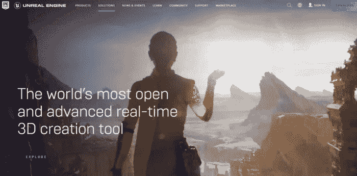
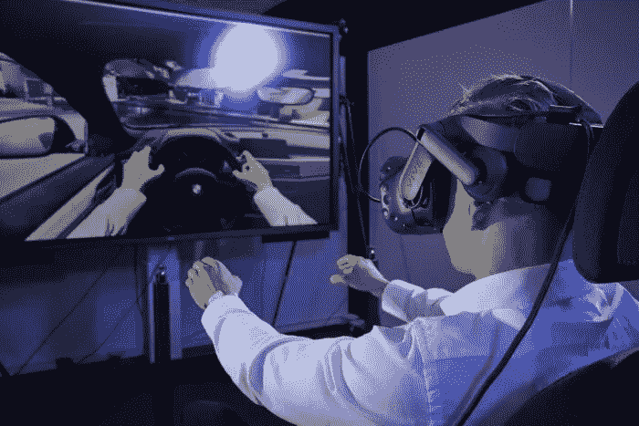
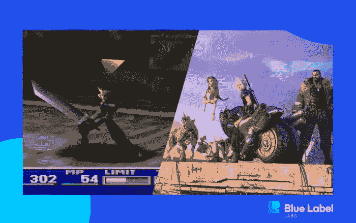
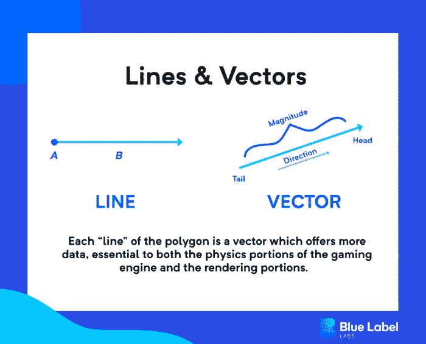

# 看看虚幻引擎 5 &黑客帝国觉醒

> 原文：<https://medium.com/geekculture/a-look-at-unreal-engine-5-the-matrix-awakens-c2e49794e2f0?source=collection_archive---------20----------------------->

## 虚幻引擎 5 能够实现一些令人兴奋的壮举——在这里，我们解释一下渲染是如何工作的，并讨论该平台可以做什么。

Epic Games 的新虚幻引擎 5 仍处于早期访问阶段，但它将很快成为开发令人难以置信的细节和效率的主要平台！— 3D(和 2D)环境，不仅适用于游戏，还适用于各种软件。

一个程序如何渲染它的图形在历史上被视为一种利基知识，但现在它变得越来越重要，不仅仅是好莱坞和大型游戏公司的人。

随着即将到来的 metaverses 和 VR 和 AR 领域的其他新发展，了解这些新发展对每个人意味着什么非常重要，所以不再多说，让我们来看看。

# 渲染的重要性&为什么像虚幻引擎这样的游戏引擎可能是应用程序的理想选择

大多数应用程序不需要依赖游戏引擎或复杂的图形系统来完成我们目前使用应用程序的大多数事情，如点餐、寻找爱情、在账户之间转移资金以及其他这种性质的任务，因为它太过了。

虽然高端渲染通常更多地是电影、游戏和工程等科学研究项目的利基需求，但它正变得越来越普遍，这一趋势将继续下去，因为我们将继续在各个方面进一步拓展边界。

它包括一些工具，如绘制屏幕上看到的一切的渲染引擎，动画绘制多边形的工具(我们将很快了解这意味着什么)，在潜在的数十亿个表面上实时应用纹理的智能系统，创建运动和检测碰撞的物理引擎，与其他一切集成的动态声音工具，等等。

除了其他有价值的功能之外，强大的渲染是游戏公司使用游戏引擎的原因，但它们在其他领域也有一席之地，包括[汽车设计](https://blog.pureweb.com/how-unreal-engine-is-creating-new-possibilities-for-the-automotive-industry)，像[宝马这样的制造商使用虚幻引擎来开发和测试车辆，甚至模拟他们的装配线](https://www.bmwblog.com/2020/11/30/how-bmw-uses-unreal-engine-to-develop-cutting-edge-new-models/)！

NASA 是另一家著名的非游戏公司，它利用该平台为[宇航员](https://www.eteknix.com/nasa-using-unreal-engine-4-virtual-reality-train-iss-astronauts/)开发逼真的训练模拟。

正如虚幻引擎和其他游戏引擎可以用来构建伟大的主机游戏，如 [*《最终幻想 7:重制*](https://www.thegamer.com/great-games-use-unreal-4-game-engine/) 和[许多手机游戏](https://www.phonearena.com/news/Best-Unreal-Engine-4-mobile-games-Android-iOS_id124882)，游戏引擎的效用正在变得更加广泛。

例如，医学成像有一个巨大的用途，可能会破坏我们在全球范围内观察人类内脏和骨骼的方式。想象一下，能够在飞行中创建一个人内部的 3D 模型，不仅视觉上准确，而且“行为”符合生物一致性？

# 渲染工作原理简介

为了理解虚幻引擎 5 提供的一些新功能的价值，我们需要了解渲染在基础层面上是如何工作的。请记住，这是一个深奥的课题，所以我们只能略知皮毛。

在你在 3D 环境中看到的所有东西的下面，是一堆线条、矢量和多边形，它们构成了结构、物体、角色等所有东西的“骨骼”。历史上，三角形被使用有几个原因，例如它是最小的多边形，三个点将创建一个平面，以及[不能被分割成除三角形](https://gamedev.stackexchange.com/questions/9511/why-do-game-engines-convert-models-to-triangles-instead-of-using-quads)之外的任何东西。使用四边形(或“四边形”)也很受欢迎，因为它提供了某些优势，但对于在这些系统中创作艺术作品的人来说，这是一个争论。

虽然从技术上讲，你可以用足够多的三角形或四边形来制作任何东西，但是对于一个系统可以容纳多少亿个点，以及它可以功能性地绘制多少个多边形，是有严格限制的。

这个绘制过程必须与其他过程共享资源，如处理纹理中使用的数据丰富的图像，实时处理输入，检测碰撞，然后相应地执行后续例程…等等。

游戏和软件的图形能力总是被他们那个时代的硬件所限制。虽然有一些变通办法，如 PlayStation 最初的 *Crash Bandicoot* 的精彩背景故事，但实际上有一个物理上限。

上面的故事解释了他们如何“入侵”系统，从本质上借用专用但未使用的系统资源，如物理内存，来创建当时不可能实现的游戏动画。

从历史上看，图形和响应性游戏不可避免地超过每一代，但随着虚幻引擎 5 的出现，新的创新将独特地装备这一代人，为无与伦比的新发展做好准备，以至于有点不清楚到底有多少果汁可以从这种异国情调的新水果中挤出来。

# 虚幻引擎 5 的新功能可能会让这一代人超越其前辈

目前,*《黑客帝国觉醒》*是第一个广泛传播的内容，试图挖掘虚幻引擎 5 的潜力，以展示该平台的全部能力。

在[演示的介绍过程中](https://www.youtube.com/watch?v=VzUHm2C8ZtE)，山谬·里维和凯莉·安妮·莫斯通过互动演示向普通消费者很好地解释了其功能的重要性。

以上是我在 PS5 上漫步于《黑客帝国》的开放世界城市时拍摄的游戏片段。大部分视频只是观光(有关于这座城市的有趣事实，以及在某些点上的“夜间模式”切换)，但开头显示了，除其他外，纹理下面的东西。

你可以看到表面，也就是说，有时像素大小的多边形的底层网络，是游戏环境和其中所有对象的基础。

# 更强大的基础设施导致更动态的环境

通过容纳反映各种物理属性、可视化、声音和运动的附加数据，可以创建更真实(或更复杂，取决于视觉风格)的环境和行为。

与虚幻引擎 4 一起推出的[混音器音频渲染器](https://docs.unrealengine.com/5.0/en-US/AudioFeatures/AudioInUE5/)将继续作为虚幻引擎 5 的主要部分，为所有声音提供各种改进，从简单地播放媒体到使用[卷积混响和 ambisonics 渲染](https://docs.unrealengine.com/4.27/en-US/WorkingWithAudio/)等工具以及其他工具构建声学上精确的环境。

# 这一切都要归功于 Nanite 虚拟化几何系统

我们继续讨论线条和形状的原因是因为这个过程对于绘制和制作动画环境以及解释其机械局限性背后的原因是多么重要。

虚幻引擎 5 现在提供了一个出色的新系统，该系统“虚拟化”了称为 Nanite 的几何体，基本上卸载了大部分渲染，并根据演示者在上述视频的前几分钟简要讨论的几个参数，使用更符合逻辑的过程来加载和渲染多边形网格。

从历史上看，项目在任何给定时间的“poly counts”是一个成败的值，但现在，当在 Unreal Engine 5 项目中使用 Nanite 时，这种限制基本上消失了(有一些例外)。

通过去除渲染和动画的最繁重的过程之一，可以实时处理和显示的细节数量是惊人的。在世界各地的开发人员、动画师、设计师和科学家学会如何真正开发该系统的所有价值后，我们将会看到将视觉和音频带到前所未有水平的项目变得栩栩如生。

对于虚幻引擎 5 的更详细的解释，并看到上面的一些功能在运行，请观看下面的视频，它直接来自虚幻引擎团队。

# 你准备好挑战软件视觉和声音的极限了吗？

新的虚幻引擎 5 将在我们的软件中开创一个视觉和音频进步的时代，这将远远超越游戏。

通过了解游戏或应用程序中的渲染工作原理，就不难想象为什么该平台的一些令人惊叹的新功能，如 Nanite，不仅对雄心勃勃的游戏开发人员，而且对任何计划为用户提供强大 3D 环境的人都非常有价值。

*原载于 2022 年 1 月 27 日*[*【https://www.bluelabellabs.com】*](https://www.bluelabellabs.com/blog/unreal-engine-5-matrix-awakens/)*。*