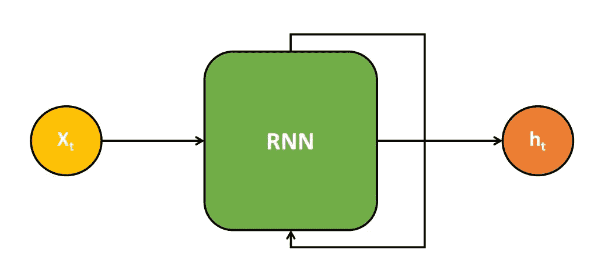
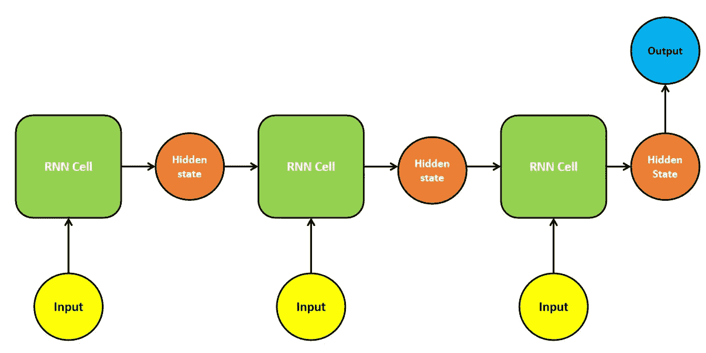
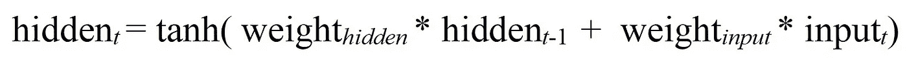
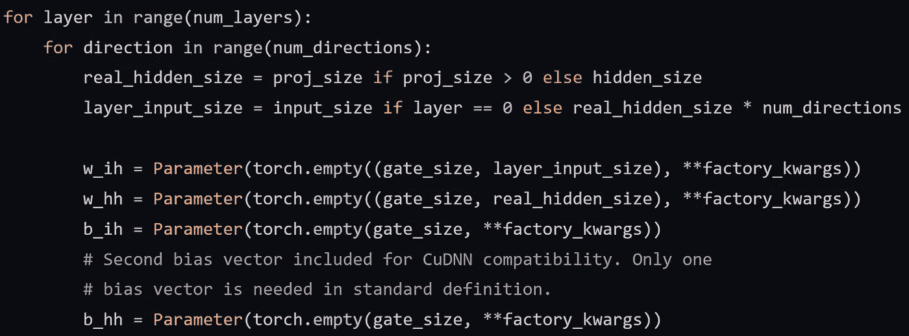
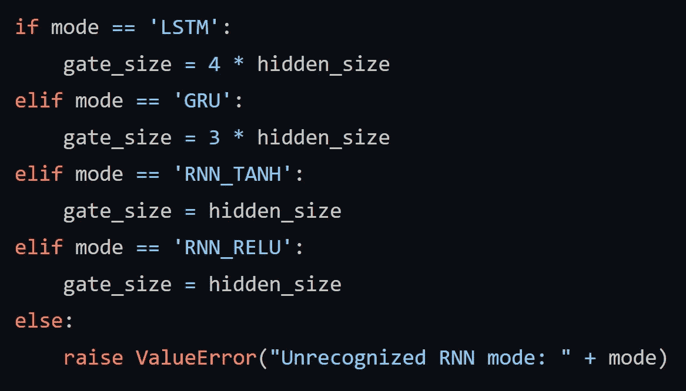
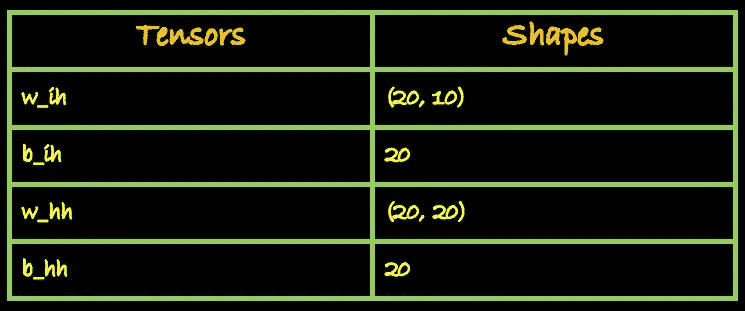
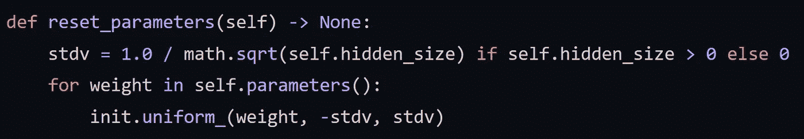
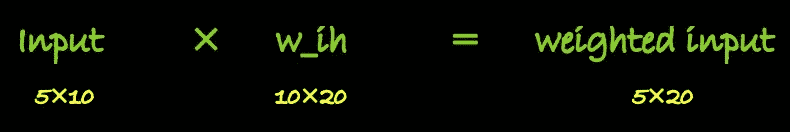

# Pytorch 递归神经网络模块的内幕

> 原文：<https://medium.com/geekculture/a-look-under-the-hood-of-pytorchs-recurrent-neural-network-module-47c34e61a02d?source=collection_archive---------10----------------------->

## py torch RNN 模块中的权重初始化和矩阵乘法指南。

Photo by [Alfons Morales](https://unsplash.com/@alfonsmc10?utm_source=unsplash&utm_medium=referral&utm_content=creditCopyText) on [Unsplash](https://unsplash.com/s/photos/books?utm_source=unsplash&utm_medium=referral&utm_content=creditCopyText)

神经网络在模仿人脑识别物体、分割图像甚至与人互动方面一直做得非常出色。说到交互，几十年的研究已经进入了自然语言处理领域(人工智能的一个子领域，涉及计算机和人类之间的交互)，以使与计算机的交互过程成为一种更无缝的体验。目前用于自然语言处理的最先进的系统主要基于一种神经网络架构，即递归神经网络(RNN)。

在本文中，我们将浏览一个普通递归神经网络的内部架构，并深入探讨两个内部机制:RNN 中的权重初始化和矩阵乘法

## 是什么让 RNNs 如此特别？

在 RNNs 之前，前馈网络用于解决 NLP 任务。该网络被输入编码成整数的文本数据，并通过反向传播对权重和偏差进行传统的调整来进行训练。尽管他们产生了可观的结果，但是他们缺乏理解输入数据的上下文含义的能力。

另一方面，rnn 具有记忆输入数据的**顺序含义**的固有能力。因此，当他们进行预测时(例如，在序列预测问题中)，预测是基于输入到模型中的整个序列，而不仅仅是输入序列的最后一个字符或单词。

## 深入了解内部架构:

递归神经网络的基本架构如下所示:

这是一个 RNN 的模糊表现。如果递归部分像下图这样展开，整个过程将更容易理解。

当一个输入被送入 RNN 时，一个隐藏状态被计算出来。这种隐藏的状态被反馈到 RNN 细胞，它同时接收下一个输入。现在，这个隐藏状态连同新的输入被用来计算新的隐藏状态，该隐藏状态被再次反馈到 RNN 单元中。这个循环持续指定的次数，直到它给出所需的输出。在 RNN 中产生隐藏状态的每个递归步骤被称为**时间步骤**。

例如，考虑这些句子:“艾丽西娅喜欢宠物。她收养了一只名叫奥利弗的狗。无论她去哪里，她总是随身带着一个单肩包。艾丽西娅去度假时，她无法带着她的宠物 ____。在这里，神经网络应该能够记住第二句话中的信息，以填补第四句话中的空白。因此，当这些句子被一个字一个字地输入 RNN 时，它会借助隐藏状态记住每个时间步获得的顺序信息。

rnn 有不同的变体，每个变体用于不同的用例。

如上图所示，自动 RNN 的输入和输出数量可以根据具体需求而变化。Andrej Karpathy 在他的博客 [**中给出了递归神经网络**](https://karpathy.github.io/2015/05/21/rnn-effectiveness/) 不合理的有效性的例子。从左至右: **(1)** 没有 RNN 的香草模式处理，从固定大小的输入到固定大小的输出(例如图像分类)。 **(2)** 顺序输出(如图像字幕拍摄图像，输出一句话)。 **(3)** 序列输入(例如，情感分析，其中给定句子被分类为表达正面或负面情感)。 **(4)** 顺序输入和顺序输出(如机器翻译:一个 RNN 读一句英语，然后输出一句法语)。 **(5)** 同步序列输入和输出(例如，视频分类，其中我们希望标记视频的每一帧)。

## 数学

使用 RNN 的序列预测可以用这五个步骤来说明。

*   一个输入被送入 RNN 单元(第一时间步)
*   RNN 单元计算该时间步长的隐藏状态。
*   这种隐藏状态被反馈到 RNN 单元(第二时间步)，同时 RNN 接受下一个顺序输入。
*   第一时间步的隐藏状态和新输入乘以各自的权重矩阵并求和。
*   将激活函数应用于所获得的总和，以产生该时间步长的隐藏状态。这种隐藏状态被反馈到 RNN 单元，并重复循环，直到产生所需的输出。

每个时间步长的隐藏状态由下面的公式给出

在每个时间步长，输出隐藏状态基本上是 RNN 前一个时间步长及其新的顺序输入的隐藏状态之和，乘以各自的权重矩阵并通过激活函数。

通过将这些隐藏状态乘以输出权重矩阵，还可以使用这些隐藏状态来获得每个时间步长的 RNN 输出。

## 权重初始化和矩阵乘法

到目前为止，我们所看到的只是理论。但是，如果不接触代码，就几乎不可能彻底了解一个网络。这个奇妙的知识库有一个完整的代码演练，解释了如何使用 Pytorch 从头构建一个 RNN。你也可以跟随[这篇](https://blog.floydhub.com/a-beginners-guide-on-recurrent-neural-networks-with-pytorch/)博文来更好地了解代码。

这篇文章不包含代码演示，因为上面提到的博客已经很好地解释了代码，在这篇文章中重做会使它变得多余。

但是 Pytorch 中有一些内部初始化设置和机制需要注意。在进入细节之前，应该定义六个变量。

输入-输入特性
w_ih-输入的权重矩阵
b_ih-输入的偏置
h0-初始隐藏状态
w_hh-隐藏状态的权重矩阵
b_hh-隐藏状态的偏置

**重量初始化**

考虑下面的例子。为 RNN 模型类初始化 rnn 对象。输入和初始隐藏状态被定义并传递到 RNN。

RNN 类的构造函数参数为(输入要素、隐藏维度、RNN 层数)。我们将使用一个单一的 RNN 层在我们的例子。

输入的形状应该是以下格式(批量大小、输入序列的长度、输入要素的数量)。批处理大小应该是第一维，因为我们在初始化 rnn 对象时已经设置了参数 *batch_first* = True。

初始隐藏状态的形状应该是以下格式(RNN 层数、批量大小、隐藏尺寸)。

现在根据我们的 RNN 公式，在每一个时间步，隐藏状态是这样计算的，

我们将输入和初始隐藏状态传递到我们的 RNN 模型中。它们中每一个的权重被初始化并被插入到上面的公式中，以计算下一个隐藏状态。这些计算是在 Pytorch 的 nn 模块中完成的。让我们看看 Pytorch 如何初始化输入和隐藏状态的权重矩阵。

这是 Pytorch 官方 github 库的 [RNN.py](https://github.com/pytorch/pytorch/blob/master/torch/nn/modules/rnn.py) (第 84 到 94 行)的截图

这是定义砝码形状的部分。在第三和第四行中，定义了两个变量，即*real _ hidden _ size***和 *layer_input_size* 。**

**因为我们正在构建一个普通的 RNN，所以我们没有任何投影尺寸。所以*真实隐藏尺寸*将等于*隐藏尺寸*(隐藏尺寸的数量)，在我们的例子中等于 20。**

**我们的模型中有一个 RNN 层。正如我们在上面的代码截图中看到的，权重形状是通过循环模型中的层数来初始化的。所以在第一次迭代中，*层*将等于 0。因此 *layer_input_size* 将等于输入大小，在我们的示例中是 10**

**现在为了初始化输入权重的形状，我们可以看到一个空的 Pytorch 张量被定义为 shape *(gate_size，layer_input_size)* 。门尺寸在 [RNN.py](https://github.com/pytorch/pytorch/blob/master/torch/nn/modules/rnn.py) 的第 71–80 行初始化。**

****

**由于我们使用 tanh 作为外部激活函数， *gate_size* 将等于 *hidden_size* ，在我们的示例中为 20。**

**最后，我们的输入和隐藏状态的权重和偏差的形状将是:**

****

**现在我们已经初始化了形状，是时候给这些矩阵赋值了。这些 RNN 参数的权重从范围从-k 到 k 的均匀分布初始化，其中 k = 1/sqrt( *hidden_size)* 。这在 [RNN.py](https://github.com/pytorch/pytorch/blob/master/torch/nn/modules/rnn.py) 的 *reset_parameters* 函数中定义(第 193-196 行)**

****

**好的，看起来我们已经达到了一个里程碑。但是如果我们也理解 Pytorch 下发生的矩阵乘法就更好了。**

****计算结果****

**我们的输入是(3，5，10)的形式。3 是批量大小——我们的例子有 3 批数据。因此，当我们传入第一批时，输入形状将是(1，5，20)，也可以认为是(5，20)。输入 *(w_ih)* 的权重矩阵的形状为(20，10)。对于两个可相乘的矩阵，矩阵 a 中的列数(dim 1)应该等于矩阵 b 中的行数(dim 0)。为此，我们转置权重矩阵 *(w_ih)* 。所以现在 *w_ih* 的形状将是(10，20)并且我们可以将矩阵相乘。**

****

**加权隐藏状态的计算也遵循相同的事件序列。隐藏状态的形状是(1，3，20)，其中 3 是 *batch_size。*因此，对于每个批次，隐藏状态的形状为(1，1，20)，也可以认为是(1，20)。隐藏状态的权重矩阵的形状为(20，20)。这里，不需要转置，因为矩阵满足乘法规则。但是我们需要一致地转置所有的矩阵，如果我们已经转置了一个的话。所以 *w_hh* 在这里也被调换了。**

****

**现在，可以将加权输入和加权隐藏状态相加，并对其应用 tanh 激活，以获得新的隐藏状态。但是等一下..加权输入和加权隐藏状态具有不同的形状。对于要相加的两个矩阵，它们应该是相同的形状！**

**为了添加这些矩阵，Pytorch 使用了一种称为广播的技术。我们的加权隐藏状态有 20 个元素，我们的加权输入有 5X20 = 100 个元素，每列有 20 个元素(dim 1)。对于广播，加权隐藏状态矩阵与加权输入矩阵的每一列相加。你可以在这里了解更多关于广播的信息。**

****

**这样我们得到了新的隐藏状态，它将作为 RNN 下一时间步的隐藏状态反馈给 RNN。**

**为了简单起见，我们没有讨论计算中的偏差。它们是一维矩阵，形状=隐藏维数。使用广播在每个时间步将它们与加权输入和加权隐藏状态相加。**

## **谢谢你**

**就这样结束了！这就是 Pytorch 如何初始化权重，并在内核中为 RNN 乘上矩阵。**