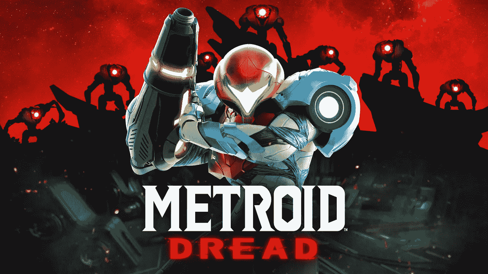
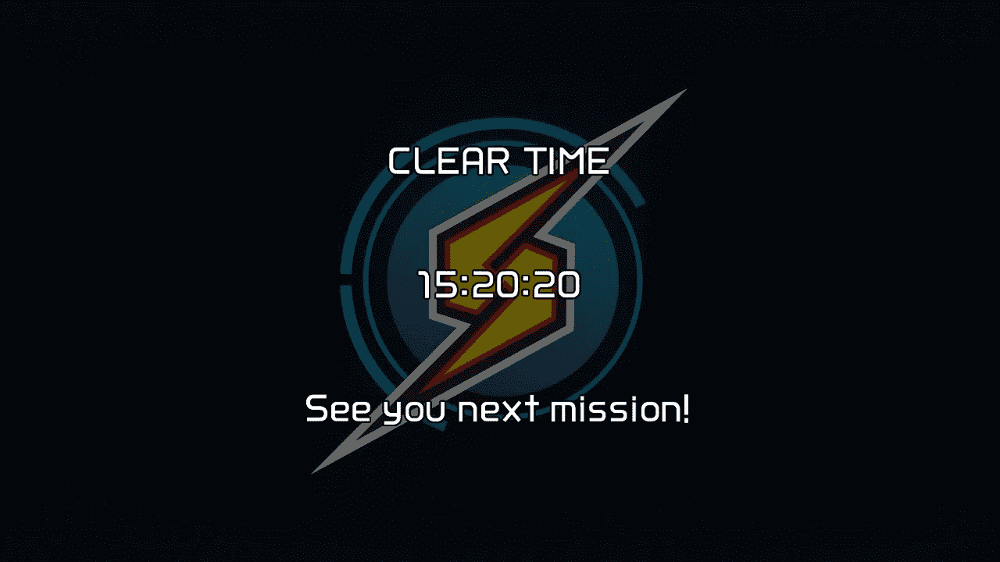

# 来自一个普通人的“银河战士恐惧”评论

> 原文：<https://medium.com/geekculture/a-metroid-dread-review-from-an-average-guy-66e7630c65b?source=collection_archive---------3----------------------->

## 产品评论/游戏

## 流畅、有趣、可怕——从好的方面和坏的方面

The first Metroid game for the Nintendo Switch. Source: [Metroid Database](https://www.metroid-database.com/metroid-dread-key-art-promo-renders/)

这是我第一次写产品评论，也是我第一次决定给一款电子游戏打分。我最近购买了一个有机发光二极管模型的任天堂 Switch，并决定我要开始与它一起推出的游戏:Metrioid 恐惧。

在之前的 2D 进入(银河战士融合)十九年后，一个继任者以恐惧的形式出现了。这款游戏原本应该是为任天堂 DS 开发的，但因为 DS 无法将恐惧的愿景变为现实而被搁置。现在我们有了开关，这一愿景变成了现实，我必须说，它做得非常好。

在委托西班牙开发商 MercurySteam 处理 2017 年的《Metroid:Samus Returns》——原版《Metroid II:Samus Return》的翻拍版——之后，任天堂授权他们处理一款新游戏:第一款[希望不是唯一的*任天堂 Switch 版] Metroid 游戏。*

## 我的第一个银河战士

我将非常明确地开始这篇评论:除了 Metroid Fusion，我从来没有真正玩过 Metroid 游戏，我在 8 或 9 岁的时候玩过*游戏。我只想说，除了能认出《恐惧》的主角萨姆斯·阿兰之外，其他的我都不记得了。我告诉你我对《银河战士》的经验不足，因为我基本上是在迎合那些以前没有体验过这款游戏的人。*

《T4》过去玩过《银河战士》的人可能熟悉它的一些机制、游戏循环和设计。另一方面，我只是把它看做是一个很酷的，全新的任天堂 Switch 游戏，一个我仍然觉得几乎没有任何值得玩的独特游戏的主机。我有一个发布日(2017 年 3 月)的 Switch 控制台，我在一年多前卖掉了它，正是因为这个原因——我觉得它几乎没有任何游戏。正在发行的任天堂游戏通常是 Wii U 游戏的全价端口，或者是《超级马里奥派对》、《1-2 Switch 》,甚至是任天堂的在线系统。

## 有机发光二极管+恐惧=美丽

银河战士恐惧恭维我的新开关有机发光二极管难以置信的好。随着有机发光二极管显示器能够显示“完美”的黑色和鲜艳的红色，以及屏幕本身比其他 Switch 型号大得多的事实，这款游戏原本令人恐惧的基调变得生动起来。我觉得恐惧是一个在其他手持开关上不会那么令人愉快的游戏，只是因为你失去了那种活力——它本身就可以让游戏更加身临其境。

不要误会我的意思，这个游戏即使在 Switch Lite 上看起来和玩起来都很棒，但是在有机发光二极管屏幕上玩是一种特殊的体验。因此，看到这种恐惧伴随着有机发光二极管开关一起出现，我并不感到惊讶。我经常发现自己在手持模式下玩游戏，而我通常是用我的旧开关在电视上玩游戏。这场比赛只是*与有机发光二极管的那场*漂亮。

# 游戏部分

关于游戏本身，我会说，在很大程度上，我喜欢它。萨摩斯的控制非常流畅，当你同时处理很多技能时，这种流畅会有很大帮助。当一切“咔嚓”一声，感觉很神奇。我的意思是，你的输入被正确地记录下来，萨姆斯做你想让她做的事，你感觉进入了状态。当它*不*点击时，游戏会感到有些沮丧。

## [剧透警报—跳到下一节，无剧透]

我特别提到以下部分，因为我觉得它有助于解释我上面的观点。如果你不想被宠坏，请跳到下一部分。在游戏中，你释放了一种能力，在某种程度上取代了传统的双跳。只要你掌握好时机，你可以把你的一跳变成两跳，这样你就可以到达之前被封锁的区域。现在，当它按照你想要的方式工作时，这是很棒的。然而，你似乎必须在一个特定的“点”计时第二次跳跃，或者在第一次跳跃的特定时间激活它。你不能直接双击，然后马上开始第二次跳跃。

这导致了在 boss 战斗中的笨拙感，你必须注意跳跃的时间，以确保游戏实际上注册了两次跳跃。不得不关注这样的事情可以归结为游戏‘难’，但我个人认为这种限制不需要存在。如果有什么不同的话，受限的第二次跳跃只会分散其他游戏的注意力。在与老板的争斗中，这可能会令人沮丧，不是因为你犯了一个可以理解的错误，而是因为你受到了劣质控制的摆布。

## 老板打架

说到老板打架，他们自己也挺好玩的。然而，有时候我觉得他们可能太… *了。我发现自己害怕与老板的争斗，因为它似乎永远不会结束。这本身并不是一件坏事。长时间的战斗真的会消磨你的斗志，让你开始恐慌。在一个名字中有“恐惧”的游戏中，这很好。不好的是那场战斗是如何进行的。一旦我理解了老板的模式，我发现我打败老板不是因为我自己的技能，而是因为我只是利用脚本模式足够长的时间，最终杀死老板。令人生畏的老板们常常变成节奏鲜明的舞蹈，只是拖得太久了。*

因此，我希望老板们有更多的变化，无论是他们的动作，你可以去杀他们的方式，或者只是老板们自己。这个游戏经常用新的，增加的变化重新散列旧的遭遇。如果你真的对第一次相遇感到开心，那就太棒了。然而，考虑到第一个是有节奏的舞蹈，你只是开始害怕新的变化。简单来说，它最终不再有趣了。

## 拍摄随机物体

另一件不太有趣的事情是“射击随机的东西以找到一个开口”的游戏循环。我猜这是一个典型的银河战士游戏循环，一面不显眼的墙实际上可能是你需要击落才能在游戏中前进的东西。在《银河战士恐惧》中，我并不总是注意到这一点。眼尖的人可能会很快指出，如果你非常仔细地看，两个并排的块的颜色可能略有不同。他们说，这种差异应该表明未来的方向。嗯，作为一个刚接触这个系列的人，作为一个不熟悉这种游戏的人，我个人认为这是一个糟糕的游戏设计。

仅仅因为它是一个银河战士游戏，因为它“一直是这样”并不意味着它必须继续这样。这种“隐藏物体”式的游戏也没有以一种特别清晰的方式展现给你。在加载屏幕期间，你必须注意——请注意，在正确的时间，考虑到每个屏幕有多达 5 个不同的提示——看到一些小文本，表明你可能能够射击墙壁，以找出去哪里。

即使你想通了这一点，你也会四处射击，但却无处可去——感觉就像你在向每堵墙射击，但却没有走远。我尽我最大的努力玩这个游戏，但我发现自己在查找一个这样的遭遇，我必须在一个非常特定的地方向地面射击才能进入一个房间。我可以肯定地看到，像“隐藏的方块”这样的东西令人讨厌，足以让一些人永远放弃这个游戏。如果像射击随机墙壁这样的事情是必要的，那么与玩家沟通也是必要的。

我的意思是，我觉得这个游戏在传达——或者更确切地说，强调——随意射击对你的进步至关重要方面做得不够好。如果游戏通过某种方式验证你理解这个概念来确保你知道尽早这样做，那么游戏对很多人来说会更流畅，我们也不会有成千上万的 YouTube 评论说人们花了多少时间感觉被“卡住”或“软锁定”在游戏之外。

值得庆幸的是，一旦我意识到我需要“射击任何东西和一切”来找到下一步该去哪里，这变得可以忍受，但仍然经常令人讨厌。尽管这种事情令人沮丧，但我仍然坚持下去，因为我发现这个游戏很有趣，也很有价值。尽管有一些笨拙的控制，有节奏的舞蹈，和“糟糕”的游戏循环，这个游戏仍然非常有趣。我沉浸在这个世界中，喜欢了解更多的故事和事情。

如果我真的因为感觉老板是不可战胜的或者某个领域看起来不可逾越而感到沮丧，我只是从游戏中彻底休息一下。下一次我拿起它时，我常常很快就想出了解决办法。我认为自己是一个非常有耐心的人，但我不能说许多新接触该系列的人能够以类似的方式容忍游戏的一些缺点。除此之外，我想重申，我发现这个游戏非常有趣。

## 荒野的宽度

游戏中的敌人处于一个足够好的难度，整体上他们不会觉得太容易*或*太难。自然，有一些简单的敌人，和你讨厌遇到的敌人。敌人有很多种，而且——除了一些老板——我从来没有真正觉得这个游戏是“一遍又一遍地做同样的事情。”

最初，这些区域本身感觉足够独特，但最终除了它们在游戏地图上的颜色之外，我无法真正说出它们之间的区别。不要误会我的意思，这些区域本身被渲染得非常漂亮，在有机发光二极管的屏幕上看起来非常漂亮，但它们最终都感觉相似，或者在某种程度上融合在一起。

这款游戏的配乐特别弱，这也于事无补，至少我觉得是这样。我经常把声音开得很大，除了一些(比如当你得到一个新东西的时候)之外，没有任何真正令人难忘的音乐曲目或声音。这种音乐深度的缺乏导致这些区域感觉大多是“相同的”,而不是独特的。

尽管如此，我觉得在游戏中有足够多的领域可以探索，在每个领域都有足够多的事情可以做。正如我提到的，我对敌人也有类似的感觉。他们有足够多的战斗不会感到无聊，而且有足够的深度和相当数量的怪物，我真的不觉得需要更多的*。*

## *游戏时间*

*在收到我的《银河战士恐惧》副本之前，我读到有些人花了大约 7 个小时才完成了他们的第一次游戏。看到这让我担心，因为我认为这不足以证明在游戏上花 60 美元是合理的。这让我很担心，我订阅了一个月的 GameFly，只是为了租游戏，而不是买游戏。不要误解我——我更喜欢质量胜于数量，但我真的不认为在那七个小时后游戏会有什么意义。我看不到自己有“第二个”游戏，也不会再碰它。我并不特别在意寻找游戏中的每一个小物品或者玩可解锁的硬模式。考虑到这一点，7 个小时 60 美元对这个游戏来说太贵了。*

*我很高兴地说，15 个小时后，我可以证明这个游戏是 60 美元。是的，我花了比熟悉的银河战士粉丝更长的时间来完成这个游戏。我以 62%的物品完成率完成了游戏，这意味着我收集了可用物品的百分比。我不觉得这个游戏太短，因为我在每个领域都花了时间探索和惊叹这个世界——老实说，有时我花的时间比预期的要长，因为我不知道去哪里或做什么。*

**

*My personal completion time.*

*谢天谢地，这并不总是如此，因为游戏大多是线性的。然而，有时我真的感到被卡住了，因为我觉得我去的每个地方都无法通行，没有任何东西指引我找到解决办法。此外，尽管花了很多时间只是因为*输了*，我也不觉得游戏太长了。*

## *E.M.M.I .遭遇*

*游戏中有一些特定的*部分*让人感觉太“长”，比如《E.M.M.I .》中的迷你 boss 遭遇战。em . m . I .机器人在游戏开始时非常烦人，但拖到后来就变得很烦人了。他们并不讨厌，因为他们很难处理，但是因为你已经在前面和后面看到过这个公式，他们大部分感觉像是一个障碍。*

*随着我释放越来越多的能力，我变得越来越不害怕*遇到*一个 E.M.M.I。这并不意味着我对他们后来继续出现在游戏中不恼火。*

*我把这种现象比作一种恐惧症。最初，你绝对害怕(高度、蜘蛛、人类等等)。最终，你可能会克服这种恐惧，并能面对这些事情。尽管如此，你仍然希望你不必和他们打交道——不是因为你仍然害怕，而是因为他们似乎只是“碍事”*

## *[剧透警报—跳到下一节，无剧透]*

*My frantic E.M.M.I. encounter*

## ***光明的一面***

*在上面的视频中，我从一个 E.M.M.I .身边飞奔而去，因为我搞乱了控制方案，而不是因为我害怕 E.M.M.I .为了有效地处理敌人的机器人，我必须使用我解锁的特定武器。要使用它，我必须点击一个按钮来“瞄准”电磁干扰仪，向我想要瞄准的方向移动操纵杆，然后按住“射击”按钮。由于所有这些命令同时发生，很容易忘记——在那一刻——你需要放开哪个按钮来拍摄。在这种情况下，我放开了错误的按钮，这阻止了我的武器开火。因此，我需要逃跑，再试一次。尽管控制器打了个嗝，但它仍然导致了一个紧张的时刻，这比其他情况下更有收获。*

*我发现这种特质可以弥补恐惧。有些时候事情会完全出错。你忘了哪个按钮是干什么的了。你甚至忘记了你有哪些能力，导致你在战斗中没有使用你可能*应该*的能力*。有太多的事情可能会出错，最终几乎要了你的命，但不管是靠运气还是技巧，你还是设法取得了胜利。不管怎样，当你克服看似不可克服的困难时，那种感觉是惊人的，恐惧让你有机会经历很多这样的事情，不管它值不值得。**

# *外卖和点评分数*

*总而言之，我向所有寻求任天堂 Switch 新体验的人推荐 Metroid Dread。它是流动的、快节奏的，并且在大多数时候非常有趣。然而，没有流畅和乐趣的时候，就其本身而言，可能是令人疲惫和可怕的——以一种糟糕的方式。*

*因此，我觉得我的总体评分可以分为两种情况。对于像我这样的“普通”玩家，我给《银河战士恐惧》一个 8/10 。这是一次实实在在的经历，会让你的钱花得值(对于像我这样的一些人来说，这可能是一个合理的担忧)。它有它的缺点，绝对不是杰作。尽管如此，我觉得这肯定可以被那些熟悉游戏循环的人视为 9/10，因此可能会更宽容。我个人不能原谅其中一些，因此 8/10。*

*这绝对是系列中的一个坚实的入口，尽管没有玩 2002 年的 Metroid Fusion，我觉得它应该被视为一个值得的继任者，仅仅因为它是多么有趣。我很高兴《恐惧》是我在该系列中的第一部作品，因此，我可以自信地向任何以前没有玩过《银河战士》游戏的人推荐它。同样，它也不是没有缺点，但是当它点击时，它*会点击*。*