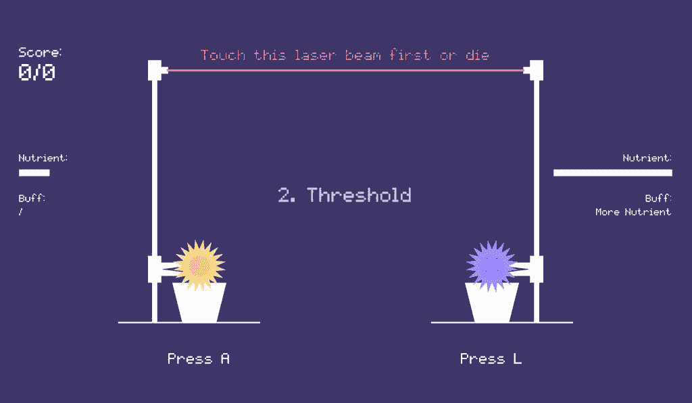
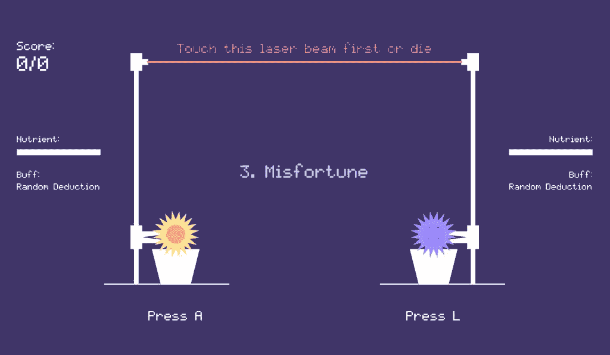
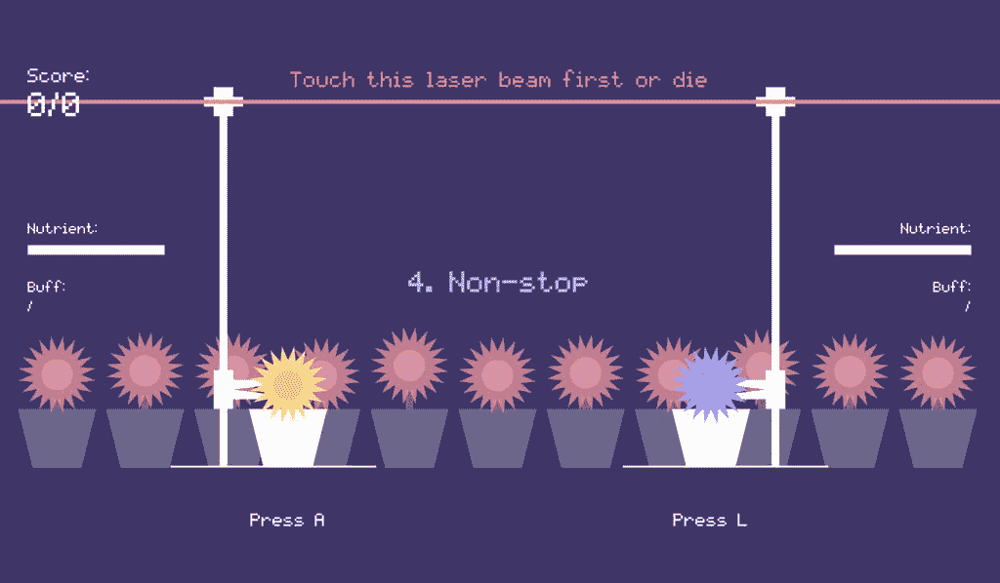
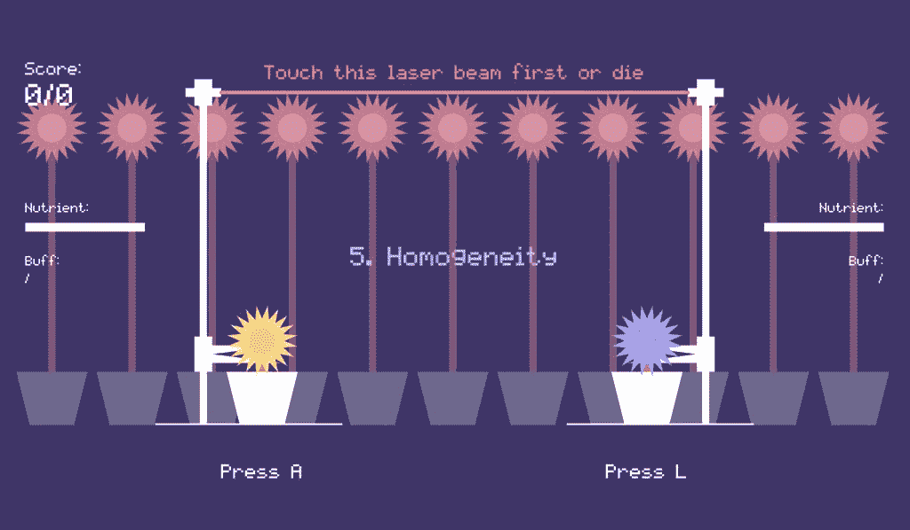
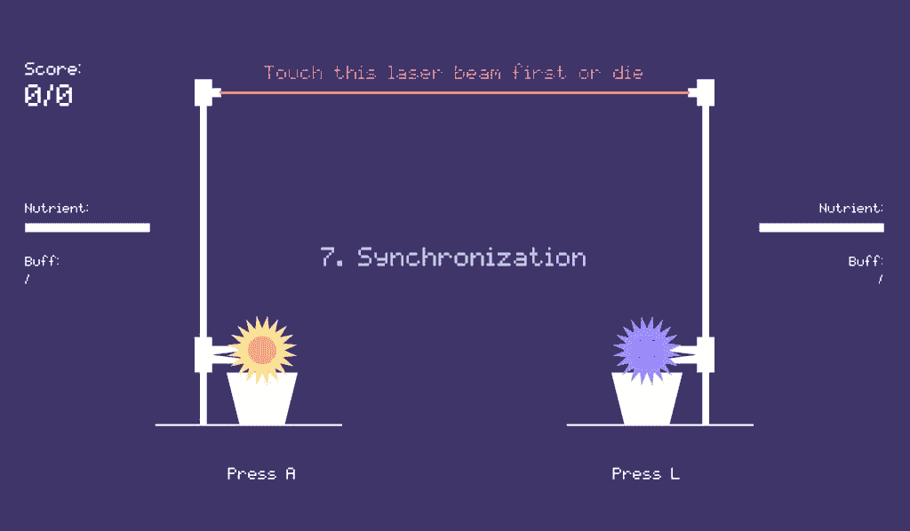
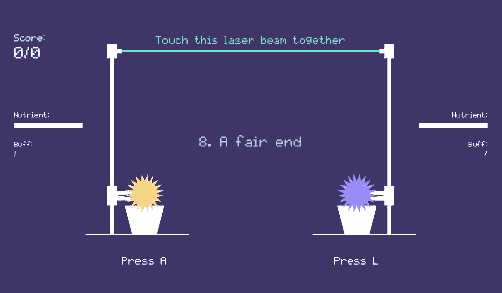
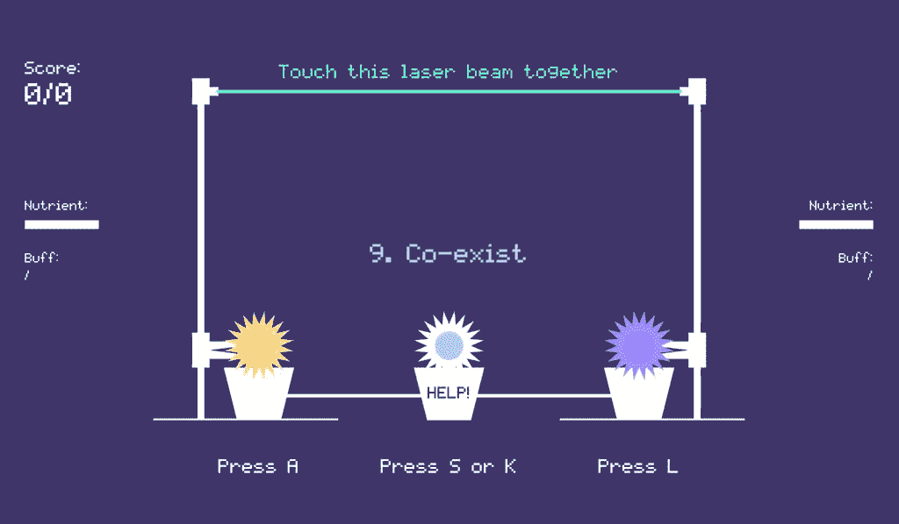
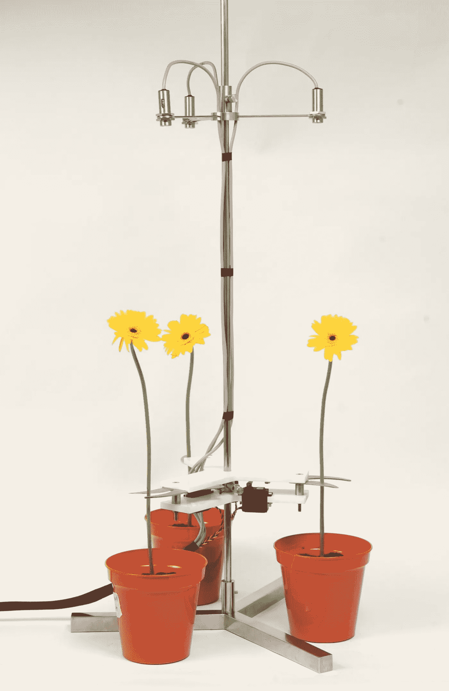

# 一个改变思维的游戏:自然淘汰的寓言

> 原文：<https://medium.com/geekculture/a-mind-changing-game-the-parable-of-natural-de-selection-b9dd89f1134e?source=collection_archive---------11----------------------->

## 将玩家的心态从竞争转变为共存的游戏。

*通过我们社会的新自由主义变革，
我们看到了经济竞争需求的总体高涨，
以及情感和人际关系的总体低落。
新自由主义意识形态的核心是
你是孤独的，
一个与他人竞争的个体。
成功者茁壮成长；失败者灭亡。当你发现自己赢不了时，你会怎么做？”*

自然淘汰的寓言是一个基于 [P5.js](https://p5js.org/) 的看似简单却复杂的游戏。这是一款双人“竞技”游戏，挑战社会达尔文主义和新自由主义竞争的心态。

两种植物被迫留在“自然选择”的游戏中——生长最快并最先到达激光束的植物**将触发机构另一侧的剪刀切断竞争对手的茎秆**。

游戏非常简单明了——玩家每次按下相应的键(“A”或“L”)，植物就会长高一定的高度。

游戏由 9 个关卡组成。随着玩家进入下一关，一种新的自由主义观念将通过资源和条件的改变而被引入。换句话说，每一关都是一套新的游戏。

总的来说，9 个级别反映了新自由主义社会中不同种类的竞争，玩家会对他们如何赢得或输掉游戏感到惊讶。

“这个游戏会欺骗你，让你认为你压得越多，赢得越快。所以你玩的时候，其实并没有注意到规则的细微差别，直到结果出现才会去想，说明你不应该这么玩。”一个玩家说。

Unequal nutrient (the bar at the left and right side) distribution — Sometimes the sky is the limit.

Random deduction to the height of the plant indicates random misfortune — The competition is never fair.

Not just competing with the other player but the whole crowd — The competition is way bigger and fiercer than you would imagine.

The winner becomes the “winners”. What are we competing for?

“虽然这个游戏的最终目标是生存，但这并不意味着两个玩家是对立的。”游戏设计师范晓·江希望玩家们能换个角度思考。**“一旦我们进入游戏，我们往往会遵守规则，忘记自己拒绝游戏的权利。**因此，第 7 关将成为整个游戏的转折点，届时两个玩家将发现这是一个双赢的局面，一个平局。”

In this level: When either key is pressed, the plants gain the same height. It’s always a tie.

Now it’s time for the player to practice the new mentality for playing — collaboration instead of competition. The player shall reach the top at the same time to pass this level.

最棘手的一关是最后一关。在没有植物有足够的养分长到顶端并触发激光束杀死别人也没有牺牲自己来帮助中间的花长到顶端的情况下，取胜的策略就是“什么都不做”。

我们的一个玩家说:“我和我的朋友在输了几次后被卡住了，当我们暂停大约 15 秒钟时，一条消息出现了:为什么要竞争而不是共存？我被吹走了。”

“这场比赛让我思考竞争和共存。如果我知道当我想赢的时候可能会输，我还愿意去竞争吗？不与规则合作是一种与他人共存的方式吗？”

自然取消选择的比喻是对新自由主义的批评。这是一个将玩家的心态从专注于竞争转变为开始考虑共存的游戏。

## 参考:

这款游戏的灵感来自蒂姆·辛普森的作品《自然淘汰》。

> 生长到预定高度的植物首先触动一个传感器，触发停在竞争植物茎杆底部的剪刀。最后存活的植物拥有在这种特殊环境下生存的优越生物设计。辛普森的黑暗颠覆性作品直截了当地展示了进化科学——一个在过去 150 年里从许多方面彻底启发了世界的研究领域——如何被操纵来创造人工设计的地狱。

[资料来源:现代艺术博物馆](https://www.moma.org/interactives/exhibitions/2013/designandviolence/natural-deselection-tim-simpson/)

点击[这里](https://preview.p5js.org/XiaofanJ1VNG/present/QarDASWgY/index.html)玩游戏