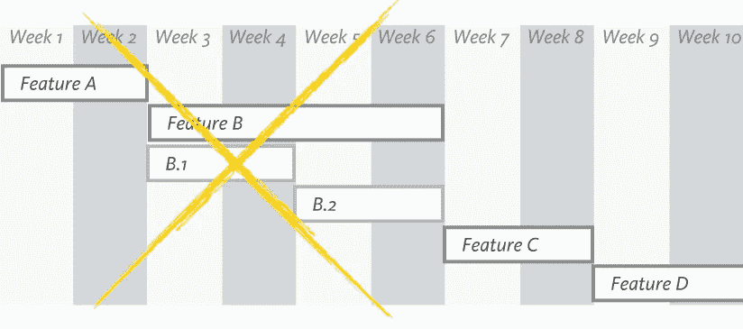
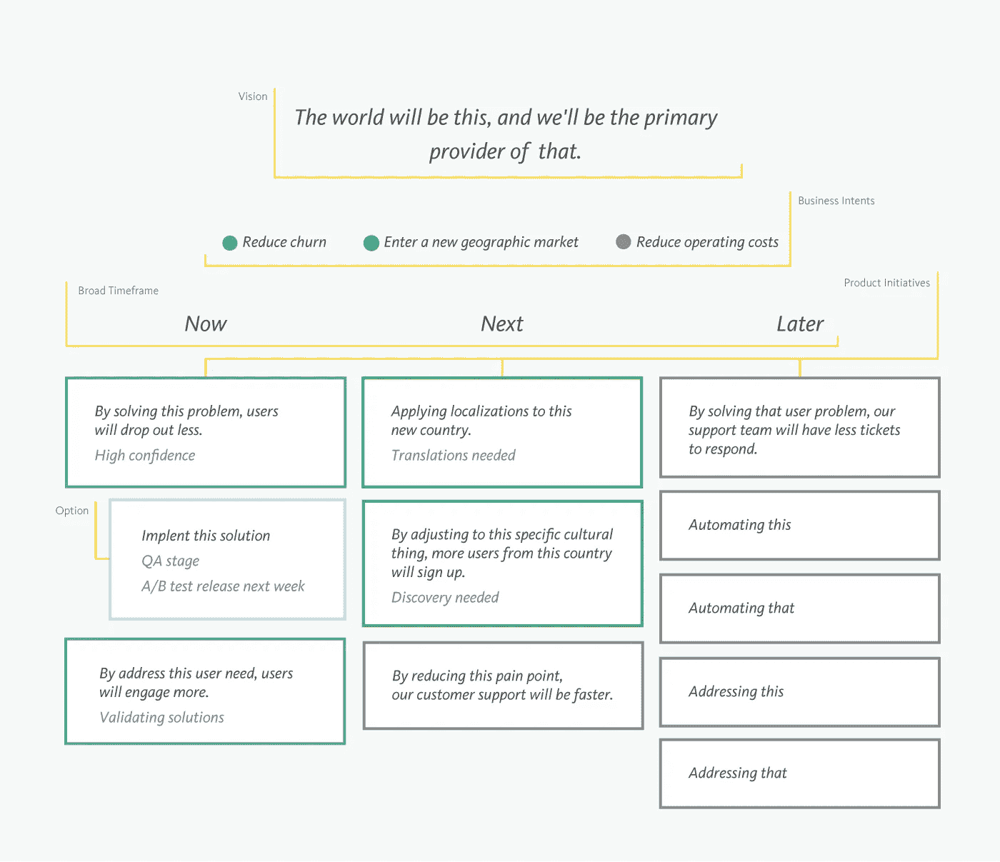

# 现代路线图

> 原文：<https://medium.com/geekculture/a-modern-roadmap-352ca01964f2?source=collection_archive---------0----------------------->

在过去的十年里，路线图已经成为我们许多人最讨厌的东西——我也是。

我们如何才能做到敏捷、实验、以结果为导向，同时对未来几个季度将发生的所有产出制定详细的计划？承诺一个充满确定性的产品计划类似于承诺一个穿越沙漠的到达日期。

当然，我们可以制定这个计划——我们可以像现在这样非常细致，完美主义。但这仍然是一个我们正在猜测或虚构的未来。它会有不切实际的期限，如果一直这样下去，它可能会错过市场机会，甚至在编写代码之前就构建出过时的功能。这不是敏捷，也不是我们现代产品制造商所能接受的。

那么，为什么要投入时间做路线图呢？我们能承认他们没有帮助吗？我们能跳过它们吗？

嗯，我试过了。但是，除了我之外，很少有人感到满意:我让高管们进行微观管理，因为他们没有获得一种一切都在计划和轨道上的安慰感；我听到开发团队抱怨说，除了他们的 sprint 之外，他们看不到任何更远的东西，他们错过了大图；我让销售团队对随机的请求说是，因为没有任何明显的理由解释为什么不是；除其他外。

虽然传统的路线图对于精益和敏捷方法来说不够灵活，但是精益和敏捷方法并没有填补路线图落后时产生的战略缺口。路线图仍然被遗漏，即使不可靠。它们里面一定有什么有价值的东西。

# 现代化路线图

产品路线图是一个强大的沟通工具。它是整个组织的指路明灯，有能力指引它朝着一个方向前进。它的价值是不可否认的。

传统上，这是通过项目计划来完成的——一张甘特图，上面列有技术团队承诺在某一天交付的功能和项目的列表。这是我们对我们应该交付什么以及何时交付的猜测，没有任何关于为什么交付的背景。难怪我们倾向于认为它们是无用的。但不一定要这样。

为了使路线图现代化，我们可以使它们不像项目计划，而更像战略原型。它们不仅仅是导航输出的向导，还可以是导航结果的向导。

如果这种结果与产出的对话对你没有任何影响，我建议你在继续下一步之前阅读下面的文章。从现在开始，我将使用的大多数术语都来自那里。

 [## 如何在结果的抽象世界中导航

### 作为消费者，我们多久用一件商品提供的数量来衡量它的价值？

medium.com](/swlh/how-to-navigate-the-abstract-world-of-outcomes-58a81cdbab95) 

通过分散对产出和交付日期的关注，我们可以更轻松地思考未来，并提供一个关注价值的视角。这将让每个人都对方向感到兴奋，并围绕一组优先事项保持一致。因为我们已经提供了一个我们对未来了解的透明视角，所以我们不会被迫做出我们没有信心的承诺。我们不需要浪费的前期设计和评估过程。

一旦我们对解决方案的执行有了信心，我们就可以在路线图中添加补充的细节。这些细节将使我们更容易与利益相关方沟通，有助于接受和协调。

请记住，当向路线图添加细节时，我们希望找到平衡。过多的信息会使路线图难以阅读。

## 现代路线图的组成部分

现代路线图可以有许多形状和形式——我们不再局限于甘特图。这个例子得到了[重新发布的](https://www.goodreads.com/book/show/36507075-product-roadmaps-relaunched?ac=1&from_search=true&qid=BXBYGuWbRA&rank=1)产品路线图的认可，我很喜欢:

该路线图的基础使每个人都围绕一个共同的目标:

*   **愿景**——它设定了最终的方向，并为随后的一切提供了意义。路线图的其余部分描述了我们打算如何实现这一愿景。
*   **商业意图**——他们传达当前关注的领域，以实现一个大的飞跃。
*   **产品计划**—它们回答了我们如何通过优化产品来实现目标。最佳答案与用户想要解决的实际问题相关联。
*   **广泛的时间框架** —它为产品计划何时实施提供了指导。它让我们想起了传统的路线图，同时保持了灵活性。

其次，我们可以在产品计划中添加子项:

*   **选项** —它们是可供探索的可能解决方案。它们中的一些将会变成已发布的特性。只有在对他们有一定的信心时，才把他们包括进来，这可能是个好主意。

最后，我们可以为项目(尤其是产品方案和选项)添加附加信息，例如:

*   发展阶段
*   信心
*   目标客户
*   产品领域
*   时间表和资源
*   依赖性和风险

就这样，我们有了路线图，有了全新的外观。我们现在能把它裱起来挂在办公室的墙上吗？你猜对了——没那么容易。无论是否现代，路线图都不应该一成不变。它们需要更新。

## 现代路线图的长度和稳定性

记住，路线图不是合同。随着环境条件的变化和我们了解的更多，它需要适应。如果世界能静止足够长的时间就好了…但是它从来没有那样运作过。然而，与此同时，我们需要让执行稳步进行。

在一个不稳定的世界中提供这种稳定性的答案是定期修改路线图——类似于 Scrum 中的 sprints 概念，但是规模更大。在正在进行的周期中，正在进行的工作将是稳定的。其他一切都可以移动来反映任何更新，并在下一个周期中处于我们所知的最佳状态。

问题是:我们的环境有多稳定？它将决定我们的路线图应该走多远，以及我们应该多久更新一次。变化的速度越快，我们的周期就越快，我们的路线图就应该越压缩。

如果我们的产品处于生命的介绍阶段，它应该有很短的周期。如果我们的产品正处于生命的成长期，我们或许可以拥有它们更长一点的时间。如果我们的产品处于生命的成熟期或衰退期，那么这个周期可能会更长。

 [## 产品不可思议的寿命

### 和所有事物一样，产品诞生，然后最终消亡。这听起来很悲惨，但不应该如此。如果一切顺利…

medium.com](/product-thinker-tank/the-incredible-life-of-a-product-9a986668032f) 

通过关注结果，通过在正确的时间提供正确数量的细节，通过严格区分优先顺序但在时间框架上灵活，通过保持新鲜但稳定，我们将能够制定一个有效的(和现代的)路线图。

*如果你喜欢这篇文章，你可能也会喜欢这些:*

 [## 我应该同意这项功能请求吗？

### 我们需要确保我们的产品始终是好的，尽管有各种力量试图干扰…

claudiatd.medium.com](https://claudiatd.medium.com/should-i-say-yes-to-this-feature-request-c4c7482ee980)  [## 排列优先顺序的方法——从最差到最好

claudiatd.medium.com](https://claudiatd.medium.com/ways-to-prioritize-from-worst-to-best-43711a28aa94)