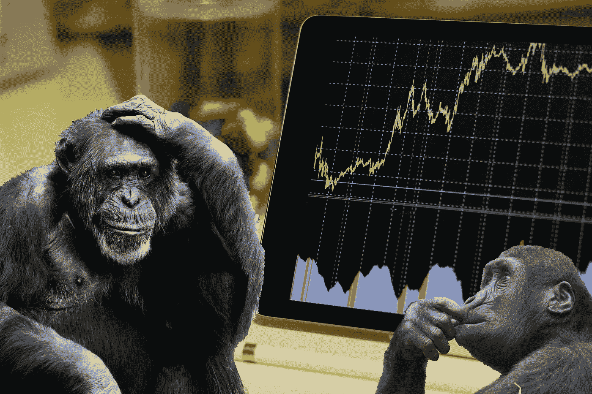

# 一只猴子挑选我的股票投资组合

> 原文：<https://medium.com/geekculture/a-monkey-picks-my-stock-portfolio-dc10fd665368?source=collection_archive---------15----------------------->

## 连续 10 年跑赢指数！当你可以随意挑选股票时，为什么还要费心去预测/优化呢？

Some serious thought before making any investment decisions is a must. (Original pictures by Photo by [Burak Kebapci](https://www.pexels.com/@weekendplayer?utm_content=attributionCopyText&utm_medium=referral&utm_source=pexels) and [Pixabay](https://www.pexels.com/@pixabay) from [Pexels](https://www.pexels.com/photo/white-android-tablet-turned-on-displaying-a-graph-186464/?utm_content=attributionCopyText&utm_medium=referral&utm_source=pexels))

普林斯顿大学教授伯顿·马尔基尔在他的《漫步华尔街》一书中引用了一句有趣的话

> “一只被蒙住眼睛的猴子在扔东西”