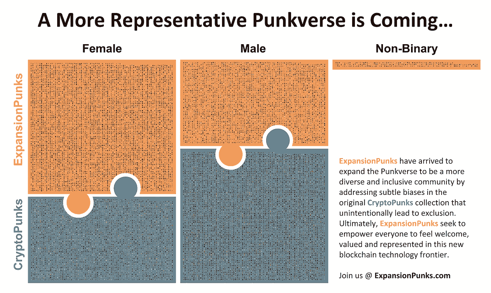
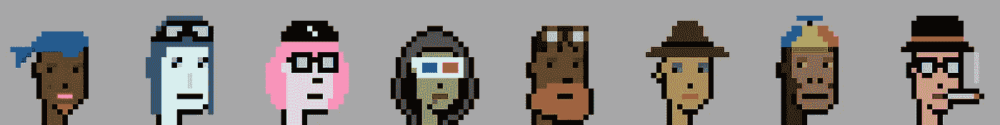

# 更加多样化和包容的 Punkverse

> 原文：<https://medium.com/geekculture/a-more-diverse-and-inclusive-punkverse-da2a27db8911?source=collection_archive---------3----------------------->

## 给加密朋克和扩张朋克带来平衡

# TL:DR

[**扩张朋克**](https://www.ExpansionPunks.com) 是一个由 10，000 个独特的、通过程序生成的可收集的朋克组成的集合，作为 ERC-721 代币存储在区块链以太坊上。同样,“扩展包”在传统桌面游戏中引入了新的角色和故事情节， [**扩展朋克**](https://www.ExpansionPunks.com) 通过解决最初**加密朋克**系列中无意中导致排斥的微妙偏见，将 Punkverse 扩展为一个更加多样化和包容的社区。

# **社会背景**

在许多方面，我们去中心化的未来仍在起步阶段。个人身份管理、艺术和金融服务等领域即将出现的创新将永远改变我们的社会。将定义这个时代的技术和范例在很大程度上仍在今天被发现。对于已经涉足这一领域的人来说，这无疑是一个令人兴奋的前景。但是那些还没有参与的人呢？

作为一个社会，至关重要的是我们要确保*每个人*都能感受到加入和参与这样一个未来的力量。如果我们要建立有弹性的下一代社会结构，我们必须摆脱我们根深蒂固的系统的固有偏见。

# **扩展密码朋克的案例**

作为世界上第一个 NFT 头像集，crypto 朋克已经在历史上留下了自己的位置。朋克是“蓝筹”化身，标志着一个人在这个领域的参与。随着去中心化运动的发展，越来越多的个人(技术专家、艺术家、投资者、学者等。)将通过隐朋克美学寻求与隐朋克精神的关联。因此，无论有没有扩张朋克，朋克的增长是不可避免的。新的“另类朋克”系列正在出现，以填补这一空白，试图跟随加密朋克的势头。正如我们的 [**朋克象限**](/geekculture/punk-quadrants-c002f756531) 文章中所详述的，这些系列以各种方式实现了差异化，从而产生了与 crypto 朋克系列的美学凝聚力和特质稀有一致性相关的各种结果。

对于扩张朋克——拥有“扩张”修正值意味着对加密朋克群体的重大责任。在我们的第一篇文章( [**创建 10K·NFT 头像集合**](/geekculture/expansionpunks-welcome-to-the-more-inclusive-punkverse-aa77e675bcf5) **)** 中写了很多关于逆向工程原始密码朋克 DNA 作为生成扩张朋克集合的先决条件的长度。这种严格性导致了 ExpansionPunk 系列在美学上与原版无与伦比，同时保证没有任何 expansion punk 会在特性组合基础上或视觉基础上(考虑到一些隐藏的特性)与原版 CryptoPunk 发生冲突。

除了美学上的一致，扩张朋克也开始在 20K Punkverse(加密朋克+扩张朋克)中创造更大的平衡和代表性。原始 CryptoPunks 集合中当前不平衡的例子包括…

1.性别不成比例地偏向男性。

2.女性被排除在帽衫和牛仔帽等可取特征之外。女性朋克甚至不能通过微笑(或皱眉)来表达情感——事实上，她们唯一被允许的嘴型是口红颜色……在 2021 年！

3.121 个最稀有(也是最有价值)的朋克(外星人、猿、僵尸)只有男性特征。

4.性别被视为一个完全二元的特征(男性对女性)——排除了越来越多的非二元个体。

# 一个更加多样化和包容的朋克世界

**ExpansionPunks** 系列的性别分布逆转了原始 CryptoPunks 系列中的差异，从而产生了一个总计 20K 的系列(10K crypto punks+10K expansion punks ),更好地反映了现实世界中的性别比例:

ExpansionPunks 还引入了一种新的、多样化的**“非二元”朋克类型**，让那些选择不认同完全二元性别的个人(甚至组织)更加包容。最后，通过**将跨性别特征的获取民主化**，扩张朋克使得发现新的原型成为可能，比如女牛仔、女警察和男飞行员。即使是罕见的外星人、猿类和僵尸现在也变得更加多样化，但它们仍然生活在庞克沃斯。

我们认为，通过凝聚和连贯的扩张实现的这种新的总体“平衡”将把 CryptoPunks 社区的相关性扩展到一个多元化和包容性的个人代表至关重要的未来。我们还相信，在我们共同努力定义我们的去中心化未来时，相同的 CryptoPunks 社区将支持这一使命，让每个人都感到受欢迎、受重视和被代表。

# **转型扩张**

扩张朋克绝不是原始密码朋克的替代品。扩张朋克具有变革性，因为他们体现了一种完全不同的艺术目的，为社区提供新的表达、美学、意义和理解。我们希望，通过一个更加多样化和包容的扩展 Punkverse，再加上动态探索[原始系列](https://expansionpunks.com/explorer/cryptopunks)和[扩展系列](https://expansionpunks.com/explorer/expansionpunks)、**扩展朋克**的新体验(PunkExplorer ),将作为社区的添加剂被接受，为整个空间带来更多的认知、需求和最终表现。

# 保持联系

扩张朋克即将登陆以太坊网络。请加入我们的 [Discord](https://discord.gg/kTNcWfYfbv) 并关注 [Twitter](https://twitter.com/ExpansionPunks) 以了解更多信息，保持联系并支持我们以团结一致的方式扩展 Punkverse 的使命。