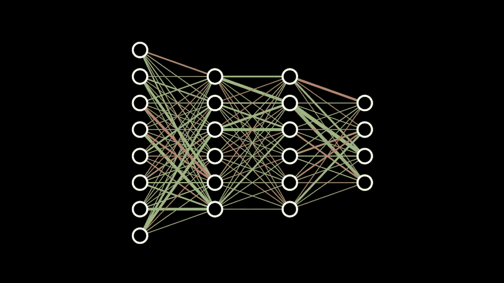
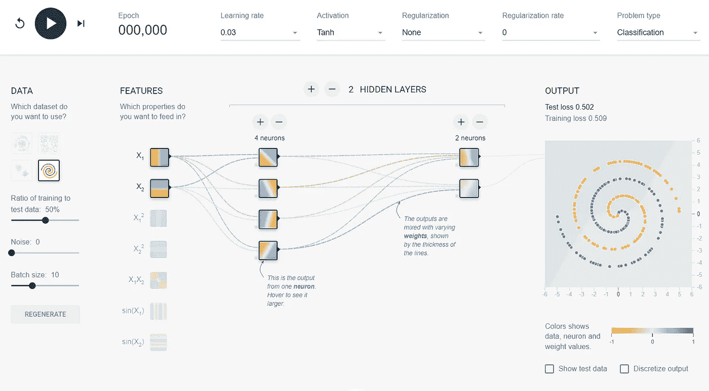
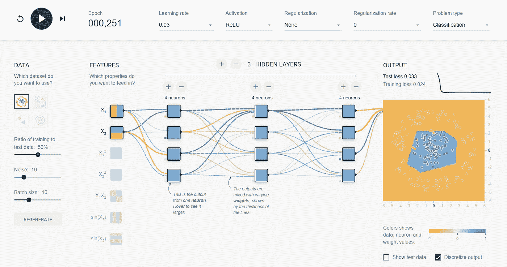

# 神经网络游乐场

> 原文：<https://medium.com/geekculture/a-neural-network-playground-12684ac1d792?source=collection_archive---------9----------------------->

Neural Network Diagram by 3Blue1Brown

神经网络是最受欢迎的机器学习算法，但不一定是最容易理解或最直观的模型。决策树根据人类理解的规则分割变量，支持向量机试图在两类之间找到决策边界，但理解神经网络并不简单。TensorFlow Playground 允许您构建、训练和学习神经网络，而无需成为编程专家或完全了解幕后发生的事情。

由于神经网络是需要高等代数和微积分的模型，它们可能不太容易访问。为了理解数学和对神经网络的直观解释，请查看 3Blue1Brown 的视频。要了解神经网络而不了解幕后的代数和微积分，或者只是为了更好地了解它们，如果你已经知道它们是如何工作的，请查看 TensorFlow Playground。

# 张量流游乐场

这个网站让你只需点击几个按钮就可以建立和训练神经网络。您可以构建、训练、测试和可视化网络的输出。通过试验每个参数，可以了解它是如何改变网络输出的。

Screen shot of TensorFlow Playground

这是一个有趣的工具，当你改变网络的超参数和架构时，它可以帮助你对发生的事情建立直觉。

该网站有一些不同的数据集来训练网络。在右侧，您会看到您选择的数据集，随着网络的训练，决策边界也会出现在图中。除了更改您使用的架构之外，您还可以改变为培训和测试保留的数据量。

## 架构和超参数

神经网络由多层神经元组成，这些神经元将信息从网络的输入层传递到输出层。在屏幕中央，您可以选择网络的层数以及每层中神经元的数量。

每个节点都有可以设置的激活函数和正则化参数。该网站有一个下拉菜单，推荐每个超参数的值。除了隐藏层架构，该网站还允许您选择多达 7 种不同的功能作为网络输入。

可以设置像批量大小和学习率这样的训练参数。有趣的是，当训练参数变化时，观察网络的训练和测试损失如何随着每个时期而变化，所述网络的训练和测试损失绘制在右侧的数据附近。

# 外卖食品

虽然我在网站上玩之前理解了这些神经网络背后的数学原理，但它让我对如何训练和选择网络架构有了更好的认识。更复杂的模型不一定更好。他们需要更长的训练时间，也不能保证更好的结果。

下面我训练了一个网络来快速区分这两个类。然而，我能够用一半的隐藏节点训练一个网络，仅用 60 个时期，而不是下面看到的 250 个，就做出一个几乎相同的决策边界。这让我想知道我过去建立的网络是否过于复杂。

Trained Neural Network by TensorFlow Playground

总的来说，这是一个伟大的网站，绝对值得一试！