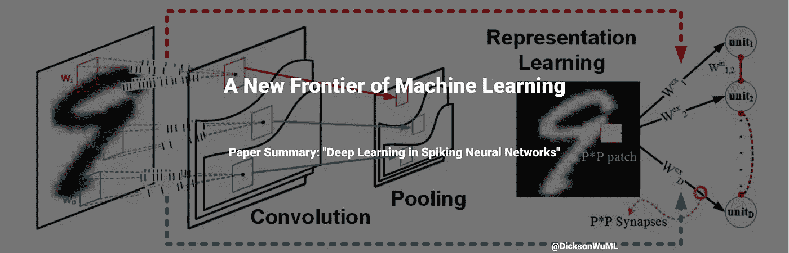

# 机器学习的新领域

> 原文：<https://medium.com/geekculture/a-new-frontier-of-machine-learning-827e18c8730?source=collection_archive---------8----------------------->

## 论文摘要:“脉冲神经网络中的深度学习”

> 论文作者:Amirhossein Tavanaei、Masoud Ghodrati、Saeed Reza Kheradpisheh、Timothee Masquelier、Anthony Maida

# 摘要:

人工神经网络(ann)已经统治了人工智能世界——它们通过使用反向传播，大量的…