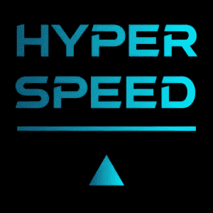

# 一个新游戏:超高速！

> 原文：<https://medium.com/geekculture/a-new-game-hyperspeed-e3fb5701d90f?source=collection_archive---------36----------------------->

## 一个基于网络的星际飞船赛跑游戏怎么样？

游戏可以在这里找到:

[**https://www.minapecheux.com/games/hyperspeed/**](https://www.minapecheux.com/games/hyperspeed/)

**最近，我一直在为**游戏开发**用 Unity 玩得很开心(如果你想了解更多，你可以看看一些[教程](/c-sharp-progarmming/making-an-rts-game-in-unity-91a8a0720edc)我在 [上贴了](/geekculture/how-to-use-events-to-implement-a-messaging-system-in-unity-c-342ab4806d53)[这个](/c-sharp-progarmming/make-smooth-scene-transitions-in-unity-c-6b7c97e4c7e0) [主题](/geekculture/how-to-use-math-noises-for-procedural-generation-in-unity-c-44902a21d8e))。但你知道还有什么更有趣吗？编码一些…**