# 如何在 Solana 上购买 NFT

> 原文：<https://medium.com/geekculture/a-non-crypto-users-guide-to-buying-nfts-on-solana-1c63c23b10dd?source=collection_archive---------0----------------------->

避免在以太坊上花费 100 美元，拥有酷的数字艺术！任何人在 Solana 生态系统上购买 NFT 的一步一步的指南。

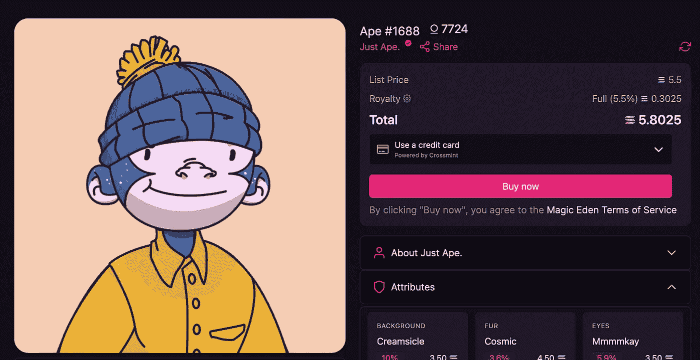

You can purchase NFTs with a credit card on Magic Eden via Crossmint

到目前为止，你已经听说过 NFT，并且已经看到有人通过出售它们赚了几万到几十万(甚至更多)美元。对很多人来说，很难理解 NFT 的宣传，也很难把所有东西都准备好，以便能够购买一台。普通用户不会花这么大力气去寻找他们喜欢的 NFT，而只是花几百美元去购买它们。

[**索拉纳**](https://solana.com/) **解决了这个问题。**

以下是在索拉纳生态系统上购买第一个 NFT 的分步指南——即使你以前从未拥有过任何加密货币。这听起来可能是一个令人生畏的过程，但让我们来分解一下:

# 2022 年更新:你现在只需一张信用卡就可以购买 NFTs！

现在，您可以一起跳过本指南的其余部分；索拉纳最大的 NFT 市场 [**魔法伊甸园**](https://www.magiceden.io) 现在支持用信用卡和电子邮件地址购买 NFT。你甚至不需要拥有密码或设置钱包——当你购买时，一个免费的 [Crossmint](http://crossmint.com) 钱包为你创建！

## 步骤:

1.  找到您想要购买的 NFT

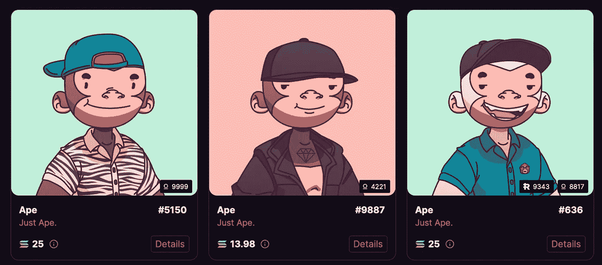

2.点击**详情**按钮，进入 NFT 详情页面

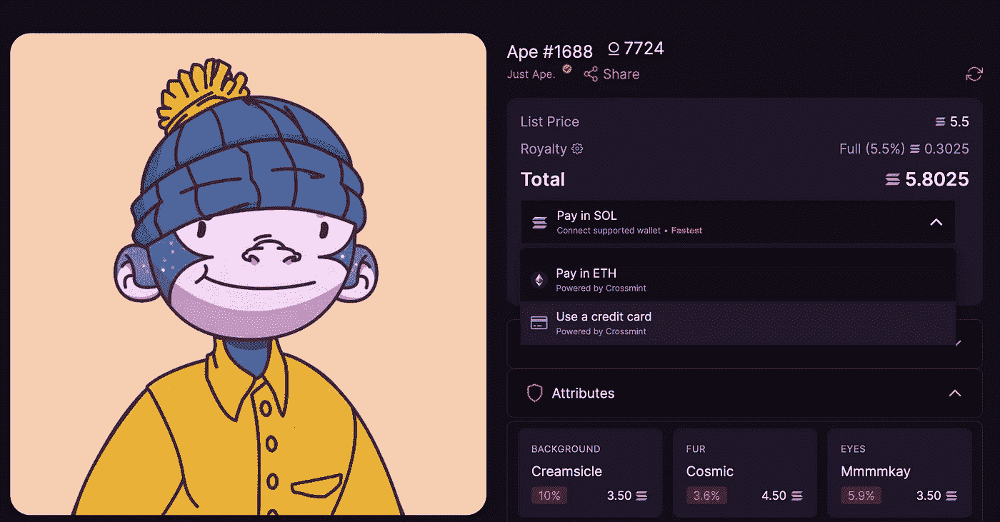

3.点击**在 SOL 中支付**下拉菜单并选择**使用信用卡**

完成购买后，您可以在您的 Crossmint 钱包中查看您的 NFT，点击这里: [**我的钱包**](https://www.crossmint.io/user/collection)

就是这样！自从我第一次发表这篇文章以来，这一过程已经变得简单多了，这真是令人惊讶。收藏快乐！🥳

# 您将需要的东西:

1.  一个**银行账户、借记卡**或一个 **PayPal 账户**(在比特币基地使用)
2.  装有 Chrome、Brave、Firefox 或 Edge 浏览器的电脑

就是这样，真的！

在本指南中，我将使用**比特币基地** + **幻影**钱包，因为我个人认为这是最容易使用的。还有其他交换选项，如 FTX 美国、北海巨妖等，以及其他钱包，如 Sollet。然而，这里的目标受众是任何不熟悉购买/销售加密和比特币基地可能是一个更容易的选择。

# 第一步:建立一个免费的比特币基地账户

1.  前往[https://www.coinbase.com](https://www.coinbase.com)并点击注册
2.  按照他们的提示创建您的帐户
3.  一旦你的账户建立，点击网站右上角的**买入/卖出**按钮

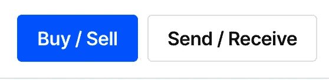

4.如果您还没有这样做，您需要添加一种付款方式。比特币基地会提示你这样做；您可以轻松地链接您的**银行** **账户**，输入**借记卡**，或将您的账户连接到现有的 **PayPal** 。

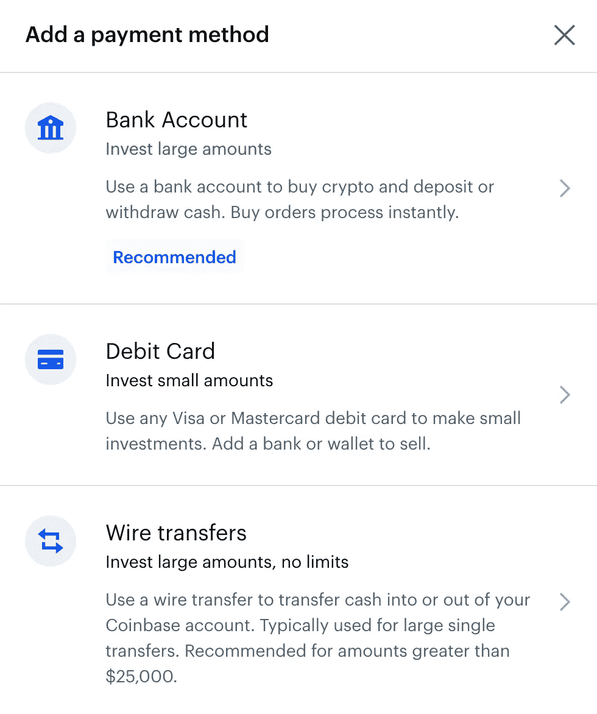

5.添加付款方式后，您会在**购买/出售**模式窗口中看到类似这样的内容:

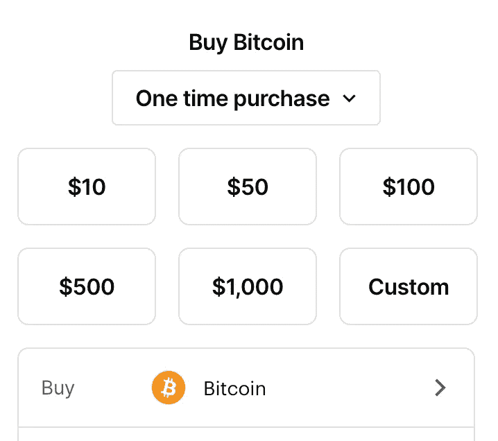

Buy / Sell modal

6.虽然我永远不会告诉任何人**不要**购买比特币，但为了在 Solana 上购买 NFT，我们需要购买 **SOL** 。单击此处，我们可以将资产更改为 Solana。

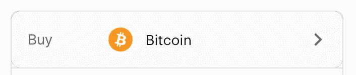

7.在搜索栏中输入 **SOL** 并点击搜索栏下方的 **Solana (SOL)** ，然后点击左上角的返回箭头图标。

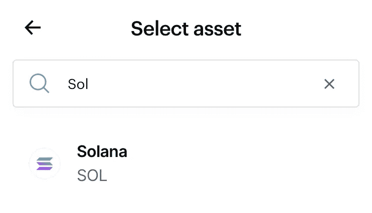

8.您现在应该会看到:

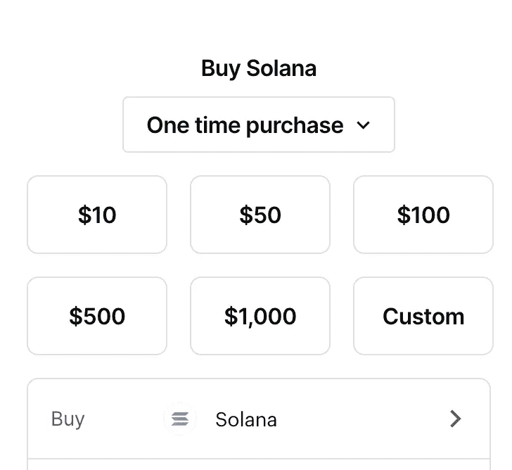

你可以购买你觉得合适的任何数量。这完全取决于你打算花多少钱——索拉纳的 NFTs 的优点是费用非常低(只需几分钱),而且 NFT 的项目仍然是新的——每天都有更多的项目推出！我建议至少从几本《T21》开始，但这完全取决于你。

9.选择或输入您想要购买的金额，然后点击**预览购买**(您还不会被收费)。

10.点击下一屏幕上的**立即购买**完成购买。

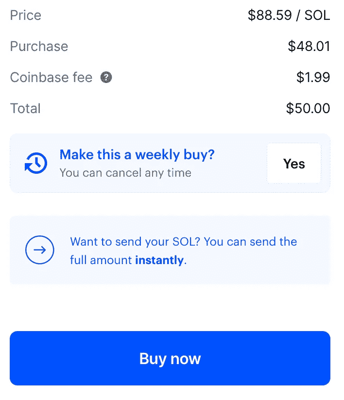

恭喜你！你刚买了你的第一个密码！现在，让我们得到一些 NFT！

# 第二步:创建你的索拉纳钱包

我们将使用 Phantom wallet，但还有其他选项，如 Sollet 和 Solflare。我更喜欢 Phantom，它非常人性化，你可以直接在钱包里查看你的 NFTs！让我们建立一个。

1.  去 https://phantom.app/
2.  根据您使用的浏览器，您会在页面的中间和右上角看到一个**添加到<浏览器>** 按钮。点击它！

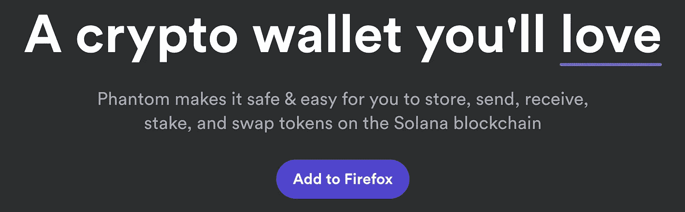

Phantom home page

3.按照他们的说明(取决于浏览器)将其作为扩展添加到您的浏览器中。

4.添加后，您应该会看到一个屏幕，显示以下提示:

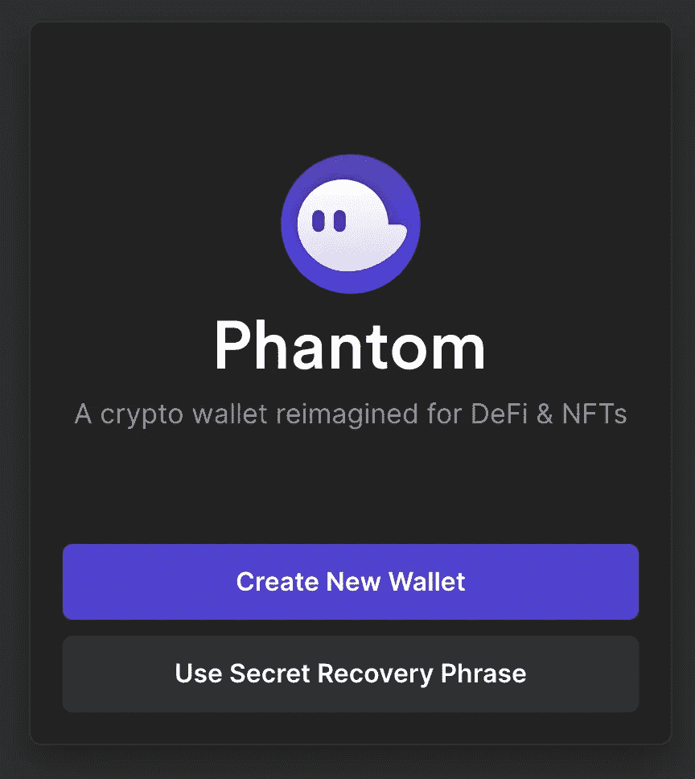

5.点击**创建新钱包**

6.在**机密恢复短语**屏幕上，您会看到一串随机单词。把它写在纸上并保存在一个安全的地方是非常重要的——把它当作一个私人文件保存在保险箱里，并记住它在哪里！如果您丢失了计算机或钱包，您将需要恢复短语来重新进入。

7.在下一个屏幕上创建一个密码，并按照提示继续操作。

## 现在，您应该会在浏览器的菜单栏(右上角)中看到幻影图标。

点击这个图标将打开你的钱包。出现提示时输入您的密码，您将看到您的钱包余额。此时，我们还没有转移任何资金，所以它将是空的。

# 第三步:将$SOL 转入你的虚拟钱包

你的钱包有一个地址。此地址是公共的；与他人共享此地址没有安全问题。你的地址可以在顶部菜单栏看到和复制，如下图所示，那里写着 **Wallet 1 (BP1z…cGvC)。**点击这里会将你的钱包地址复制到你的剪贴板上。或者，您可以点击**接收**按钮，选择您想要存款的资产，并在屏幕上复制您的钱包地址。我们一会儿会讲到这个。

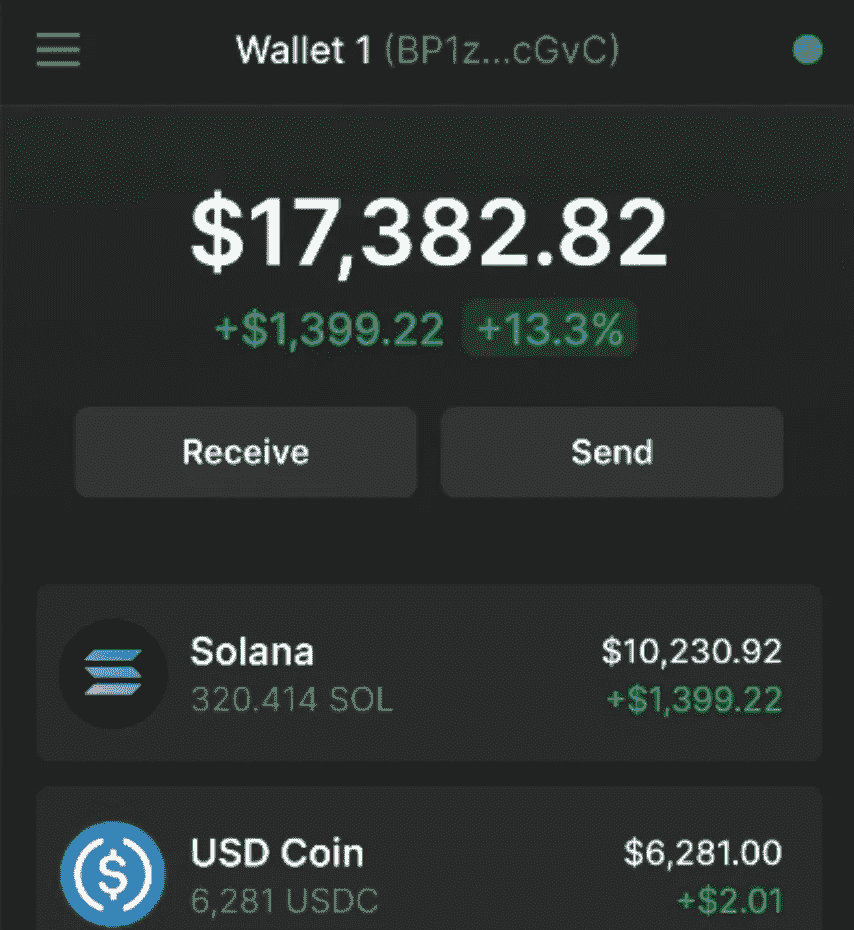

是时候把比特币基地舞步和幻影舞步绑在一起了！为了在 Solana 平台上购买 NFT，我们本质上需要使用 Solana 作为货币。出售 NFT 的网站(我将在下面列出)连接到我们的**幻影**钱包，这就是我们如何为 NFT 交易我们的 **$SOL** 。

你可能想知道为什么我们需要使用比特币基地+幻影——为什么我们不能直接在我们的幻影钱包里购买 **$SOL** ？一个简短的答案是，Phantom 旨在存储我们的资产——它没有支持直接支付的基础设施。比特币基地处理这一点，很容易使用，并连接到您的银行，方便直接转移美元。

让我们从比特币基地把我们的 **$SOL** 发送到我们的虚拟钱包。

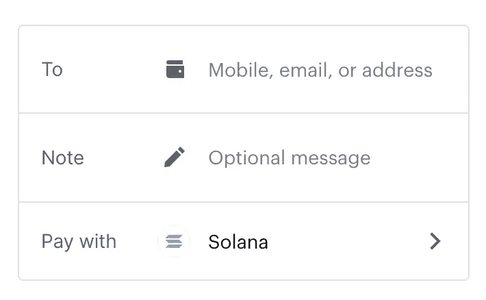

1.  在**比特币基地**中，点击页面右上角的发送/接收按钮。
2.  单击浏览器菜单栏中的**幻影**钱包图标，并按照上述说明复制您的钱包地址。
3.  在比特币基地，在**到**字段中，粘贴您的虚拟钱包地址。
4.  您可以选择包含注释，但这不是必需的。
5.  在 **Pay with** 字段中，将它更改为 Solana，就像我们之前初次购买 Solana 时所做的那样。
6.  点击**继续**(还不会发送，你会先看到另一个确认画面)。
7.  点击**立即发送**。

等待 1-2 分钟…也许更短！然后，再次打开你的幽灵钱包。你现在应该看到我们刚从比特币基地发来的索拉纳了！

# 第四步:买你的第一个 NFT！

我们到了，激动人心的部分！在我写这篇文章的时候，NFT 对索拉纳来说还为时过早。项目量相对较少(相比以太坊上的项目量)。不过这种情况正在迅速改变，因为每天都有不同类型的艺术和实用的新项目涌现出来！然而，随之而来的是一些不同的平台，我们可以用它们来购买 NFT。不管你买的是哪一款 NFT，你都可以在钱包里查看、交易和出售它。

> Twitter 是寻找 NFT 新项目的好地方。
> 关注[https://twitter.com/solnftradar](https://twitter.com/solnftradar)新项目&造币厂预警。

# 魔法伊甸园: [https://magiceden.io](https://magiceden.io)

Solana NFTs 最受欢迎的市场。

# exchange . art:[https://exchange . art](https://exchange.art)

面向艺术家个人的流行市场/拍卖网站。

# form function:[https://form function . XYZ](https://formfunction.xyz)

艺术家个人的流行市场/拍卖方。

在所有网站上，您都会在右上角看到一个**连接钱包**按钮。点击此处将显示一个弹出窗口，您可以在其中选择您的钱包类型。这样做并选择**模型**。

您的虚拟钱包将打开，提示您允许该网站连接到您的钱包。在幻象中点击**批准**。

你现在可以浏览市场，找到你梦想中的 NFT 并购买它了！你会在 **SOL** 中看到价格，当你找到你想买的东西时，只需点击它，然后按照你的虚拟钱包中的提示操作。一旦你有了你的 NFT，你可以点击钱包窗口底部的 4 方块图标，或者点击这里查看它:

 [## 您的 Nft 画廊

### 所有的 NFT 都在一个地方。👀Solana Metaplex、以太坊和 BinanceSC 的 NFT 画廊 c

www.nfteyez.global](https://www.nfteyez.global/) 

输入你的公共钱包地址。你可以把这个链接分享给朋友来炫耀你的收藏！

你现在拥有一辆 NFT……现在呢？

*   将其设置为您社交媒体个人资料中的个人资料图片
*   寻找并加入项目的不和谐与电报小组
*   加入项目的社区！大多数将举行赠品，竞赛和更多…一些甚至开发游戏，创建 Dao，做空投-可能性是无限的。

**收藏！**

[Solarian](https://solarians.click?r=TR472S)

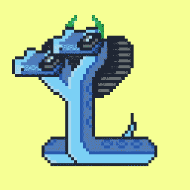

Sol Snek!