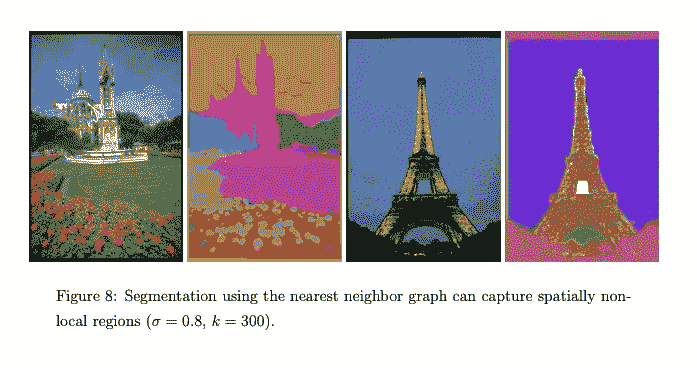
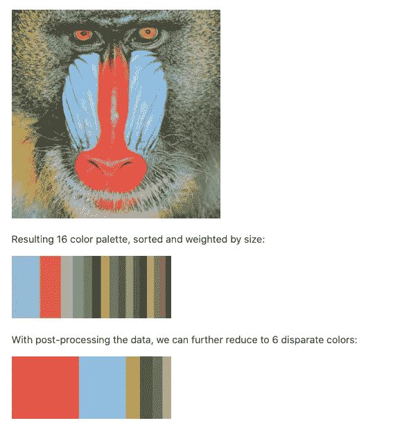

# 图论在图像处理中的应用:洪水填充，图像分割，调色板生成

> 原文：<https://medium.com/geekculture/a-note-on-graph-theory-applications-in-image-processing-flood-fill-image-segmentation-palette-68a7957aed8c?source=collection_archive---------17----------------------->

Photo by [Ricardo Gomez Angel](https://unsplash.com/@ripato?utm_source=medium&utm_medium=referral) on [Unsplash](https://unsplash.com?utm_source=medium&utm_medium=referral)

我最近选修了一门计算机科学课程，内容包括图论、数据结构和算法。

我们讨论了很多现实生活中的问题，图形可以建模并帮助解决这些问题，如社交网络、地图/目的地路由或日程安排，这让我想知道还有哪些领域正在使用图形和图形算法解决问题，这是我以前从未考虑过的(很多领域)。

真正激起我兴趣的一个领域是如何在图像处理中利用图形算法。

没有人会感到惊讶，图像处理是一个非常广泛的主题，充满了迷人和疯狂优化的算法，但见鬼，这里有三个让我震惊的主题，以及我从课堂上学到的相应算法的最基本版本:

1.  **洪水/铲斗填充**与**深度优先搜索**
2.  **图像分割/边缘检测**使用**最小生成树&克鲁斯卡尔算法**
3.  **颜色量化**通过**联合寻找&连通分量**

# 洪水填充

如果你曾经使用过任何类型的图形编辑软件，从 Photoshop 到 MS Paint，你可能对桶工具很熟悉。整体填充是一种算法，它查找连接到开始节点的节点，并找到一条路径，通过该路径可以更改为目标颜色。

[Recursive Flood Fill in 4 and 8 directions — by André Karwath](https://en.wikipedia.org/wiki/Flood_fill#/media/File:Recursive_Flood_Fill_4_(aka).gif)

泛色填充算法可以被建模为图形遍历，将给定图像表示为矩阵，并将每个像素视为连接到其周围、上方、下方、左侧和右侧的像素的顶点，并且在 8 个方向的情况下，连接到给定像素的拐角处的对角相邻像素。

# 图象分割法

[http://people.cs.uchicago.edu/~pff/papers/seg-ijcv.pdf](http://people.cs.uchicago.edu/~pff/papers/seg-ijcv.pdf)

在 2004 年， [Felzenszwalb](http://people.cs.uchicago.edu/~pff/papers/seg-ijcv.pdf) 提出了一种基于 Kruskal 最小生成树算法的分割方法。边按权重递增的顺序考虑；如果这不会导致图形中的循环，并且如果像素与现有区域的像素“相似”,则将它们的端点像素合并到一个区域中。像素相似性是通过启发式算法来判断的，该算法将权重与每段阈值进行比较。该算法输出多个不相连的 MST 或一个森林，其中每棵树对应于一个片段。

在图像分割的情况下，顶点中的元素是像素，边的权重是由该边连接的两个像素之间的相异度的某种度量。

—[https://sandipanweb . WordPress . com/2018/02/25/graph-based-image-segmentation-in-python/](https://sandipanweb.wordpress.com/2018/02/25/graph-based-image-segmentation-in-python/)

# 颜色量化

从相关输入数据构建一个图，该图包含连接 **边**的**顶点**和**。**

顶点包含比较试探所需的信息，而边表示相连的“邻居”。一种算法遍历图形，根据相邻顶点的连通性和相对值来标记顶点。连通性是由媒介决定的；例如，图像图可以是 4-连通邻域或 8-连通邻域。

在标记阶段之后，图可以被分割成子集，之后原始信息可以被恢复和处理。

> 经由[https://en.wikipedia.org/wiki/Color_quantization](https://en.wikipedia.org/wiki/Color_quantization)

Borrowed from Matt DesLauriers’ ATCQ implementation ([https://github.com/mattdesl/atcq](https://github.com/mattdesl/atcq)), but IMO, an excellent visual for what Color Quantization is in general

Union-Find 数据结构在图像处理社区中是众所周知的，因为它用于高效的连通分量标记算法。

> “这样做的目的是产生一个由*种不同的*种颜色组成的调色板，通过反复修剪掉非常接近的颜色(删除权重最小的颜色)，直到最终达到目标数量。”—马特·德斯劳里尔斯

Generic algorithms for union-find functions and getting connected components

# 资源

*   [https://github.com/mattdesl/atcq](https://github.com/mattdesl/atcq)
*   [http://people.cs.uchicago.edu/~pff/papers/seg-ijcv.pdf](http://people.cs.uchicago.edu/~pff/papers/seg-ijcv.pdf)
*   [https://journals . sage pub . com/doi/full/10.1177/1748302619873599](https://journals.sagepub.com/doi/full/10.1177/1748302619873599)
*   [https://www.crisluengo.net/archives/913](https://www.crisluengo.net/archives/913)
*   [https://www . ijser . org/research paper/A-Systematic-Study-on-Applications-of-Graph-Theory-in-Focus-on-Image-segmentation . pdf](https://www.ijser.org/researchpaper/A-Systematic-Study-on-Applications-of-Graph-Theory-in-Image-Processing-With-a-Focus-on-Image-Segmentation.pdf)
*   [http://www . IRI . UPC . edu/files/scidoc/702-Graph-based-presentations-and-techniques-for-image-processing-and-image-analysis . pdf](http://www.iri.upc.edu/files/scidoc/702-Graph-based-representations-and-techniques-for-image-processing-and-image-analysis.pdf)
*   [http://www . CB . uu . se/~ filip/ImageProcessingUsingGraphs/lesten notes/lesten 1 . pdf](http://www.cb.uu.se/~filip/ImageProcessingUsingGraphs/LectureNotes/Lecture1.pdf)