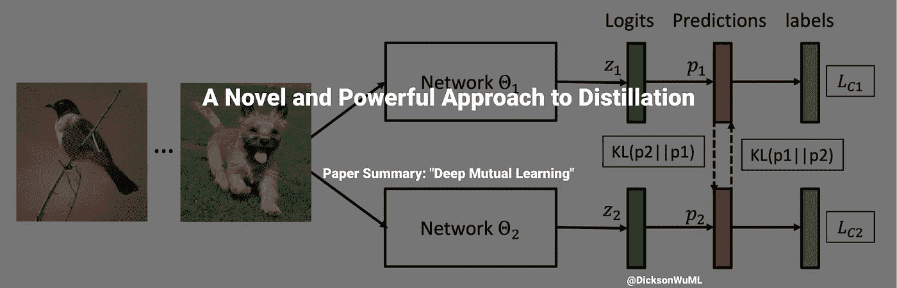

# 一种新颖而有效的蒸馏方法

> 原文：<https://medium.com/geekculture/a-novel-and-powerful-approach-to-distillation-e7aba26c8b98?source=collection_archive---------23----------------------->

## 论文摘要:“深度互学”

> 论文作者:张颖、向涛、蒂莫西·霍斯佩代尔、胡传禄

# 摘要:

在传统的蒸馏中，我们有一个强大的教师模型/集合，它将其知识转移到学生网络，该网络具有更低的内存和/或更快地满足…