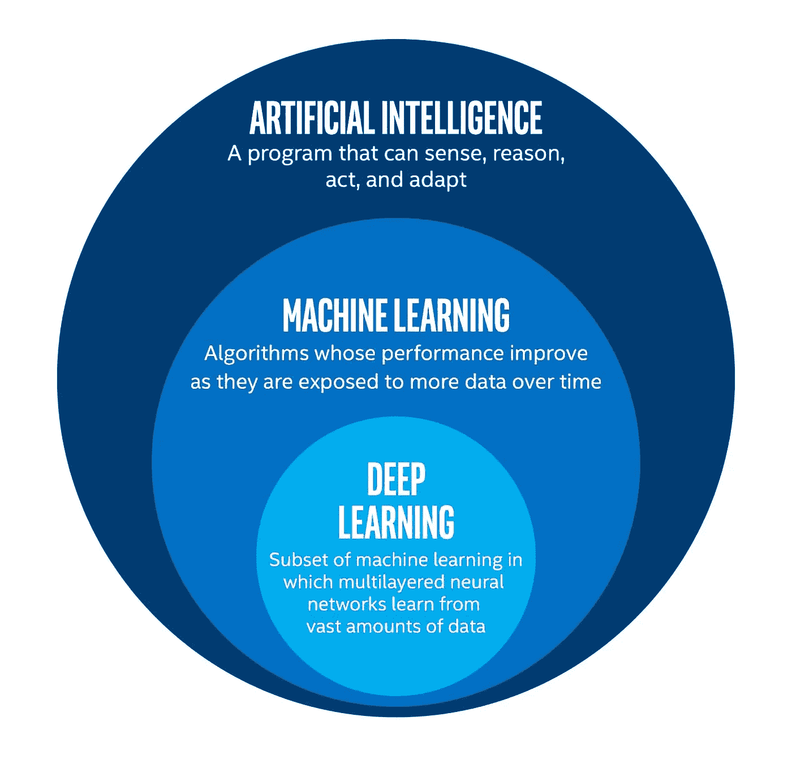

# 理解机器学习的新手指南

> 原文：<https://medium.com/geekculture/a-novices-guide-to-understand-machine-learning-cac964f768d2?source=collection_archive---------25----------------------->

## 机器学习的体验…

Photo by [Blue Planet Studio](https://www.istockphoto.com/photo/future-artificial-intelligence-robot-and-cyborg-gm1202870693-345510100) from [iStockPhoto](https://www.istockphoto.com)

机器学习正在成为科技界最热门的概念。这个词在搜索引擎中很流行，因为越来越多的人想在这个领域发展。这是 2021 年令人着迷的技术。

在这里，我们将讨论它用在什么地方，机器学习的未来是什么，等等。

**什么是机器学习？**

> “机器学习实际上是对计算机系统算法的研究，这些算法可以通过经验以及信息的使用很容易地自动增强。”

Photo by [Intel](https://software.intel.com/content/www/us/en/develop/articles/how-to-get-started-as-a-developer-in-ai.html)

机器学习是人工智能的一部分，通常处理复杂的数据。它有助于处理大量数据，为构建基于预测的报告进行预测，并识别模式。除此之外，它也有助于决策。

在本文中，我们将通过现实生活中的例子来讨论机器学习，并讨论机器学习如何有助于解决商业问题。

**机器学习的基本工作思想**

如果我们谈论传统编程，我们通过编写良好的代码或程序给出输入，然后等待输出。但是在机器学习中，输入和相关的输出数据在学习阶段就被输入到机器中，它会自己构建程序。

**为什么机器学习如此受欢迎？**

机器学习是一个正在赢得喝彩和认可的术语。机器学习可以执行所有只有人类凭借其技能和智能才能完成的任务。大多数企业使用这项技术来自动化他们的日常工作。由于机器学习的特点，它越来越受欢迎。它有助于为数据分析创建模型。几乎每个行业都要处理海量数据，他们需要专业技术来优化数据并做出有见地的决策。有了它，组织可以用最短的周转时间创建模型。它有助于通过最小化风险来利用机会。

除了所有这些事情，机器学习还有助于生成文本、图像和其他实际应用，这就是为什么初学者在这方面有很大的发展空间。

**机器学习是如何工作的？**

机器学习模型通过考虑输入其中的历史数据来工作。它构建并生成算法来预测新数据集的输出。例如，我们有一个复杂的问题，我们希望找到一些预测。

我们可以将数据输入预定义的机器学习算法，而不是手动浏览所有数据。现在，机器将通过算法建立一些逻辑来开发输出。

因此，通过这种方式，机器学习可以改变处理商业和社会问题的整体方式。这个模型的准确性是基于你输入的数据量及其质量。

**机器学习算法的基本类型:**

机器学习算法分为四类，每一类都互不相同。

*   **监督学习**

在这种方法中，算法是从一组标记的数据中使用的。在这里，您已经有了一些已知的答案，可以很容易地确定新数据是否与此匹配。在这种方法中，机器将从你提供的信息中评估数据。你给出的数据越多，它给出的结果就越精确。

*   **无监督学习**

这与监督学习正好相反。在这种类型的机器学习中，给程序的数据是没有标记的。不知道这些数据代表什么。所以，在这里，机器将检测模式，组合它们，然后概括结果。

*   **半监督学习**

这是上述类型的混合，其中您提供给机器的数据有一些标签，它可以帮助处理更大的未标记数据集。

*   **强化学习**

该方法基于使用未标记数据的持续学习和奖励。在交互环境中训练机器学习模型做出目标导向的决策是有帮助的。

**可以通过机器学习解决的问题:**

*   **针对目标市场**

在线平台和网站收集了海量的用户数据，这些数据可用于有针对性的个性化营销。这是推荐产品的理想选择。这有利于识别转化率、预测客户终身价值和预测流失率。

*   **用于检测欺诈行为**

因为有了机器学习技术，交易中的违规行为将变得容易识别。有了它，企业可以提高其安全性并识别欺诈交易。

*   **用于交通预测**

机器学习算法在谷歌地图中也是有益的。它的工作原理是将交通数据与从公共交通和私家车传输的实时 GPS 数据进行比较。它预测交通拥堵程度，并建立理想的导航路线，以提供准确的结果。

*   **在聊天机器人和面部识别中**

聊天机器人和面部识别的广泛流行定义了机器学习在现实世界中的价值和成功。

**机器学习的未来**

如果我们谈论未来，那么它显然正在一天天萌芽。大型组织以及初创企业都采用这种技术来快速解决复杂的数据。这有助于提供更好的投资回报率。这项技术被用于许多流行的平台，如网飞、亚马逊、脸书、谷歌地图等等。

在未来，我们肯定会看到越来越多的机器学习算法将有所帮助的应用。通过考虑这些事情，机器学习领域将会出现巨大的空缺。如果你想建设你的未来，那么这是采取一些措施的好时机。

Photo by [Markus Winkler](https://unsplash.com/@markuswinkler?utm_source=medium&utm_medium=referral) on [Unsplash](https://unsplash.com?utm_source=medium&utm_medium=referral)

**结论**

机器学习在医疗保健部门、交通部门、金融部门和政府部门有着广泛的应用前景。机器学习的魅力与日俱增。*根据* [*薪级表*](https://www.payscale.com/research/US/Job=Machine_Learning_Engineer/Salary) *显示，在美国，机器学习工程师的全国平均工资为每年 113425 美元*。因此，作为一个新手，从今天开始设定你的目标，跟上科技和互联网的发展。