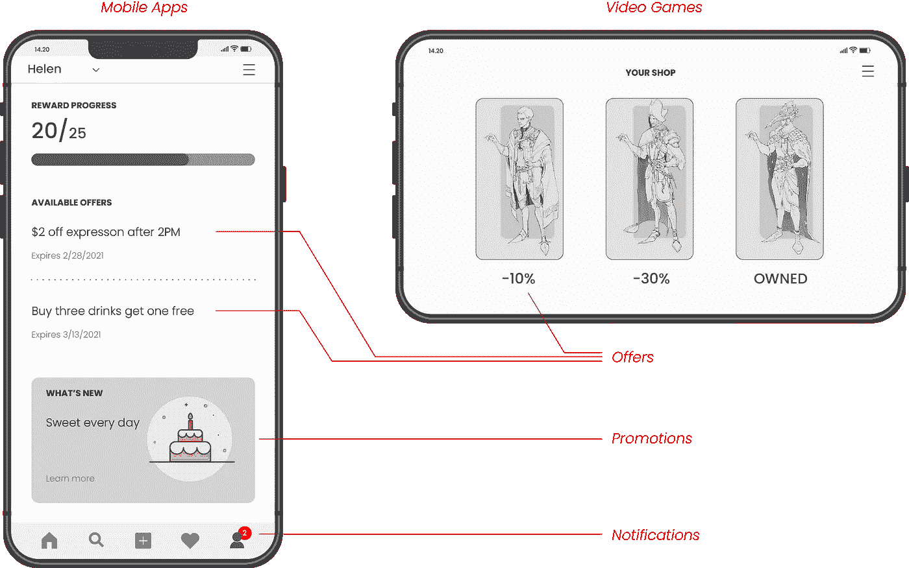
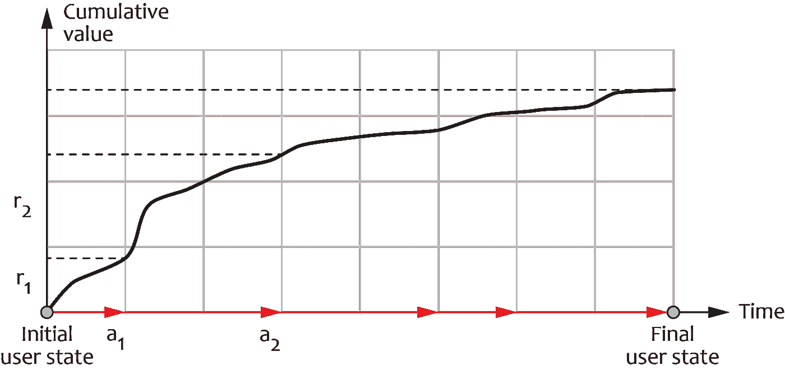
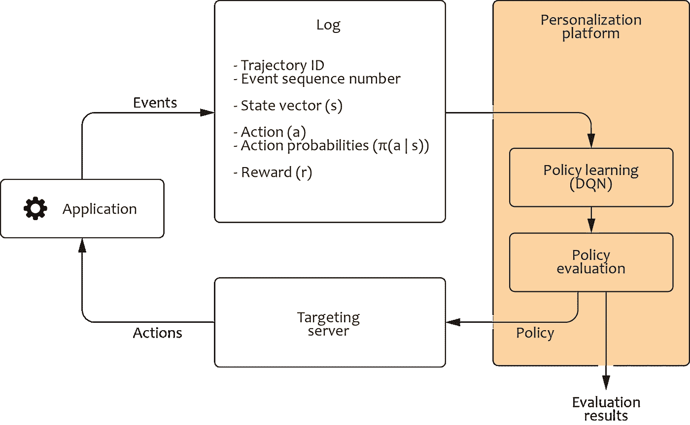
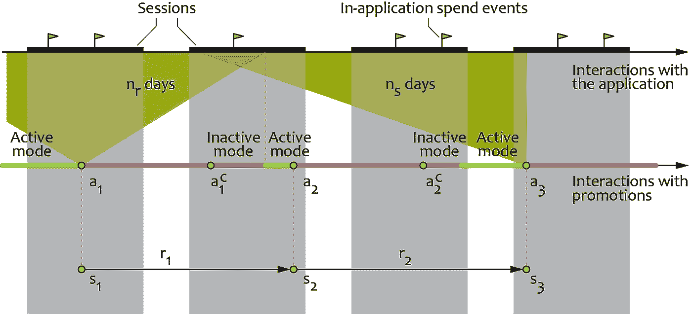
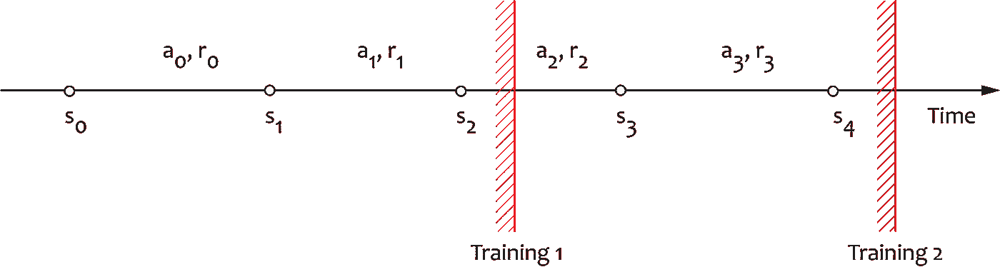

# 一个即插即用的应用内和游戏内个性化体验平台

> 原文：<https://medium.com/geekculture/a-plug-and-play-platform-for-in-app-and-in-game-experience-personalization-21eba2315a89?source=collection_archive---------35----------------------->

Article originally posted at [Grid Dynamics Blog](https://blog.griddynamics.com/?utm_source=medium&utm_medium=referral&utm_campaign=Plug_and_play_Platform_for_In_App_and_In_game_Experience_Personalization)

个性化和推荐模型被技术和娱乐公司广泛采用，作为数字体验改善和转换优化的高效工具。然而，传统的模型开发和产品化过程需要大量的工程工作，这增加了上市时间和实施成本。在本文中，我们讨论了一个个性化平台的设计，该平台使用强化学习来降低实现的复杂性并提高推荐的质量。

我们考虑一家开发视频游戏和移动应用程序的公司的案例。该公司旨在通过在移动应用程序或游戏内商店的订阅源中显示个性化的优惠、促销和通知来提高用户参与度和游戏内货币化。此类优惠包括游戏升级、虚拟货币包和忠诚度移动应用中的特殊交易:

# 设计目标:战略优化和自动化

从商业角度来看，公司的首要目标是提高应用程序或游戏的长期性能。这种表现可以使用各种参与度和货币指标来衡量，包括报价接受率、应用内用户支出和游戏会话持续时间。大多数用户与产品互动的时间跨度相对较长，因此优化战略内容中的每个动作(优惠、促销或通知)是很重要的，它包括过去和以前的步骤，而不是孤立地优化动作。我们可以将 atat 上的每个行为与以参与度或货币形式衡量的价值 rtrt 的一部分相关联，这样在长时间内从单个用户获得的总价值将是这些部分的总和:

定义价值标准的灵活性和战略性地优化行动顺序的能力是该平台的主要设计目标。

从工程角度来看，主要考虑的是与解决方案实施和操作化相关的工作和时间。传统的目标和个性化技术，如倾向评分和协作过滤，通常需要在每个用例的功能工程、模型开发和产品化方面投入大量精力。特别是，通常需要一些努力来操作由预测模型产生的分数，并在其基础上开发交易决策组件。使用规定的而不是预测的方法实现高度自动化通常是现代个性化平台的设计目标。

传统的个性化方法还假设覆盖所有动作或至少动作类型的历史用户交互数据的可用性。这种假设在许多情况下并不成立，包括新游戏版本的发布、新应用程序功能和新类型的促销活动。在这种情况下，我们可能需要开发定制的变通方法或安排随机实验来收集数据，这既增加了工程工作量，又降低了系统效率。因此，在动态环境中学习和适应的能力也是平台的基本设计目标。

# 解决方案:强化学习平台

从概念上讲，上一节中描述的目标可以使用强化学习技术来实现。首先，强化学习方法是专门为战略(多步)优化设计的，并提供了强大的统计工具，用于根据从环境中收集的有噪声的反馈来执行这种优化。其次，强化学习明确地解决了基于从环境中收集的反馈的动态探索和交互式学习的问题——大多数强化学习算法可以在没有对历史数据进行预训练的情况下开始运行，并从正在进行的观察中学习。最后，强化学习算法通常可以被视为遵循我们在上一节中提到的规范范式的自主代理。

不幸的是，由于几个原因，在企业环境中实际采用强化学习方法是非常具有挑战性的。首先，大多数强化学习算法容易出现稳定性和收敛性问题，需要执行各种安全检查和仔细监控。第二，交互式学习意味着代理需要直接集成到生产环境中，这使得维护变得复杂并带来了额外的风险。最后，部署未经训练的代理直接在生产中采取随机行动对大多数公司来说是不可接受的，尽管强化学习理论上能够以这种方式引导。

然而，强化学习的优势超过了与其采用相关的挑战，许多知名公司报告称，他们在生产中使用了强化学习算法。这包括星巴克开发的忠诚度应用优化解决方案[1]，Adobe 开发的战略广告优化解决方案[2]，以及脸书为其社交网络平台开发的用户体验优化解决方案[3]。

在本节中，我们将讨论 Grid Dynamics 最近基于脸书试剂框架开发的平台的设计，以及我们从实际应用中获得的一些经验。

# 作为马尔可夫决策过程的经验优化

让我们首先简要回顾一下如何用强化学习的术语来表示敬业度优化问题。我们之前已经说过，个性化代理在离散的步骤中与用户交互，并且它在每一步采取特定的动作 at，tt 接收返回值 rtrt，该值表征了在动作被执行之后从用户获得的参与度或金钱收益。根据强化学习术语，我们将 rtrt 值称为奖励。最后，我们可以假设在任何时间步，用户和交互上下文的状态可以由一个特征向量来描述，我们将其表示为 stst。因此，整个用户旅程可以表示为一系列转换(st，at，rt，st+1)(st，at，rt，st+1)，我们称之为轨迹。下图描绘了一个假设五种状态的离散集合的轨迹的玩具示例:

实际上，状态是一个多维实值向量。更重要的是，我们必须以这样一种方式设计状态向量，即 stst 包括关于用户和上下文直到 tt 时刻的所有重要信息，使得回报和下一个状态的概率分布不依赖于先前的状态和动作；即

p(rt，st|s0，a0，s1，a1，…)=p(rt，ST | st1，at)p(rt，st|s0，a0，s1，a1，…)=p(rt，ST | st1，at)

这种称为马尔可夫特性的特性极大地简化了支持动作优化的模型的设计，并提高了它们的计算效率。我们将在下一节详细阐述这个主题。

# 选择算法

强化学习为马尔可夫决策过程中的行动优化提供了广泛的解决方案。这些算法的不同之处在于它们的样本效率(学习有效动作策略所需的转换次数)、支持的动作空间(离散或连续)以及计算效率。

强化学习算法的最大类别之一是基于值的方法。这些方法的共同特点是，它们显式地估计轨迹的期望回报(回报之和)，然后用它来构造行动策略。所有实际上重要的基于价值的方法都利用了允许递归计算回报的环境的马尔可夫属性。例如，假设我们在 at 采取行动，估计从状态 stst 开始的轨迹的值函数的一种特定方法如下:

Q(st，at)=E[T∑τ=trτ]≈rt+maxaQ(st+1，a)Q(st，at)=E[∑τ=tTrτ]≈rt+maxaQ(st+1，a)

这种近似允许我们使用基于从环境中收集的多个转换样本(st，at，rt，st+1)(st，at，rt，st+1)的常规监督学习方法来拟合值函数 Q(a，s)Q(a，s)。此外，在一个动作策略下批量收集这些样本，然后基于该输入训练另一个策略是有效的。这个属性对平台架构有很大的影响，我们将在下一节讨论。然后，使用价值函数来确定当前状态下的最佳可能动作，并构建平衡价值最大化和环境随机探索的动作策略。

实现上述方法的最常见、最健壮和最通用的算法之一是深度 Q 网络(DQN ),其使用深度神经网络作为值函数近似器，并且还使用若干启发式技术来提高学习过程的计算稳定性和效率。在实践中，我们发现 DQN 及其变体对于大多数个性化问题都相当有效。DQN 的缺点之一是要求动作空间离散且相对较小；从上面的递归方程中可以明显看出，在每一步中搜索价值最大化动作，这需要枚举动作空间中的所有元素。在个性化应用程序中，这种假设有时会有局限性，因为可用促销或促销位置组合的数量可能相对较高。这个问题可以通过使用支持连续动作空间的动作评论算法来缓解，我们下面描述的平台支持这个选项。

# 平台架构

根据上述部分，将 DQN 等强化学习代理直接集成到生产环境中可能会很有吸引力，这样它可以实时执行报价个性化决策，并立即从反馈中学习。不幸的是，在实践中实现和操作这样的解决方案是具有挑战性的，因为它没有提供从生产环境中单独修改、重新训练或评估代理的方法。

我们可以通过将代理与应用程序后端服务或视频游戏服务器分离来解决上述问题，如下图所示:

在该架构中，交易应用需要以特定格式记录用户交互事件，包括客户旅程 ID、该旅程中事件的序列号、与事件相关联的状态向量、代理采取的行动、其他可能行动的概率以及奖励。这些日志然后被用于迭代地训练代理:

*   我们从在初始动作选择策略下收集日志开始，该策略可以是随机的或基于规则的。
*   记录的状态、动作和奖励被用于训练任意的偏离策略强化学习算法:日志被逐个事件地重放，模拟与环境的实际交互。
*   记录的动作概率用于通过训练过程产生的策略的反事实评估。
*   如果评估结果符合质量和安全标准，新版本的策略将被部署到生产环境中，并重复培训周期。

上面描述的设计被实现为使用标准组件的通用平台。该平台支持从开源库中集成的几种强化学习算法，无需修改，并且很容易在算法之间切换。该平台还支持多种反事实政策评估(CPE)方法，并为评估结果的分析提供通用接口。最后，图中描述的目标服务器代表了一个通用的部署容器，用于从平台作为二进制工件导出的经过训练的策略。服务器处理来自事务性应用程序的个性化请求，根据业务规则阻止某些策略决策，并管理 a/b 测试逻辑。与传统方法相比，上述解决方案从根本上不同的角度看待个性化模型。它使用强化学习不仅作为价值函数估计的算法，而且作为一个端到端的优化机器，将探索、学习和评估能力打包在一起。与倾向建模等传统数据科学方法相比，这种多功能性是强化学习的主要优势之一。

# 状态、动作和奖励的设计

上一节描述的平台通常提供了高度的自动化，但是它仍然需要设计奖励、状态和动作，作为集成工作的一部分。在这一节中，我们将进一步了解这些细节。

为了便于说明，我们将重点放在应用程序一次只允许显示一个报价实例的情况上，尽管通常情况下用户会看到几个报价。下图给出了说明这种情况的时间表示例:

代理按顺序做出要约决定，因此首先向用户提供选项 a1a1，然后代理等待，直到要约被接受(事件 ac1a1c)或过期。报价之间的最短时间限制为 nrnr 天，如果报价更快被接受，代理将切换到非活动模式。一旦要约被接受或到期，代理切换到主动模式，生成下一个要约 a2a2，并重复该循环。

在许多数字应用中，对于发布要约的公司来说，要约的货币成本为零。例如，视频游戏发行商通常使用游戏内升级和虚拟货币包作为促销手段。在这种情况下，重要的是在行动集合中包括不行动元素，监控报价相对于不报价基线的提升，并实施惩罚以防止代理了解滥用激励的政策。对于与非零货币成本相关联的报价，可以通过将这些成本分解到奖励设计中来更直接地管理提升。

该平台支持多种奖励计算方法，包括应用内收入、虚拟货币支出和二元奖励(如果报价被接受，奖励 1，否则为零)。在所有这些情况下，基于动作后 nrnr 天的时间窗来计算奖励，因此，奖励值在 nrnr 天的延迟后获得。为了创建可以被强化学习平台使用的完整日志，在行动时产生的日志记录被存储在缓冲器中，并且稍后与相应的奖励相结合。

陈述的特征包括一些参与度度量，例如会话的持续时间、日历和用户人口统计特征。敬业度特征是在行动前 nsns 天的固定时间窗口内计算的，如上图所示。

# 增量训练

基于日志的方法有助于将代理培训过程从生产操作中分离出来，但它也带来了一些挑战。平台运作的一个潜在问题是增量培训。根据定义，所有强化学习算法都旨在最大化轨迹回报，因此需要正确指定轨迹和回报。在个性化平台的情况下，用户可以与应用程序进行无限长时间的交互，因此她的轨迹可以无限增长。这可能会导致轨迹设定错误。为了更好地理解这个问题，让我们以下面的轨迹为例来看一下 DQN 的训练过程:

我们首先假设来自该轨迹的前两个转变的对数，并且计算 DQN 训练的目标标签为
Q(s0，a0)=r0+γmaxaQ(s1，a)Q(s1，a1)=r1Q(s0，a0)=r0+γmaxaQ(s1，a)Q(s1，a1)=r1

状态 s2s2 是该轨迹中的最终状态，因此我们仅对第一次跃迁展开递归。假设到第二次训练时轨迹被延长了两个以上的转换，新的目标标签被计算如下:
Q(s2，a2)=r2+maxaQ(s3，a)Q(s3，a3)=r3Q(s2，a2)=r2+maxaQ(s3，a)Q(s3，a3)=r3

因此，到第二次训练时，DQN 缓冲区包含两对不相关的样本，这使得不可能跨所有四个转换进行策略优化。这个问题可以通过使用更长的轨迹段或其他调整来解决，以确保增量学习的正确性。

# 结果

强化学习平台证明了自己是实现我们在文章开头设定的目标的有效解决方案。首先，与基于规则或基于倾向的基本解决方案相比，其战略优化能力可以带来显著提升。在某些情况下，我们观察到与遗留基线相比大约有 20%的提升。

第二，平台的整合过程比较短。在许多情况下，从最初的分析到生产启动，试点项目可以在大约八周内实施。尽管这还不是一个完美的即插即用解决方案，但与传统建模方法相比，这是一个重大进步。

最后，该平台提供了高级自动化功能，包括反事实策略评估、a/b 测试和一系列现成的强化学习算法。这有助于专注于商业问题，如奖励和行动设计，而不是专注于基本的建模和 MLOps 任务。

同时，如果您对该解决方案或我们公司感兴趣，请不要犹豫，联系我们！

# 参考

1.  詹妮弗·索科洛夫斯基，“星巴克转向技术，与顾客建立更个性化的联系”，2019 年
2.  圣乔治·塞奥查卢斯、菲利普·托马斯和穆罕默德·加瓦姆扎德，“有保证的生命周期价值优化个性化广告推荐系统”，2015 年
3.  杰森·高西等人，《地平线:脸书开源应用强化学习平台》，2019