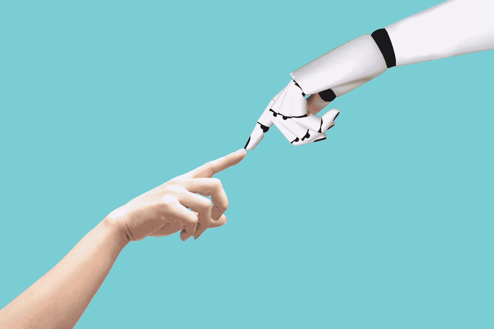

# 为期 12 周的实用课程，学习使用 Python 实现自动化

> 原文：<https://medium.com/geekculture/a-practical-12-week-course-to-learn-to-automate-stuff-with-python-4b61b5c3e7e4?source=collection_archive---------0----------------------->

## 学习用 Python 自动完成工作，让计算机为你做所有的脏活累活。

Image via iStockphoto under license to Frank Andrade

使用 Python 可以做的最酷的事情之一就是自动化任务。

不管你是零知识还是 Python 专家，学习用 Python 自动化任务将…