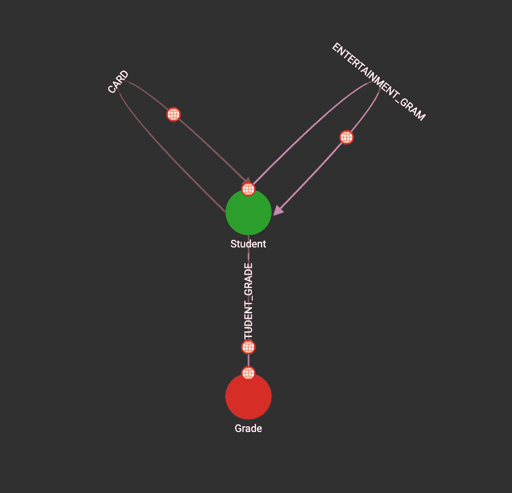

# TigerGraph 的实际应用:将 TigerGraph 用于筹款事件数据库

> 原文：<https://medium.com/geekculture/a-practical-application-of-tigergraph-using-tigergraph-for-a-fundraising-event-database-9bdb17dd82c?source=collection_archive---------19----------------------->

## 我如何将 TigerGraph 应用于学校活动的一个例子

# 语境

每年，我们学校的三年级学生都会为毕业舞会举办一场盛大的情人节募捐活动。然而，今年由于疫情，我们不得不在网上进行募捐，销售两种产品:娱乐卡和贺卡。(尽管在事件本身中，我们最终是混血儿。)而不是资助 prom，所有的钱都捐给了白血病和淋巴瘤协会。卡片将直接发给每个学生，娱乐节目需要按照年级来组织。

# 数据

因此，首先，我们创建了一个谷歌表单，让学生选择他们想要的。我找不到任何好的方法来格式化它，所以这个表单将数据分为 11 个卡片部分和 8 个娱乐节目部分。Google Forms 生成的 Excel 表格相对混乱:我需要的所有数据有几列，许多列是空的。此外，由于表单经历了多次迭代，所以有许多旧列在最终版本中从未使用过。因此，总的来说，我的数据是一团糟。

除此之外，我还得到了两张 Excel 表格:一张是所有有学校邮箱的学生的列表，另一张是他们的学校邮箱，另一张是所有没有学校邮箱的学生的列表，另一张是他们父母的邮箱。

因此，简而言之，我有三个 Excel 表:一个包含所有订单，一个包含有学校电子邮件的学生，一个包含没有学校电子邮件的学生。我的目标是合并每个人的订单，按等级分组，然后放入 Excel 表格中，供所有低年级学生提交。

# 步骤 0:库、设置等。

为此，我使用 Python 来处理数据。我使用 Pandas 解析 Excel 表，然后使用 pyTigerGraph 与我的 TigerGraph 解决方案进行交互。

```
import pandas as pd
import pyTigerGraphBeta as tg
```

为了启动解决方案，我转到 [https://tgcloud.io](https://tgcloud.io.) ，通过执行以下操作创建并启动了一个解决方案:

1.  前往 [https://tgcloud.io](https://tgcloud.io) 并导航至“我的解决方案”
2.  单击蓝色的“创建解决方案”按钮，然后按照提示创建免费的解决方案。注意:记下您使用的子域；这在以后会很重要！
3.  等待解决方案启动。

接下来，我需要创建一个到我的图表的连接。

```
conn = tg.TigerGraphConnection( host="https://SUBDOMAIN.i.tgcloud.io",
password="tigergraph", useCert=True )
```

在这种情况下，子域是您在创建解决方案时指定的子域。

# 第一步:创建模式

首先，我需要为我的图表创建模式。我以为这很简单。每个学生都有电子邮件的属性。学生将被连接到他们年级的一个顶点。最后，学生与一个有向顶点连接，该顶点具有发送的卡片的属性。

因此，总的来说，代码应该是这样的:

```
conn.gsql('''
     CREATE VERTEX Student (PRIMARY_ID id STRING, first_name STRING, last_name STRING, email STRING)
     CREATE VERTEX Grade (PRIMARY_ID grade STRING) WITH primary_id_as_attribute="true"

     CREATE UNDIRECTED EDGE STUDENT_GRADE (FROM Student, TO Grade)
     CREATE DIRECTED EDGE CARD (FROM Student, TO Student, order_id STRING, card_url STRING, sender_nickname STRING)
     CREATE DIRECTED EDGE ENTERTAINMENT_GRAM (FROM Student, TO Student, order_id STRING, gram_name STRING)
''')conn.gsql('''CREATE GRAPH VdayGraph(Student, Grade, STUDENT_GRADE, CARD, ENTERTAINMENT_GRAM)''')
```

运行这段代码应该会在我们的解决方案中创建这个模式。



Resulting Schema in Graph Studio

接下来，我们需要更新连接的详细信息，这样我们就可以将数据插入其中:

```
conn.graphname = "VdayGraph"
conn.apiToken = conn.getToken(conn.createSecret())
```

注意:如果 conn.createSecret()不起作用，您需要从图中生成一个秘密。参考[这篇博客](https://towardsdatascience.com/generating-a-secret-in-tigergraph-e5139d52dff6)了解如何做到这一点的更多细节！

现在我们已经准备好开始将数据加载到图表中了！

# 步骤二:加载数据

接下来，我把所有的数据都插入到我的图表中。首先，我将数据向上插入到“Grade”顶点。这相当简单:我只是为幼儿园增加了“K ”,然后为 1-12 年级增加了 1-12。

```
conn.upsertVertex("Grade", "K", attributes={"grade": "K"})for grade in range(1, 13):
    conn.upsertVertex("Grade", str(grade), attributes={"grade": str(grade)})
```

接下来，我需要向上插入我的学生顶点和我的卡片和娱乐边。为此，我使用了 [pyTigerGraph 的 dataframe 函数](https://pytigergraph.github.io/pyTigerGraph/DataFrame/)。首先，我通过读取 Excel 文件将 Excel 文件转换成熊猫数据帧:

```
student_emails = pd.read_excel("Student Email Adresses grades 5-12 (2021).xlsx")young_student_emails = pd.read_excel("K-4 Primary Parents Email 2021.xlsx")
```

接下来，我编写了一个快速函数来解析学生姓名:

```
def convert_style(name):
    return [i.strip() for i in name.split(", ")]
```

然后，我将两个 Excel 表格中的数据放在一起，组成一个新的数据框架，并将数据向上插入到我的图表中:

```
updated_df = pd.DataFrame({
     "FirstName": [convert_style(i)[1] for i in student_emails["LastName, FirstName"]] + [convert_style(i)[1] for i in young_student_emails["Student"]],
     "LastName": [convert_style(i)[0] for i in student_emails["LastName, FirstName"]] + [convert_style(i)[0] for i in young_student_emails["Student"]],
     "Email": list(student_emails["Email 1"]) + list(young_student_emails["Email"])
})conn.upsertVertexDataFrame(updated_df, "Student", attributes={"first_name": "FirstName", "last_name": "LastName", "email": "Email"})
```

接下来，我重复了这个过程，但是使用学生的回答表向上插入边缘。

一旦所有这些都在我的图表中，就该写查询了。

# 第三步:编写查询

下一步是对我的数据编写查询。对于卡片，我需要将所有的学生按年级进行分类。接下来，我需要获取发送者的真实姓名、发送者的昵称、接收者、接收者的电子邮件和发送的卡片的数据。

这是我创建的查询:

```
CREATE QUERY getOrdersByGrade(STRING grade) FOR GRAPH VdayGraph { // Set up 
  ListAccum<edge> @@edgeList;
  Seed = {Grade.*};

  // First hop from Grade to Student
  Students = SELECT s FROM Seed:g-(STUDENT_GRADE:e)-Student:s
              WHERE g.grade == grade;

  // Second Hop for Orders 
  Students2 = SELECT t FROM Students:s-(CARD:o)->Student:t
            ACCUM @@edgeList+=o;

  PRINT @@edgeList;
}
```

遍历查询时，我从 Grade 顶点开始。接下来，我遍历 STUDENT_GRADE 边缘来检索该年级的所有学生。接下来，我去查看所有其他学生与该年级学生的联系，并检索他们的订单。我累积了所有的边(或顺序),然后最终返回了这个列表。

在 TigerGraph 中，我安装并上传了查询。然后，我可以轻松地访问我的 Python 文件中的书面查询:

```
conn.runInstalledQuery("getOrdersByGrade", params={"grade": "K"})
```

或者，只获取边的列表:

```
conn.runInstalledQuery("getOrdersByGrade", params={"grade": "K"})[0]["@@edgeList"]
```

然后我可以使用这个结果来创建一个 CSV 文件。

# 第四步:创建 CSV 文件

最后，为了将它分发给我的同学，我只是将 edgeSetToDataFrame 与我的查询结果一起使用。在创建了数据帧之后，我从文件中删除了订购 id，并添加了一个“已发送”列。最后，我把所有的 Excel 文件上传到 Google Drive，让其他人分而治之。

# 面临的问题

因此，面临的最大问题之一就是错别字。因为只有很少的错别字，比如没有输入一个人的姓或者拼错了一个人的名字，我们只是为了计时的目的手动修正了这些。(我不可能再花几个小时去尝试自动化我们可能需要 30 分钟的事情。)

# 扩展

这是活动开始前几天晚上面临的挑战，所以我很快就把所有东西都整理好了。然而，一个很酷的下一步将是为我们今年的筹款活动创造视觉效果。期待一个博客，展示如何在未来用你的数据创造可视化！

# 后续步骤(供读者参考)

非常感谢你阅读这个博客！如果你对创建这样的东西感兴趣，或者想用 TigerGraph 创建其他很酷的项目，请加入 TigerGraph Discord:

[](https://discord.gg/yCm9Kv9rDv) [## 加入 TigerGraph Discord 服务器！

### 查看 Discord 上的 TigerGraph 社区-与 496 名其他成员一起闲逛，享受免费语音和文本聊天。

不和谐. gg](https://discord.gg/yCm9Kv9rDv)