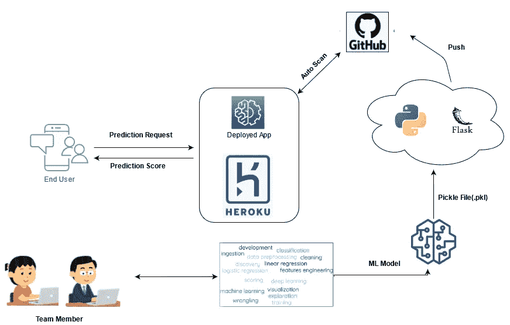
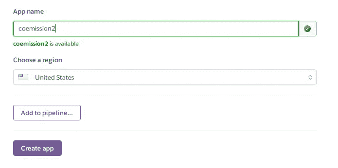
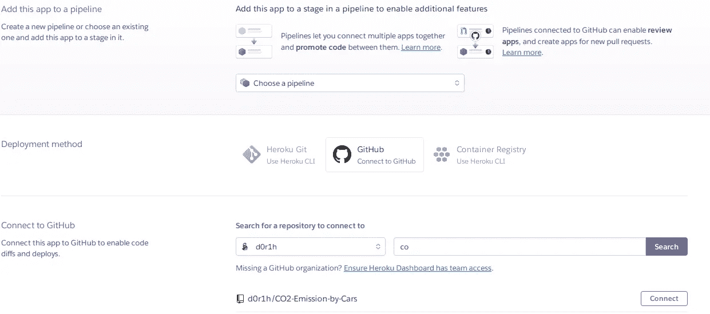
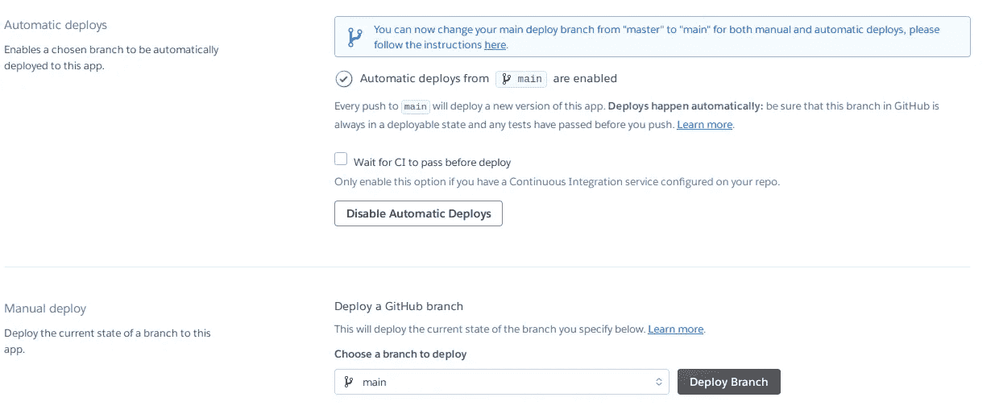
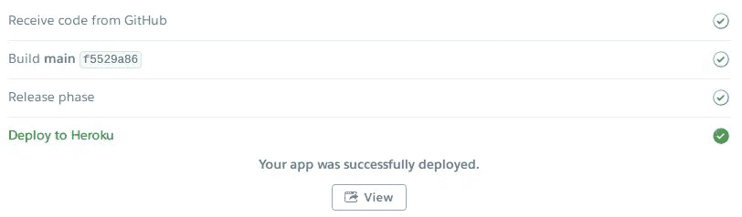

# 部署机器学习项目 101 实用指南

> 原文：<https://medium.com/geekculture/a-practical-guide-on-deploying-machine-learning-project-101-a494314a6127?source=collection_archive---------55----------------------->

关于如何在 Heroku 上部署你的第一个 ML 项目的实用学生指南。


在这篇文章中，你将学习如何建立一个机器学习模型，将它打包并部署到云上。

这篇文章分为两部分—

1.  构建 ML 模型
2.  在云上部署它

因此，在开始之前，让我们看看这个项目的流程，以及我们要解决的问题，并构建一个应用程序来解决这个问题，下面是这个项目的技术堆栈



# 构建机器学习模型

我不打算深入研究预处理、特征工程、构建通用模型和其他微调步骤的过程，而是利用我在项目中使用的数据，在此基础上构建一个模型。这样我就可以专注于主要任务。

因此，我们建立了一个可靠的机器学习模型来预测不同类型汽车的二氧化碳排放量，数据集取自 [Kaggle[1]](https://www.kaggle.com/debajyotipodder/co2-emission-by-vehicles) 。

为了建立模型，我们使用线性回归算法，我们根据模型所需的预处理和微调数据来训练模型。

你可以从 Kaggle 下载数据，并为训练模型做好准备。一旦数据集准备好了，你就可以通过下面的代码:—

使用上述步骤，您训练了一个模型，并将其打包到 pickle 文件中，我们将使用该文件进行部署。现在我们将转移到部署部分，因为我们的模型已经准备好了。

# 在云上部署它

那么，现在模型已经在 pickle 文件中训练好并准备好了，现在让我们开始…

首先，我们使用 conda 发行版创建一个新的虚拟环境，并且为每个 python 项目创建一个单独的虚拟环境总是一个好主意，以便更深入地了解参考[这篇文章](https://realpython.com/python-virtual-environments-a-primer/)【2】。

通过运行以下命令，您可以创建一个虚拟环境 **C02** 并通过执行“python app.py ”,它将启动一个本地服务器，web 应用程序将在该服务器上加载，您可以使用该服务器进行预测。

为了在您的系统上运行这个设置，您可以从这个存储库中下载代码，并以同样的方式执行它。

[](https://github.com/d0r1h/CO2-Emission-by-Cars) [## d0r1h/汽车二氧化碳排放量

### 预测不同类型汽车二氧化碳排放量的可靠机器学习模型——d0r1h/CO2-by-Cars

github.com](https://github.com/d0r1h/CO2-Emission-by-Cars) 

现在，您已经在本地系统中测试了您的机器学习模型，并且它运行良好，是时候将它放入云中，以便每个人都可以访问它。

一旦你的模型被打包到 pickle 文件中，你必须创建一个 flask 应用程序，你可以从头开始[创建 flask 应用程序](https://realpython.com/flask-by-example-part-1-project-setup/) [3]或者可以使用我的模板并根据你的要求修改它。

在 C02 项目中，总共有 10 个特征，其中 6 个是数字，例如(发动机尺寸、气缸、燃料消耗城市、高速公路等)。)和 4 是分类的，例如(燃料类型、变速器类型、品牌、车辆类别)。因此，对于数字特性，我创建了用于输入的框字段，对于分类特性，我创建了下拉菜单供选择。为了更好地理解我如何开发前端检查这个 [HTML 文件。](https://raw.githubusercontent.com/d0r1h/CO2-Emission-by-Cars/main/templates/index.html)

通过按下**计算 co2** 按钮，一旦所有字段都已填写，并且从下拉菜单中选择了数值，模型将返回预测的 co2。

因此，要在 Heroku 上部署它，首先将代码推送到 GitHub 上，下面的文件是在 Heroku 上部署应用程序所必需的。

```
[wsgi.py](https://github.com/d0r1h/CO2-Emission-by-Cars/blob/main/wsgi.py)
[requirements.txt](https://github.com/d0r1h/CO2-Emission-by-Cars/blob/main/requirements.txt)
[Procfile](https://github.com/d0r1h/CO2-Emission-by-Cars/blob/main/Procfile)
```

进入 [Heroku](https://www.heroku.com/) ，一旦你完成了登录过程，主屏幕就会出现，现在按照以下步骤操作:—

*   点击创建新应用程序
*   填写应用程序名称并点击创建应用程序
*   现在不需要选择管道
*   选择部署方法为 GitHub，并连接到 GitHub 帐户
*   搜索您托管代码的存储库名称，然后单击 connect
*   选择 branch(main)并启用自动部署，方法是单击相同的按钮(*以便在代码(GitHub)中进行更改时，该更改将自动反映在应用程序中*)并单击 deploy branch。
*   现在将构建应用程序，一旦完成，您将获得访问该应用程序的 URL，或者通过单击**查看**按钮，您可以看到您的应用程序。

您可以使用下图来更好地理解如何在 Heroku 上部署应用程序。



我的申请链接:[https://coemission.herokuapp.com/](https://coemission.herokuapp.com/)

脚注:

[1].[https://www . ka ggle . com/debajyotipodder/CO2-由车辆排放](https://www.kaggle.com/debajyotipodder/co2-emission-by-vehicles)。[2].[https://real python . com/python-virtual-environments-a-primer/](https://realpython.com/python-virtual-environments-a-primer/)。。。。[3].[https://real python . com/flask-by-example-part-1-project-setup/](https://realpython.com/flask-by-example-part-1-project-setup/)