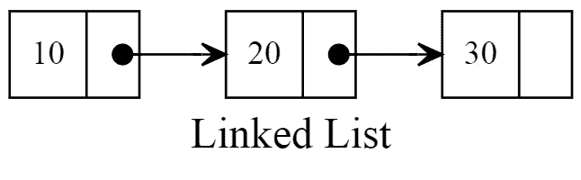
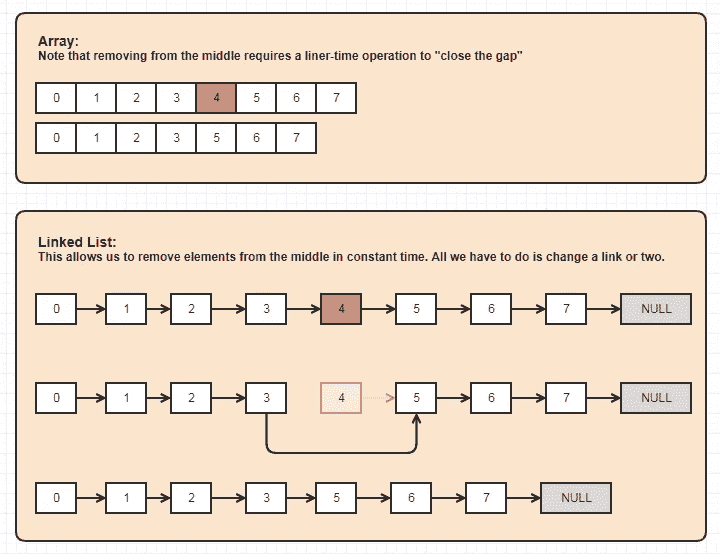

# 链表数据结构的实用介绍(带 JavaScript 例子)

> 原文：<https://medium.com/geekculture/a-practical-intro-to-the-linked-list-data-structure-with-javascript-examples-42bf54344eef?source=collection_archive---------24----------------------->


# 你为什么要关心什么是链表？

自从 20 世纪 50 年代的以来，链表就已经存在了，它们仍然相关吗？绝对的！

对于构建[队列或堆栈](https://osgoodgunawan.medium.com/stack-and-queue-in-linkedlist-javascript-76ca86dd95fe)，在图像查看器或音乐播放器或浏览器中实现前进/后退等功能，或者实现更复杂的数据结构，如[斐波那契堆](https://en.wikipedia.org/wiki/Fibonacci_heap)，链表是一种很好的数据结构。与数组相比，链表还提供了一些处理数据的性能提升。

# 那么，什么是链表呢？

这是一种以列表格式存储数据的方式,“链接”部分描述了存储在每个节点(一个对象)中的数据是如何顺序链接到其他节点的。

最简单的形式是，**单链表**是一系列有序的对象(节点),每个对象都包含自己的数据，并引用列表中的下一个对象(节点)。例如:



第一个节点称为“头”，最后一个节点称为“尾”。头节点可以使用真实数据进行初始化，或者使用空数据作为“伪头”来帮助实现(详见下文的实现)。尾部总是链接到一个空引用，表示列表的结尾。

因为每个节点都是彼此独立的实体，所以它们存储的数据在内存中不是连续的，这意味着它们在本地硬盘中不是并排存储的([查看本文](https://www.geeksforgeeks.org/difference-between-contiguous-and-noncontiguous-memory-allocation/#:~:text=1.,process%20or%20file%20needing%20it.&text=We%20can%20implement%2Fachieve%20contiguous,partitions%20into%20fixed%20size%20partitions.)了解连续和非连续内存存储的详细解释)。这为某些操作创造了优于数组的性能优势。

# 链表与数组

链表和数组有三个主要区别。

**访问:**从列表中的某个地方获取数据的能力。

为了访问数组中的数据，您可以简单地引用它的索引，例如

```
exampleArray[index of data you want]
```

这意味着对于数组来说，你可以很容易地取出任何你想要的元素(这是随机存取)，而且可以很快地完成(只需一步)。然而，链表没有索引来引用，所以在链表中找到所需数据的唯一方法是从头开始，遍历链表，直到找到为止(这是顺序访问)，这是一个非常慢的操作(需要多少步就有 n 步)。这是数组优于链表的一大优势。

**存储:**列表占多大空间？

创建数组时，存储空间是根据数组的大小(构建列表的时间)分配的。随着时间的推移，情况会发生变化，您可能会发现您低估或高估了该数组的空间需求(例如，数组中的空元素占用了空间)。然而，链表只根据你需要的节点数量来占用内存，所以你不会浪费空间分配。然而，由于每个节点包含一个链接的额外数据，链表也占用更多的存储空间。这通常被认为是链表的一个缺点，但却是一个有用的属性(比如在[这个](https://stackoverflow.com/questions/34382941/linked-lists-example-why-are-they-used)粒子模拟的例子中)。

**插入/删除:**从列表的特定点添加或删除数据的能力

数组使得在 JavaScript 中使用*添加或删除列表末尾变得容易。pop()* 和*。push()* 方法，但是如果要在数组中间移除或添加一个元素呢？使用*。splice()* 方法将允许您这样做，但是当您进行更改时，您不只是更改一个元素，而是更改(变异)整个数组(见下图),这在线性时间内发生。链表可以在不改变整个列表的情况下执行这些过程，这是一个更简单的改变，可以在更快的常数时间内发生(如果这是一个令人困惑的句子，请在这里温习您对[时间复杂性的理解](https://en.wikipedia.org/wiki/Time_complexity))。这是链表优于数组的一大优势。



# 用 JavaScript 实现一个链表

链表使用两个类实现，一个用于创建链表，另一个用于创建新节点。让我们看看那是什么样子！

```
class LinkedList {
    constructor(head = null) {
        this.head = head
    }
}class Node {
    constructor(data) {
        this.data = data
        this.next = null                
    }
}
```

以上是使用链表的最低要求，你可以创建一个简单的链表，如下所示:

```
let firstNode = new Node("Hello");
let secondNode = new Node("world");
firstNode.next = secondNode;//now our two nodes are connected
//let's define the first node as being the head of our list:let myLinkedList = new LinkedList(firstNode);
```

就像这样，我们的链表有两个节点，头节点有数据“Hello”和一个指向下一个节点的指针，尾节点有数据“world”和一个指向 null 的指针，因为这是链表的结尾。我们可以用我们的列表执行很多操作，但是每一个都需要作为我们的类函数中的一个方法来构建。一些常见方法的示例有 add(element)、insertAt(element，location)、removeFrom(location)，一些常见的帮助器函数有 isEmpty、sizeOfList、printList。

关于构建所有这些公共方法和助手函数的详细演练，请查看本文。

# 链接列表的类型

链表有 3 种变体:

*   单向链表——这是我们一直在使用的链表类型，其中每个节点都包含对下一个节点的引用。
*   双向链表——这种类型的链表在每个节点中都包含一段额外的数据，是对前一个节点的引用。这允许你在链表中向前或向后移动，尽管会占用更多的存储空间。
*   循环链表——可以是单向链表，也可以是双向链表，循环链表的关键特征是尾节点包含对第一个节点的引用，而不是对 null 的引用。当您不希望循环遍历节点导致流程结束时，这种类型的链表非常有用。例如，一些操作系统使用循环链表来存储当前正在运行的应用程序，这样您就可以在它们之间循环。

# 摘要

在正确的上下文中，链表比数组有更大的优势。有了这个简短的介绍，现在您可以考虑什么数据结构最适合您给定的与列表相关的任务了！

感谢您的阅读，如果您想更深入地了解这个话题，请参阅下面的一些链接文章。

# 进一步阅读

[本文](https://www.geeksforgeeks.org/implementation-linkedlist-javascript/)给出了用 JavaScript 实现链表的方法的编码示例。

[本文](https://osgoodgunawan.medium.com/stack-and-queue-in-linkedlist-javascript-76ca86dd95fe)给出了在 JavaScript 中使用链表构建队列和堆栈的编码示例。

我们介绍了单链表，如果你想了解更多关于它的其他形式，如[双向链表](https://dev.to/miku86/javascript-data-structures-doubly-linked-list-intro-and-setup-275b)和[循环链表](https://learnersbucket.com/tutorials/data-structures/circular-linked-list-implementation-in-javascript/)，请查看链接文章。

[本文](https://www.rubyguides.com/2017/08/ruby-linked-list/)给出了一个类似的演示，但是使用了 Ruby 中的例子

[这篇文章](https://www.freecodecamp.org/news/implementing-a-linked-list-in-javascript/)是我获得这些类的代码的地方，也是这篇文章布局的灵感来源。

[这个帖子](https://stackoverflow.com/questions/34382941/linked-lists-example-why-are-they-used)是我得到这个图的地方。