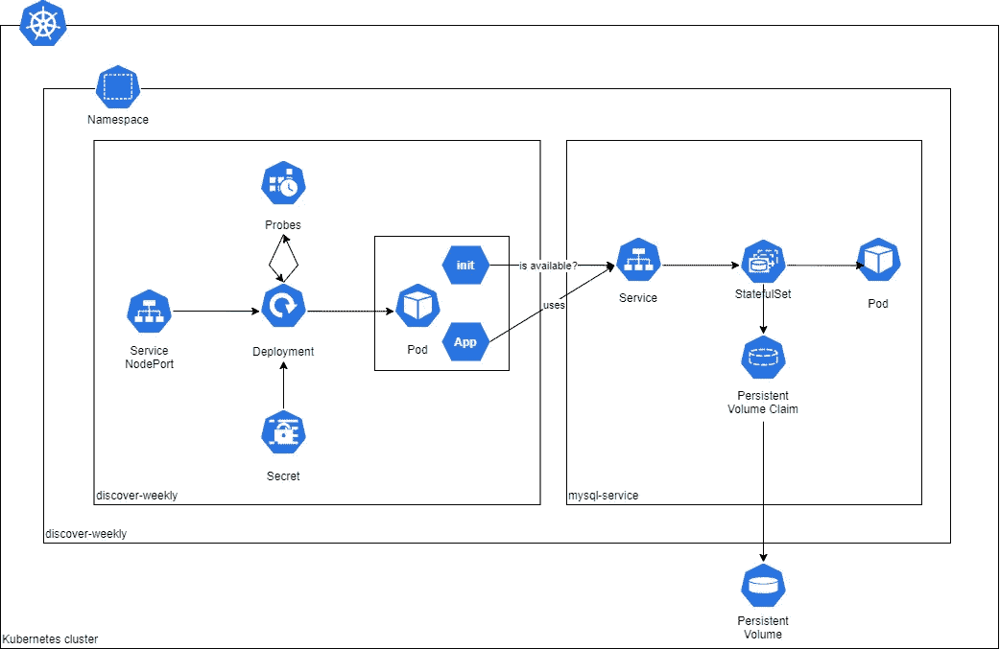

# Kubernetes 持久卷和 Init 容器的实用介绍

> 原文：<https://medium.com/geekculture/a-practical-introduction-to-kubernetes-persistent-volumes-and-init-containers-209d9ef81d1d?source=collection_archive---------11----------------------->


Photo by [Rinson Chory](https://unsplash.com/@nessa_rin?utm_source=medium&utm_medium=referral) on [Unsplash](https://unsplash.com?utm_source=medium&utm_medium=referral)

当你开始学习 Kubernetes 时，你会遇到一些基本的概念，比如 pod、部署、服务等等。这些对象使您能够部署无状态应用程序和微服务。然而，一旦你深入研究 Kubernetes，你就会发现诸如持久卷和多容器 Pod 设计模式之类的东西。在这篇文章中，我将指导您部署您的第一个持久卷和 Init 容器。

您可以在这个[存储库](https://github.com/nino-a2/discover-weekly)中找到本演练的代码。

# 先决条件

对于本演练，请确保具备以下条件:

*   对 Kubernetes 的基本了解。
*   你需要一个 Kubernetes 集群。用 Docker Desktop 在本地运行就可以了。
*   您必须将 Express.js 应用程序容器化，并在容器注册表中可用。您可以简单地使用上述 repo 中的 Docker 文件来创建这个 Docker 映像。在本演练中，我们将利用 AWS ECR 来存储 Docker 图像。这意味着你需要一个 AWS 账户。或者，您也可以在其他地方使用容器注册中心，但是在这种情况下，您需要相应地更新 Kubernetes 清单文件。

# 那么什么是持久卷和多容器容器呢？

> 一个持久卷(PV) 使您能够将状态保持在 Pod 之外，这意味着当一个 Pod 甚至整个集群发生故障时，您的应用程序不会丢失有价值的数据。

这种容错的程度取决于 PV 类型。例如，当您键入 *hostPath* 时，PV 使用节点上的目录或文件来模拟网络连接存储。这意味着，如果一个 Pod 出现故障，您的存储将继续存在。但是，如果集群失败，您将丢失存储的数据。另一方面，你也有云提供商支持的解决方案，如 AWS EBS 或 Azure 磁盘存储。有了这样的解决方案，即使集群崩溃，您的数据也将持续存在，因为存储位于 Kubernetes 集群之外。

为了在 Pod(以及您的应用程序)中使用 PV，您必须创建一个*持久卷声明(PVC)* 。在创建了 PV 和 PVC 之后，Kubernetes 会寻找一个满足 PVC 中定义的需求和存储类名称的 PV。如果找到合适的 PV，它会将声明绑定到卷。

> 多容器容器的想法是另一个放入工具箱的有用工具。当您在一个 Pod 中使用多个容器时，您可以在应用程序旁边运行一个或多个专用容器。

例如，这将使您能够确保在应用程序启动之前所需的服务已经启动并正在运行。因此，您将能够保证在您的应用程序处理任何传入的请求之前，所有的外部依赖都已经就绪。这个功能可以用*初始化容器*来实现。

# 解决方法:每周发现

我们将构建一个简单的解决方案，它包含两个服务:

*   探索周刊。这是该解决方案的主要应用，它将查询数据库以获得个人歌曲建议。为了确保数据库在应用程序启动前启动并运行，我们将实现 *init 容器*模式。
*   *mysql-service* 。这是 MySQL 数据库服务，其数据存储在持久卷中。为了简单起见，我们将使用一个*主机路径* PV 类型。

在下图中，您可以看到这两个服务在一个名为 *discover-weekly* 的名称空间中的架构。



几个要点:

*   对于*每周发现*服务，我们将使用节点端口服务。这将使我们能够从本地环境访问应用程序。如果您想在云环境中使用这个解决方案，可以使用 LoadBalancer 变体。
*   如前所述，我们将利用 Init 容器来确保 MySQL 服务启动并运行。我们还将利用活跃度探测器。这将帮助我们识别应用程序进入中断状态的窗格。因此，Kubernetes 将能够理解应用程序不再健康，它应该替换 Pod。

## 通用 Kubernetes 对象

在创建任何服务之前，我们必须设置一些通用资源。具体来说，我们需要*每周发现*名称空间和*数据库凭证*秘密。该密码将包含 base64 编码的用户名和密码，用于 *root* 和 *admin* 帐户。Base64 编码的字符串可以用以下命令生成:

`echo -n "stringtoencode" | base64`

正如您在示例中看到的，本演练中使用的机密值是用于演示目的的简单值。但是，对于您自己的秘密，请确保使用强秘密值。

使用以下命令部署通用资源:

`kubectl apply -f manifests/generic/`

要在您的集群上部署 *discover-weekly* 应用程序，您必须向您的集群添加另一个秘密。该密码将包含访问 ECR 所需的信息。要创建这个秘密，您可以使用以下命令。确保将值`account_id`和`region`替换为与您相关的值。

```
kubectl create secret docker-registry registrycredentials \
  --docker-server=*account_id*.dkr.ecr.*region*.amazonaws.com \
  --docker-username=AWS \
  --docker-password=$(aws ecr get-login-password) \
  -n discover-weekly
```

## MySQL 服务

既然集群中已经有了通用资源，我们可以开始设置 MySQL 服务了。为此，我们将创建四个对象:一个 PV、一个 PVC、一个部署和一个服务。

上面的代码片段向您展示了如何创建 PV 和 PVC。对于这两个对象，您可以看到它们具有相同的 *storageClassName* ，用于将这两个对象相互绑定。它们还共享相同的[访问模式](https://kubernetes.io/docs/concepts/storage/persistent-volumes/#access-modes)，设置为*读写一次*。这意味着只有一个节点可以读写方式装载卷。

此外，Kubernetes 还会检查请求的存储容量(由 PVC 定义)是否能被一个可用的 PVC 支持。如果可以找到具有正确存储类名称、访问模式和大小的 PV，PVC 将连接到该 PV。如清单中所指定的，PV 将其数据存储在集群节点上的`*/mnt/data*` 路径中。

此时，我们已经创建了 PV 和 PVC，所以是时候实际利用存储了。正如您在下面的代码中看到的，我们已经得到了一个 StatefulSet，它利用了 *mysql:5.6* 容器映像。我们将 root 密码、MySQL 用户和 MySQL 密码指定为环境变量，这样我们就可以使用这些凭证登录。从第 45 行开始，我们声明我们想要利用我们已经创建的 PVC，我们将该卷称为“mysql-persistent-storage”。最后，我们在 *volumeMounts* 部分通过引用我们刚刚声明的卷的名称来引用这个卷，并将它挂载到位于容器中的路径`/var/lib/mysql` 。这意味着 MySQL Pod 可以使用`/var/lib/mysql`路径从持久性卷中读取和写入数据。

我们可以使用以下命令部署 *mysql-service* 对象:

`kubectl apply -f manifests/database/`

## 探索周刊服务

此时，我们在集群上有了通用资源和可用的 mysql 服务。最后一步是创建将使用数据库服务的应用程序。在这个演练中，我们将使用一个 Express.js API，它将(1)在服务器启动时将测试数据插入到数据库中，以及(2)当您向`[http://localhost:30000](http://localhost:30000).`发送 GET 请求时，从数据库中返回测试数据

一些要点:

*   为了授权应用程序访问数据库，我们将凭证作为环境变量传递。
*   为了确保应用程序是健康的，我们将创建一个简单的活跃度探测器。该探测器将每 15 秒向`/health`端点发送一个 HTTP Get 请求。
*   我们还将添加一个 Init 容器，它将确保在 Express.js API 启动之前 *mysql-service* 已经启动并正在运行。
*   我们将创建一个节点端口服务，它允许我们访问*每周发现*服务，而不需要我们设置入口和/或负载平衡器解决方案。

在为应用程序应用清单之前，请确保更新 deployment.yml 文件，以便正确设置映像位置，当前它被配置为:

`account_id.dkr.ecr.region.amazonaws.com/discover-weekly:latest`

我们可以使用以下命令部署 *mysql-service* 对象:

`kubectl apply -f manifests/application/`

好了，现在我们应该已经启动并运行了*每周发现*解决方案！

## 测试解决方案

要测试该解决方案，您可以在浏览器或 Postman 中简单地查询以下 URL:

`[http://localhost:30000](http://localhost:30000)`

响应看起来像这样:

这个响应表明我们已经在 MySQL 数据库中成功创建了 1 条记录，这发生在 *discover-weekly* 应用程序启动时。

## 当 pod 崩溃时，我们真的有能力保存数据吗？

让我们通过删除 *discover-weekly* 和 *mysql-service* 来测试当一个 Pod 出现故障时，数据是否实际存在。

`kubectl delete -f manifests/application`

`kubectl delete -f manifests/database`

让我们验证资源是否已完全删除:

`kubectl get all -n discover-weekly`

响应:*在每周发现命名空间中没有找到资源。*

`kubectl get pv`

响应:*未找到资源*

此时，我们已经确认 PV 和 PVC 对象已被移除。因此，让我们再次创建数据库服务:

`kubectl apply -f manifests/database/`

现在，如果你再次运行`kubectl get pv`，你应该会看到我们有一个 PV 对象。让我们进入下一步，重新创建*每周发现*服务:

`kubectl apply -f manifests/application/`

如果我们再次调用`[http://localhost:30000](http://localhost:30000)`，我们不仅看到数据仍然存在，而且事实上，我们现在有两个记录。这是因为:

1.  我们成功地创建了一个 PV，这意味着尽管我们模拟了一个 Pod 故障，但我们最初创建的数据仍然存在。
2.  JS 应用程序是有意编写的，它创建 MySQL 表时没有声明唯一性约束。这意味着我们可以向数据库中添加重复的记录。通常，这是不可取的，但在这种情况下，它实际上是有用的，因为我们不仅能够证明我们有一个持久的卷，而且现在我们还证明了即使在 Pod 出现故障后，我们也可以继续向该卷写入(静态数据)。

## Init 容器真的能工作吗？

我们可以通过将 *discover-weekly* 应用程序扩展到 10 个副本来简单地尝试一下。让我们用这个命令来实现:

`kubectl scale --replicas=10 -f manifests/application/deployment.yml && clear && kubectl get all -n discover-weekly`

该命令应该显示如下内容:

这里您可以看到第一个 Pod 的状态为`Init:0/1`。这意味着 1 个初始化容器中有 0 个成功完成。换句话说，它还在运行。对于大多数其他 Pod，您可以看到 Init 容器已经完成，并且 Pod 正在初始化。如果你再次运行`get all`命令，你很可能会看到所有 10 个吊舱都在运行。因此，我们可以说 Init 容器实际上正在运行。

我们知道，如果 MySQL 服务存在，Init 容器正在运行并通过，但是如果 MySQL 还不存在，会发生什么呢？为了测试这一点，我们必须再次删除 *discover-weekly* 和 *mysql-service* 。然后，让我们重新创建*每周发现*服务。当您使用`get all`资源时，您将看到容器的状态是`Init:0/1.`,但是，这一次，如果您等待 5 分钟，您将看到它仍然处于相同的状态。换句话说，Init 容器不能成功，因为依赖关系不存在。结果，我们还证明了 Init 容器确实检查了服务是否存在。

此外，如果您再次创建 MySQL 服务，您将在短时间内看到 Pod 再次处于`Running`状态。这证明了 Init 容器会一直运行，直到 MySQL 服务启动并运行。

正如您在第一个 Pod 的状态中看到的，我们只有 1 个 Init 容器。然而，您实际上可以有多个，所以一般来说状态看起来像`Init:N/M`。如果您有多个必须存在的依赖项，比如多个数据源，那么拥有多个 Init 容器是很有用的。

# 结论

在本演练中，我们已经部署了 *discover-weekly* 解决方案，并测试了(1)当一个 Pod 出现故障时，我们是否可以在一个 PV 中持久保存数据，以及(Init 容器是否可以正常工作。

例如，如果您想进一步试验这些概念，您可以:

*   创建一个 PV，其中的数据存储在 AWS EBS 或 Azure 磁盘存储中。有了这个 PV，您就可以做一个实验，通过移除整个集群来模拟集群故障，并测试存储的数据是否真的被持久化了。
*   尝试在一个 Pod 中拥有多个 Init 容器。
*   探索其他多容器 Pod 模式，例如 Sidecar、Adapter 或 Ambassador 模式。

# 参考

*   [Kubernetes 作者解释的持久卷](https://kubernetes.io/docs/concepts/storage/persistent-volumes/)
*   [Kubernetes 作者解释的初始化容器](https://kubernetes.io/docs/concepts/workloads/pods/init-containers/)