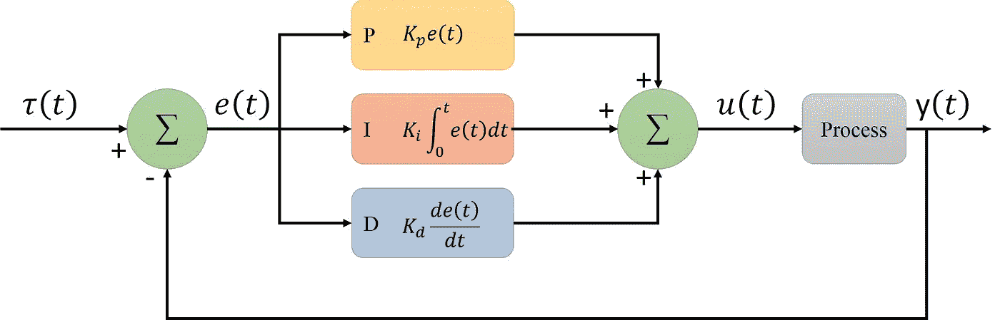
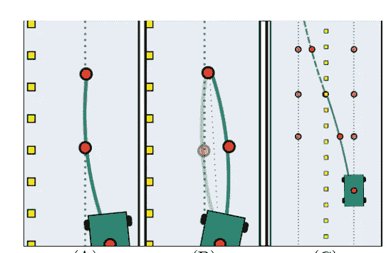
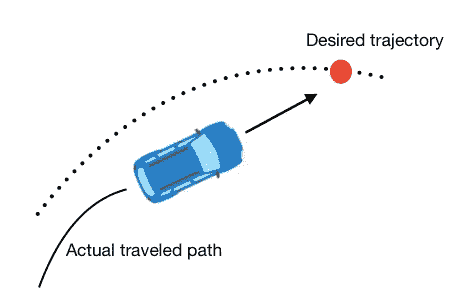
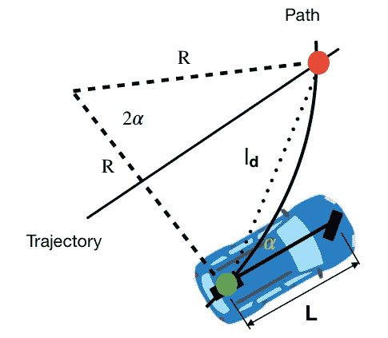
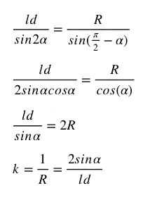
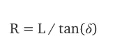
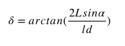
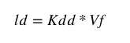
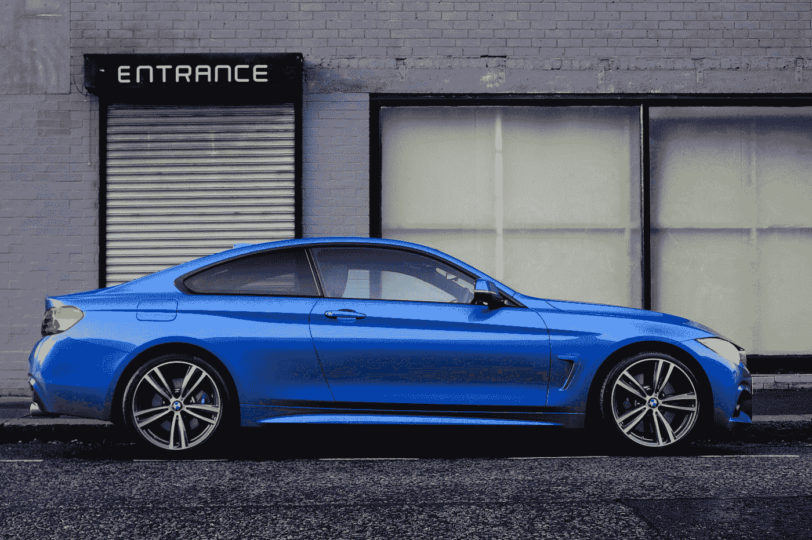

# 自动驾驶汽车入门——从控制角度——第一部分

> 原文：<https://medium.com/geekculture/a-primer-into-autonomous-vehicle-from-controls-perspective-part-1-eccd1db92b55?source=collection_archive---------17----------------------->

我将保持这个故事简短明了，以便即使是新手读者也能了解自动驾驶汽车背后的想法。所以让我们直入主题吧。

> 什么是 PID，我们为什么需要它？

这是一种控制算法，让您的系统遵循所需的命令，几乎在所有工业应用中都可以找到。PID 控制器背后的基本思想是设置/调整比例、微分和积分增益(也称为常数)。它提供了自动保持设定值和补偿过程和环境变化的能力。

PID 的典型结构如下所示。

PID Structure

具有反馈闭环的 PID 控制系统框图。这里，τ(t)是设定值或期望值，而 y(t)是称为过程变量(PV)的变量值。PV 的值被计算为 **PV = y(t) : e(t) = τ(t) -y(t)** ，并且基于比例、积分和偏差规则应用校正动作。该控制器通过调节控制变量(CV) u(t)来采取校正措施。

要了解每种增益的效果以及它们如何减少系统中的误差，我建议您阅读这个[链接](https://plcynergy.com/pid-controller/)。

> 问题陈述

我们的自主车辆必须遵循一定的轨迹/路径。我们考虑汽车的情况，并将问题分成两部分:

**纵向控制&横向控制**

Reference Trajectory

# **纵向控制:**

我们确保可以通过让汽车遵循预先定义的速度曲线来控制它的速度。我们假设没有偏移/交叉跟踪误差，这意味着我们的车辆准确地沿着预期的路径行驶。我们感兴趣的只是汽车为了到达期望位置而必须加速的速度。一个非常基本的想法是，在道路曲率较大的地方让汽车的速度变慢，反之亦然。

# **横向控制:**

在横向控制中，我们希望消除相对于期望轨迹的跨航迹误差。在横向控制的情况下，参考信号总是零，因为我们希望我们的汽车精确地匹配路径。

我们可以把横向控制分成三种以上的控制技术，这些技术考虑到了系统的运动学，我们以前跳过了。

这些控制算法的名字是 Pure Pursuit、Stanley 和 MPC 控制器。

# **纯追踪控制器**

纯追是**几何路径跟踪控制器**。几何路径跟踪控制器是仅使用车辆运动学的几何形状和参考路径来跟踪参考路径的任何控制器。纯追踪控制器使用一个**前瞻点**，它位于车辆前方参考路径上的固定距离处，如下所示。车辆需要使用我们需要计算的转向角前进到那个点。

**目标点**选择为上图中的红点。并且后轮轴和目标点之间的距离被表示为 *ld* (前瞻距离)。我们的目标是让车辆以正确的角度转向，然后继续前进。所以几何关系图如下，车身航向与前视线的夹角称为 **α** 。因为车辆是一个刚体，绕着圆周运动。该圆的瞬时旋转中心(ICR)如下所示，半径记为 **R** 。

# 纯追求公式

根据正弦定律:

k 是曲率。利用自行车模型(如果对运动学自行车模型没有概念，可以参考另一篇名为[《运动学自行车模型的简单认识》](http://www.shuffleai.blog/blog/Simple_Understanding_of_Kinematic_Bicycle_Model.html))的文章，

因此**转向角δ** 可以计算为:

纯追踪控制器是一种简单的控制。它忽略了车辆上的动态力，并假设车轮保持无滑动状态。此外，如果它被调整为低速，控制器将在高速时危险地咄咄逼人。一个改进是基于车辆的速度改变**前瞻距离*LD*。**

因此转向角改变为:

在我的下一篇文章中，我将解释 Stanley 和 MPC 控制器。将解释关于 MPC 控制器和设计 MPC 控制器的基本原理的更多讨论。

Photo by [Grahame Jenkins](https://unsplash.com/@grahamejenkins?utm_source=medium&utm_medium=referral) on [Unsplash](https://unsplash.com?utm_source=medium&utm_medium=referral)

# **参考**

[https://www.youtube.com/watch?v=XmjjmnDcduU&list = plgnqpqtftogqo 2 z _ ogbonywtg 8 jxci 9 PD&index = 15](https://www.youtube.com/watch?v=XmjjmnDcduU&list=PLgnQpQtFTOGQo2Z_ogbonywTg8jxCI9pD&index=15)