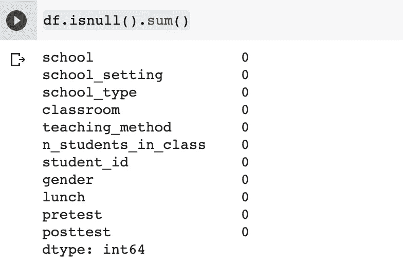
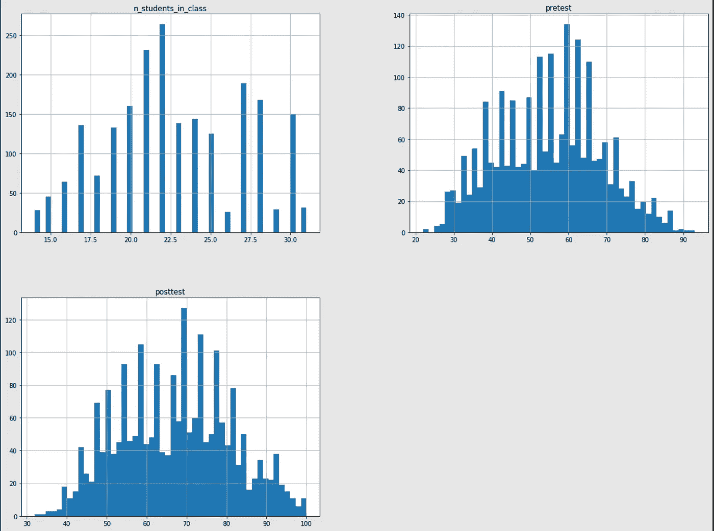
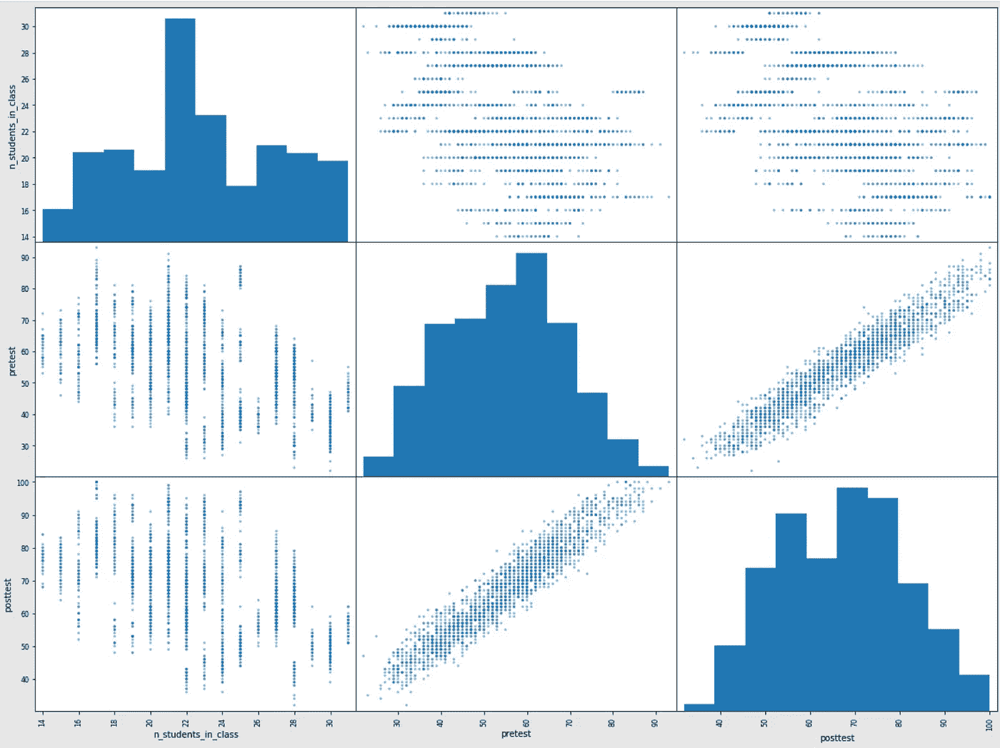
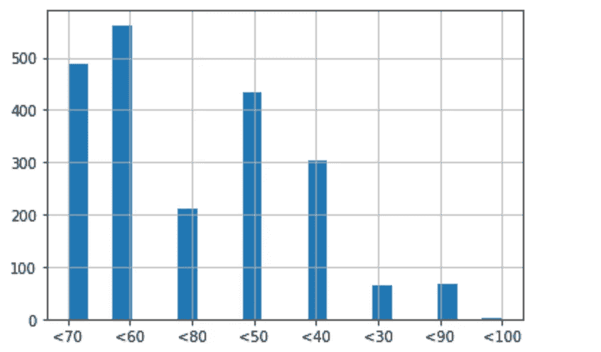
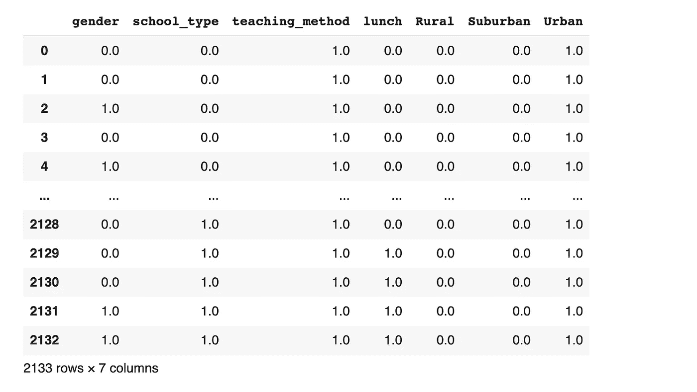
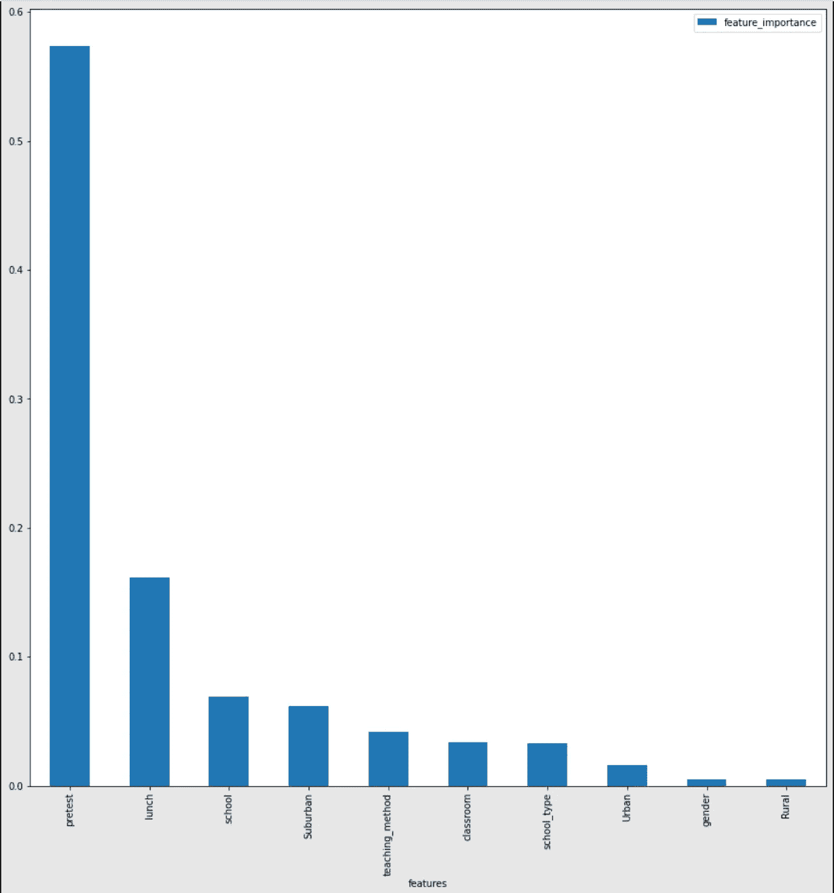
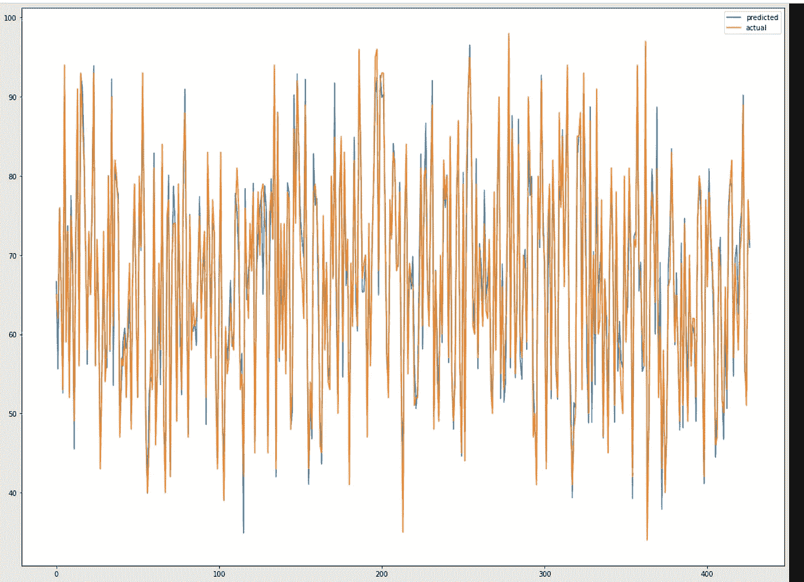

# 机器学习和数据分析入门

> 原文：<https://medium.com/geekculture/a-primer-on-machine-learning-and-data-analysis-5f19fd734c5a?source=collection_archive---------25----------------------->

大家好，我是 Shaythuram，一名新加坡 ReactJS 开发人员，对机器学习、数据分析和所有技术都有浓厚的兴趣。这是我进入科技博客世界的第一步，我决定用 Medium 来记录我在 ML/AI 和数据分析领域的学习之旅。

这篇文章是解决我在 Kaggle 上发现的这个问题的指南。我希望你能像我喜欢制作它一样喜欢阅读它。

这方面的原始代码是用 GoogleColab 编写的，因此某些细微差别可能是特定于该环境的。尽管如此，这些代码在其他地方应该也能很好地工作。请随时给我发邮件，在 shaythuram@gmail.com 寻求任何帮助、澄清和最重要的改进。关于这一点的完整代码可以在[这里](https://github.com/shaythuram/Predicting-Test-Scores)连同数据集一起找到。

将数据集上传到工作目录后，我们可以导入我们将使用的所有模块。

```
import os
import urllib
import urllib.request
import pandas as pd
import matplotlib.pyplot as plt
import numpy as np
import sklearn
from pandas.plotting import scatter_matrix
from google.colab import files
from sklearn.preprocessing import OrdinalEncoder
from sklearn.preprocessing import OneHotEncoder
from sklearn.model_selection import StratifiedShuffleSplit
from sklearn.pipeline import Pipeline
from sklearn.preprocessing import StandardScaler
from sklearn.impute import  SimpleImputer
from sklearn.compose import ColumnTransformer
from sklearn.base import BaseEstimator, TransformerMixin
from sklearn.ensemble import RandomForestRegressor
from sklearn.metrics import mean_squared_error
from sklearn.model_selection import GridSearchCV
from sklearn.model_selection import cross_val_score
import warnings
warnings.filterwarnings("ignore")
os.listdir()
```

os.listdir()函数只是告诉我们数据集在我们的工作目录中。

```
data_location = 'test_scores.csv' #location of Data/csv filedef load_test_scores(data = data_location ):
    #function to load data into pandas DataFrame
    df = pd.read_csv(data_location)
    return df
df = load_test_scores()
```

n_student 指的是这个学生班级的学生人数。我们可以将此列名更改为 n_students_in_class。

```
df.rename(columns={"n_student":'n_students_in_class'} ,inplace=True)
```

inplace=True 参数允许我们改变当前的 df，如果没有它，我们将不得不创建一个新的变量并将改变后的 df 赋给它。



This line of code allows us to check if we have any missing values in our dataset. Thanks to the contributor, the issues of incomplete data is not present here.

```
%matplotlib inline #This line of code just makes our plot more #easily viewable
df.hist(bins=50 , figsize=(20,15) )
plt.show()
```

上面的代码帮助我们可视化非分类数据，即 n_students_in_class 以及前测和后测分数。后测分数是我们想要预测的，从现在开始将被称为标签。



You should get an output like this upon running the code above.

下一步是找出这些特征中哪些与我们的标签最相关，即后测分数。为此，我们将使用一个叫做[皮尔逊相关系数](https://www.spss-tutorials.com/pearson-correlation-coefficient/)的指标。(PCC)简单地说，这为我们提供了一个介于-1 和+1 之间的值范围。+1 表示某个特征与我们的目标特征非常正相关，而-1 表示某个特征非常负相关。正负之间的差值就是斜率的方向。-0.7 和+0.7 都表示相关性值得研究，而 PCC 为-0.1 和+0.1 的特征将被视为低相关性特征。完成这项工作的代码如下。

```
corr_matrix = df.corr()
corr_matrix['posttest'].sort_values(ascending=False)
```

除了 PCC 之外，我们还可以想出一个我们所有特征的散点图，来挖掘一些其他关系或关于我们数据的有趣事实。

```
%matplotlib inline
pd.plotting.scatter_matrix(df, figsize=(20,15) )
plt.show()
```



从 PCC 和上面的图中，我们可以推断出前测和后测结果高度相关。PCC 应该已经揭示了班级中的 n 个学生和标签之间的中度负相关。然而，仅仅从散点图很难推断出这一点。

需要注意的一点是，n_students_in_class 和教室特征本质上揭示了相同的信息。这是因为，对于任何给定的数据点，比如教室 A 和班级 B 中的 n 个学生，这两个值是恒定的。(教室 A 将总是有 B 个学生在里面)。

因此，去掉这些特性就可以了。我们将从数据框架中删除 n_students_in_class 列。

```
df.drop('n_students_in_class', inplace=True , axis=1)
```

axis=1 表示列，而 axis=0 表示水平行，即单个数据点。

现在，我们必须将数据集分为训练集和测试集。根据皮尔逊相关系数，前测成绩是后测成绩的一个很强的指标。因此，我们将使用分层洗牌来分割我们的数据集。这样，我们的模型将根据与实际数据分布相似的数据进行训练。

为了做到这一点，我们可以将预测试分数分割成箱或阈值。箱子之间相隔 10 分，下限包含任何低于 30 分的分数。

直方图的每一条都告诉我们有多少学生的预测试成绩在给定的范围内。我们将在训练和测试集中对这种分布预测试得分进行建模。

```
model_this_distribution = pd.cut(df['pretest'],bins=[0 , 30\. , 40\. , 50\. , 60\. , 70\. ,80\. , 90\. ,np.inf ],labels = ['<30' , '<40','<50','<60','<70','<80','<90' , '<100'])%matplotlib inline
model_this_distribution.hist(grid=True, bins=20, rwidth=0.9)
plt.show()
```



现在，让我们使用上面的分布将数据集分成训练集和测试集。

```
split = StratifiedShuffleSplit(n_splits=1,test_size=0.2,random_state=42)for train,test in split.split(df , model_this_distribution):
    strat_train_set = df.loc[train]
    strat_test_set = df.loc[test]
```

**数据处理和转换**

前面我们谈到了拥有一个没有缺失值或空值的完整数据集是多么幸运。然而，即使我们这样做了，scikit-learn 也为我们提供了简单的工具来帮助填补这些缺失的数据。这叫做简单估算器。它可以使用均值、中值或众数策略来填充缺失的数值数据，或者对分类数据使用“最频繁”策略。

对于分类数据，大多数机器学习算法更喜欢数字输入而不是文本输入。为了解决这个问题，我们可以使用 [OneHotEncoding](https://machinelearningmastery.com/why-one-hot-encode-data-in-machine-learning/) 。

要编码的列:

1.性别

2.学校类型

3.教学方法

4.午餐(无论学生是否有资格享受减价/免费午餐)

5.学校环境

对于第 1-4 项，值是二进制的，因此我们可以从对 4 列中的每一列进行编码时产生的 2 列中删除每一列。对于 school_settings 列，我们不需要这样做。

```
OneHotEncoder_Instance = OneHotEncoder()df_Encoded = OneHotEncoder_Instance.fit_transform(df[['gender' , 'school_type' , 'teaching_method' , 'lunch' , 'school_setting' ]])df_Encoded = pd.DataFrame.sparse.from_spmatrix(df_Encoded ).drop(axis=1 , columns=[0,2,4,6]).rename(columns={1: "gender", 3: "school_type" , 5:'teaching_method' , 7:'lunch' , 8:'Rural' , 9:'Suburban' , 10:'Urban'} )
```



df_Encoded should look like this.

上面这组代码运行良好。我们将把这一点纳入一个定制的变压器。

```
class HotEncodingCleaner(BaseEstimator, TransformerMixin): def fit(self, X, y=None):
    return self  # nothing else to do def transform(self, X):
    df = pd.DataFrame.sparse.from_spmatrix(X )
    df.drop(axis=1 , columns=[0,2,4,6]  , inplace=True)
    return df
```

通过导入 BaseEstimator，TransformerMixin，我们有了一个现成的带有 fit_transform 函数的转换器。我们需要做的就是定义转换方法的作用，即删除虚拟列。fit 函数应该总是返回 self。

我们可以在函数中删除上面的列，并在编码后将其应用到我们的数据帧中。使用这种方法，我们可以将它插入 scikit-learn 为我们提供的管道特性中。

我们还必须对学校和教室的特征进行编码，因为我们只需要给我们的算法输入数值。然而，这些功能包含许多独特的价值，因此使用 OneHotEncoding 将是对空间的巨大浪费。相反，我们将使用 OrdinalEncoding，这将只为每个唯一值分配一个唯一的整数值，列中的数据将被相应的整数替换。

```
categorical_attributes = ['gender' , 'school_type' , 'teaching_method' , 'lunch' , 'school_setting' ]
Ordinal_encoding_attributes = ['school' , 'classroom']
num_attributes = ['pretest' , 'posttest']cat_pipeline = Pipeline([("cat", OneHotEncoder()),
('custom' , HotEncodingCleaner())])Ordinal_pipeline = Pipeline([('ordinal' ,  OrdinalEncoder()),])full_pipeline = ColumnTransformer( [("cat_pipeline", cat_pipeline,  categorical_attributes ),("Ordinal_pipeline", Ordinal_pipeline ,Ordinal_encoding_attributes),('imputer', SimpleImputer(strategy="median") , num_attributes ),] , remainder='passthrough')
```

我们创建了两个管道来处理两组不同的列，因为一组列需要进行一次性编码和清理，而另一组列(Ordinal_encoding_attributes)只需要进行顺序编码。然后，我们使用 ColumnTransformer 将这两个管道合并成一个管道。

我们也做了(' imputer '，simple imputr(strategy = ' median ')，num_attributes)。这是为了处理我们的前测和后测列中任何缺失的数据。我们使用了中位数策略，但你也可以使用“均值”或“众数”策略。

remainder='passthrough '很重要，因为它确保了未被'触动'的列，不在 num_attributes、categorical _ attributes 或 Ordinal_encoding_attributes 中的列仍然保留在数据帧中。默认情况下，该值为' *drop '。*

现在，我们将把这个完整的流水线应用到我们的分层训练集中，然后我们将使转换后的数据帧更加直观。我们还将隔离输入数据和标签。

```
strat_train_treated = full_pipeline.fit_transform(strat_train_set)strat_train_treated_df = pd.DataFrame(strat_train_treated , columns=['gender' , 'school_type' , 'teaching_method' , 'lunch' , 'Rural' , 'Suburban' , 'Urban' , 'school' , 'classroom' , 'pretest' , 'posttest' ,  'student_id' ] )strat_train_treated_prepared  = strat_train_treated_df.drop(columns=['posttest' , 'student_id'   ])strat_train_treated_labels  = strat_train_treated_df.loc[:,['posttest']]
```

df.iloc[:，-1]选择最后一列，这是测试后的值，我们希望隔离这些值，因为它们是测试分数的“正确值”。

对于这个问题，我们将使用随机森林回归。这是一个广泛使用的算法，更多细节可以在[这里](https://www.google.com/search?q=randomm+forest&sxsrf=ALeKk00NQBf_e8QCRT1iG56r9bau87oX1w%3A1627244850120&ei=Msn9YObhBo70rAGu7bioBA&oq=randomm+forest&gs_lcp=Cgdnd3Mtd2l6EAMyBAgAEEMyBAgAEEMyBAgAEEMyBAgAEEMyBAgAEEMyBAgAEEMyBAgAEEMyBAgAEEMyBAgAEAoyBAgAEApKBAhBGABQxSxYxSxgoC5oAHABeACAAXGIAb0BkgEDMS4xmAEAoAEBqgEHZ3dzLXdpesABAQ&sclient=gws-wiz&ved=0ahUKEwjmwoO6h__xAhUOOisKHa42DkUQ4dUDCA8&uact=5)找到。

```
forest_reg = RandomForestRegressor(n_estimators=100, random_state=42)forest_reg.fit(strat_train_treated_prepared , strat_train_treated_labels)predictions_train_set = forest_reg.predict(strat_train_treated_prepared)forestreg_rmse_train = np.sqrt(mean_squared_error(strat_train_treated_labels , predictions_train_set  ))print('The RMSE on the training set is {}'.format(forestreg_rmse_train))
```

我们还可以看到这个模型在测试集上的表现。

```
strat_test_treated = full_pipeline.transform(strat_test_set)strat_test_treated_df = pd.DataFrame(strat_test_treated , columns=['gender' , 'school_type' , 'teaching_method' , 'lunch' , 'Rural' , 'Suburban' , 'Urban' , 'school' , 'classroom' , 'pretest' , 'posttest' ,  'student_id' ] )strat_test_treated_prepared  = strat_test_treated_df.drop(columns=['student_id' , 'posttest' ])strat_test_treated_labels  = strat_test_treated_df.loc[:,['posttest']]
```

在这里，我们不必对我们的 strat_test_set 进行 fit_transform，这是因为我们希望我们的管道只适合于我们的训练集，并将这些转换应用于我们的测试集。

**永远不要将管道或模型安装到测试设备上！！！**

```
predictions_test_set = forest_reg.predict(strat_test_treated_prepared)forestreg_rmse_test = np.sqrt(mean_squared_error(strat_test_treated_labels , predictions_test_set  ))print('The RMSE on the test set is {}'.format(forestreg_rmse_test))
```

单独的 RMSE 是不够好的指标来评估我们的模型，我们可以使用 K 倍交叉验证。

**使用 K 倍交叉验证进行评估**

在 K 折叠交叉验证中，我们将训练集随机分成 K 个大小相等或相近的折叠。(K 在 cross_val_score 实例中设置为 cv)然后我们训练并评估我们的 lin_regressor 10 次。每次，我们选择 9 个折叠来训练 lin_regressor，然后在我们没有选择的折叠上测试它。

对于 K 倍交叉验证，Scikit-Learn 期望效用函数(越大越好)而不是成本函数(越小越好)。root_mean_squared_error 是一个成本函数，因此在交叉验证器计算时，它的值将为负。因此，scoring = " neg _ root _ mean _ squared _ error "。如下所示，有一个简单的解决方法。

```
def scores_breakdown(scores_Linear , name=''): 
  #A simple function to evaluate our K-fold Cross-Validation scores scores_mean = scores_Linear.mean() scores_std = scores_Linear.std() print('Mean and Standard deviation of the k-fold scores of the {}        
  set is {} and {} respectively'.format(name , scores_mean , 
  scores_std ))cross_val_score_train = cross_val_score(forest_reg, strat_train_treated_prepared , strat_train_treated_labels , scoring="neg_root_mean_squared_error", cv=10)cross_val_score_train = -cross_val_score_train
#Workaround for the negative values problem
scores_breakdown(cross_val_score_train , name='train')cross_val_score_test = cross_val_score(forest_reg, strat_test_treated_prepared , strat_test_treated_labels , scoring="neg_root_mean_squared_error", cv=10)
cross_val_score_test = -cross_val_score_test
#Workaround for the negative values problemscores_breakdown(cross_val_score_test , name='test')
```

在执行上述步骤时，我注意到，我们的训练集的平均 k 倍分数并不是很大。

更好的是，我们的训练集和测试集的平均 k 倍分数之间的差异并不太大。这意味着算法没有过度适应我们的训练集。

**微调**

我们可以手动调整算法的超参数，给我们一个更好的模型，从而得到更好的预测。

对于 RandomForest 算法，这些是超参数。

RandomForestRegressor(bootstrap = True，CCP _ 阿尔法=0.0，criterion='mse '，max_depth=None，max_features='auto '，max_leaf_nodes=None，max_samples=None，min _ infinity _ decrease = 0.0，min_samples_leaf=1，min_samples_split=2，min_weight_fraction_leaf=0.0，n_estimators=100，n_jobs=None，oob_score=False，random_state=42，verbose

手动更改这些特征中的每一个都将花费大量时间，但是我们可以使用 GridSearchCV 来探索上述超参数的任何组合，并使用给定的一组超参数进行 K 重交叉验证来评估模型。

```
param_grid = [# try 24 (2×3×4) combinations of hyperparameters{'bootstrap': [False,True], 'n_estimators': [30,45,50], 'max_features': [2, 4, 6, 8]},# then try 12 (2×2×3) combinations with bootstrap set as False{'bootstrap': [False,True], 'n_estimators': [3, 10], 'max_features': [8,11 ,7 ]},]forest_reg_GCSV = RandomForestRegressor(random_state=42)# train across 5 folds, that's a total of (36)*5=180 rounds of trainingRF_grid_search = GridSearchCV(forest_reg_GCSV, param_grid, cv=5,
scoring='neg_root_mean_squared_error',
return_train_score=True)RF_grid_search.fit(strat_train_treated_prepared , strat_train_treated_labels)
```

通过以下步骤，我们可以从我们的 RF_grid_search 中获得参数的最佳组合、最佳估计值和最佳得分

```
print('Best Parameters are: {}, \nthe  best estimator is: {} \nand the best score is: {}'.format(RF_grid_search.best_params_  , RF_grid_search.best_estimator_ , -RF_grid_search.best_score_) )
```

当我们研究超参数的大量组合时，这种方法是很好的。为了扩大搜索范围，我们可以使用[randomzedsearchcv](https://scikit-learn.org/stable/modules/generated/sklearn.model_selection.RandomizedSearchCV.html)来代替。

**分析模型及其误差**

RandomForestRegressor 可以告诉我们每个特征在做出准确预测的过程中有多重要。

我们可以通过下面的步骤来想象每个特征在决策过程中的相对重要性。

```
relative_feature_importance = RF_grid_search.best_estimator_.feature_importances_.tolist()feature_dict = dict(zip(strat_train_treated_prepared.columns, relative_feature_importance))feature_dict = sorted(feature_dict.items(), key=lambda x: x[1] , reverse=True) #Sortedfeature_dict_df = pd.DataFrame.from_dict(feature_dict )feature_dict_df.rename(inplace=True , columns={0:'features' , 1:'feature_importance'})%matplotlib inlinefeature_dict_df.plot.bar(x='features' , y='feature_importance' , figsize=(15,15) )plt.show()
```

前 3 行代码从 RandomForest 回归器的实例中提取相对特征重要性，并为每一列及其相应的重要性创建一个字典。随后，我们订购了这本字典，并将数值绘制成条形图。



为了结束这一点，我们现在将在我们的火车和测试集上尝试我们最好的模型，看看它的表现如何。

```
best_model = RF_grid_search.best_estimator_cross_val_score_train = cross_val_score(best_model, strat_train_treated_prepared , strat_train_treated_labels , scoring="neg_root_mean_squared_error", cv=10 )
cross_val_score_train = -cross_val_score_train
scores_breakdown(cross_val_score_train , name='train')cross_val_score_test = cross_val_score(best_model, strat_test_treated_prepared , strat_test_treated_labels , scoring="neg_root_mean_squared_error", cv=10)
cross_val_score_test = -cross_val_score_test
scores_breakdown(cross_val_score_test , name='test')
```

让我们想象一下我们在训练集和测试集上的预测分数和实际分数之间的差异。

让我们使用我们的 best_model，在我们的训练集上做一些预测。

```
best_model = RF_grid_search.best_estimator_
predictions_train_set = best_model.predict(strat_train_treated_prepared)train_labels = strat_train_treated_labels.iloc[:,0].astype('int')predictions_test_set = best_model.predict(strat_test_treated_prepared)test_labels = strat_test_treated_labels.iloc[:,0].astype('int')
```

strat _ train _ treated _ labels . iloc[:，0])将返回一系列对象，这些对象就是我们的标签。然而，为了绘制这些值，我们需要它们是整数，因此我们这样做了。astype('int ')将系列值转换为整数类型。

下面我们有一个自定义函数，可以帮助我们将预测分数和标签(实际或“正确的”后测分数)绘制成线形图。

```
def plot_comparison(predictions,labels , split_plots=False ): data_dict_predictedvactual = { 'predicted':predictions,
      'actual':labels
       } predictedvactual =      
   pd.DataFrame.from_dict(data_dict_predictedvactual )
   %matplotlib inline
   predictedvactual.plot.line(figsize=(20,15) ,     
   subplots=split_plots)
   return plt.show()plot_comparison(predictions_test_set ,test_labels )
```

这里我们有一个接受 3 个输入的函数，预测(由模型做出的预测)，标签和一个名为 split_plots 的布尔变量。默认情况下，split_plots 设置为 False。我个人认为，在同一个图表上查看两个预测值可以直观地看出我们的模型是好是坏，但你可以通过将该变量设置为 True，将它们显示在两个不同的图表上。



The Predicted and Actual values plotted on the same graph

文章到此结束。我希望你喜欢跟随，我的 github 回购的链接可以在这里找到。它包含这个完整的脚本作为一个. ipynb 和。py 文件以及数据集。

如有任何澄清或反馈，请随时给我发电子邮件到 Shaythuram@gmail.com。这也是我的 [LinkedIn](https://www.linkedin.com/in/shaythuram-elangkovan-2b4007202/) ！！