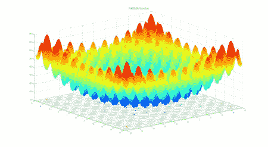
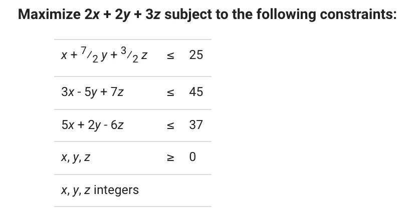
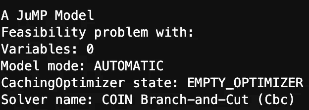
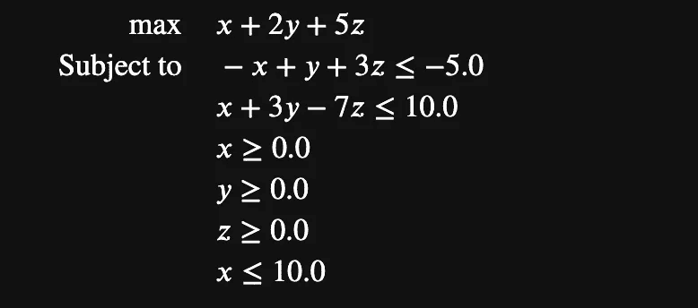
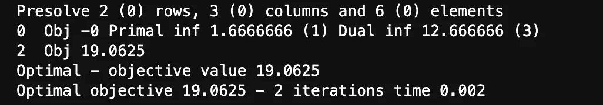
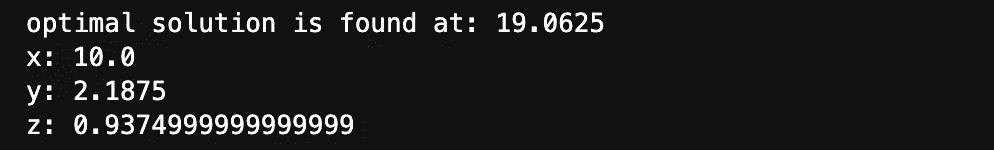

# Python 和 Julia 中的运筹学库入门

> 原文：<https://medium.com/geekculture/a-primer-on-the-operations-research-libraries-in-python-and-julia-d10da69591ff?source=collection_archive---------25----------------------->

作为过去两年的 Medium 用户，我必须说这个社区到目前为止非常棒。一个由志趣相投的人组成的庞大社区，他们不懈地追求知识。

*作为一个从其他作者的文章中受益匪浅的人，我也很乐意这样做。*

*如果把十几个不同来源的材料综合成一篇文章，可以缩短哪怕一个人的学习旅程，我认为这本身就是一项有价值的努力。*

这也是对我的理智检查，以确保我确实理解了我所读的内容。

毕竟，如果我缺乏以令人信服的方式记录和解释我的知识的能力，这一定意味着我的掌握不够。

话虽如此，我们还是直入主题吧。

# 运筹学是什么？

运筹学和最优化。这两个术语在学术和商业领域中可以互换使用。

从广义上讲，它们可以被看作是利用数学工具，从天文数字般大量的可能路径中寻找最合适的行动路线。

虽然这种术语听起来令人生畏，但这个领域非常广阔，运筹学有很多可能的用途，即使没有严格的技术基础，也可以很好地理解。

以下面的例子为例:**灰狼优化**算法。

它起源于狼及其猎物的种群动态。

[](https://www.geeksforgeeks.org/implementation-of-grey-wolf-optimization-gwo-algorithm/) [## 灰狼优化(GWO)算法的实现——GeeksforGeeks

### 以前的文章灰狼优化-介绍谈到了灰狼优化的灵感，及其…

www.geeksforgeeks.org](https://www.geeksforgeeks.org/implementation-of-grey-wolf-optimization-gwo-algorithm/) 

A plot of the Rastrigin function in the GWO algorithm

# **我们试图优化什么？**

运筹学的关键任务是**目标函数**的最大化(或最小化)。这取决于我们如何看待这个问题。

在不同的文献中也称为**损失**或**代价函数**。

 [## 损失函数-维基百科

### 在数学优化和决策理论中，损失函数或成本函数(有时也称为误差…

en.wikipedia.org](https://en.wikipedia.org/wiki/Loss_function) 

在 Rastrigin 函数的彩色图中，我们可以看到该函数的局部最大值和最小值，由暗红色和暗蓝色的尖点特征给出。

> 挑战在于找到一个足够高的峰值，或者足够低的谷值，来解决我们的问题。

# 代码实现

在接下来的小节中，我将通过一个简单的例子来演示一个优化问题的从头到尾的过程。从公式化问题，到解决它以获得期望的值。

## Python 实现

对于 Python 版本，我们使用了 Google 运筹学工具包**【Google OR-Tools】。**它包含了一整套由谷歌开源的优化库。

[](https://developers.google.com/optimization) [## 或者-工具|谷歌开发者

### OR-Tools 套件提供了运筹学软件库和 API，用于约束优化、线性…

developers.google.com](https://developers.google.com/optimization) 

这里列出了 OR-tools 中给出的一个例子。

一个有 3 个变量和 4 个**约束的问题。**

或者从技术上来说，我们可以说是 **5** 约束，甚至高达 **7** 。考虑到我们将所有 3 个变量限制为整数值。



A typical problem in constraint optimization.

```
**#Import the relevant library in command prompt#**python -m pip install --upgrade --user ortools **#Declaring the model#** from ortools.sat.python import cp_model
model = cp_model.CpModel()
```

*注意*

该工具包中使用的 CP 模型是专门为处理整数而设计的，目的是提高计算速度。

因此，如果我们在问题中遇到分数，我们需要通过乘以另一个数将它们转换成整数。

因此，我们将第一个等式从 **a** 转换为 **b，**保持其功能不变。

```
a. **x + 7/2 y + 3/2 z <= 25**
b. **2x + 7y + 3z <= 50** 
```

接下来，我们需要声明变量和约束。

值 50、45、37 表示目标函数可以存在的状态空间。

并且我们的变量被约束采用的整数值通过函数来表示:" **NewIntVar** "。“新整数变量”的简写。

```
**#Boundaries#**
var_upper_bound = max(50, 45, 37)**#Declare variables** x = model.NewIntVar(0, var_upper_bound, 'x')
y = model.NewIntVar(0, var_upper_bound, 'y')
z = model.NewIntVar(0, var_upper_bound, 'z')
```

添加剩余的约束并调用求解器。

```
**#Remaining constraints#**
model.Add(2*x + 7*y + 3*z <= 50)
model.Add(3*x - 5*y + 7*z <= 45)
model.Add(5*x + 2*y - 6*z <= 37)**#Maximise objective function#**
model.Maximize(2*x + 2*y +3*z)**#Output possible solution#**
solver = cp_model.CpSolver()
status = solver.Solve(model)if status == cp_model.OPTIMAL:
    print('Maximum value of objective function: %i' % solver.ObjectiveValue())print('x value: ', solver.Value(x))
print('y value: ', solver.Value(y))
print('z value: ', solver.Value(z)) output: **< Maximum value of objective function: 35
x value:  7
y value:  3
z value:  5 >**
```

## Julia 实现

Julia 实现来自于 Julia 中的**跳转**库

[](https://jump.dev/JuMP.jl/stable/) [## 简介跳转

### JuMP 是嵌入在 Julia 中的用于数学优化的特定领域建模语言。它目前支持…

跳转. dev](https://jump.dev/JuMP.jl/stable/) 

我之所以包括它，是因为 Julia 在最近几年取得了巨大的进步，在易用性方面紧跟 Python。


My Julia command line

```
**#Import dependencies in Julia#**
using Pkg
Pkg.add("JuMP")
Pkg.add("Cbc")
Pkg.add("GLPK")using JuMP, Cbc, GLPK
```

声明优化模型。这里使用的模型是**硬币分支和切割** (Cbc)。

```
m = Model(Cbc.Optimizer)
```



```
**#Declare variables#**@variable(m, 0 <= x <= 10)
@variable(m, y >= 0)
@variable(m, z >= 0) **#Declare objective function#**
@objective(m, Max, x + 2y + 5z) **#Declare constraints#**
@constraint(m, constraint1, -x + y + 3z <= -5)
@constraint(m, constraint2, x + 3y -  7z <= 10)println(m)
```

Julia 的好处是它允许你以一种更接近人类直觉的方式来看待你所宣布的目标。这使得校对更加容易。



Output in the terminal

从求解器中提取我们的解

```
optimize!(m)println("optimal solution is found at: ", objective_value(m))
println("x: ", getvalue(x))
println("y: ", getvalue(y))
println("z: ", getvalue(z))
```



这将是这篇文章的结尾，我们已经用 Python 和 Julia 语言演示了将约束优化问题传递给不同的求解器。