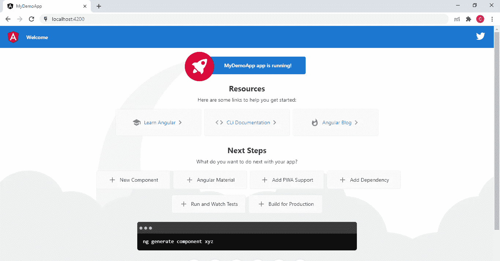

# 角度 CLI 快速设置指南

> 原文：<https://medium.com/geekculture/a-quick-guide-to-setup-angular-cli-3d77889bf6f9?source=collection_archive---------22----------------------->

> Angular 是一个使用 HTML 和 TypeScript 构建单页面客户端应用程序的平台和框架。它将核心和可选功能实现为一组导入到应用程序中的类型脚本库。Angular 应用程序的架构依赖于某些基本概念。在这篇文章中，你将学习如何快速设置 angular 开发环境。

Angular 是一个使用 HTML 和 TypeScript 构建单页面客户端应用程序的平台和框架。Angular 是用打字稿写的。它将核心和可选功能实现为一组导入到应用程序中的类型脚本库。

以下是使用 Angular 构建 web 和移动应用的概述:

-第一步包括使用 Typescript、HTML、CSS 等编写代码。

-然后，需要将 Typescript 代码编译成 Javascript。

-最后，应用程序托管在 web 服务器上。

-角度视图结合了组件和模板。

-不同视图之间的导航由路由器定义。

-自动同步或数据绑定发生在模型中的模型和视图组件之间，提供了一种反应式的用户体验。

因此，角度工作空间的构建模块适合于设计令人印象深刻的单页面应用程序(spa)。

## 使用角度的优势

## 1.开箱即用的功能

Angular 的默认设置为您提供了开箱所需的一切。这包括负责路由的工具，因此您可以轻松地获取希望在应用程序中呈现的数据。Angular 的预配置环境不仅有助于开发，也有助于测试。

## 2.以打字打的文件

Angular 是用 TypeScript 构建的。这种强类型语言的主要优点是，它有助于开发人员保持代码的整洁和易懂。由于能够在您键入时看到常见错误，因此更容易发现和消除错误。

## 3.一致性

为了进一步增强一致性，Angular 团队开发了一个 CLI 工具，可用于从命令行创建某些可重复的代码块。此外，该框架的文档为开发人员提供了最新的参考。

## 4.生产力

更大一致性的一个受欢迎的副作用是生产率的提高。开发人员不需要花费宝贵的时间来试图弄清楚一个函数、实用程序或组件是做什么的，一旦你掌握了如何编写一个组件，通过遵循相同的一般准则和代码结构，编写另一个组件是很容易的。

Angular 代码的高可读性也使得新开发人员很容易加入到正在进行的项目中。

类型系统允许开发人员更早地捕捉潜在的错误。由于集成在 VS Code 和 WebStorm 等 ide 中，TypeScript 会在您键入时增量地重新编译并突出显示错误。

这些因素都有助于减少开发时间和成本。

## 5.可维护性

Angular 从几个方面支持代码的出色的代码可维护性。首先，当从一个主要版本升级到另一个主要版本时，所有与 Angular 相关的包同时更新——这意味着 HTTP、Routing 和 Angular Material 也包括在内。

更新很容易，通常只需使用一个命令“ng update”即可完成。这意味着您不必花时间担心是否支持新的包，不知道应该使用哪个版本，或者不知道某个特定的开源包何时会更新到最新版本。

## 6.模块化开发结构

Angular 的模块化本质意味着开发人员可以有效地将代码划分为模块。这使得应用程序功能的组织变得简单，并创建可重用的代码块，从而大大减少开发时间和成本。Angular 社区通过各种现成的组件进一步支持这一点

模块还可以在团队之间有效地划分开发工作，同时确保代码保持整洁有序，并允许应用程序无缝扩展。

## 7.角状材料

Angular Material 是一个现成的、经过良好测试的 UI 组件和模块的集合，遵循 Google 的材料设计原则。它包含一系列 UI 组件，如导航模式、表单控件、按钮和指示器。组件经过调整以适应各种浏览器，有良好的文档记录，并基于最新的指南编写。

由 Angular 社区开发的这些**模块简化了团队的设计工作流程，允许开发人员添加新元素并快速开发应用程序，而对性能的影响最小。**

让我们开始安装设置

## 先决条件

要使用 Angular 框架，您应该熟悉以下内容:

- JavaScript

- HTML

- CSS

了解 TypeScript 是有帮助的，但不是必需的。

## 步骤 1:安装 Node.js

要安装 Angular cli，您必须在系统中安装 nodejs (LTS 版)和 npm package manager，npm package manager 会在安装 node.js 时自动安装，要安装 Node js，请到 https://nodejs.org/en/download/的[下载 Node js，它会下载。exe 文件，然后单击“下一步并安装”进行安装。](https://nodejs.org/en/download/)

要检查 nodejs 是否安装正确，只需打开命令提示符并运行:node -v 或 node -version。它将显示节点版本，否则如果安装不正确，它将抛出错误。

还要检查 npm 版本: *npm — v* 或 *npm —版本*

## 步骤 2:安装 Angular CLI

要使用 npm 全局安装 Angular CLI，请打开终端/控制台并输入以下命令:

```
$ npm install -g @angular/cli
```

## 步骤 3:创建新项目

安装完成后，您可以创建新的 angular 项目。

要创建新项目，请输入以下命令

```
$ ng new MyDemoApp
```

这里 **MyNewApp** 是一个项目名

点击上面的命令，ng CLI 将询问一些配置问题

**？您想要添加角度路由吗？否**

这取决于你，如果你想要单独的路由文件，然后点击是

**？您想使用哪种样式表格式？CSS**

你可以从这四种格式中选择任何一种，比如 css，scss，sass，less

## 步骤 4:运行创建的项目

现在移动到项目文件夹

1.通过输入以下命令，转到项目文件夹

```
cd MyDemoApp
```

。运行项目通过执行以下命令来运行项目

```
ng serve --open
```

—打开:打开浏览器以运行项目

或者直接导航到 [http://localhost:4200/](http://localhost:4200/)

结果将会是这样的:



**在项目**中工作时，您将需要更多的命令

**ng 新**

Angular CLI 使得创建开箱即用的应用程序变得容易。它已经遵循了我们的最佳实践！

**ng 生成**

用一个简单的命令生成组件、路由、服务和管道。CLI 还将为所有这些创建简单的测试外壳。

```
ng generate component component_name
ng generate service service_name
ng generate directive directive_name
```

**ng 发球**

在开发过程中，在本地轻松测试您的应用。

**测试，棉绒**

让你的代码真正闪耀。运行你的单元测试，你的端到端测试，或者用一个简单的命令执行官方的 Angular linter。

## 结论:

就这样，这就是我们第一个角度项目的设置，快乐编码😊。