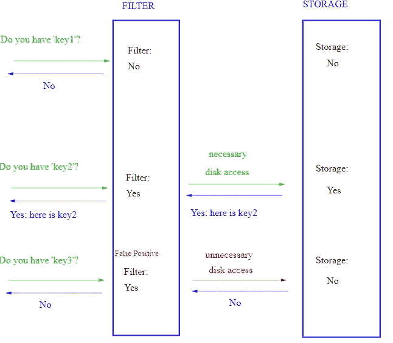
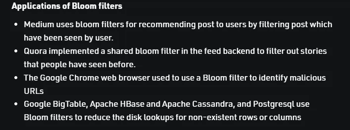

# 布鲁姆过滤器快速介绍

> 原文：<https://medium.com/geekculture/a-quick-introduction-to-bloom-filters-eeba404b13a2?source=collection_archive---------3----------------------->

## 当设计大型可伸缩系统时，这种想法会有很大帮助

如何检查一个元素是否是一个非常大的数据集的成员？以你的中型账户为例。Medium 上有数百万用户。因此，当一个新用户试图创建一个用户名时，Medium 如何检查该用户名是否已经存在？如果搜索所有用户名会非常昂贵。对于较小的集合，可以使用 HashSet 进行搜索。但是，在搜索之前，您必须将整个数据集加载到内存中。这将是一个缓慢而昂贵的过程。那么，如何以简单且经济的方式检查一个元素是否是一个非常大的数据集的成员呢？

下面是我每日简讯的一段- [科技造简单](https://codinginterviewsmadesimple.substack.com/) -回答这个问题。这篇文章是为了让你了解时事通讯的内容。如果你对更多这样的文章感兴趣，订阅时事通讯。细节在最后。

假设你有一个非常大的数据集。许多许多成员，每个成员都非常复杂。也许你的社交媒体平台起飞了，你有数百万用户名古怪的用户(甚至还有更复杂的用户 id)。

现在每次你想检查一个新的 ID 是否是集合的一部分，你会怎么做？LinkedList 和 Arrays 会太慢。尝试将需要不断更新和平衡，使他们成为问题。为什么不试试哈希映射/集呢？大家总说自己有 O(1)插入，查找等。

Bloom Filters help you reduce unnecessary disk access. This makes them amazing for applications with lots of data.

[**不过，回想一下那张磕磕碰碰我们做过的**](https://codinginterviewsmadesimple.substack.com/p/understanding-hashing-math-mondays) 。请记住，哈希是在数组之上实现的。如果您每次都必须访问底层存储，您的成本将会飙升。请记住，保存大量数据的成本很低。加载并运行它的成本很高。那么我们如何在不影响财务的情况下测试会员资格呢？这就是我们将要了解的。

If you’re looking for the best results in your interviews/tech journey, reach out.

> [*【11】*](https://en.wikipedia.org/wiki/Bloom_filter#cite_note-11)
> 
> [*——这是维基百科第一个使用布鲁姆滤镜的例子。*](https://en.wikipedia.org/wiki/Bloom_filter#Examples)

# 突出

1.  什么是布隆过滤器- 布隆过滤器是概率数据结构，旨在以有效的方式测试成员资格。
2.  **它们如何工作(插入)-** 有一个大小为 m 的位数组(所有值初始化为 0)。有 k 个散列函数，所有这些函数都映射到数组中的索引值(从 0-(m-1))上。给定一个输入，运行它通过所有的散列函数。这给了我们 k 个不同的值。检查数组，将**所有**的索引设置为 1。
3.  **查询-** 获取输入，通过我们的 k 函数获取它。如果任何索引的值为 0，那么我们就没有看到这个输入。
4.  **误报/漏报** -布隆过滤器是概率性的。他们可以告诉你一个元素是否可能在存储器中。有时候他们会对不存在的元素说是。他们没有假阴性。他们永远不会说一个元素 DNE，如果它。
5.  **再生-** 随着我们开始添加更多的值，误报率将会上升。最终，每个查询都将返回 true。一旦我们的过滤器填满超过一个点，就有必要创建一个更大的/替换它。**有趣的事实——任何固定大小的过滤器都可以用于无限数量的元素**。不要这么做，把这个当做琐事吧。
6.  **存储-** 布隆过滤器实际上并不将元素存储在数据库中。你需要别的东西来代替它。他们只是让搜索过程变得更便宜。代价是我们会

布隆过滤器是目前正在实现的最重要的数据结构之一。该过滤器有许多变体，每一种都专门用于不同的任务。例如，[内容交付网络](https://codinginterviewsmadesimple.substack.com/p/an-introduction-to-cdnssystems-design)使用它们来优化缓存中使用的存储。

There are over **60 kinds of Bloom Filters.** [ImageSource](https://www.geeksforgeeks.org/bloom-filters-introduction-and-python-implementation/)

布鲁姆过滤器是你工具箱中的一个很好的工具。无论你是一个试图构建惊人的可扩展系统的软件开发人员，一个寻找简单方法来测试两个用户行为向量之间相似性的机器学习工程师，还是一个寻求优化搜索和查询协议的后端 bro，Bloom Filters 都将对你的需求非常有用。

更多这样的文章，请查看我的时事通讯[技术采访变得简单](https://codinginterviewsmadesimple.substack.com/)。Tech Made Simple 是寻求在技术领域建立惊人职业生涯的人的最佳资源。它将帮助您概念化、构建和优化您的解决方案。**它涵盖了从系统设计、计算机科学概念和 Leetcode 问题解决的技术方面到网络和职业发展的详细指南的所有内容**。*在一个地方找到你所有的需求，节省你的时间、精力和金钱。* [**使用此处的链接可享受 20%的优惠，优惠期长达一整年**](https://codinginterviewsmadesimple.substack.com/subscribe?coupon=1e0532f2) **。**

我创造了[技术面试，使用通过指导多人进入顶级技术公司而发现的新技术，使面试变得简单](https://codinginterviewsmadesimple.substack.com/)。时事通讯旨在帮助你成功，避免你在 Leetcode 上浪费时间。**我有一个 100%满意的政策，所以你可以尝试一下，不会有任何风险。[您可以阅读常见问题解答，并在此了解更多信息](https://codinginterviewsmadesimple.substack.com/p/faqs-and-about-this-newsletter?r=4tnbw&s=w&utm_campaign=post&utm_medium=web)**

如果你也有任何有趣的工作/项目/想法给我，请随时联系我。总是很乐意听你说完。

以下是我的 Venmo 和 Paypal 对我工作的金钱支持。任何数额都值得赞赏，并有很大帮助。捐赠解锁独家内容，如论文分析、特殊代码、咨询和特定辅导:

https://account.venmo.com/u/FNU-Devansh

贝宝:[paypal.me/ISeeThings](https://www.paypal.com/paypalme/ISeeThings)

# 向我伸出手

使用下面的链接查看我的其他内容，了解更多关于辅导的信息，或者只是打个招呼。另外，查看免费的罗宾汉推荐链接。我们都得到一个免费的股票(你不用放任何钱)，对你没有任何风险。所以不使用它只是在损失免费的钱。

查看我在 Medium 上的其他文章。https://rb.gy/zn1aiu

我的 YouTube:[https://rb.gy/88iwdd](https://rb.gy/88iwdd)

在 LinkedIn 上联系我。我们来连线:[https://rb.gy/m5ok2y](https://rb.gy/f7ltuj)

我的 insta gram:【https://rb.gy/gmvuy9 

我的推特:【https://twitter.com/Machine01776819 

如果你正在准备编码/技术面试:[https://codinginterviewsmadesimple.substack.com/](https://codinginterviewsmadesimple.substack.com/)

获得罗宾汉的免费股票:[https://join.robinhood.com/fnud75](https://join.robinhood.com/fnud75/)