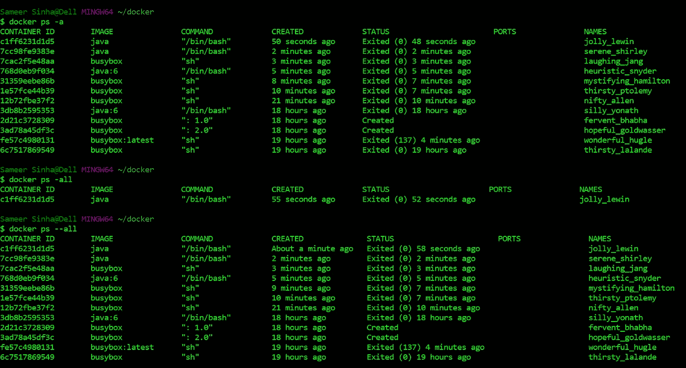

# Docker 快速介绍

> 原文：<https://medium.com/geekculture/a-quick-introduction-to-docker-c18a382100fa?source=collection_archive---------28----------------------->


Photo by [Ian Taylor](https://unsplash.com/@carrier_lost?utm_source=unsplash&utm_medium=referral&utm_content=creditCopyText) on [Unsplash](https://unsplash.com/s/photos/docker?utm_source=unsplash&utm_medium=referral&utm_content=creditCopyText)

事情是这样的。你创建了一段代码，可能是一个 ROS 节点或者一个 ReactJS 应用程序，然后你把这个包交给一个朋友。构建应用程序并开始使用它很简单。没那么快。出问题了，你之前用的 Python 版本变了，或者点云库更新了。好吧，接下来的几个小时将会试着把你的包裹和你朋友的系统匹配起来，反之亦然。如果有一种方法可以确保软件包在各种不同的计算机上运行相同，那会怎么样？一种可以传递的容器？有！它叫做 Docker

我们开始吧！

假设你用的是 Ubuntu。首先从 [Docker Hub](https://docs.docker.com/engine/install/ubuntu/) 安装 Docker

```
$ sudo apt-get remove docker docker-engine docker.io containerd runc
$ sudo apt-get update 
$ sudo apt-get install apt-transport-https ca-certificates curl gnupg lsb_release
$ curl -fsSL https://download.docker.com/linux/ubuntu/gpg | sudo gpg --dearmor -o /usr/share/keyrings/docker-archive-keyring.gpg
$ echo \  "deb [arch=amd64 signed-by=/usr/share/keyrings/docker-archive-keyring.gpg] https://download.docker.com/linux/ubuntu \  $(lsb_release -cs) stable" | sudo tee /etc/apt/sources.list.d/docker.list > /dev/null
$ sudo apt-get install docker-ce docker-ce-cli containerd.io
$ sudo docker run hello-world
```

现在你都准备好了。一旦 [hello-world](https://kumarvikram.com/hello-world-docker-first-container/) 容器运行，Docker 就会安装到您的系统中。是的，就是这么简单。有几个命令对 Docker 很有用。查看这个[小抄](https://github.com/wsargent/docker-cheat-sheet#dockerfile)了解更多。

让我们试着用 ROS 设置 Docker。因此，有许多更简单的选择，如这个 ROS [图像](https://hub.docker.com/_/ros)或这个 SLAM 工具箱[图像](https://hub.docker.com/r/stevemacenski/slam-toolbox)。是的，Docker 非常灵活，你可以得到一个 Ubuntu 映像，或者一个基于 Ubuntu 映像的 ROS 映像，或者一个基于 ROS 和 Ubuntu 的 ROS 包映像。

让我们尝试在我们的案例中构建我们自己的 ROS 包映像。运行以下命令来提取 docker 映像:

```
$ sudo docker pull ubuntu
```

然后通过运行以下命令启动 docker 容器:

```
$ sudo docker run -it ubuntu bash
```

it 命令允许将终端中编写的命令传输到 Docker 容器，并将 Docker 容器的输出写入终端。bash 命令防止容器立即启动和终止。你可以试着使用这个 Docker 容器，但是你会发现大多数东西都没有设置好。让我们把他们安置好

```
$ apt-get update 
$ apt-get install lsb-release -y 
$ apt-get install net-tools -y 
$ apt-get install iputils-ping -y 
$ apt-get install gnupg -y 
$ apt-get install curl -y
$ apt install python-catkin-tools -y
```

注意，不再需要 sudo 了，因为在 Docker 容器中，您是在“root”下运行的。现在所有的依赖项都已经安装完毕，我们可以安装 ROS 和 ROS 包了。现在让我们使用 SLAM 工具箱。

```
$ sh -c ‘echo “deb [http://packages.ros.org/ros/ubuntu](http://packages.ros.org/ros/ubuntu) $(lsb_release -sc) main” > /etc/apt/sources.list.d/ros-latest.list’
$ curl -s [https://raw.githubusercontent.com/ros/rosdistro/master/ros.asc](https://raw.githubusercontent.com/ros/rosdistro/master/ros.asc) | apt-key add —$ apt-get update
$ apt install ros-noetic-desktop-full
$ mkdir -p /catkin_ws/src && cd /catkin_ws
$ catkin build
$ cd src && git clone [https://github.com/SteveMacenski/slam_toolbox.git](https://github.com/SteveMacenski/slam_toolbox.git)
$ source /opt/ros/noetic/setup.bash
$ rosdep update
$ rosdep install -y -r --from-paths src --ignore-src --rosdistro=noetic -y
$ catkin build
```

现在你已经成功地安装了 ROS 和 ROS 包。尝试运行 roscore，看看是否所有的东西都安装正确。如果一切顺利，那么继续设置您的环境。假设您的 docker 正在同一设备上与 ROS 主机通信。例如，如果您的 Turtlebot3 带有运行 docker 的板载 PC，docker 中的 ROS 包可以与板载 PC 上本地运行的 ROS 包和 ROS 主机进行通信

```
$ echo “source /opt/ros/noetic/setup.bash” >> ~/.bashrc
$ echo “source /catkin_ws/devel/setup.bash” >> ~/.bashrc
$ echo “export ROS_MASTER_URI=[http://172.17.0.1:11311](http://172.17.0.1:11311)" >> ~/.bashrc
$ echo “export ROS_IP=172.17.0.2” >> ~/.bashrc
$ echo “192.174.28.20 turtlebot” >> /etc/hosts
```

请注意，主机设备上的 ROS 主 URI 始终是 172.17.0.1。将有两个 IP 地址，在我们的例子中，辅助 IP 地址是 192.174.28.20。这可以使用以下命令进行检查:

```
$ ifconfig
```

turtlebot 这个名字是 PC 的名字。这不是用户名。例如，在下面的终端中，PC 的名称是 linux-desktop，用户名是 mark。/etc/hosts 中的名称应该是 PC 的名称，而不是用户名！


[https://ubuntu.com/tutorials/command-line-for-beginners#3-opening-a-terminal](https://ubuntu.com/tutorials/command-line-for-beginners#3-opening-a-terminal)

瞧啊。您已经准备好运行具有 ROS 功能的 docker 容器了。为了退出容器，键入" exit"。

```
$ exit
```

为了回到该容器中，请执行以下操作:

```
$ sudo docker ps -a 
```

这将显示所有封闭的容器。重新启动先前关闭的容器的名称。所以在下图中，之前关闭的容器的名字是“jolly_lewin”。



[https://stackoverflow.com/questions/48105317/what-is-the-difference-between-docker-ps-all-and-docker-ps-all](https://stackoverflow.com/questions/48105317/what-is-the-difference-between-docker-ps-all-and-docker-ps-all)

重新启动并连接到容器的命令有:

```
$ sudo docker restart jolly_lewin
$ sudo docker attach jolly_lewin
```

这就是了。创建混合了 ROS 和 Ubuntu 元素的 Docker 容器的快速指南。在下一课中，我们将介绍创建整个容器的方法，就像我们在这里使用 Dockerfile 所做的那样。敬请期待！