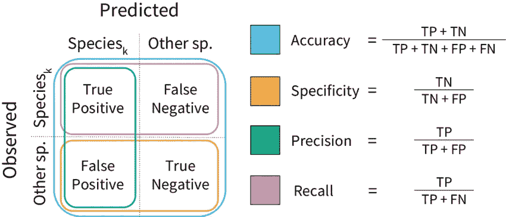
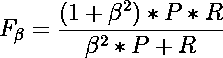
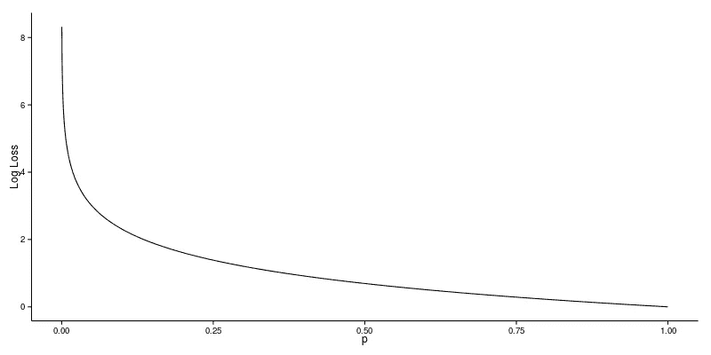
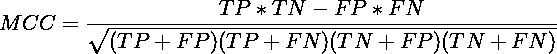

# 分类模型评估标准的完整指南

> 原文：<https://medium.com/geekculture/a-quick-overview-of-evaluation-metrics-for-classification-models-3aaa578113fb?source=collection_archive---------15----------------------->

Photo by [Emily Morter](https://unsplash.com/@emilymorter?utm_source=medium&utm_medium=referral) on [Unsplash](https://unsplash.com?utm_source=medium&utm_medium=referral)

数据集被清理和组织，模型被训练，你已经准备好检查你的模型有多好了！但是，**你的商业模式的最佳评估标准是什么？？？**

如果你像我一样，每次需要记住一个概念时都缺少谷歌的一点帮助，**我会给你免费的建议！**写下来是*背熟*东西的最好策略！这就是我写这篇文章的原因！首先是*记住*概念，其次是在同一页面中拥有关于某个主题的所有信息以供进一步查询，最后但同样重要的是**与数据科学社区分享知识。**

在本文中，我将介绍**二元分类模型**的主要评估指标。在不久的将来，我会写关于回归模型的关键评估指标，但是现在这不是假设。

在此，系好安全带，让我们看看尺寸！！

## 准确(性)

准确度可能是评估机器学习模型的最已知的指标。即使你从未从事过数据科学**的工作，你也可能知道并使用**准确性来评估你的任务表现！

准确性衡量在样本大小范围内正确预测的样本数量。例如，假设你想预测一个 100 人的群体中谁会在星期五晚上点比萨饼(*在我的邻居中，这将是一个非常不平衡的数据集！*)。该模型预测有 45 人会点披萨，55 人不会点，但实际上只有 35 人点了披萨！模型预测的 55 人中，只有 45 人没有点披萨。

在该示例中，该模型在 100 个人的群体中获得了 80 个正确预测的样本，在这种情况下，该模型的准确度为 80% (80/100)。

如果，对于同样的人口，我们预测谁会赢得彩票呢？如果模型只是一直预测“不”，准确率会是 99.9%！

在这种情况下，数据具有不平衡的类，精度不是一个好的选择，但有更好的选择，如您所见。

## 精确

精度是分类器不将阴性样品标记为阳性的能力。换句话说，精度是回答这个问题的度量: ***“在所有模型预测为正面的实例中，有多少实际上是正面的？”***

假设你试图从 100 个人中预测，谁会在冬天去海滩旅行。你的模型预测每个人(100 人)都会去海滩，但事实上冬天只有 **10 个人去了**海滩。这 **10 个人**被称为**真阳性**，模特预测他们会去海滩，他们做到了！**其他 90 个**没去海边的**叫误报。**

在上例中，*模型精度为 10%* ( `10/(10+90)`)。

## 回忆

召回是分类器找到所有阳性样本的能力。换句话说，召回是回答问题的度量: ***“在所有属于肯定类的实例中，有多少模型被标记为肯定的？”***

例如，假设您想预测下一次选举中谁会投票给候选人 A。在 100 个人中，确实有 10 个人投了候选人 A 的票。假设模型将所有 100 个人都标记为阳性(投票给候选人“A”)，那么召回率将是 100%，因为模型找到了所有的阳性病例。

另一方面，在上述示例中，模型精度仅为 10%。(10 真阳性超过 100 标记为阳性)

**什么时候用精准，什么时候用召回？:**

**精准**讲究的是精准！因此，即使我们设法只捕获了一个正类实例，并且我们正确地捕获了它，那么我们是 100%精确的。

**回忆**与其说是关于正确捕获案例，不如说是关于捕获所有属于正类的案例。所以，如果我们总是简单地说每个病例都是阳性，我们就有 100%的回忆。

因此，基本上，如果我们想更多地关注最小化假阴性，我们会希望我们的召回率尽可能接近 100%，而精确度不会太差，如果我们想关注最小化假阳性，那么我们的重点应该是尽可能使精确度接近 100%。

## 特征

特异性是衡量模型识别真阴性的程度，它是不属于阳性类别(真阴性和假阳性)的所有样本中真阴性的比率。这是一个回答问题的度量: ***“在所有属于否定类别的实例中，有多少模型被标记为否定的？”***

在选举模型的例子中，特殊性的想法是确定谁不会投票给候选人“A”。

## **混淆矩阵**

混淆矩阵是一个非常详细的指标，可以得出真阳性(TP)、假阴性(FN)、假阳性(FP)和真阴性(TN)值。这是你的模型如何表现的一个很好的足迹。利用混淆矩阵提供的信息，您能够计算上述所有指标！

下面你可以找到一个非常好的混淆矩阵的可视化表示，包含前面提到的指标的所有公式。

## F1 分数

F1 得分是精确度和召回率的加权平均值(或调和平均值)。算术平均值对两个值赋予相同的权重，*调和平均值对低值给予更大的重视*，这样，**为了获得好的 F1 分数，模型必须具有好的精确度和召回值**。

F1 得分的一种变化称为 F-beta。当我们想要强调模型必须优先考虑与精确度相比更好的召回时，我们将β的值定义为大于 1。

假设您正在训练一个模型来识别患有罕见疾病的人。该模型需要确保所有正面实例都被正确标记，即使将一些负面实例也标记为正面会有代价。在这种情况下，使用高于 1 的β值是有益的。

## ROC AUC 得分

ROC 曲线是一条概率曲线，它绘制了在不同阈值下 **TPR(真阳性率或灵敏度)**对 **FPR(假阳性率或 1-特异性)**的曲线，并且基本上**将‘信号’与‘噪声’**分开。曲线下的**面积(AUC)** 是分类器区分类别的能力的量度，并用作 ROC 曲线的总结。

当 AUC = 1 时，分类器能够完美地区分类别。然而，如果 AUC 为 0，那么分类器将预测所有阴性为阳性，所有阳性为阴性。

当 AUC = 0.5 时，则分类器不能区分类别。这意味着分类器预测所有数据点的随机类别或恒定类别。

## 对数损失

**测井损失**是基于概率的最重要的分类指标。它**严重惩罚了对错误分类有信心的分类者！** *但这是什么意思呢？？*

这意味着**如果对于一个特定的正样本，模型将其分配到正类的概率非常小，那么该样本的相应贡献将非常大**(如您在下图中所见)，这将对整体模型性能产生巨大影响。

对数损失没有上限，其范围从 0 到无穷大。当该值接近 0 时表示精度较好，而远离 0 的对数损失表示精度较低。

## 马修斯相关系数

马修斯相关系数— **MCC** ，是一个**考虑到混淆矩阵(TP，TN，FP 和 FN)** 覆盖的所有可能性的度量，通常被认为是**一个平衡的度量** **，即使类别的大小非常不同**(非平衡数据集)，也可以使用该度量。MCC 值在-1 和+1 之间变化，其中+1 表示完美预测，-1 表示逆预测，0 表示平均随机预测。

MCC 公式如下所示:

如果您想了解更多关于 MCC 的信息，我推荐您阅读这篇文章:

 [## 马修斯相关系数(MCC)的优势超过 F1 评分和准确性在二进制…

### 背景评估二元分类及其混淆矩阵，科学研究人员可以使用几个…

bmcgenomics.biomedcentral.com](https://bmcgenomics.biomedcentral.com/articles/10.1186/s12864-019-6413-7#:~:text=The%20Matthews%20correlation%20coefficient%20%28MCC%29%2C%20instead%2C%20is%20a,both%20to%20the%20size%20of) 

# 结论

在本文中，我介绍了二进制分类模型最常用的评估指标！我试图以一种肤浅的方式介绍这些概念，**但是我真心鼓励你在每个指标上更深入。**

我希望这篇文章对你将来的 ML 性能指标的定义有所帮助，或者至少让你记住一些在你头脑中不知何故丢失的概念！

如果你喜欢这篇文章，请毫不犹豫地鼓掌！如果你有任何疑问或要求，请随时使用评论！