# Python 继承和异常处理的快速复习

> 原文：<https://medium.com/geekculture/a-quick-refresher-on-object-oriented-programming-exception-handling-on-python-971b5ac115b8?source=collection_archive---------10----------------------->

> "一个人的价值并不比他的野心更大。"—马库斯·奥勒留

所以你的手被 Python 弄湿了，或者水开始变干了，不管怎样，现在是时候开始做些基本的事情了。建立并保持你坚实的基础，这样你就能在你的能力上达到更高的高度。

我将非常详细地解释如何使用 Python，一种面向对象的编程语言(OOP)来模拟一个简单的库(una tienda)。这个迷你项目将帮助你快速掌握继承和异常处理。

# 继承需要被削弱吗？

OOP 是什么意思？它的整体思想是现实生活中的对象也可以用 Python 中的对象/类型来表示。

您可以创建一个商店产品，比如一个香蕉，并包含这个香蕉的所有特征(属性)和行为(方法)。

为什么要举香蕉的例子呢？

> 因为我们可以。

如果你能描述现实生活中的事物，那么你就可以用 Python 来创建和表现它。给你更多的力量。

Banana Time by Internet

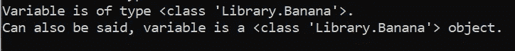

Results from running my online library program.

*你注意到我上面的代码片段了吗？*

如果你没有，那么让我来揭示它，因为它是如此晦涩。注意，变量的类型是怎样的？

变量的类型如此显示是因为类 Banana 包含在库模块中。如果需要复习脚本和模块，请查看我的其他相关文章:

[什么是 __name__ == "__main__ "？详细解释。亚历克·摩尔多瓦|极客文化| 2021 年 4 月| Medium](/geekculture/what-is-name-main-explained-in-detail-a05c1ee885c6)

你也看到开头的`class`。这暗示了我们是如何制造物体的！

要制作对象，我们使用特殊的关键字:

`**class** <your_object's_name>():`

以香蕉为例:

`**class** Banana(LibraryItem):`

还有一件需要注意的事情！

当我创建我的香蕉类时，我在括号中添加了`Libraryitem`。什么给了…？

# 继承什么，为什么继承？

嗯，我从父类继承了一大堆属性和方法。为什么呢？

嗯，我的香蕉和电影、专辑、书籍一起存放在图书馆里！它们都是图书馆的项目。假设我想看一张专辑和一根香蕉。为了做到这一点，我必须在每个类中定义所有这些行为:Banana 和 Album。但是我们不会像那样做多余的工作。

所以既然两者共享相同的行为，那么我应该在一个单独的**父类**中为**子类**泛化这些行为:Banana 和 Album 继承！

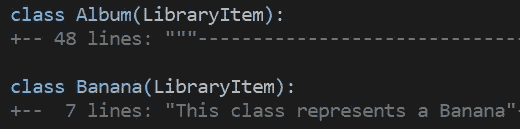

A simple example of Inheritance in Python

下面是不同类型继承的一般表示:

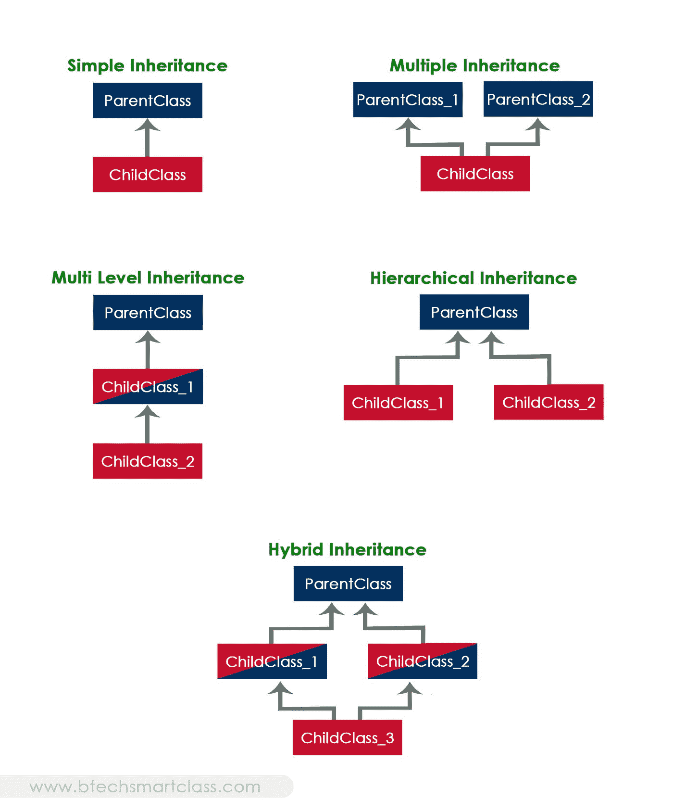

Inheritance examples by BtechSmartClass.com

## 那么我还继承了香蕉和相册类可以发现有用的什么呢？

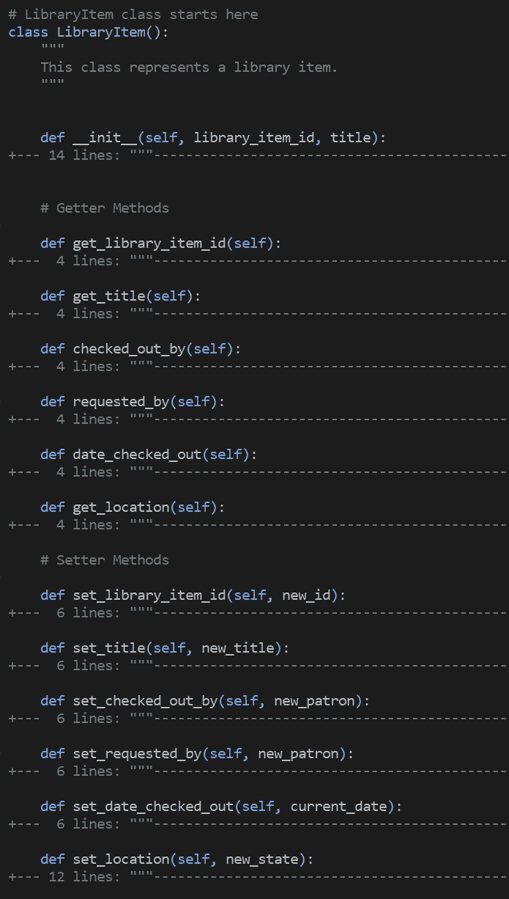

Shallow Look into LibraryItem Parent Class (Code folding Enabled)

这就是你的面向对象编程复习工具！还有更多的事情要做，嘿，我们是来复习的，不是来拿博士学位的！

> "一个有创造力的人是被取得成就的欲望所激励的，而不是被打败别人的欲望所激励的。"—安·兰德

# 异常处理需要 buff 吗？

当遇到运行时错误**时，异常处理对于优雅地结束程序**非常有用。**现在请记住有两种类型的错误！**

> **“想象一下这样一种情况:您打开了一个数据库，正在手动更新它的一些部分，这时突然出现了一个严重错误，您希望停止所有操作。您可能不希望它在写入数据库时崩溃。也许您可以通过首先撤销最近的全部更改来处理异常(这样您就不会有一些部分混乱的数据)，然后在关闭程序之前退出数据库。”——马修·罗伯茨**

1.  **句法误差**
2.  **异常(运行时错误)**

**语法错误是编译器或解释器由于类型或错位缩进(在 Python 中非常重要)而无法读取代码。**

**但是为什么我们必须实现异常处理呢？**

**假设你有一个程序，根据你的输入，它会永远运行下去！**

**使用异常处理，您可以用一个描述性的语句来退出程序，说明您的程序终止的原因。这将为你节省时间和金钱。**

**另一个例子是，你写了一个程序，需要灵活的用户输入，但是他们输入了一个不正确的输入，这通常会导致整个系统崩溃，而没有异常处理。有了异常处理，你就能够捕捉到所说的异常，并将程序重新启动到之前的稳定状态。又是时间和金钱！**

**这是一个关于我的 Library.py 程序中异常处理的例子！**

## **带异常处理**

**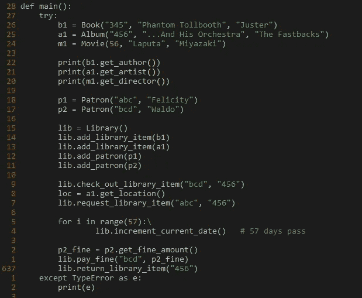**

**Exception Handling with my Try-Except Blocks ready!**

**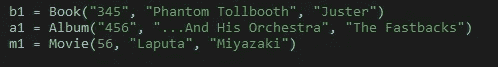**

**Purposeful incorrect Library item id input type**

**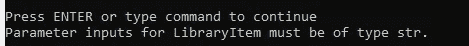**

**My graceful exit with a description.**

## **没有异常处理**

**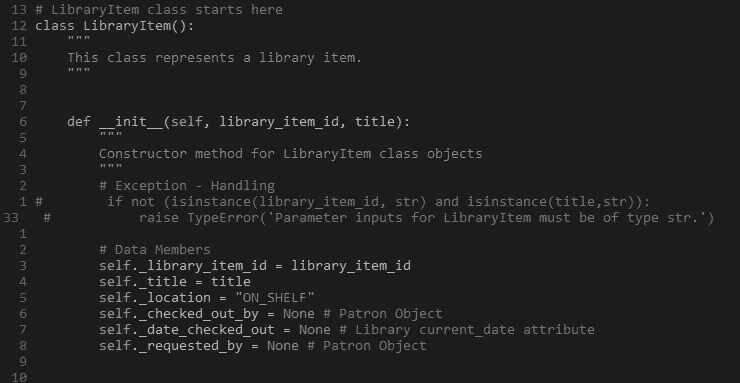**

**Exception Handler commented out!**

**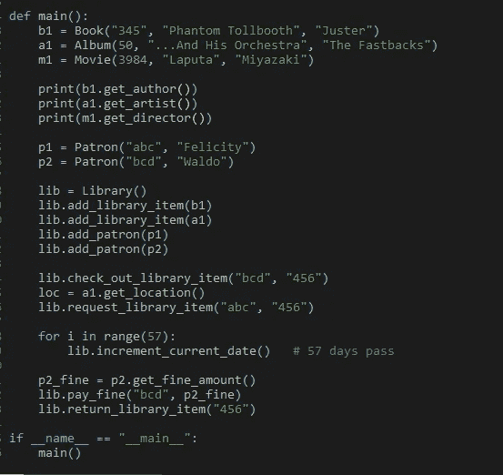**

**Wrong input parameters for a1 and b1 (Album and Movie Objects) and no try-except blocks**

**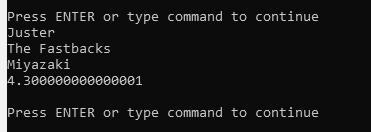**

**Excepted Output.**

**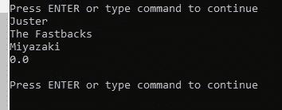**

**Actual output! No description as to what is wrong.**

**你可以看到我的程序运行了，但是没有崩溃，但是它没有输出正确的输出。让我们有数以千计的书籍、专辑和电影添加到图书馆，其中大多数都输入正确。**

**因此，我们有一个我称之为*的不幸 bug，*，我的程序有时会工作，但不会崩溃，而且你得不到关于程序出问题的原因和位置的反馈！**

**这些 bug 是出了名的难找(我花了一两天找了个小*倒霉 bug* )。这就是为什么在构建程序时以增量方式编写和测试，并加入异常处理来避免上述情况是一个好的实践。**

## **顺道拜访韦尔丹斯克之前，先了解一下附件**

**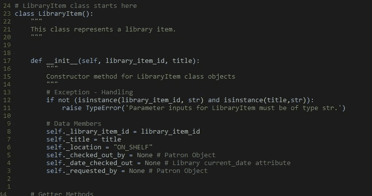**

**‘raise’ keyword**

**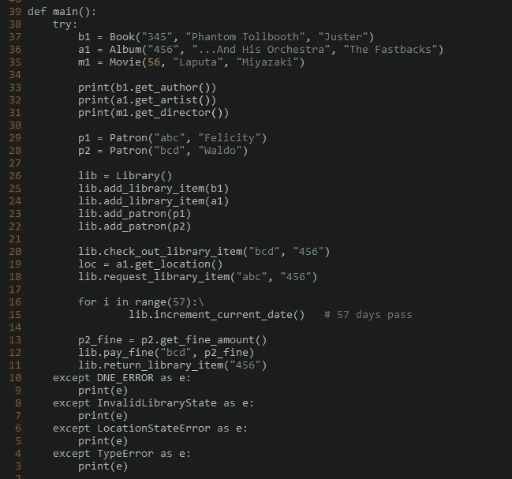**

**Try-except blocks ready!**

**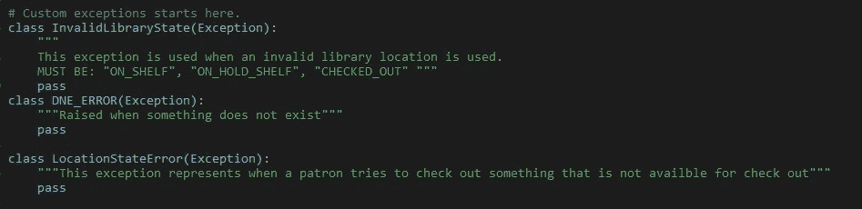**

**User-defined Exceptions**

**有三个基本要素可以让你重新振作起来:**

1.  **Try-except-finally(可选)**
2.  **“raise”关键字**
3.  **用户定义的异常**

> **“继续游——海底总动员中的朵拉”**

## **Try-Except-Else(可选)-Finally(可选)块**

****尝试块:****

**保护具有高失败风险的代码，并优先进行监视和调试。**

****例外块:****

**引发指定异常时执行。在我们的例子中，我们打印了 TypeError 的回溯。**

**注意:将高度具体的异常放在更一般的异常之前。因此，由于我有自定义异常，如:“DNE _ 错误”，“无效库状态”和“位置状态错误”，我把它们放在我的类型错误异常之前。如果我不这样做，那么我可能会将 DNE 错误标记为类型错误，如果我需要关于引发了哪种异常的信息，这对我没有帮助。**

****Else(可选)块:****

**确保只有在 try 块中的代码没有引发任何异常的情况下才执行程序的一部分是非常重要的。**

**IOErrors 就是很好的例子:**

**如果文件没有成功打开，您不希望您的程序执行文件敏感语句。**

**此外，您可以在 final 子句(关闭文件)之前执行代码。**

****最后一个(可选)模块:****

**不管是否引发了异常，执行一组语句都是很棒的。**

**一个很好的例子是当你想关闭一个文件，而不管之前是否有相关的失败。这样你可以控制你的内存使用量！**

****

**Sloth climbing tree from UnSplash by [Sebastian Molinares](https://unsplash.com/@damebash)**

# **谢谢你，希望能很快见到你！**

# **资源**