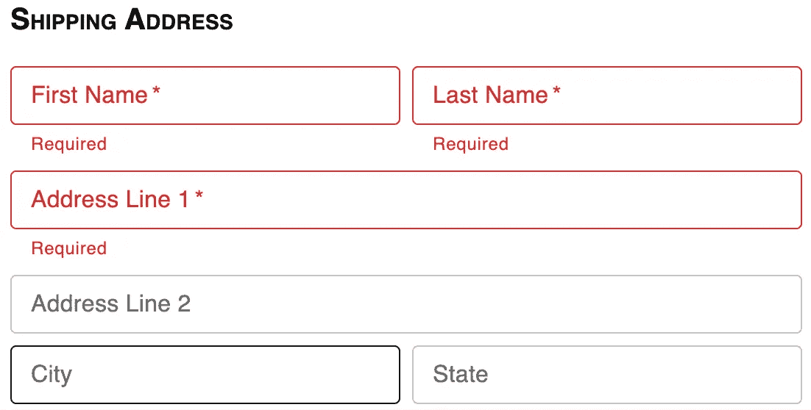

# 一个 React Material UI 库，只需 JSON 配置即可构建任何表单

> 原文：<https://medium.com/geekculture/a-react-material-ui-library-to-build-any-form-with-only-json-config-ec2b3e961a27?source=collection_archive---------9----------------------->



假设我们想创建一个收集送货地址的表单。下面是我们如何只用 JSON config 和我构建的开源库`[@jeremyling/react-material-ui-form-builder](https://github.com/jzcling/react-material-ui-form-builder)`复制下面的表单。

# **JSON 配置**

```
const fields = [
  {
    title: “Shipping Address”,
    component: “display-text”,
    titleProps: {
      style: {
        fontSize: 20,
        marginTop: 16,
        fontWeight: “bold”,
        userSelect: “none”,
        fontVariant: “small-caps”,
        marginBottom: 8,
      },
    },
  },
  {
    col: {
      xs: 6,
    },
    label: “First Name”,
    props: {
      required: true,
    },
    attribute: “firstName”, 
    component: “text-field”,
    validations: {
      label: “First Name”,
      required: “Required”,
    },
    validationType: “string”,
  },
  {
    col: {
      xs: 6,
    },
    label: “Last Name”,
    props: {
      required: true,
    },
    attribute: “lastName”,
    component: “text-field”,
    validations: {
      label: “Last Name”,
      required: “Required”,
    },
    validationType: “string”,
  },
  {
    label: “Address Line 1”,
    props: {
      required: true, 
    },
    attribute: “address1”,
    component: “text-field”,
    validations: {
      label: “Address 1”,
      required: “Required”,
    },
    validationType: “string”,
  },
  {
    label: “Address Line 2”,
    attribute: “address2”,
    component: “text-field”,
    validations: {
      label: “Address 2”,
    },
    validationType: “string”,
  },
  {
    col: {
      xs: 6,
    },
    label: “City”,
    attribute: “city”,
    component: “text-field”,
    validations: {
      label: “City”,
    },
    validationType: “string”,
  },
  {
    col: {
      xs: 6,
    },
    label: “State”,
    attribute: “state”,
    component: “text-field”,
    validations: {
      label: “State”,
    },
    validationType: “string”,
  },
  {
    col: {
      xs: 6,
    },
    label: “Postcode”,
    props: {
      required: true,
    },
    attribute: “postcode”,
    component: “text-field”,
    validations: {
      label: “Postcode”,
      required: “Required”,
    },
    validationType: “string”,
  },
  {
    col: {
      xs: 6,
    },
    label: “Country”,
    props: {
      required: true,
    },
    attribute: “country”,
    component: “text-field”,
    validations: {
      label: “Country”,
      required: “Required”,
    },
    validationType: “string”,
  },
  {
    options: [{
      label: “Same as Billing”,
      value: true,
    }],
    optionConfig: {
      key: “label”, 
      label: “label”,
      value: “value”,
    },
    attribute: “sameAsBilling”,
    component: “checkbox-group”,
  },
];
```

# **所有表格的标准代码**

```
import React, { useRef, useState } from “react”;
import { FormBuilder } from “@jeremyling/react-material-ui-form-builder”;
import { Button } from “@mui/material”;
import { get, isEmpty } from “lodash”;async function validate(refs, form) {
  var errors = {};
  for (const [attribute, ref] of Object.entries(refs.current)) {
    if (ref.validate) {
      const error = await ref.validate(get(form, attribute));
      if (error.length) {
        errors[attribute] = error;
      }
    }
  }
  if (!isEmpty(errors)) {
    console.log(errors);
    return false;
  } 
  return true;
}export default function ShippingAddress() {
  const [form, setForm] = useState({});
  const refs = useRef({});

  const updateForm = (updates) => {
    const copy = { …form };
    for (const [key, value] of Object.entries(updates)) {
      copy[key] = value;
    }
    setForm(copy);
  }; const handleNext = async (event) => {
    event.preventDefault();
    const ok = await validate(refs, form);
    if (!ok) {
      return;
    }
    console.log(form);
  };

  return (
    <>
      <FormBuilder
        fields={fields}
        form={form}
        updateForm={updateForm}
        refs={refs}
      />
      <Button
        type=”submit”
        variant=”contained”
        color=”primary”
        sx={{ mt: 1 }}
        onClick={handleNext}
      >
        Next
      </Button>
    </>
  );
}
```

# **解释**

这里，我们只使用库中的几个组件，`display-text`、`text-field`和`checkbox-group`。还有很多你可以用的。你可以在这里查看[文档](https://github.com/jzcling/react-material-ui-form-builder#field-props)。请注意，一般来说，所有输入组件都有这些核心字段属性。

```
{ … title: “State”, // Display text above the input label: “State”, // Input label attribute: “state”, // Attribute of the form to set/control component: “text-field”, // Type of component col: { // Breakpoints and corresponding width (1–12) xs: 6, sm: 6, … }, validations: { // Any validations accepted by yup required: true, length: 10, min: 5, max: 20, matches: [‘/[a-z]/i’, ‘Can only contain letters’], email: true, url: true, uuid: true, },}
```

# **结束语**

实际上，我在 [FormBlob](https://build.formblob.com/builder) 上点击了 3 次并做了一些重命名，就创建了上面的表单。尝试一下，让建筑形式变得轻而易举。如果你是一名开发人员，[联系我们](https://build.formblob.com/p/05f25c5d-0f7b-446b-931c-afd2d876499b)，我会为你打开一个功能，将你构建的表单导出到你自己的项目中。或者，您甚至可以完全在 FormBlob 上构建和部署托管表单，并将表单嵌入到您自己的域中。如果你使用这种方法，你不必在你的应用程序中使用 React，它仍然开箱即用！

如果担心数据隐私，可以定义 webhooks 在每次提交时调用，将表单数据传递到自己的后端。如果您选择，FormBlob 不会在我们的服务器上存储表单结构之外的任何数据。