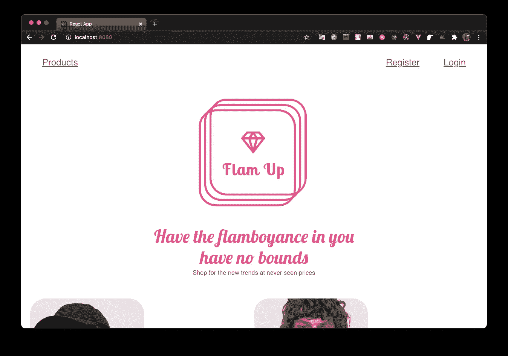
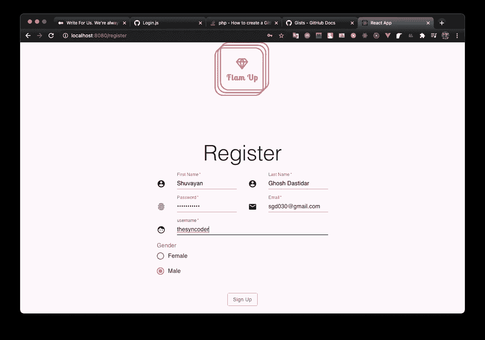
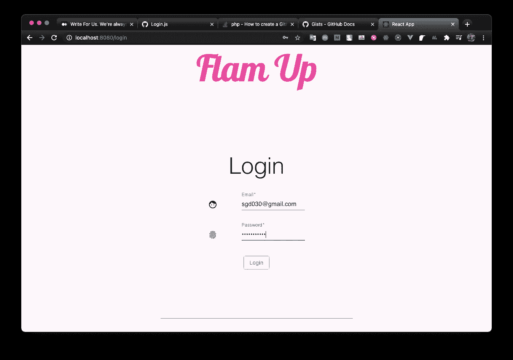
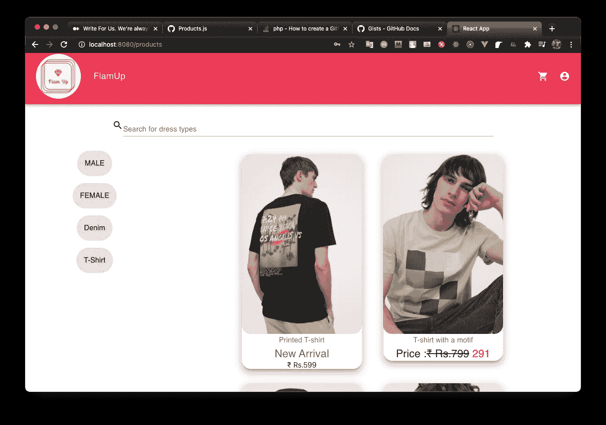

# 一个 ReactJs Web 应用程序，有一个 Spring Boot 后端，并使用 Docker 将其容器化。

> 原文：<https://medium.com/geekculture/a-reactjs-web-application-with-a-spring-boot-backend-and-containerizing-it-using-docker-3eeaed8cb45a?source=collection_archive---------0----------------------->


Photo by [Nubelson Fernandes](https://unsplash.com/@nubelsondev?utm_source=medium&utm_medium=referral) on [Unsplash](https://unsplash.com?utm_source=medium&utm_medium=referral)

ReactJs 是开发 web 应用程序的必由之路，因为它在社区中得到高度和深刻的支持，并且有数以千计的第三方库对其进行补充。然而，对于一些人来说，将它连接到 Spring Boot 应用程序可能是一项艰巨的任务。因此，本文计划简要介绍 React，并完整演示如何将 ReactJs 应用程序与 Material-UI 和 Spring Boot 后端集成在一起。有关 Spring Boot 的详细信息以及如何使用它构建 API 的演练，

[](/geekculture/a-full-stack-e-commerce-application-using-spring-boot-and-making-a-docker-container-eff46f6f4e14) [## 一个使用 Spring Boot 和 Docker 容器的全栈电子商务应用程序。

### 使用 spring boot 制作 API 并使用 Docker 对其进行容器化的演练。

medium.comWhat 什么](/geekculture/a-full-stack-e-commerce-application-using-spring-boot-and-making-a-docker-container-eff46f6f4e14) 

# 什么是 ReactJs？

> React 是一个开源的前端 JavaScript 库，用于构建用户界面或 UI 组件。它由脸书和一个由个人开发者和公司组成的社区维护。React 可以用作开发单页面或移动应用程序的基础。

React JS 基本上代表了应用程序中的一个视图。要将它与 Spring Boot 联系起来，理解 React 如何在幕后工作是非常重要的。

React 使用一个虚拟 DOM，允许 React web 应用程序在一个单独的**index.html**页面中显示整个应用程序，而不是其他应用程序，后者需要更多的 html 页面来显示每个视图。虚拟 DOM 可以插入和拔出基于 React 的组件，这些组件保存要显示的应用程序用户的状态。

现在 ReactJs 的组件可以用两种方法制造—

*   基于类的组件
*   功能组件

```
import React from 'react'
class ReactComponent extends React.Component{ constructor(props){
        super(props);
        this.state = {
             user: "newuser"         }
      } render(){ return( <div>Hello {this.state.user}<div>
        )
     }}
```

功能组件也是一样的

```
import React from react;const ReactComponent = (props) => { const [ user, setUser ] = React.useState('newuser'); return ( <div>Hello {user}</div>
     );
}
```

对于本演练，我们将继续讨论功能组件。

在继续之前，我建议浏览一下[使用状态](https://reactjs.org/docs/hooks-state.html)和[使用效果](https://reactjs.org/docs/hooks-effect.html)的文档，因为我们会非常频繁地使用它们。

现在让我们考虑应用程序和应用程序页面的状态。我们的应用程序是一个服装店，注册用户可以查看后端可用的产品，并可以搜索它们。产品最初是根据用户的性别和商品的类型显示的——通过用户交互(由后端完成)的新变化或打折变化。我们的工作只是呈现后端提供的内容。此外，用户可以将产品添加到购物车，并更新数量或从购物车中删除商品。

可以使用 React Redux 在全局存储中保存应用程序的状态，并调用 reducers 和操作来操作它。然而，我们将继续使用 [ReactContext](https://reactjs.org/docs/context.html) API。

这将是一个很长的教程，所以请随意跳过你已经熟悉的部分。

*   **App.js** —使用上下文 API 设置全局认证状态，并声明应用程序的路由。
*   **注册登录**——处理用户的认证状态。
*   **产品和分页** —通过创建无限滚动列表来处理 react 应用程序中的分页。点击“加载更多”按钮可添加更多项目。
*   **购物车** —商品被添加到购物车中。用户可以删除和更新购物车中的商品数量。大量使用 useEffect 在每次更改后更新当前状态。
*   **构建和 Docker** —构建 react 应用程序的构建过程，以及 spring boot 应用程序的构建，并将它们组合在 Docker 容器中。

首先，让我们用 Create React app 创建一个新的 React App。

```
npx create-react-app frontend
```

现在让我们保存我们将需要的依赖项，

```
npm i @material-ui/core @material-ui/icons @material-ui/lab axios react-router-dom
```

如前所述，让我们创建一个 context.js

完成这些后，让我们决定应用程序的路线。对于路由，我们将使用 React-Router-Dom 来定义应用程序的不同路由。

这里是 App.js 应用的起点。

正如我们前面讨论的,“products”路由仅适用于经过身份验证的用户，它会提醒用户在进入经过身份验证的路由之前登录。

为此，我们需要实现 PrivateRoute 组件。

因此，如果用户通过了身份验证，privateRoute 组件将显示所请求的组件，否则将使用 location 状态中的消息将其重定向到主页。

除此之外，App.js 调用 authenticationService 函数来检查用户身份验证是否已经完成。这是通过调用后端并检查当前用户是否经过身份验证来完成的。后端或 spring boot 检查请求中的 cookie，并检查用户的当前会话是否已经过身份验证。对于前端，我们只需向后端发出 get 请求，就可以知道用户的身份验证状态。

现在让我们制作第一个屏幕——主屏幕，



Home Screen

# 响应式设计

网格组件确实有助于做出响应式设计。


Photo by [Taras Shypka](https://unsplash.com/@bugsster?utm_source=medium&utm_medium=referral) on [Unsplash](https://unsplash.com?utm_source=medium&utm_medium=referral)

为了让我们的应用程序在所有设备上都看起来不错，我们需要做一个完全响应的设计。material Ui 中的网格组件确实有助于基于断点(如 xs、sm、lg 等)进行响应式设计。现在，一个屏幕中最多有 xs={12}列。我们可以设置断点，比如 xs={12}和 sm={6} —这意味着在尺寸小于 sm 的屏幕上，组件将占用 xs={12}的整个宽度，否则它将占用一半的屏幕尺寸— 6。在[文档](https://material-ui.com/components/grid/)中定义了更多断点。

此外，我们可以传递诸如 justify 和 alignItems 之类的属性，使我们的组件以 flex 方式正确对齐。对于包装器，我们使用容器属性，对于其中的孩子，我们使用项目属性。

现在让我们看看代码，

一旦我们完成了主屏幕，

让我们看看注册屏幕和登录屏幕。

用户首先在注册屏幕中注册，注册成功后，路由器会将他/她重定向到登录页面。登录页面是进行实际身份验证的地方。成功验证数据库中的密码和电子邮件后，用户通过身份验证，并且**全局状态身份验证设置为真。**现在存储了一个 cookie JSESSIONID，它保存了由 spring boot 设置的用户认证状态。现在，即使在刷新浏览器时，用户仍然是经过验证的。

我建议通读这篇文章，了解后端是如何工作的。

[](/geekculture/a-full-stack-e-commerce-application-using-spring-boot-and-making-a-docker-container-eff46f6f4e14) [## 一个使用 Spring Boot 和 Docker 容器的全栈电子商务应用程序。

### 使用 spring boot 制作 API 并使用 Docker 对其进行容器化的演练。

medium.com](/geekculture/a-full-stack-e-commerce-application-using-spring-boot-and-making-a-docker-container-eff46f6f4e14) 

这是注册页面，



The registration page

这是用户注册后被重定向到的登录页面，



The login Page

现在让我们来到产品页面。我们的产品最初是根据用户性别从后端提供的。此外，产品从服务器分页。因此，我们也必须在前端支持分页。每个产品都显示在购物车组件中。让我们先做那个组件。

# 产品和分页

现在让我们制作产品页面。在安装组件时，将调用 useEffect 从后端获取初始产品。点击**加载更多按钮**，状态更新至下一页，更多产品被提取并添加至应用程序的当前状态。此外，还有一个搜索查询的实现，它调用后端的另一个端点，在那里搜索与搜索查询相似的产品类型，并将其返回到前端进行显示。下面是同样的实现。



Products Page

现在我们只剩下购物车了。cart 屏幕使用 useEffect 和一个空依赖项[]在首次安装组件时首次加载订单项。当任何状态改变时，例如数量或在删除的情况下，我们设置产品状态，这又触发另一个具有[products]依赖关系的 useEffect 来获取更改。下面是相同的实现。

这样我们就覆盖了用 React 制作的前端部分。现在它是如何与弹簧靴一起建造的。

我们将使用 docker 在一个容器中制作它们，前端和后端一起构建，我们使用这个优秀的插件— [maven 前端插件](https://github.com/eirslett/frontend-maven-plugin)。

让我们看看它是如何在 spring boot 应用程序的 pom.xml 中配置的。

它充当一个插件，为 react 应用程序的构建过程执行 npm install 和 npm run build，最后将文件复制到 spring boot 的静态目录中。

我们还需要在 spring boot 安全配置中进行修改，以便 react-router 能够工作。我建议浏览我解释过的后端文章。

现在来看 docker 配置，以便将它们组合成一个 docker 文件。由于前端插件，一个人可以只运行 mvn 安装和应用程序将启动和运行。dockerfile 文件也很相似和简单。我们在应用程序的根目录中定义了一个 docker 文件。

```
FROM maven:3.6.1-jdk-8-slim AS build
RUN mkdir -p workspace
WORKDIR workspace
COPY pom.xml /workspace
COPY src /workspace/src
COPY frontend /workspace/frontend
RUN mvn -f pom.xml clean install -DskipTests=true
FROM openjdk:8-alpine
COPY --from=build /workspace/target/*.jar app.jarEXPOSE 8080
ENTRYPOINT ["java","-jar","app.jar"]
```

因此，我们获取一个 maven 映像和一个 jdk 映像，并制作一个应用程序的 jar 文件以及 reactJs 构建。运行它是在入口点定义的。

为了用 postgres 数据库编写它，我们定义了一个 docker-compose 文件，

```
version: '3'

services:

  db:
    image: "postgres:9.6-alpine"
    container_name: db
    restart: always

    ports:
      - 5432:5432

 *volumes:
      - postgres_data:/var/lib/postgresql/data* environment:
      - POSTGRES_DB=flamup
      - POSTGRES_USER=postgres
      - POSTGRES_PASSWORD=postgres
      - PGDATA=/var/lib/postgresql/data/pgdata

  flamup:
    build: ./
    container_name: flamup
    environment:
      - DB_SERVER:db
      - POSTGRES_DB=flamup
      - POSTGRES_USER=postgres
      - POSTGRES_PASSWORD=postgres
    ports:
      - 8080:8080 *# Forward the exposed port 8080 on the container to port 8080 on the host machine* depends_on:
      - db

volumes:
  postgres_data:
```

如果您的系统上安装了 docker 和 docker-compose，那么现在运行它就像。

```
docker-compose up --build
```

因此，该应用程序在 [http://localhost:8080/](http://localhost:8080/) 上运行

这标志着本文的结束。在下一篇文章中，我将讨论这个应用程序在 AWS(亚马逊网络服务)上的部署，以及更多的未来前景。

所以一定要保持关注，一定要关注我。

[推特](https://twitter.com/TheSYNcoder) [领英](https://www.linkedin.com/in/shuvayan-ghosh-dastidar-3b5383166/)

因此，我们将在另一篇文章中再见。

再见。