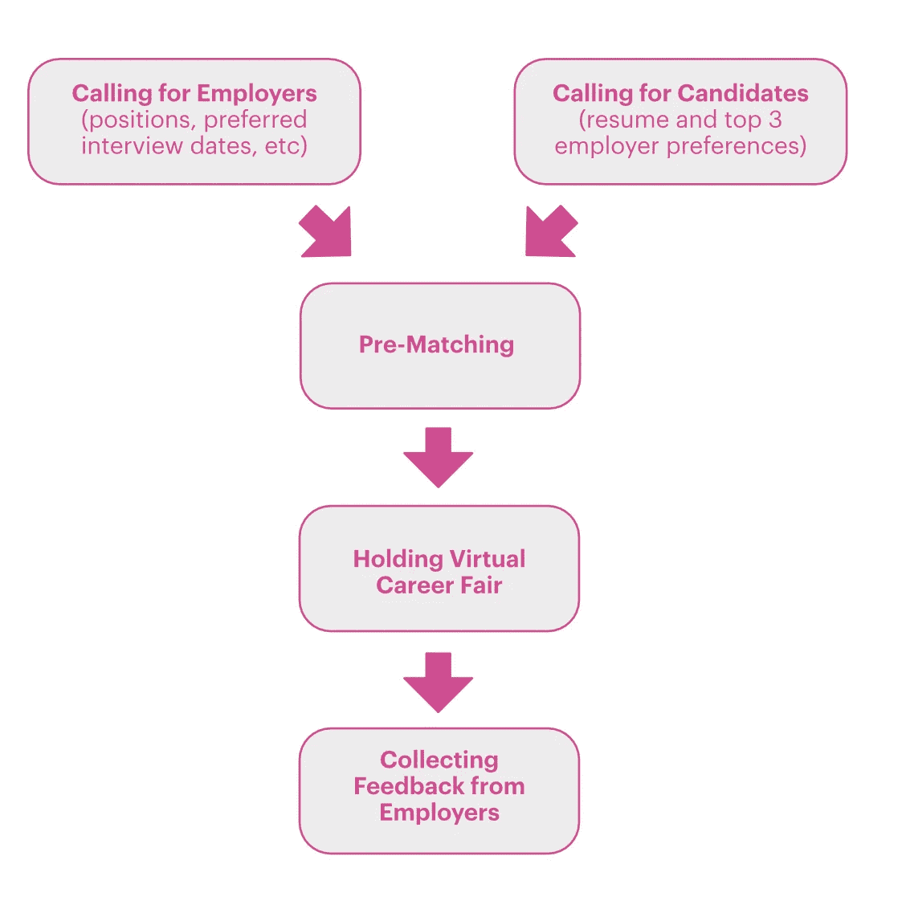
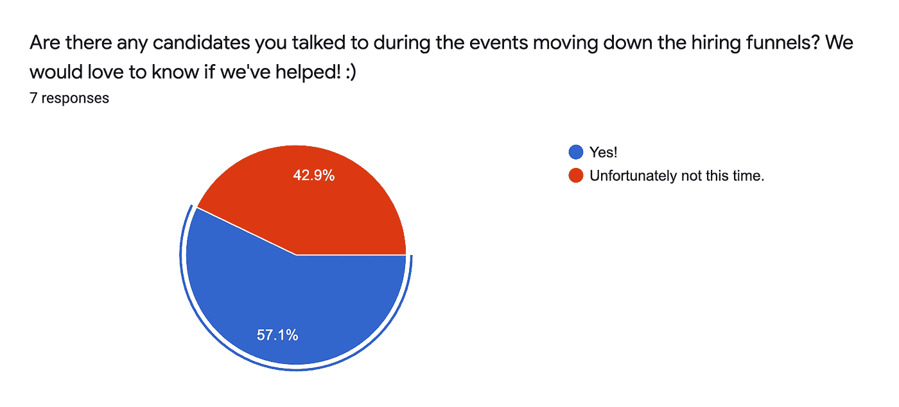
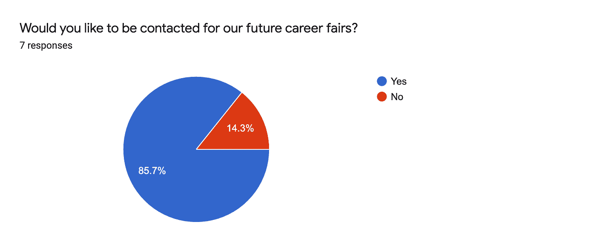

# DataCan 虚拟招聘会述评

> 原文：<https://medium.com/geekculture/a-review-of-datacans-virtual-career-fair-d4b38ece593d?source=collection_archive---------19----------------------->

组织者的视角

*本帖是对 DataCan 有史以来第一届* [*虚拟招聘会*](https://www.meetup.com/datacan-meetup-group/events/279282431/) *的回顾。要了解我们的组织，请访问我们的* [*网站*](https://datacan.network/) *并关注我们的*[*LinkedIn*](https://www.linkedin.com/company/wids-vancouver/)*。*

[虚拟招聘会](https://www.meetup.com/datacan-meetup-group/events/279282431/)(2021 年 7 月)是[Data can](https://datacan.network/)自 2021 年从温哥华数据科学妇女协会演变而来的首次活动，旨在支持和扩大数据科学社区的多样性，作为一个非营利性的独立组织。虚拟招聘会的目标是通过 1-1 小型面试(15 分钟)将数据人才与雇主联系起来，并使全球疫情的求职过程更加开放和灵活。

自 2021 年 6 月宣布该活动以来，我们已经收到了来自美国、英国和加拿大三大洲的 167 份简历。通过在活动期间与候选人交谈，我们发现候选人的人才库包括应届毕业生和有经验的专业人士。经验丰富的候选人来自不同的行业，从跨国公司到体育、电信、会计和学术机构的本地初创企业。

许多雇主对我们的招聘表现出兴趣，因为这一活动为他们参加招聘会节省了时间和金钱。分别是百思买加拿大、[鱼多多(POF)](https://medium.com/u/6a708bb6e8c8?source=post_page-----d4b38ece593d--------------------------------) 、 [Shopify App Devs](https://medium.com/u/b9a2816f90a0?source=post_page-----d4b38ece593d--------------------------------) 、 [Unbounce](https://medium.com/u/eda63d4fd9e4?source=post_page-----d4b38ece593d--------------------------------) 、奥比斯投资、[万事达卡](https://medium.com/u/10924fd16ff8?source=post_page-----d4b38ece593d--------------------------------)、 [Fortinet](https://medium.com/u/77010c8a1c1b?source=post_page-----d4b38ece593d--------------------------------) 。开放的角色包括机器学习工程师、数据科学家、数据分析师、数据工程师和软件工程师。需要注意的一点是，Shopify 的开口都是远程的。

组织此次活动的后勤工作如下图所示:

雇主和候选人的信息都是通过表格收集的。然后，我们会将候选人的简历发送到他们喜欢的公司。在这一点上，雇主可以预先选择他们有兴趣与之聊天的候选人。然后在雇主选择的那天安排了 1-115 分钟的面试。我们相信小型面试可以作为第一轮面试，帮助我们的数据人才和雇主相互了解。

根据雇主的反馈，57%的候选人进入了下一步的招聘渠道(图 1)。

Figure 1

几乎所有人都希望在下一次招聘活动中得到联系(图 2)。

Figure 2

组织一场以 1:1 小型面试为特色的网上招聘会与面对面的招聘会截然不同。提前进行了大量的规划，比如收集候选人的简历，与雇主沟通，管理预匹配流程，为首选雇主安排候选人的迷你面试，设置多个面试室同时举行面试等。

# 有些事情我们可以做得更好

组织一场以 1:1 小型面试为特色的网上招聘会与面对面的招聘会截然不同。许多计划都是提前进行的，例如收集候选人的简历，与雇主沟通，管理预匹配过程，为首选雇主安排候选人的小型面试，以及设置多个面试室同时举行面试等。

由于我们志愿者的时间有限，我们只要求每位候选人列出他们有兴趣与之交谈的前三位雇主。此外，我们只能给每个雇主分配 1 小时的面试时间。不幸的是，一些候选人找到了雇主，但却无法与雇主交谈。为了弥补这一点，我们在所有雇主之间分享了所有候选人的简历，以便将来联系。我们可以做的一件事是在面试结束前向应聘者发送一段简短的视频介绍，这样应聘者可以花更多的时间来评估应聘者。

我们遗漏的另一件事是列出职位的资历。这可能会影响求职者和雇主的满意度。我们将在未来的招聘会活动中牢记这一点。

我们还发现，我们以前学校的很多同事甚至在事件发生后也不知道这件事。我们尝试分发信息的社交媒体平台包括:有针对性的脸书/微信/WhatsApp 群体、学校校友渠道、数据科学非政府组织、志愿者社交媒体账户等。信息能传播多远很大程度上取决于 DataCan 的声音有多大影响力。作为一个新的 Meetup 团队，这是 DataCan 面临的新挑战。因此，我们设计了一个登录页面，上面列出了社区成员可以从中受益的资源和信息。此外，我们意识到，人们也可能会错过一篇文章，因为它已经被埋在他们的新闻提要的底部。在未来，我们计划有一个更好的营销计划，定期广播未来的事件。最后但并非最不重要的一点是，与我们的观众进行更多的互动可能是一种有效的方法。一种可能的做法是鼓励我们的候选人和雇主在他们的社交媒体渠道和标签数据罐上分享对事件的想法。