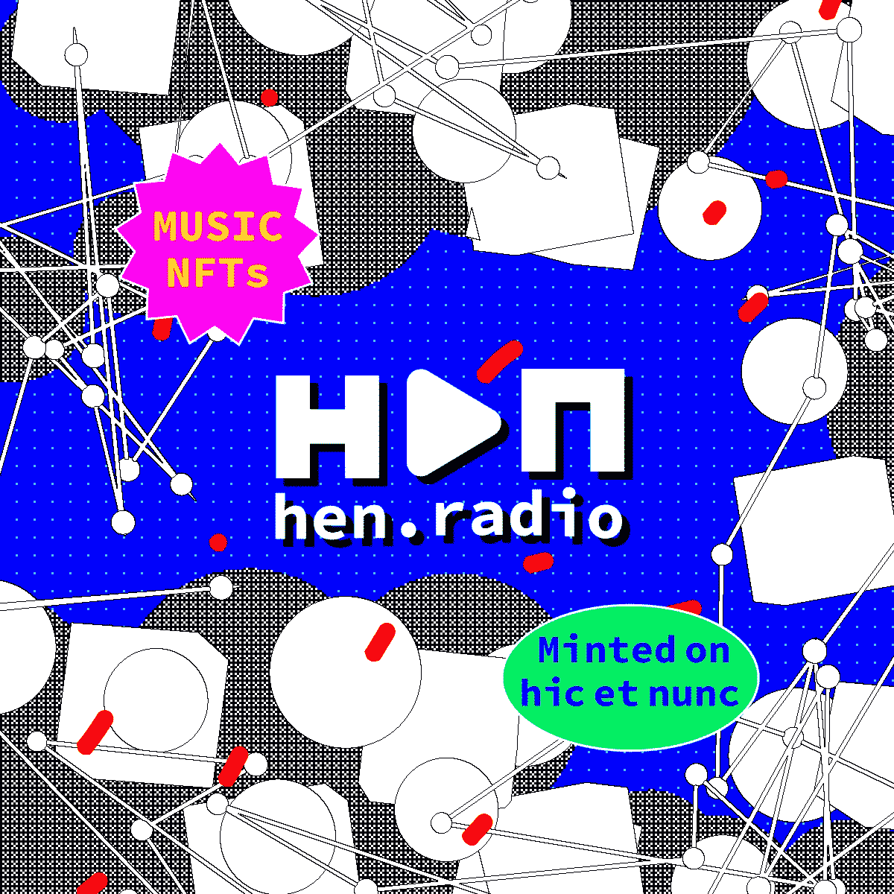
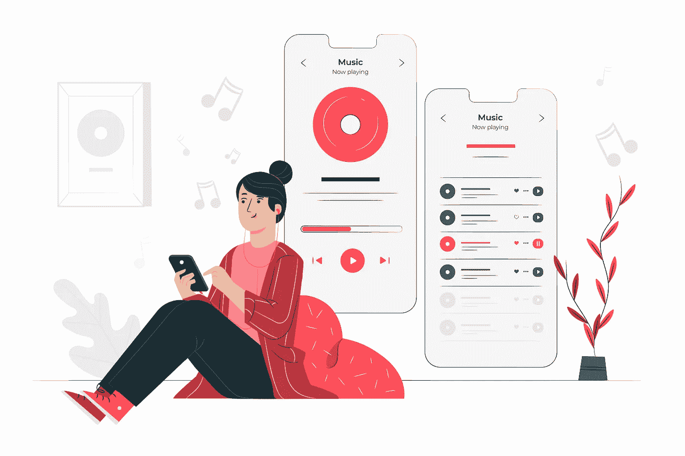
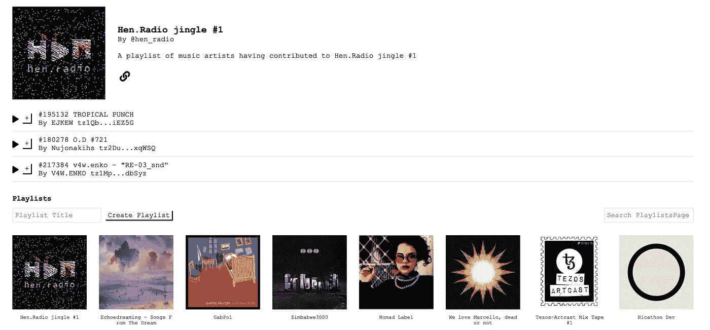
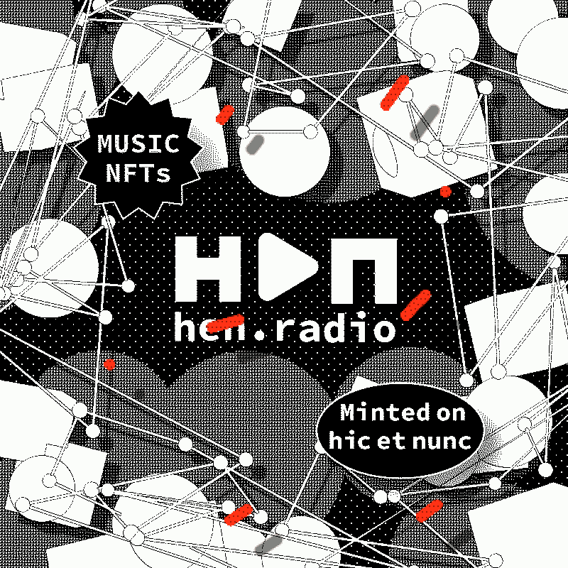

# 上升的节奏:音乐 NFTs 和母鸡收音机介绍

> 原文：<https://medium.com/geekculture/a-rising-tempo-introduction-to-music-nfts-and-hen-radio-d983539a4733?source=collection_archive---------18----------------------->

*HEN Radio ~音乐与区块链解链的地方*

Credit: [V5MT](https://twitter.com/v5mt_tv)

2021 年见证了 NFT 在不同区块链以无限热情的壮观崛起，加密艺术逐渐与主流融合，并在受人尊敬的佳士得和苏富比画廊拍卖。

然而，虽然 NFT 社区的大部分注意力都集中在艺术和基于视觉的媒体上，但可以悄悄地观察到一种日益增长的趋势，即音乐人以越来越快的速度进入 NFT 空间。

今年早些时候，随着 Grimes、3LAU 和 Kings of Leon 发行他们的音乐数字版并获得数百万美元的收入，音乐 NFTs 首次成为国际头条新闻。

虽然这一消息引发了音乐界对 NFTs 的兴趣，但在意识和采用方面仍有很大差距，有抱负的音乐家必须跨越，才能达到与创作更多传统 NFTs 的创作同行相同的高度。

引入更多以音乐为先的平台，如 Tezos 区块链上的 HEN Radio，有望改变这种动态，并极大地增强音乐人的权能，特别是那些有才华但没有重大影响力或支持的人。

# **音乐 NFTs 的好处和潜力**

音乐 NFT 向音乐家承诺了一种独立的生活方式，这种生活方式由世界各地的收藏家实现，他们欣赏自己的创作，而不必为自己的音乐的可发现性和发行与标签联系在一起。

通过区块链，NFT 音乐的创作者和他们的歌迷也获得了更直接和更密切的关系。

NFT 音乐创作者有新的和灵活的方式直接与他们的粉丝互动，通过铸造具有特殊用途的 NFTs，例如，给予特殊 NFTs 特权的持有者后台通行证或合作创建独特的音乐曲目。

随着 NFTs 转售版税的实施，以及可能来自其曲目流媒体的实施，音乐家将逐渐获得财务独立和自由，不受限制地追求创作他们喜爱的音乐。

所有这一切都是由于 NFTs 的独特之处而成为可能，在 NFTs 中，内在价值来自出处，版税通过一个智能合同自动计算并转移给创作者，无需任何中间人。

# **音乐 NFT 的潜在弊端**

然而，由于 NFTs 的新颖性和加密空间的反复无常性，创作者不得不面对一些不确定性和风险。

任何新的音乐家都必须足够精通技术，才能在这个秘密空间里游刃有余。

这包括设置钱包和与 dapps 互动，了解 NFT 的铸造和燃烧过程，以及保护自己免受越来越多的诈骗，这些诈骗可能会因一次误点击而将累积的储蓄化为乌有。

还存在税收、知识产权所有权和许可的法律和会计问题，这些问题必须由 NFT 创作者根据其国家和唱片公司(如果有的话)来理解。

此外，与基于视觉的 NFTs 相比，对音乐 NFTs 的需求要低得多。因此，在每个人都在争夺注意力的情况下，新兴音乐人可能更难在秘密领域站稳脚跟。

# **介绍母鸡收音机的声音**

基于 Hic Et Nunc 的愿景，利用“创意经济作为传统 DeFi 思维模式的替代方案”，HEN Radio 于 2021 年 5 月在 Hicathon 期间推出，并在 9 月的后 Hicathon 期间进一步开发了更强大的功能。

HEN Radio 是音乐和其他音频作品的最小独立画廊，使音乐家能够直接与粉丝和收藏家分享他们的创作，以发现 H=N smart contract 上创作的音乐。

作为 HEN 的听觉延伸，该平台还旨在使发现、聆听和奖励 NFT 音乐艺术家变得更加容易。

Credit: [HEN.Radio](https://hen.radio)

目前，HEN Radio 上有一个蓬勃发展的音乐场景，共有 937 名音乐家创作的 316 首歌曲。

作为一个具有支持社区的去中心化和开源平台，新音乐人将发现在 Hic Et Nunc 和 HEN Radio 上开始他们的 NFT 之旅很容易。

要开始，只需像往常一样在 [Hic Et Nunc](https://www.hicetnunc.xyz/mint) 上制作你的音频文件(最好是 ogg 或 mp3 ),你的新曲目将在 HEN Radio 上同步，并可在两个平台上使用。

您还可以创建您最喜欢的曲目的本地音乐播放列表，或者通过在 Twitter 上向@hen_radio 提交请求来创建带有封面图像的公共播放列表。

多才多艺的 HEN Radio 工作组将在后 Hicathon 之后继续发展，以实现一种流媒体模式，每当音乐人的曲目被播放时就奖励他们，以及一种分期付款版税智能合同，以鼓励视觉和音乐艺术家之间的合作。

Credit: [V5MT](https://twitter.com/v5mt_tv)

NFTs 的迅速崛起以一种他们从未想象过的方式改变了许多视觉艺术家的生活，并有可能彻底改变音乐产业。

虽然这项技术仍处于萌芽阶段，但 NFT 音乐领域的创意人员有无数的机会来尝试和创造以可持续的方式与观众联系的新方式。

*PS:如果你愿意为 HEN Radio 的发展做出贡献，欢迎你加入# hica thon-WG-7–2-Hic-Radio*频道的 Hic Et Nunc Discord

P.P .大力支持开发 HEN 的 Hicathon 工作组。radio[*@ lauzaki*](https://twitter.com/lauzaki)*，*[*@ andreasrau _ eu*](https://twitter.com/andreasrau_eu)*，*[*@ uv DSC*](https://twitter.com/uvdsc)*，*[*@ _ _ orderandchaos*](https://twitter.com/__orderandchaos)*，*[*@ webidente*](https://twitter.com/webidente)*，*