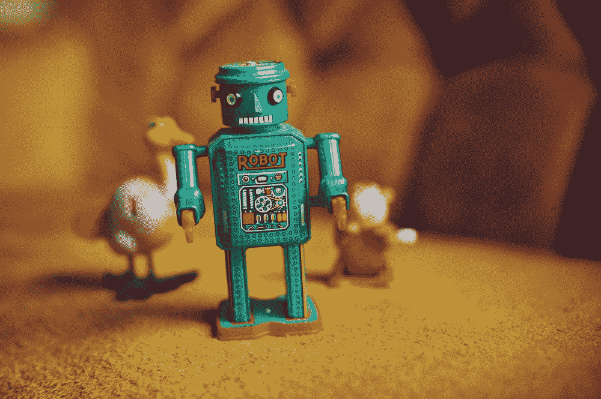

# 聊天机器人 UI UX 设计新手指南

> 原文：<https://medium.com/geekculture/a-rookies-guide-to-chatbot-ui-ux-design-9eb71d95deb1?source=collection_archive---------15----------------------->

仅诚实回答。

如果你无意中发现一个过分热情的聊天机器人在帮你解决生活中的问题，请举手。

这很自然。出于纯粹的好奇(如果它看起来还不错)，我们立即在文本框中输入我们的查询。

我们也是讲道理的。我们不要求荒谬的事情。相反，我们会问，我们认为聊天机器人有能力做什么。

最有可能发生三种情况之一:

通常情况下，聊天机器人几乎不存在。七个小时后它会回来——那时你可能已经失去兴趣了。

它将要求 1800 万个细节，包括你住在哪里，你母亲的二年级老师的名字，以及你最喜欢的美国偶像。

它不会完成您分配给它的任务。因此，你在兜圈子。

整个过程结束时，会发生三件事:

聊天机器人会用三个不同的名字称呼你。

你可能已经通过谷歌搜索找到了你想要的答案或解决方案。

你只是在浪费时间。

尽管看起来一切都是注定的——事实恰恰相反。看来我们需要聊天机器人。

**我们为什么需要聊天机器人？**

*38%的用户* *愿意等待与人类交谈，而 68%的用户不介意与聊天机器人交谈。*

*2021 年，88%的客户至少与聊天机器人有过一次互动。*

然而，只有不到 19%的企业使用聊天机器人。

*尽管我们抱怨聊天机器人，但 69%的客户报告了积极的体验。*

这表明聊天机器人有利于提高销售线索的生成，推动转化，并通过提供有价值的信息说服用户进行交易。

聊天机器人全天候可用(如果你愿意的话)，并且可以同时处理多个客户。他们还监控和分析消费者数据，以帮助扩大客户群。

聊天机器人的类型

在设计聊天机器人之前，我们需要了解我们想要哪种类型。聊天机器人主要有两种类型:

a) **基于人工智能的聊天机器人**在人工智能、机器学习和自然语言处理方面发挥作用。

b) **基于规则的聊天机器人**，也称为点击机器人，设计并构建了预定义的对话路径。

那么，如何开始设计聊天机器人呢？

设计聊天机器人背后的用户界面/UX

很简单，真的。但事实并非如此。尽可能的人性化。你永远不知道一个真正的人会问什么，对吗？

**首先定义聊天机器人**

聊天机器人的目的是什么？

它有个性吗？

你应该给它一个吗？

最重要的是，给它一个记忆。聊天机器人获取的数据越多，对话就越容易进行。

**让移情成为所有对话的基础**

在用户可以与聊天机器人开始对话之前，提醒他们他们不是在与人类对话。当你这样做的时候，用户在搜索的时候会更加宽容和慎重的选择词汇。

"下周布拉格的天气会怎么样？"会喜欢，“2022 年 7 月 27 日布拉格温度”。

这使得聊天机器人更容易记录、查找和传递信息。

**全渠道体验**

无论是在电脑上，电话上，还是语音命令上，拥有一个兼容的聊天机器人将会立即提升用户体验。

**加分点**:让聊天机器人容忍错别字和歧义。如果谷歌和 YouTube 能理解你想输入“吉娃娃”而不是“吉娃娃”，那么你的聊天机器人肯定也能理解。

**一种配色方案**

聊天机器人看起来像什么一样重要，它如何运作才能成功。创建聊天机器人时，不要过多偏离图形界面的原始颜色。这可能会不和谐，用户会很快将机器人从界面中分离出来。

视觉层次是 UI/UX 设计中的一切，它延伸到聊天机器人。例如，“欢迎”和“保存详细信息”可能是最先弹出的两个元素。用不同的颜色，增加字体大小来强调它的重要性。

让用户更容易做出选择。这样做的时候，请记住圆角明显比方形更悦目。

2022 年无衬线字体继续称雄。请注意，聊天框并不是最适合尝试字体风险的地方。

**让动画说话**

让聊天机器人变得更有个性或“更像人类”的一个快速方法是加入表情符号、gif 甚至视频。把互动想象成你与朋友、同事和家人的互动。对于一个千禧一代来说，只输入 ROFL 是不够的。

我们必须补充我们的 ROFLs 和 LMFAOs😂 😂 😂 😂 😂 😂。

但是，不要让 Z 世代听到你。

他们开始使用“ded ”,然后是☠️️ ☠️️ ☠️️ ☠️.️

不要害怕尝试和思考不同的年龄组和地理位置。交互越个人化，用户界面连接越好。

如果你想多走一步…

**精心设计按钮**

尺寸的确很重要。

在用户的旅程中，你把按钮放在哪里以及如何操作也扮演着重要的角色。想起来了；一个设计良好的按钮可能是聊天机器人成功的最重要因素之一。

不知道从哪里开始？让[胡椒广场](https://www.peppersquare.com/blog/the-inside-scoop-to-designing-better-buttons/)的好心人帮你[设计重要的按钮](https://www.peppersquare.com/blog/the-inside-scoop-to-designing-better-buttons/)。他们不仅已经在设计领域和 UI/UX 行业工作了 20 年，而且他们对细节有着惊人的洞察力。当你讨论设计聊天机器人的细微差别时，他们会很乐意为你端上一杯热气腾腾的全有机茶。现在是享用那杯茶的最佳时机。