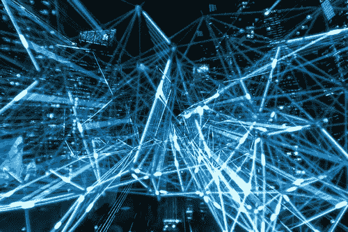
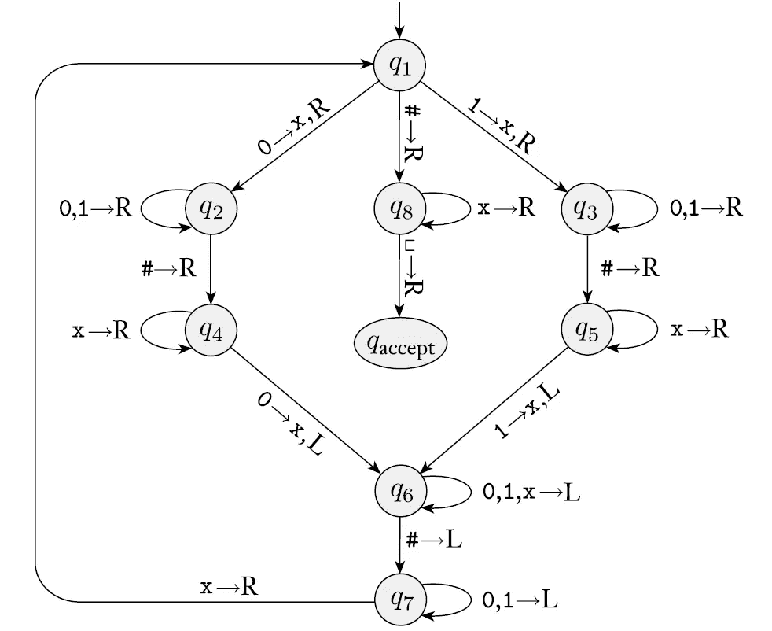
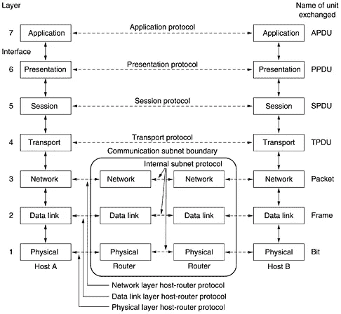

# 外行人人工智能简明指南

> 原文：<https://medium.com/geekculture/a-short-guide-to-ai-for-laymen-867e6a12d37e?source=collection_archive---------20----------------------->

## 大肆宣传的是什么？

人工智能的出现是渐进的，尽管对大多数人来说，它似乎是不连续的飞跃。上世纪 90 年代，一名人类国际象棋冠军输给了 IBM 的国际象棋程序 Watson，接下来你可能会知道 AlphaGo 和 Lee Sedol 之间的另一场比赛成为头条新闻。现代人工智能系统表现出的日益惊人的复杂性应该引起我们的关注，因为每个人，不管愿意与否，都会受到这一不可逆转的趋势的影响。

# 结构

这篇文章旨在让人们了解人工智能的总体情况。它需要很少的领域特定知识来理解。

内容结构如下。首先，将给出人工智能系统的简要概述。然后我将深入研究智能本身的概念。最后，我们来看看人工智能的前景，以及这些系统中仍然缺乏什么。我试图让这些部分相互独立，所以可以随意浏览或跳过不感兴趣的部分。

# 概观

加州大学伯克利分校的计算机科学教授 Stuart Russell 在他的书《人类兼容》中，将人工智能定义为

> 机器被****到了这样的程度，它们的 行动就可以预期达到**我们的** 目标。****

# ****智能——人工智能的本质****

## ****自然智能****

********

****为了简单起见，我们将智能实体定义为:在给定感知的情况下，它所做的事情可能实现它想要的东西。据我们所知，最古老的智能形式来自古老的进化。一种大肠杆菌在我们的下部肠道中随机游荡，并遵循其基因为其设计的严格的寻找葡萄糖的规则。简单而琐碎的生物，但它承载着现代智能的基础。它这样做是为了从环境中获得最大的回报，这样基因就有更高的机会存活和繁殖。****

****这种硬编码的行为是不灵活的。大自然不可能预测环境的每一个细节，所以在表型形成后的学习能力对生存来说是一个巨大的福音。****

****为了进一步定义智力，让我们考虑一个最简单的例子。对于一个同样聪明的理性个体来说，它的目标是最大化效用值。(当然，人类在保持理性方面的不一致性是出了名的，但那是另一回事了。就目前而言，我们可以忽略偶尔的非理性。)这样的主体旨在在给定的环境中做任何有利于其自身存在的事情，简明地表示为效用值。这很好，但现实世界不会只有一个代理。因此，扩展这个模型是很自然的。当两个特工牵扯进来时，事情就变得棘手了。我们不能用概率来计算出最佳策略，因为另一方将如何行动是不透明的。(这是一门通常被称为博弈论的学科，你可能听说过的最著名的例子之一是*囚徒困境*。)事实证明， [*纳什均衡*](https://en.wikipedia.org/wiki/Nash_equilibrium) 确实给出了一个解，只要双方代理人都是理性的。生物学到目前为止。****

## ****普通电脑****

****最初，人造机器笨重而缓慢。很少有人认为它聪明。著名的英国数学家艾伦·图灵定义了通用图灵机，它构成了所有现代计算机的基础。计算机科学的一个核心概念是*算法*。软件可以运行大量的算法作为子程序，建立复杂的层次。另一方面，硬件已经被观察到遵守摩尔定律，该定律预测稳定和指数级更好的性能。****

********

****Diagram of a Turing Machine* that recognizes the language {w#w| w ∈ {0,1}*}****

****然而，这肯定是有限度的，因为在一台更快的机器上运行一个错误的算法只会让你更快地得到错误的答案。因此，从智能的角度来看，一台神一般的机器和一台虚弱的机器一样毫无用处。此外，并不是所有的问题首先都是可计算的。这意味着，对于某些问题，普通计算机可能无法给出答案——它永远不会停下来返回答案。因此，以图灵机(所有现代计算机的基本原型)可以给出是/否断言的方式构造的问题被称为可判定语言。在可判定语言的领域内，就输入的大小而言，到目前为止发现的一些问题的最快算法需要指数级的时间来解决。我们都知道，随着输入规模变大，指数函数会出现爆炸性增长。****

****这些可怕的障碍似乎阻碍了我们构建人工智能的道路。幸运的是，它们并不致命。我们知道人类也无法快速解决指数级复杂问题。拥有更多计算能力的人工智能可以在合理的时间内提供体面的次优解决方案，这已经是值得庆祝的事情了。****

## ****人工智能****

****在 2000 年前两次尝试建立人工智能系统失败后，现代人工智能现在进入概率论、效用理论、统计学、控制理论等领域。这一次似乎出乎意料地顺利。****

****人工智能的智能由一个智能代理来表示。智能代理是能够智能感知和行动的东西。它可以用来解决一场国际象棋比赛，或者分析一段文字的情感，这两者需要完全不同的目标、规则和设计。这类问题数不胜数，每一个都需要一组独特的参数和调整才能工作。然而，人工智能研究的最终目标是细节不重要。我们只需告诉代理去做某件事，它就会学会所有相关的知识和技能，必要时寻求帮助，并着手执行目标。****

****当问题比较小的时候，可以有效的搜索到确定的答案。完成后，一个成功的代理将输出一个*函数*，它将告诉我们在每个可能的状态下该做什么。比如在一个图中寻找从 A 到 B 的最短路径的问题，一个算法可以打印出完整的最短路径，我们可以按照这个指令来执行。然而，很大一部分问题太大，无法全部解决。到目前为止，另一种算法在这些问题上表现得相当好。它被称为*强化学习*，其中代理试图最大化从环境中给定的一些奖励函数，并在迭代状态时学习。****

********

****Reinforcement Learning*****

# ****未来——对人工智能的期望****

****正如在开头提到的，人工智能的发展与其他研究领域相似:它是螺旋式的和连续的，尽管有时会走进死胡同。一个重大的飞跃是可能几十年的研究和学习的收获。尽管有了很大的进步，目前的人工智能离理想的超级智能还有很大的距离。****

## ****超级智能何时到来？****

****这是一个令人担忧的问题，但最好不要回答。Stuart*给出了 3 个理由:****

1.  ****历史上错误的预测。至少两次来自受人尊敬的研究人员。谨慎的做法是完全不给出这些断言。****
2.  ****没有明确的门槛。这些系统既不聪明也不愚蠢。在一些特定领域，机器已经超过了人类的表现，而另一些领域仅仅因为一个新生婴儿而感到羞愧。****
3.  ****本质上不可预测。总的来说，人工智能或科学的发展有很多不确定性。就在卢瑟福发表文章声称不可能利用核能的几个小时后，西拉德反驳并提出了他的核链式反应的发明。这同样适用于人工智能研究。****

## ****还需要做什么？****

****我们仍然不清楚超级智能的本质。然而，要达到超智能，必须取得一些重大突破。这可能不是一个详尽的列表，但克服这些挑战是必要的。****

*   *****语言和常识*****

****作为人类的标志，语言已经被深入研究，但仍然困扰着机器。当今的自然语言处理(NLP)技术:****

> ****能从清楚陈述的事实中提取简单的信息，但不能从文本中构建复杂的知识结构；他们也不能回答需要从多个来源的信息进行大量推理的问题。****

****作为与人类交流的基本手段，NLP 对于构建服务于我们的超级智能至关重要。****

*   *****自举、递归和反思*****

********

****Google “recursion” and see what will happen****

****这是计算机科学中最强大的范例之一。基本思想是，我们可以构造一个引用自身的数据，或者一个在执行过程中调用自身的函数。这种递归关系不是微不足道的，值得敬畏，因为我们现在正在构建的实体有能力建立在它现有的自我之上。出于同样的原因，我们希望我们的人工智能系统能够收集一些知识，处理这些知识，并使用它们来构建和理解更高层次的概念。这很像在没有比 C 语言更具表达能力的语言的情况下编写 C 编程语言编译器:人们会编写一些汇编代码来简化一些任务或例程，并迭代地使用它们来进一步开发和扩展这个编译器，直到构造出一个成熟的编译器。这是典型的自举过程。****

*   *****概念和理论的累积学习*****

****牛顿的名言“如果我比别人看得更远，那是因为我站在巨人的肩膀上”就是一个范例。知识，无论多么微小或宏大，都可以传给下一代。不幸的是，人工智能系统仍然无法积累知识。就像自举一样，智能机器必须在各个领域积累一代又一代的新概念，就像孩子们在学校可能会学到的那样。****

*   *****发现动作*****

********

****The OSI model for modern computer networks. *****

****只需去谷歌搜索任何关键词。数十亿网页的结果将被返回。就在几十年前，这还是不可想象的。考虑计算机网络层次结构(见上图)。每次你在浏览器中输入 google.com，大量的协议和操作，可能涉及几十台机器，只是为了把网站提供给你。作为用户，我们需要知道的只是如何键入这些按键，机器将运行数十年来开发的众多网络算法。对人类来说，这是一个方便的抽象概念。我们希望人工智能能够自己学习这种抽象，这样它就可以像人类一样建立抽象层。如何做到这一点仍然是个谜。****

## ****人工智能有局限性吗？****

****事实上，想象一个超级智能能够在一天之内读完所有的书，你会感到脊背发凉。然而，可以肯定地说，这样的人工智能系统无法预测真实世界的完美图景。令人欣慰的是，它还受到世界运行速度的限制。也就是说，它无法知道一种新药是否有效，除非已经进行了一些实验或模拟，后一种选择甚至比真正的实验本身在计算上更加昂贵。最后，超智能不是人类，这在预测和理解人类固有的行为/感觉时带来了一些困难。例如，用指甲刮黑板引起的感觉对我们来说会立即不舒服，但这必须在复杂的模拟中运行，以便人工智能理解。****

## ****人工智能对我们有什么好处？****

****在云计算中，我们区分 PaaS(平台即服务)和 IaaS(基础设施即服务)。如果超级智能存在，我们将获得它为我们提供的巨大优势，这可以方便地缩写为 EaaS(万物即服务)。所有人都受益于艾将军的浩瀚。教育是个性化的，以适应一个人的特点，健康状况可以计算出超过精度，平均生活水平将提高一个档次。****

# ****结论****

****虽然你可能还在让你的想象力发狂，但这是本文的结尾。我们已经看到了自然智能如何启发了人工智能，现代人工智能是什么，以及这些系统中缺少哪些关键部分。我希望你学到了计算机科学和人工智能背后的一些关键思想。人工智能正在迅速渗透到我们生活的每个角落，这一事实促使我们对人工智能有一个基本的了解。对于本质上的细节，你可以参考我下面列出的参考资料，深入到任何你感兴趣的领域。****

# ****参考文献和引文****

****Tanenbaum，a .，& Wetherall，D. (2010 年)*计算机网络(第五版)*(第五版。).皮尔森。
罗素，S. (2019)。*人类兼容:人工智能和控制问题*。艾伦·莱恩。西普瑟，M. (2012 年)。*计算理论简介*(第三版。).Cengage 学习。
MIT。(2021).*深度学习介绍*。[http://introtodeeplearning.com/](http://introtodeeplearning.com/)****