# 简单的自动报告:新冠肺炎仪表板

> 原文：<https://medium.com/geekculture/a-simple-automated-reporting-covid-19-dashboard-8a610b90b2f?source=collection_archive---------6----------------------->

自动化现在已经成为一种必然，包括在数据领域。数据字段中的自动化可用于自动获取数据、处理数据和更新仪表板。这样我们就不需要在每次数据/仪表板需要更新的时候都运行源代码或语法。这一次，我将向您展示如何为新冠肺炎仪表板进行简单的自动化报告。

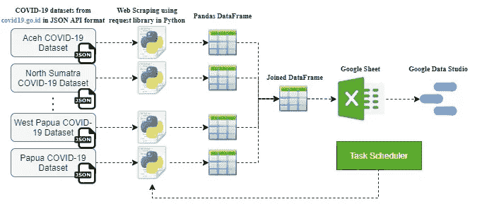

Fig. 1 — Reporting Automation Workflow

在下文中，我将提到构建使用任务调度器自动更新的仪表板的步骤。要使用的新冠肺炎数据直接取自 API(应用程序编程接口)，可从 [covid19.go.id](https://data.covid19.go.id/public/api/) 获得。从 API 检索数据的一种方法是使用 python 中的请求库。此方法是从特定服务器检索数据的最常用方法。

# **1。从 covid19.go.id** 中检索数据

在第一步中，我们需要使用以下命令导入所需的库:

```
import request
```

如果您没有安装这个库，那么您必须首先使用以下命令安装它:

```
$ pip install requests
```

我们可以通过使用 **request.get('url')** 从特定的资源中检索数据。

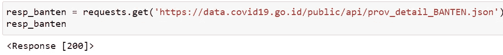

Fig. 2 — Retrieve COVID-19 data

如图 2 所示。，我检索万丹省的新冠肺炎数据， **resp_banten** 是响应对象。运行代码后，您可以在上面看到状态代码为“200 ”,表示数据请求成功，请求的内容可供提取。与 GET 请求相关的几个状态代码:

*   一切顺利，结果已经返回(如果有的话)。
*   `301`:服务器正在将您重定向到不同的端点。当公司切换域名或端点名称更改时，可能会发生这种情况。
*   `400`:服务器认为你提出了一个错误的请求。当你没有发送正确的数据时，就会发生这种情况。
*   `401`:服务器认为你没有通过认证。许多 API 需要登录凭证，所以当您没有发送正确的凭证来访问 API 时，就会发生这种情况。
*   `403`:你试图访问的资源被禁止:你没有权限查看。
*   `404`:在服务器上找不到您试图访问的资源。
*   `503`:服务器没有准备好处理请求。

关于状态码的更多信息，你可以在这里阅读[HTTP 状态码列表——维基百科](https://en.wikipedia.org/wiki/List_of_HTTP_status_codes)。在我们知道请求成功后，我们可以使用**头属性**知道我们请求的文件类型。对于这个案例研究，请求的内容在 JSON 文件中。如图 3 所示，我使用了**。json()** 方法，看看我们将从 API 接收到什么。

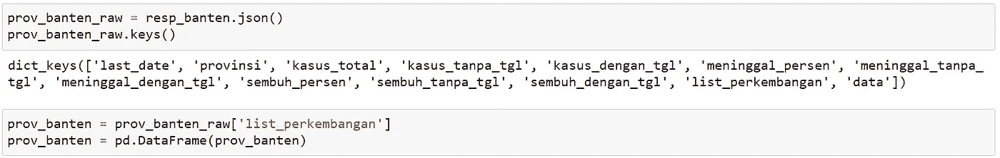

Fig. 3 — Convert JSON to a Pandas DataFrame

# **2。将 JSON 转换成熊猫数据帧**

我们从 API 得到的 JSON 文件是“key-value ”,类似于 Python 中的字典。因为它与 Python 中的 Dictionary 足够相似，所以我们可以直接将其转换为 Pandas 数据帧。

# **3。将所有数据合并成一个数据帧**

在得到印尼所有省份的新冠肺炎数据后，我们需要使用**将这些数据组合起来。merge()** 或**。concat()** 方法。结果如下所示:

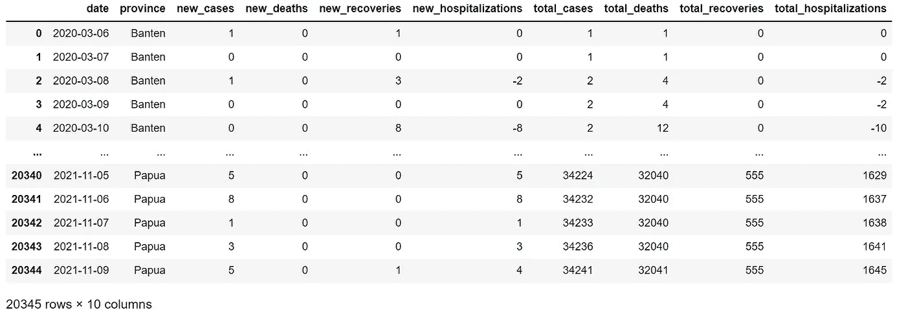

Fig. 4 — A Combined DataFrame that contains COVID-19 data of all provinces in Indonesia

# **4。将数据上传至谷歌工作表**

接下来，我们需要将新冠肺炎的数据上传到 Google 工作表中。这是必要的，以便仪表板可以持续获得数据更新。将数据上传到 google sheets 的过程不像导出数据那样是手动的。csv 或。xls 格式，然后我们每次有新数据的时候就导入到 google sheet 中。我们没有手动完成，但是为了节省时间，我们将使用 python 自动完成。所以我们会在每次有新数据的时候用 python 把数据上传到 Google Sheet，那么 Google Sheet 里的数据就会自动更新。在我们继续我们的步骤之前，我们必须确定我们是否已经有一个谷歌帐户。

**4.1 创建谷歌服务账户**

*   首先，我们应该在[谷歌云平台](https://console.cloud.google.com/apis/dashboard?pli=1)创建一个开发者账户。单击“创建新项目”或选择我们现有的一个项目。


*   您将被重定向到项目仪表板，在那里单击“启用 API 和服务”。

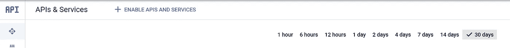

*   在 API 库中，我们搜索“Sheets API”和“Google Drive API”，然后为这两个库单击“Enable”。


*   当我们启用这两个库时，在 Google Drive API 中点击“管理”,然后我们会看到一个如下的屏幕。单击“创建凭据”创建服务帐户。

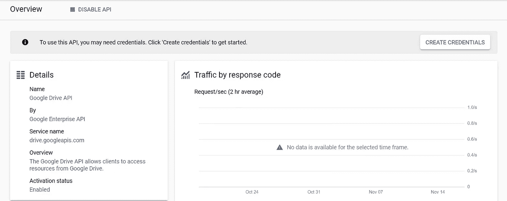

*   选择一个 API→“Google Drive API”。其余的我们随意填充。

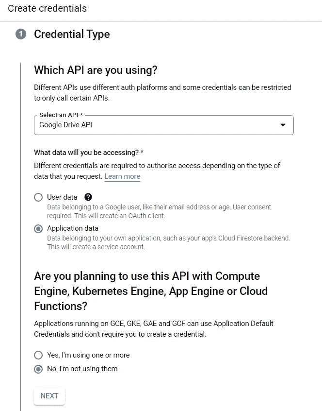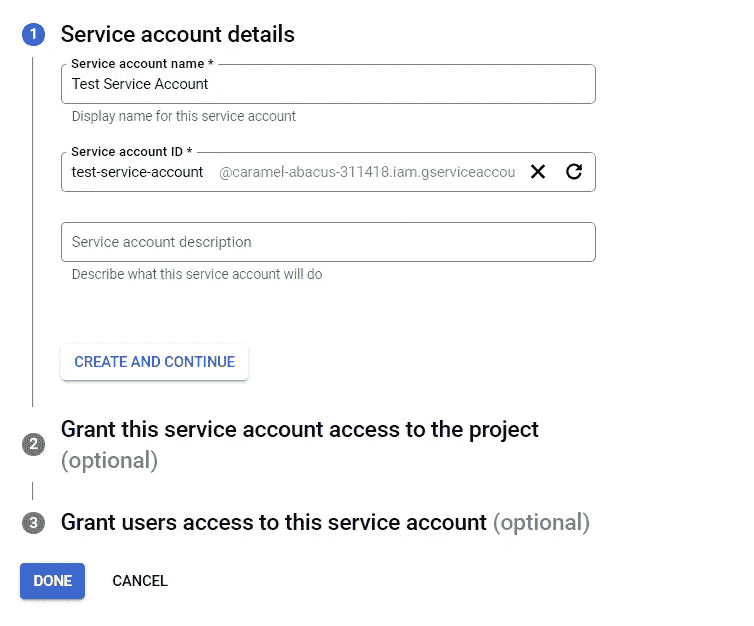

*   在服务帐户中，单击“管理密钥”。这里我们选择 JSON 作为键类型。

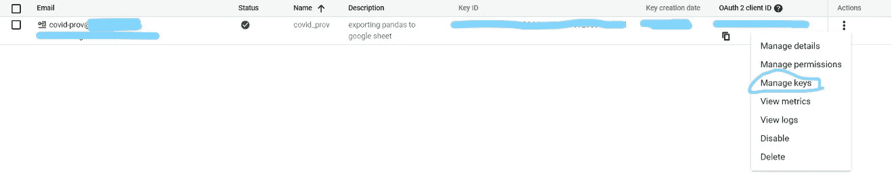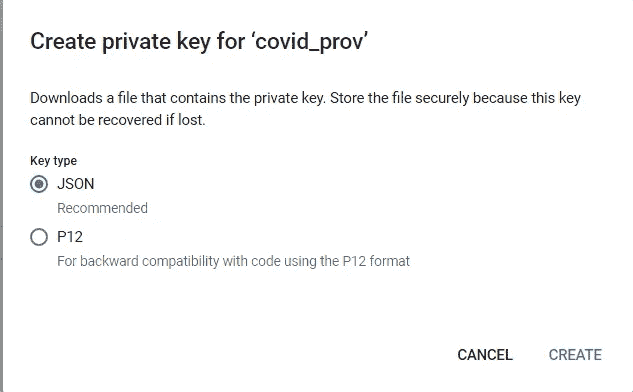

**4.2 安装**

我们将使用 [**gspread**](http://gspread - gspread 4.0.0 documentation) 和 **oauth2client** 服务来授权和启用 API 访问 Google 云平台。我们可以使用以下命令安装库:

```
$ pip install gspread
$ pip install --upgrade google-api-python-client oauth2client 
##(depreceated)
```

但是现在 outh2client 被[弃用](https://google-auth.readthedocs.io/en/master/)，所以我们改为安装 [google-auth](https://google-auth.readthedocs.io/en/master/) 。

```
$ pip install --upgrade google-auth
```


**4.3 授权**

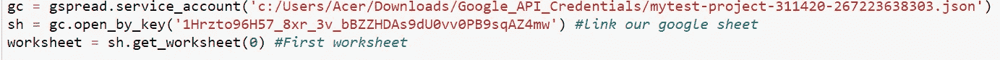

**4.4 将数据导出或更新至 Google 工作表**

```
worksheet = sh.get_worksheet(0) #First worksheet#### Append data to sheet ###
cov_prov_id = prov_id
set_with_dataframe(worksheet, cov_prov_id)
```

注意:当我们想要更新数据时，我们有两种方法:
1。清除谷歌工作表中的所有数据，然后我们导出最新更新的数据。(这个项目我用的就是这种方式)。

2.我们将新更新的数据插入最后一行+ i。

# **5。从谷歌工作表数据构建仪表板**

我做的简单仪表板可以在这里看到[https://fahmiam2.github.io/Covid19-Report-Indonesia/](https://fahmiam2.github.io/Covid19-Report-Indonesia/)。

每次我们想要更新仪表板时，只需点击`CTRL + E`。

# 6。使用任务调度器自动更新数据

在最后一步中，我们将使用任务调度器自动更新数据。任务调度器根据我们指定的时间运行我们的 python 脚本，例如，每 1 小时、每 5 小时或每 24 小时。使用任务计划程序的好处是它免费且易于使用。缺点是电脑操作系统必须开启并连接互联网。

*   首先，从 jupyter notebook(.ipynb)变成。py 文件格式。有两种方式: **(I)** 使用 jupyter 笔记本上的下载功能或者 **(II)** 使用 CMD 或 Anaconda 提示符下的命令行。

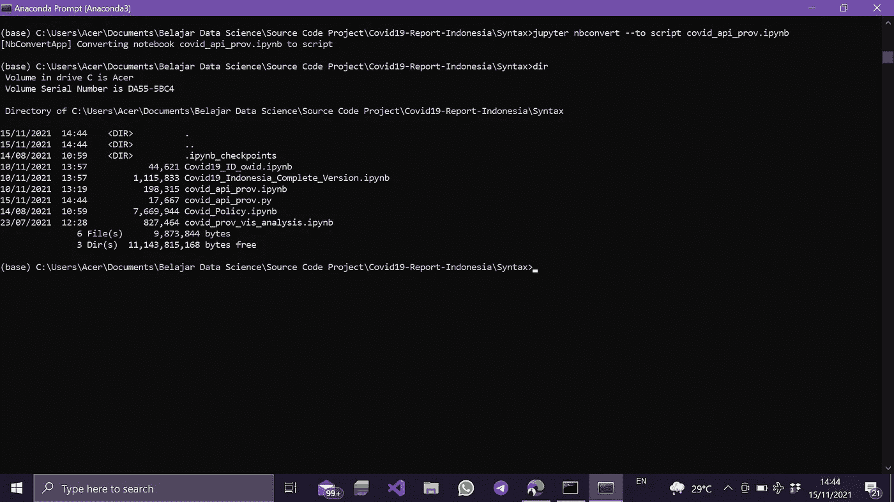

*   点击 Windows 搜索，搜索“任务调度器”。
*   点击“操作”→“创建基本任务”
*   将我们的 python.exe 位置放在“程序/脚本”，将我们的脚本位置放在“开始于(可选)”。你可以把你的 python 的文件(。py)在“添加参数(可选)”处。

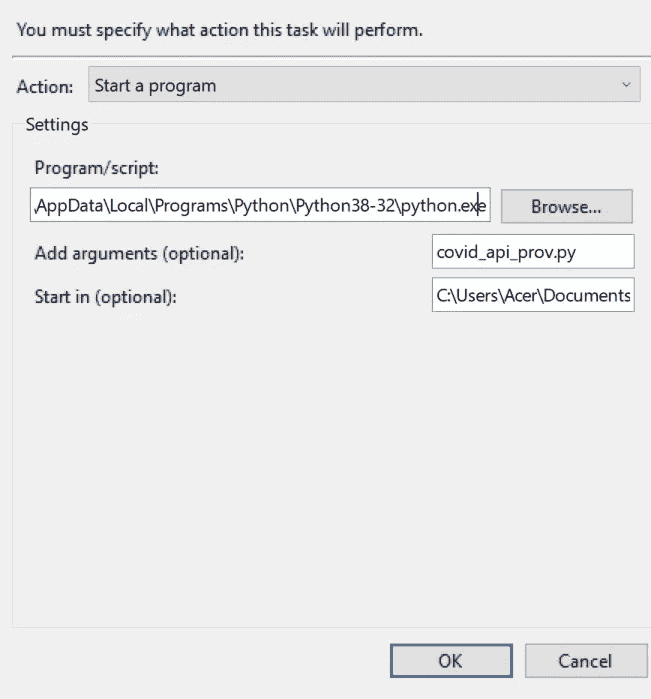

*   接下来，我们导航到“触发器部分”。这里，我们创建了一个新的触发器，以我们想要的时间表运行我们的程序。
*   结束

好了，伙计们，我们已经完成了创建简单自动报告的步骤。希望这对你有用。如果你有任何建议，请随时与我分享。感谢你阅读这篇文章，祝你有美好的一天！