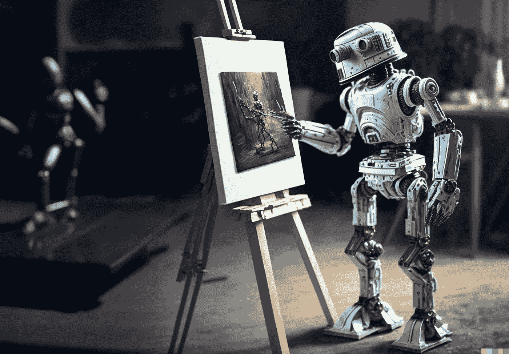

# 简单解释人工智能如何创作艺术品

> 原文：<https://medium.com/geekculture/a-simple-explanation-of-how-ai-creates-artwork-433272babcdb?source=collection_archive---------3----------------------->

‘Robot artist’ by author, made on Midjourney, outpainted on DALL-E 2

对于我的非技术家人和朋友，这是我将如何解释人工智能如何产生艺术。

## 什么是 AI 生成艺术？

*AI 生成艺术*的基本前提是，你键入一个文本提示，结果是一个唯一的图像。如果您再次运行相同的提示，您将总是得到不同的图像。