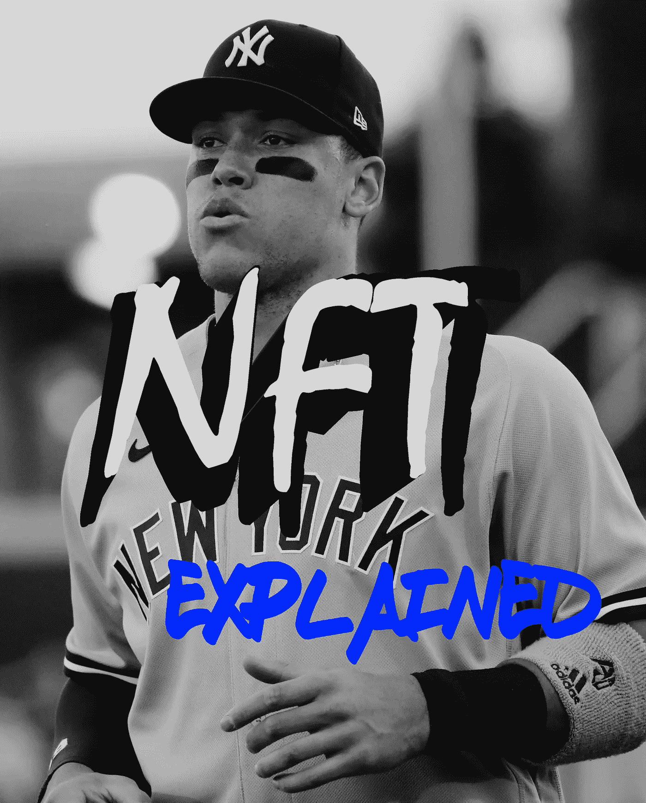
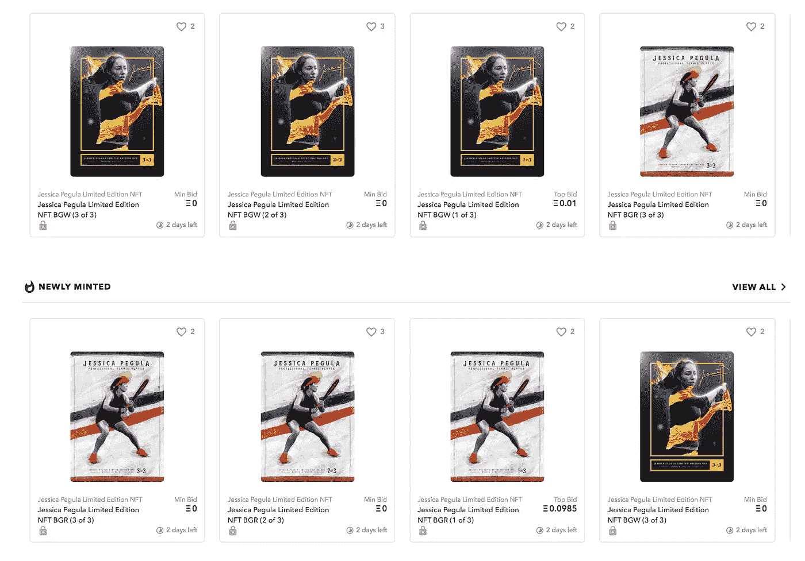
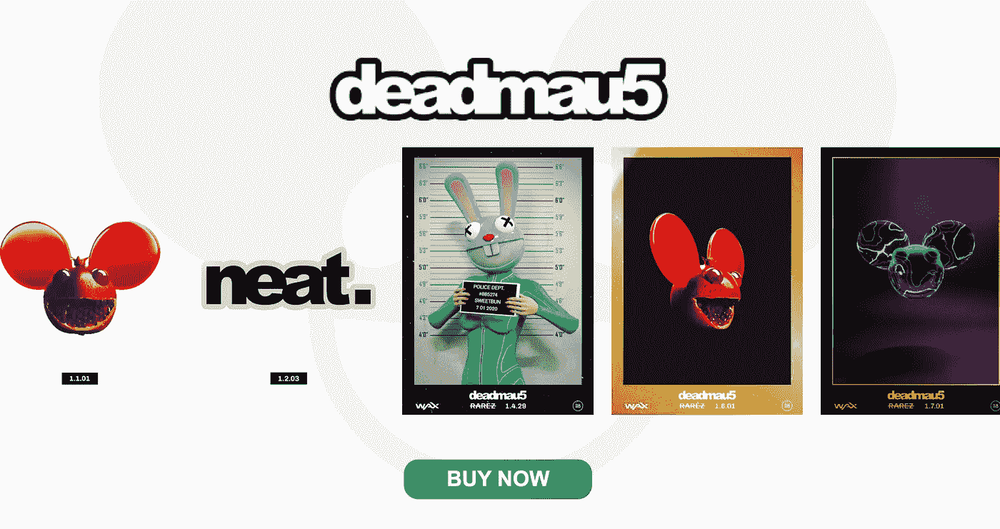

# NFT 的简单解释。这是什么？

> 原文：<https://medium.com/geekculture/a-simple-explanation-of-nft-what-is-it-7238602e3ef2?source=collection_archive---------12----------------------->

似乎每周都有一种新的技术形式需要我们去解码并弄清楚如何使用。我们大多数人没有时间或精力去搜索网页来解释科技世界的新变化。而且，让我们现实一点，我们中的大多数人没有从麻省理工学院毕业，也没有学习机器人或金融，所以外面的很多东西很难跟上。对你来说幸运的是，我已经做了肮脏的工作，用简单的术语列出了你需要知道的所有信息。席卷互联网的最新轰动被称为 NFT，我知道它，所以你不必。让我们从基础开始。

# **什么是 NFT？**

NFT 代表“不可替代的令牌”。好吧，但这并没有让事情变得更清楚。你需要知道的第一件事是，它几乎总是数字的，尽管有时可以描述一个物理的、有形的项目。“不可替代”的部分意味着它是独一无二的，独一无二的，这给某物赋予了价值，并使其值得拥有。考虑到美元。这是*可替换的*,因为有成吨的其他完全一样的东西在价值上是相等的。一张一美元的钞票和下一张一美元的钞票是一样的，它们可以互换。

如前所述，NFT(最常见的)是数字文件。此外，它们通常与艺术和创意领域有关，从视觉到听觉。例如，NFT 可以是平面设计师创作的一件作品的数字文件。它可以是一个音频文件，一个网站域名，一部动画，一张音乐会的电子门票，或者其他大量的商品。这些都有什么共同点呢？因为它们属于 NFT 类别，所以它们在数字上是独一无二的，而不是原件的复制副本。

# 我 **听说跟加密货币有关——那是什么意思？**

是的，NFT 和加密货币是相通的。加密货币，总结一下，就是在线完成的电子支付。要拥有加密货币，您需要用真钱(即美元)购买。虽然加密货币通过消除物理元素简化了货币交换，但更大的吸引力在于其背后的高级安全性。这种新形式的电子货币(例子包括比特币、莱特币和以太币)是使用“*区块链*技术创建和跟踪的。区块链公开展示了使用加密货币的电子交易记录。例如，购买平面设计师的艺术品可以从卖家到买家进行验证，并由无数个计算机系统而不是一家银行或信用卡公司进行认证；它分散了交易。

继续增加安全性的好处当购买 NFT 时，区块链(记住，这些是使用加密货币执行购买的系统)不要求购买者输入个人信息。因为交易是一对一的，没有银行作为中间人，它们可以在全球范围内完成，更安全，更容易追踪和审查。此外，区块链跟踪独特的交易从开始到结束，所以有人可以看到购买去了哪里，避免任何盗窃或其他财务虐待的问题。

# 我为什么想要一个 NFT？

简而言之，购买 NFT 就像收藏艺术品一样。所以，想一想任何人都想成为一名艺术收藏家的优势和原因——个人兴趣、支持当地艺术家、为拥有一件独一无二的作品而自豪，等等。将此转化为现实世界的范例，就像拥有一张特殊的交易卡。物理世界有独一无二的棒球卡，数字空间也有独一无二的棒球卡。NFT 版棒球卡的额外好处是，你可以证明你拥有它(通过区块链验证)，安全地购买它，并且像实体卡一样，它可以增值，有一天可能出售获利。最后，拥有真正的 NFT，而不是 NFT 的截图，会给你它所拥有的一切价值；截图一文不值。

# **我为什么要以 NFT 的身份出售我的作品？**

让我们也把它放在那里，支持艺术家是**好**。如果有一天你决定出售 NFT 棒球卡，原创作者可以从交易中获得版税。我们喜欢看到它。创意人员在数字时代面临的一个大问题是，人们拿走并复制他们的作品，并冒充为自己的作品。如果你在 Twitter 上看到同一条病毒式的推文，一字不差地出现在多个个人资料中，你会不知道它最初是从哪里来的。然而，Twitter 首席执行官杰克·多西证明了你可以用任何东西创造一个 NFT；从而表明一条推文的原始创建者。他以 NFT 的身份出售了第一条推文(一个购买者，一个所有者，一次交易)，每个人都可以看到这条推文来自他的账户。更不用说，这表明 NFT 有很大的价值，因为 tweet 的价格高达 290 万美元。是的，数字资产，卖了几百万。

作为 NFT 的创造者，你掌控着一切。如果你在没有 NFT 支持的情况下出售你的画，你的买家可以复制它很多次，并操纵系统转售它并从你的作品中获利。然而，如果艺术家将他们的画作作为 NFT 作品出售，他们可以 A)证明他们是最初的创作者，B)显示从起点到最终目的地的交易路径，C)在全球范围内出售，D)从未来销售的版税中获利，最后 E)控制他们想要购买多少版本的作品。回到 C 点，卖遍全球，这对创意人员来说是巨大的福利。不需要等待工作的委托，艺术家可以创造出真正酷的东西，并随时随地在全球出售。以前，你会用它做什么？或许在你的网站上发布一个版本？发布在 Instagram 上？把它加入到你的投资组合中，然后希望将来有人会雇用你？现在艺术家可以把他们的作品放在一个更大的市场上，让更多的人购买，并在整个生命周期中获得销售的好处。从本质上说，它提供了一种新的和行之有效的货币化方法。

# **爽。给我看看 NFT 是什么样子的。**

我碰巧认识一位才华横溢的艺术家，他亲自向我展示了 NFT 工艺是如何运作的。我的朋友迪伦是一名平面设计师，职业网球运动员杰西卡·佩古拉(美国)请她为她创作 NFTs。此外，让我们为杰西这位第一个闯入 NFT 世界的女运动员欢呼吧！点击这里查看迪伦的作品[。杰西的 NFT 是在一个名为 OpenSea 的网站上找到的，这是众多 NFT 购物网站中的一个；其他包括](https://opensea.io/collection/jessica-pegula-limited-edition-nft-collection)[贵重物品](https://v.cent.co/) (cc。杰克·多西推文)、[俏皮网关](https://niftygateway.com/)和[稀有](https://rarible.com/)。制作 NFT 运动员卡的额外好处是，你可以将它提升到一个新的水平，添加动画并使它变得生动。如果你仍然对数字运动员卡持怀疑态度，看看罗布·格隆考斯基的 NFT 网站。还是不相信我？[这篇](https://www.ledgerinsights.com/super-bowl-champion-gronkowski-nft-nonfungible-token-blockchain/)文章(链接)详细介绍了他的 NFT 收藏以 160 万美元售出的情况。艺术有价值，运动员有价值，两者等同于潜在成功的巨大风暴。其他值得注意的 NFT 例子包括 [deadmau5 数字动画](https://deadmau5.rarez.io/)和耐克[隐踢](https://www.pymnts.com/innovation/2019/nike-patents-cryptokicks-blockchain-shoes/)专利的开发。

Deadmau5 animated stickers

# **展望未来:NFTs 是数字空间的未来吗？**

很有可能！另一位杰出的媒体作家安德鲁·斯坦沃德在他的文章中展示了非功能性写作的历史，显示出非功能性写作正以惊人的速度流行开来；就像在，不到十年的时间里。鉴于在短时间内取得的巨大成功，以及未来发展的无限可能性，非专利技术有潜力成为最大的市场。不仅如此，加密货币本身还在呈指数级增长。在撰写本文时，1 比特币的价值相当于 58051 美元。天文数字。加密货币和 NFT 的累积力量有能力代表所有未来交易的大部分。