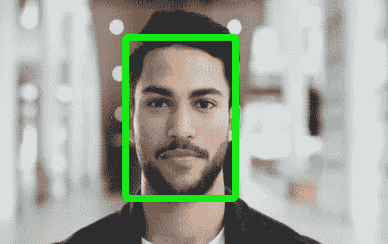
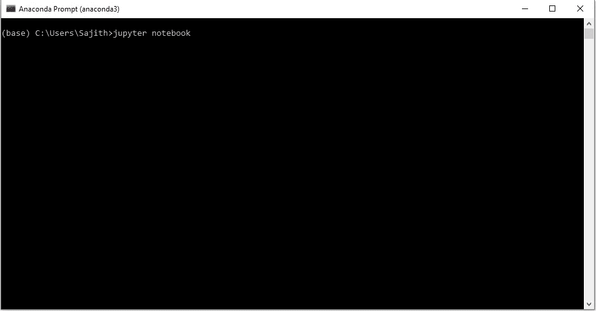
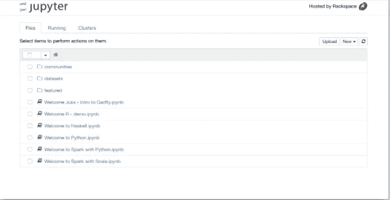
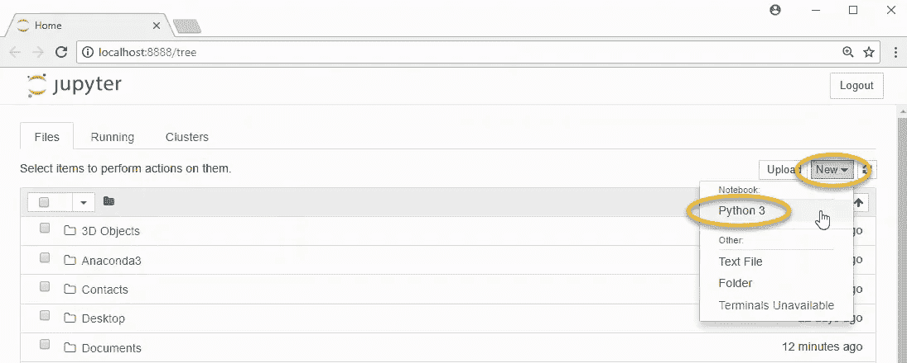
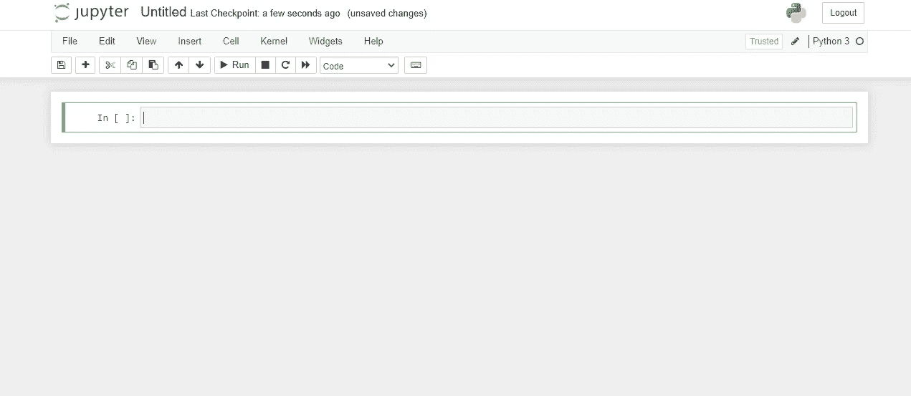
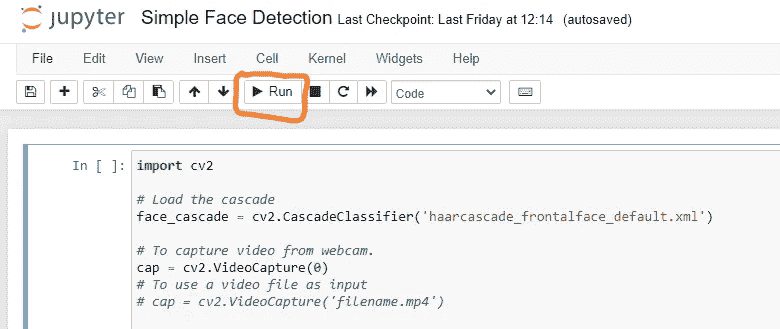

# 用 OpenCV 和 Python 实现的简单人脸检测系统

> 原文：<https://medium.com/geekculture/a-simple-face-detection-system-in-using-opencv-python-5abda1d07b38?source=collection_archive---------13----------------------->

Face detection

我们将检测视频中的人脸。众所周知，视频基本上是由帧构成的，这些帧是静止的图像。然后，我们对视频中的每一帧进行人脸检测

首先，在你的机器上安装 OpenCV。如果你不知道如何安装 OpenCV。你可以阅读我以前的文章[使用 Anaconda 在 Windows 上安装 OpenCV for Python](/@sajithpro1/installing-opencv-for-python-on-windows-using-anaconda-d37300e2e194)

使用哈尔级联的人脸检测是一种基于机器学习的方法，其中用一组输入数据训练级联函数。OpenCV 已经包含了许多预先训练好的人脸、眼睛、微笑等分类器。今天我们将使用人脸分类器。您也可以尝试其他分类器。

你要在 GitHub([Haar cascode _ frontal face _ default . XML](https://raw.githubusercontent.com/opencv/opencv/master/data/haarcascades/haarcascade_frontalface_default.xml))下载训练好的分类器 XML 文件，在 [OpenCV 的 GitHub 资源库](https://github.com/opencv/opencv/tree/master/data/haarcascades)有。你可以进入 Haar cascade _ front alface _ default . XML Raw page 并右击它，然后转到另存为，将该文件保存到你的工作位置。

之后，从开始菜单启动 Anaconda 提示符

launching Anaconda prompt

要打开 Jupyter 笔记本，我们需要在提示符下键入以下命令:

## Jupyter 笔记本

Launch Jupyter notebook

当笔记本在您的浏览器中打开时，您将看到笔记本仪表板，它将显示笔记本服务器启动目录中的笔记本、文件和子目录的列表。

Jupyter Notebook Dashboard

选择文件路径，然后单击右侧顶部名为“新建”的按钮，并选择 python 3 来创建笔记本文件

creating a Jupyter notebook file

之后，你可以看到 Jupyter 笔记本文件

JupyterEmptyNotebook

之后，您可以将下面的代码复制并粘贴到那个空的笔记本文件中

要检测视频中的人脸:

将代码复制并粘贴到笔记本后，您可以通过单击“运行”按钮来运行该文件

run button in Jupyter notebook

点击运行按钮后，你可以看到该程序使用网络摄像头工作，检测网络摄像头视频中的人脸。

**需要注意的几件事:**

*   该检测仅对灰度图像有效。因此，将彩色图像转换为灰度图像非常重要。(第 15 行)
*   **detectMultiScale** 函数(第 17 行)用于检测人脸。它需要 3 个参数——输入图像、*比例因子、*和*近邻*。 *scaleFactor* 指定图像尺寸随每个比例缩小多少。指定每个候选矩形应该有多少个邻居来保留它。你可以[在这里](https://www.bogotobogo.com/python/OpenCV_Python/python_opencv3_Image_Object_Detection_Face_Detection_Haar_Cascade_Classifiers.php)详细了解。您可能需要调整这些值以获得最佳结果。
*   *面*包含找到面的矩形区域的坐标列表。我们使用这些坐标来绘制图像中的矩形。
*   我们使用无限循环来遍历视频中的每一帧。我们使用 *cap.read()* 来读取每一帧。返回的第一个值是一个标志，指示帧是否被正确读取。我们不需要它。返回的第二个值是我们将在其上执行检测的静止帧。

*社交媒体:*[*LinkedIn*](https://www.linkedin.com/in/sajith-dilshan/)*，*[*Twitter*](https://twitter.com/sajithd7)*，*[*insta gram*](https://www.instagram.com/sajithd_dilshan/)*，* [*YouTube*](https://www.youtube.com/channel/UCXvjoCD39q8s3zWCwKD-Qpw)