# 将 RStudio 连接到 MySQL 数据库的简单指南

> 原文：<https://medium.com/geekculture/a-simple-guide-on-connecting-rstudio-to-a-mysql-database-d8a8ca6573fd?source=collection_archive---------4----------------------->

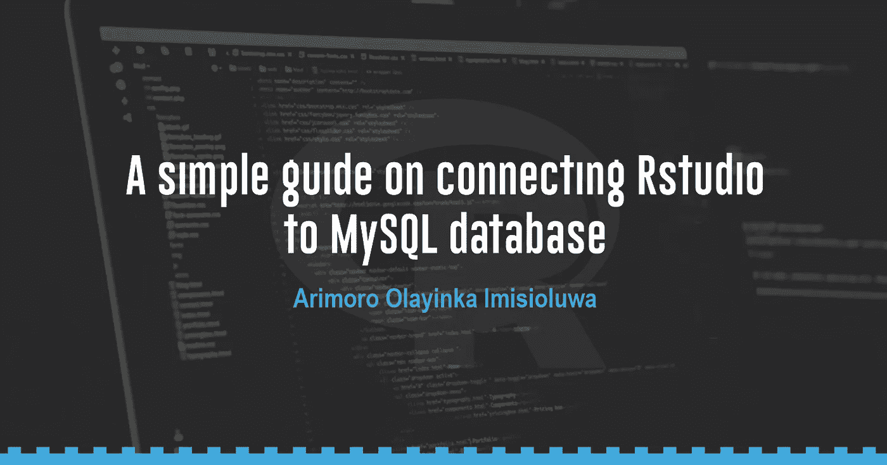

你读过我写的关于将 RStudio 连接到 PostgreSQL 数据库的文章吗？那篇文章是我们在这里讨论的先决条件。我非常详细地解释了我们将在本文中使用的一些功能和我们将采取的步骤。

如果你还没有阅读那篇[文章](https://arimoroolayinka.medium.com/a-simple-guide-on-connecting-rstudio-to-a-postgresql-database-9e35ccdc08be)，请花 12 分钟阅读这里的文章。如果你已经读了那篇文章，那么我们可以一起开始这趟美丽的旅程。

在本文中，我将向您展示如何本地连接到 MySQL 数据库。在我的上一篇文章中，我已经解释了当我们连接到 PostgreSQL 数据库时，将这篇文章放在一起的基本原理。将 RStudio 连接到 SQL 数据库有助于我们将强大的 R 包和函数用于不同的数据任务。

正如我在上一篇文章中提到的，这篇文章是一个简单的指南，这意味着它并没有包罗万象地解释所有涉及的技术细节。请放心，通过遵循本指南中概述的步骤，您将能够将 RStudio 连接到您的本地 MySQL 数据库。此外，我相信您有一个 MySQL 数据库，数据库中有表。

> **注意:**这篇文章不会教你如何创建一个 MySQL 数据库。假设您已经建立了至少一个包含至少一个表的 MySQL 数据库。

此外，各种函数和包有助于实现本文的相同目的——将 RStudio 连接到 MySQL 数据库。然而，我将使用 odbc R 包来展示这个例子。ODBC 的意思是[开放数据库连接](https://www.techtarget.com/searchoracle/definition/Open-Database-Connectivity)，一个开放的标准应用编程接口(API)，允许应用程序员访问任何数据库[1]。

最后，在我们开始之前，我想提一下，确保你通读到底；我在这篇文章中添加了一个奖励部分和一份礼物。

现在，让我们开始吧！

# **入门**

第一步是安装并导入所需的 R 包。如果你以前用过 R，你应该知道 R 有几乎任何用途的包。目前，R 综合档案网络(CRAN)存储库中有超过 13，000 个包。要安装和导入我们将在本文中使用的包，请使用下面的代码。

> **注意:**要在 R 中运行一行代码，对于 Windows 用户使用 CTRL ENTER 或者使用 RStudio 界面上的 run 按钮。

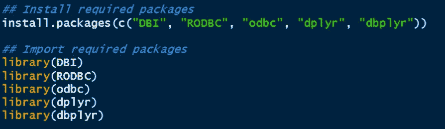

我建议使用谷歌搜索来检查每个导入的包是做什么的。为了使本文尽可能简短紧凑，我跳过了解释每个导入包的功能。

至此，我们现在可以看看如何将 RStudio 连接到 MySQL 数据库。你刚才看的和上一篇文章挺熟悉的吧？现在，我们将深入研究这篇文章有趣的部分。

# **将 RStudio 连接到 MySQL 数据库**

正如我们在 PostgreSQL 数据库中看到的那样，让我们首先展示我们想要在本文中连接到的 MySQL 数据库的一个片段。我在 MySQL 中有 **employeesdb** 数据库。

从上图来看， **employeesdb** 有五个表，并且没有视图。显然，这个数据库不同于我们在 PostgreSQL 文章中连接的数据库。由于我们将从 **employeesdb** 数据库中查询 employees 表，我相信查看它包含的数据会有所帮助。

上图显示了 employees 表中的数据片段。值得注意的是，employees 表上有 1000 行和 9 列。了解这些信息有助于我们在查询数据库时确认是否已经成功连接到数据库。

连接到您的 MySQL 数据库类似于 PostgreSQL 数据库，但不像 PostgreSQL 那么直接；您需要做一些事情来实现无缝连接。

首先，我们希望确保在安装 MySQL 时，MySQL ODBC 驱动程序已经安装。记住，我们使用 odbc 包来创建连接。因此，我们希望确保安装了 MySQL 的数据库驱动程序。对于 PostgreSQL，我们不需要这样做——我猜 PostgreSQL 不需要安装驱动程序(虽然不确定！)

我们可以使用下面的代码来检查安装的唯一数据库驱动程序的列表。

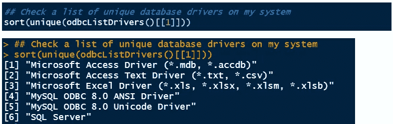

结果显示了安装的数据库驱动程序，我们可以看到安装了两个 MySQL 驱动程序。我们可以看到安装了其他一些数据库驱动程序，包括 SQL Server。

**我想 PostgreSQL 为我们省去添加数据库驱动程序作为 ODBC 数据源的压力。老实说，我不明白 PostgreSQL 数据库驱动程序是如何工作的。你可以在评论中分享你对此的想法。**

现在我们已经确定 MySQL 数据库驱动程序已经安装，我们需要确认这个驱动程序是作为 ODBC 数据源添加的。如果没有，我们将需要添加 MySQL 数据库驱动程序作为 ODBC 数据源。然后，我们可以将 RStudio 连接到 MySQL 数据库。

为了帮助我们实现这一点，我已经列出了你需要采取的步骤。

## **第一步:添加 MySQL 驱动程序作为 ODBC 数据源**

首先，我们必须确认 MySQL 数据库是一个 ODBC 数据源。为此，请遵循以下步骤，如下图所示:

*   进入你的搜索栏，输入 **odbc 数据源**，如果你安装了 64 位版本，点击 64 位版本。

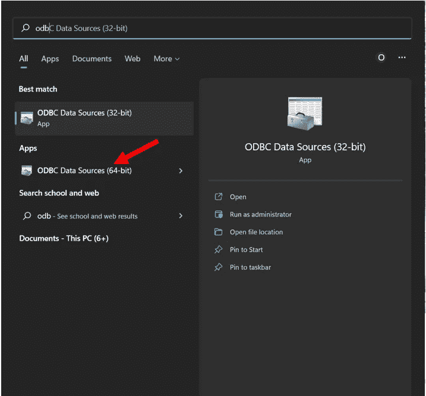

当你点击它时，类似下图的对话框应该会打开。

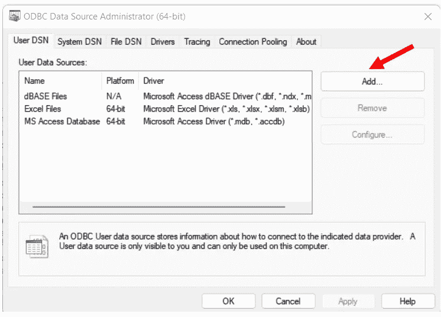

从表面上看，MySQL 数据库驱动程序没有被列为 ODBC 数据源。因此，将 RStudio 连接到 MySQL 是不可能的，除非我们将 MySQL odbc 驱动程序添加到用户数据源列表中。

*   现在，点击**添加**，进入下一步。

点击“添加”,将弹出下面的对话框。

*   现在，单击 MySQL ODBC 8.0 ANSI 驱动程序并完成(选择 MySQL ODBC 8.0 ANSI 驱动程序应该有助于完成工作)。

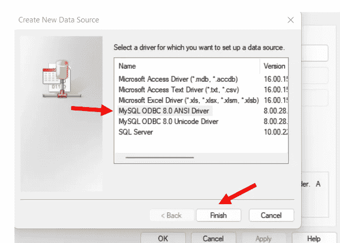

完成这一步后，让我们继续！我希望你一直在跟进。如果没有，请后退一步，并确保在继续之前你跟随了我的思路。

漂亮！当您单击“完成”时，出现下图，但没有您在下图中看到的信息。只有 MySQL 的默认端口号 3306 会为您填充。

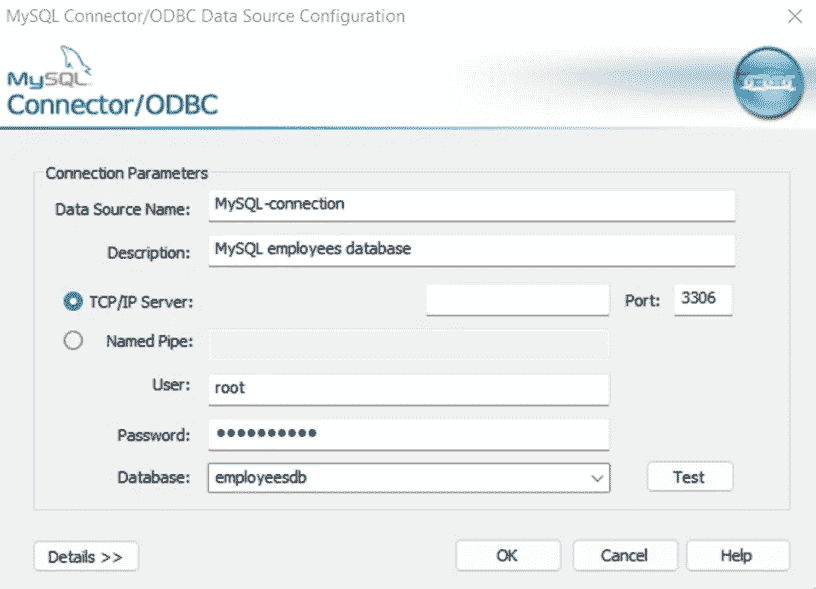

在这一步中，我们将配置 MySQL ODBC 数据源连接器。上面的对话框打开后，您需要填写以下内容:

*   数据源名称:您可以给它取任何喜欢的名称。我把它命名为 **MySQL-connection**
*   描述:你可以给它一个简短的描述
*   用户:通常用户应该是 **root** 。但是，您可以决定连接到另一个用户。在本例中，我选择连接到根用户的**，因为 **employeesdb** 数据库在我的根用户连接中。**

> **提示:**当你打开你的 MySQL 工作台，你应该会看到你的不同用户，如下图所示。

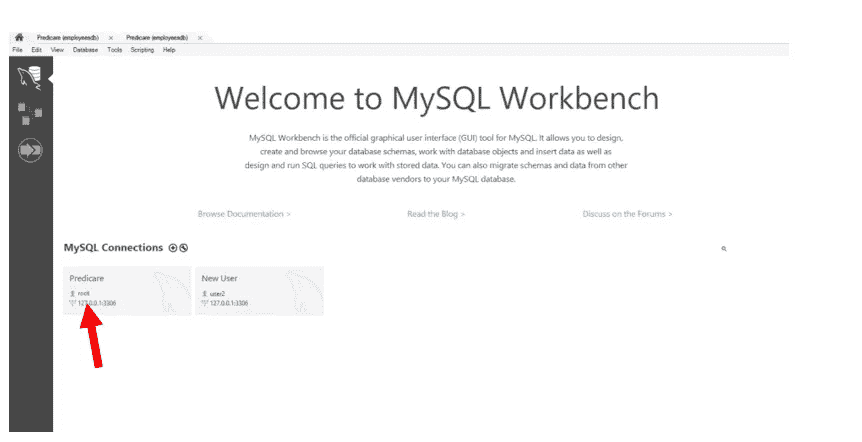

*   密码:输入您安装 MySQL 时使用的密码，该密码与您打开 MySQL 工作台时输入的密码相同
*   数据库:输入你想连接的数据库；在本例中，我想连接到 **employeesdb** 数据库

> **注意:**你可以做的一件实际的事情是点击**测试**按钮。如果您输入的详细信息，尤其是用户名、密码和数据库是正确的，您应该会看到如下所示的提示**连接成功**。

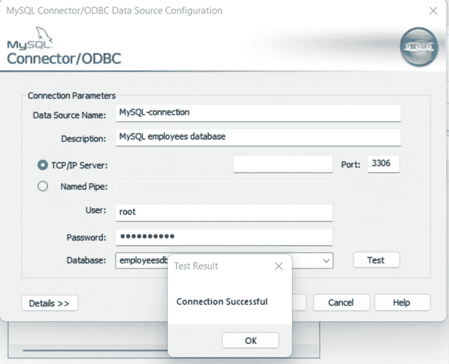

您会注意到我正在连接到另一个名为 **employeesdb** 的数据库，它不同于我用来说明 PostgreSQL 连接的那个数据库。这样做表明，无论您想连接到什么 RDBMS，想法都是相似的。

最后，您可以点击 **OK** 或 **X** 返回 MySQL ODBC 数据源对话框并点击 OK，到 **employeesdb** 数据库的新 MySQL 连接就创建好了。

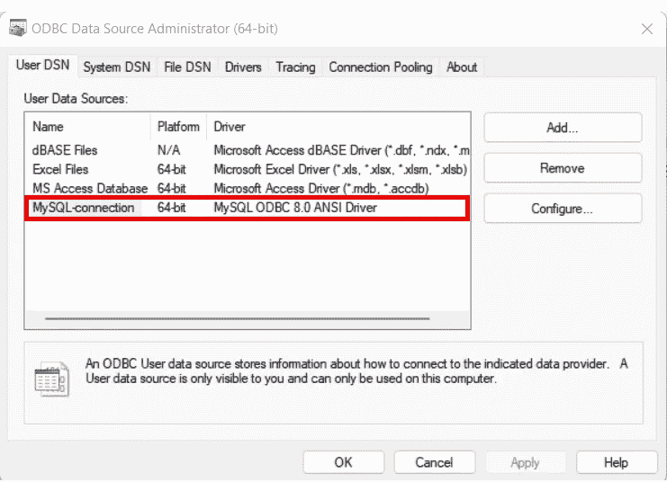

您将看到新的连接被创建。点击 OK，你就可以开始了。我们添加了 MySQL 作为 ODBC 数据源。现在，将 RStudio 连接到 MySQL 数据库 **employeesdb** 将变得很容易。

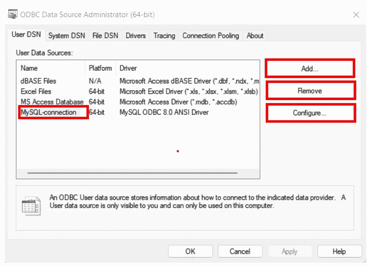

> **注意:**点击用户数据源，您将看到添加、删除或配置连接的选项。如果您单击“配置”，您可以修改您在上述步骤中填写的详细信息。例如，您可以将数据库名称更改为 MySQL 中的另一个数据库。

连接完成后，剩下的就是编写 R 代码，类似于我们将 RStudio 连接到 PostgreSQL 时编写的代码。

## **第二步:定义一个数据库连接**

现在，我们回到你所熟悉的话题。使用下面的代码从 RStudio 连接到 **employeesdb** 数据库，这与我们连接到 PostgreSQL 数据库的方式非常相似。唯一的区别是参数中提供的信息。例如，您的密码将是您安装 MySQL 时使用的密码，也是您将 MySQL 驱动程序添加为 ODBC 数据源时使用的密码。

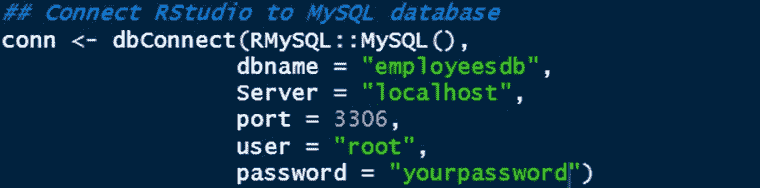

根据上面的代码，我们创建了一个名为 **conn** ( *你可以给它取任何喜欢的名字*)的 R 对象。我相信上面代码的其他部分是不言自明的。

> **注意:**如果您想要连接到在线或基于云的数据库，您需要将服务器从**“localhost”**更改为基于云的服务器，可能需要通过链接。您可以探索这个选项。我们使用 localhost 作为服务器，因为我们连接到一个本地数据库。

接下来，让我们使用下面的代码打印出 **employeesdb** 数据库中的表名:

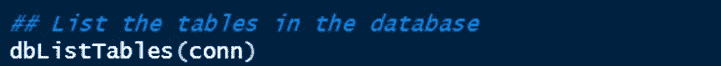

结果如下所示:

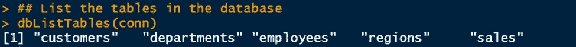

在将 MySQL 连接到 RStudio 这一节的开头，查看图像的左侧，您会看到我们有相同的表名。这个结果进一步证明连接是成功的。

> **注意:**如果您连接到一个不同的数据库(很可能是这种情况)，您将得到一个不同的表名列表，因为我们没有连接到同一个数据库。

## **第三步:查询数据库**

既然我们确定已经成功创建了一个连接，现在就可以从 RStudio 中查询数据库了。我们在连接到 PostgreSQL 数据库时使用的相同代码也可以工作。

假设我们需要连接到 RStudio 的数据库 **employeesdb** 中 employees 表的前 500 行。

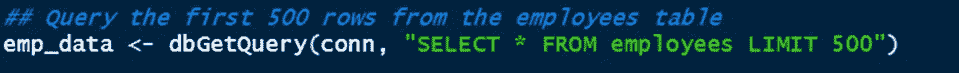

在上面的代码中，我们使用了 DBI 包中的 dbGetQuery()函数。它需要两个必需的参数:连接和语句。回想一下，当我们创建与 MySQL 的连接时，我们将 R 连接对象称为 conn。第二条语句只是检索所有的列，因为我们在 SELECT 关键字后使用了星号( ***** ) ，并且由于 LIMIT 500 语句，检索了 500 行。

让我们看一下数据。我们将使用 **glimpse()** 函数。

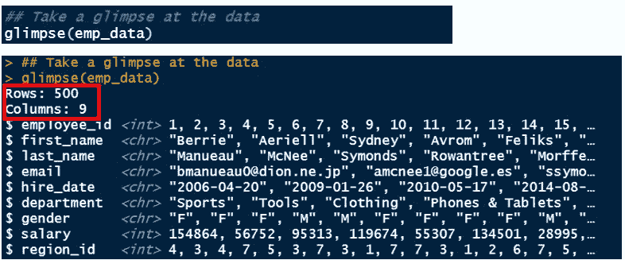

太神奇了！我们有 500 排。毕竟，我们在数据库中查询了 employees 表中的 500 条记录。此外，我们有九列，因为我们查询了数据库中的所有列。

因为我们已经将数据保存为 R 对象 **emp_data** ，所以我们可以关闭连接来释放资源。

如前所述，如果我们试图运行下面的代码，我们将会得到一个错误，因为我们已经断开了 RStudio 与 MySQL 数据库的连接。

这个错误向我们展示了为什么将查询的数据保存为 R 对象是非常重要的。即使我们断开了对 employees 表的访问，我们仍然可以访问 500 行的 employees 数据，因为我们将它保存在 R 对象 **emp_data** 中。否则，我们需要运行代码来再次创建连接。

最后，我们可以开始使用 R 函数来处理我们已经查询并保存为 **emp_data** 的数据。例如，我们可以使用 head() 函数打印出数据的前六行。

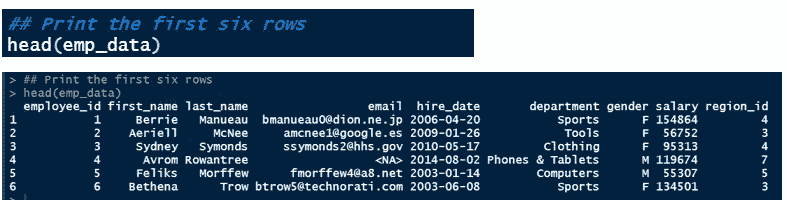

漂亮！经过仔细观察，您会注意到这里返回的数据与本节开头的图像产生的数据相似。

拍拍自己的背！通读这篇文章，你做得很好。我相信这是一次美好的经历。如果我们在这里结束，我认为你已经学到了一些伟大的想法。

然而，我决定添加一个额外的部分，在创建到数据库的连接之后，使用 **dbplyr** 包中的函数来查询数据库，而不是使用 DBI 包中的 dbGetQuery()函数。使用这两个包各有利弊，我们不会在本文中探讨。

让我们看看它是如何工作的。

# **奖金部分:使用 dbplyr**

就我个人而言，我可以使用任何一个软件包，DBI，或 dbplyr。然而，我认为 dbplyr 提供了一些灵活性，特别是在查询数据库时使用 dplyr 函数。 [dbplyr 包](https://dbplyr.tidyverse.org/)是一个数据库的“dplyr”后端，它允许你处理远程数据库表，就像它们是内存中的数据帧一样。基本特性适用于任何具有“DBI”后端的数据库。

作为演示这个例子的第一步，我们需要重新连接到 MySQL 数据库。请记住，我们已经断开了与数据库的连接。下面的代码可以帮助我们做到这一点:

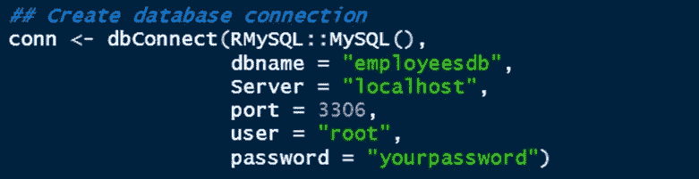

现在，假设我们想要查询 employees 表中的前 500 条记录或行。我们将使用通用的 tbl()函数从数据源创建一个表。我们需要为该函数提供数据源(在本例中是我们的数据库连接)和 SQL 语句。

请注意这与 dbGetQuery()函数之间的区别。这里，我们将在 SQL 语句之前指定 SQL，因为 tbl()函数是一个通用函数，可以处理各种数据源。

我认为这是有道理的。

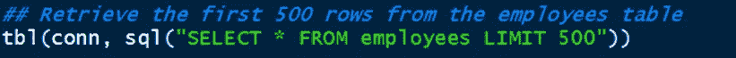

你能告诉我为什么不建议按照我上面写的方式写代码吗？

答案很简单，如果我们关闭连接，我们将无法访问数据库和 employees 表。事实上，代码将在您的 RStudio 控制台上打印结果(这可能相当混乱)，如下面的结果所示。

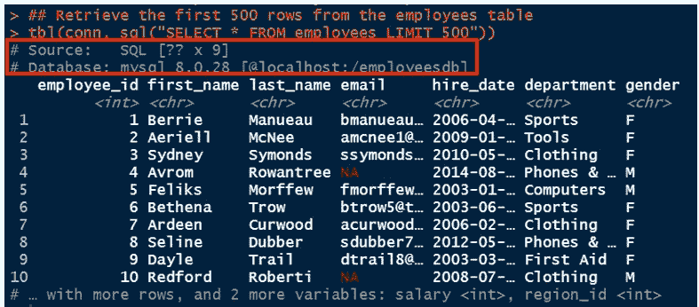

另外，您会注意到结果向我们显示了数据源和连接的数据库— **employeesdb** 。该结果的另一个结果是，该数据还不是 R 数据帧。因此，对我们查询的数据使用一些 R 函数可能是不可能的。这是使用 dbGetQuery()函数的一个优点。它将查询的数据作为数据框返回。

我们可以很快解决我提出的这些问题。

让我们通过将结果存储在 R 数据帧中来整理这个结果。下面的代码也返回前 500 行。我使用了管道函数来链接几个步骤。首先，我使用 tbl()函数连接到数据库，但是我没有编写 SQL 语句来检索前 500 行，而是查询了整个 employees 表，即行 tbl(conn，“employees”)。然后，我使用 as.data.frame()函数将查询的数据转换为数据框，以便在我们继续操作时易于处理。因为我们需要前 500 行，所以我使用 slice()函数通过索引检索前 500 行。

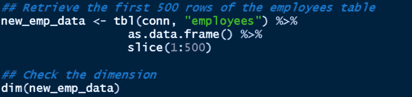

最后，我们可以检查新数据框的维度，以确保我们做了正确的事情。

正如预期的那样，该维度显示了 500 行和 9 列。因此，我们可以在查询数据库时使用 dplyr 函数——通过 dbplyr。然后，我们可以关闭或断开连接。

保存数据后，我们可以使用 head()函数返回数据的前六行，并从九列中选择一些我们想要的列，包括 first_name、last_name、department 和 salary。dplyr 函数中的 select()函数帮助我们实现了这一点。

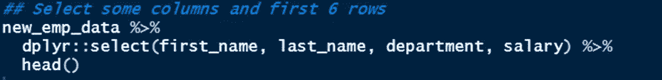

> **注:**通常在 R 中，我们可能会在各种包中找到类似 select()函数的函数。有时候，当你调用这样的函数时，通常会发生冲突。在代码中，你会注意到我写了 dplyr::select()。dplyr::select()表示我想使用 dplyr R 包中的 select()函数，因为在 MASS 包中也可以找到 select()函数。在 MASS 包中，select()的功能不同于使用名称或类型选择列。

因此，可能会有这样的情况，您需要使用 package name::function name 显式声明可以找到函数的包。事实上，你在 R 学习中很有可能会看到这样的代码。

上面代码的结果如下所示:

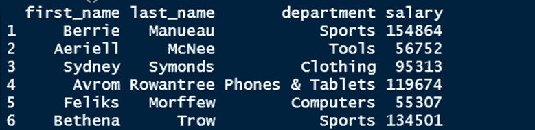

上面的输出类似于我们之前看到的结果。唯一的区别是我们有四列而不是九列，因为我们选择了四列。这里最后要注意的是，select()函数将按照您在 select()函数中指定列的顺序返回结果。

# **结论**

太神奇了！你已经走了很长的路，我很高兴你走了这么远。我向你的顽强和坚持到底的决心致敬。我相信你花时间学习这些概念是值得的，你会发现它们很有价值。

我有一份礼物给你——我已经上传了完整的 R 脚本到 GitHub 库[这里](https://github.com/Predicare1/Connecting-RStudio-to-SQL-databases/blob/main/connect-RStudio-to-MySQL.R)。这个脚本减轻了您编写代码的压力，您可以快速运行代码。当然，要使用这个脚本，您需要调整脚本，比如更改数据库名、表名等等。

此外，在创建到数据库的连接之后，您可以做许多其他事情。您可以从 RStudio 更新数据库中的表或向表中添加新记录。本文为您提供了最大化 RStudio 和 SQL 功能的第一步，也是关键的一步。在这里，您可以阅读软件包和函数的文档，以便对从 RStudio 连接到的数据库执行不同的操作。

如果你喜欢这篇文章，请在评论区留下你的评论，与他人分享这篇文章。如果你能点击“鼓掌”图标(最多允许 50 次鼓掌)，这将对我意义重大。

作为 Coursera Guided Project Network 的一名基于项目的课程讲师，我教授过一些关于使用 R 的课程，尤其是 R tidyverse 系列包，包括 dplyr 包。你可以点击[这里](https://www.coursera.org/instructor/arimoro-olayinka)查看这些课程。谢谢大家！下次见！