# 将 RStudio 连接到 PostgreSQL 数据库的简单指南

> 原文：<https://medium.com/geekculture/a-simple-guide-on-connecting-rstudio-to-a-postgresql-database-9e35ccdc08be?source=collection_archive---------2----------------------->

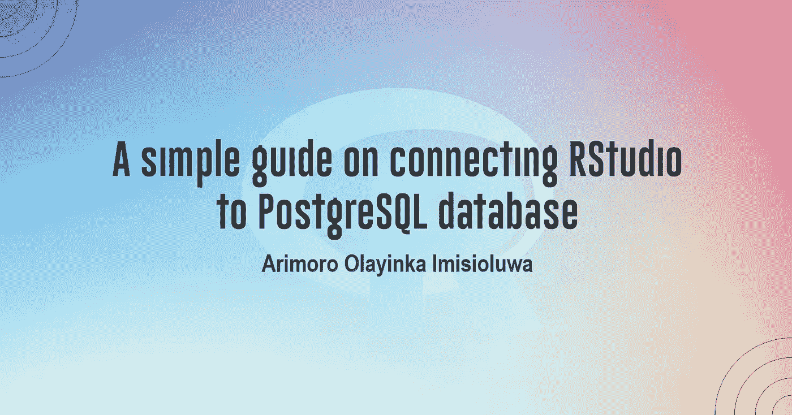

有没有想过从 RStudio 查询 PostgreSQL 这样的关系数据库的可能性？在 2021 年，我试图这样做，但我发现没有太多的资源详细解释如何做到这一点。我早就应该写这篇文章了。不过，那段时间我在 Coursera 上教了一门名为“在 RStudio 中使用 SQL 操纵 R 数据框”的基于项目的课程，了解如何使用和编写 SQL 代码在 RStudio 中查询 R 数据框。你可以点击查看课程[。](https://www.coursera.org/learn/manipulate-r-data-frames-using-sql-rstudio/home/week/1)

在本文中，我将向您展示如何本地连接到 PostgreSQL 数据库。当连接到其他关系数据库(包括 MySQL 和 SQL Server)时，即使数据库位于云存储中，您将从本文中收集到的想法也会很有帮助。

在研究这篇文章之前，应该想到的一个问题是——这篇文章的基本原理是什么？为什么我需要将 RStudio 连接到 SQL 数据库？

通常，关系数据库中的数据以规范化的格式存储。因此，对于执行统计计算和数据可视化等分析的数据专业人员来说，需要编写高级和复杂的 SQL 查询。但是，R 可以很容易地连接到许多关系数据库，如 PostgreSQL、MySQL、Oracle、SQL Server 等。，并从其中检索数据作为数据框。当数据成功地进入 R 环境时，它就变成了一个典型的 R 数据集，使得使用所有强大的包和函数进行操作或分析变得容易。

我相信这为这篇文章的重要性提供了一个坚实的理由。

在我们继续之前，这里有一个小小的警告。这篇文章是一个简单的指南，这意味着它并没有包罗万象地解释所有涉及的技术细节。请放心，通过遵循本指南中概述的步骤，您将能够将 RStudio 连接到本地 PostgreSQL 数据库。此外，这些步骤稍加调整，就可以连接到基于云的数据库。

另外，在我们开始之前，我想假设您已经安装了 PostgreSQL，您知道如何创建数据库，并且您在 PostgreSQL 中至少有一个数据库。假设您以前没有使用 SQL 数据库的经验。在这种情况下，你可以在这里查看我教授的题为“在 SQL 中执行数据定义和操作”的基于项目的课程[。](https://www.coursera.org/learn/performing-data-definition-and-manipulation-in-sql/home/week/1)

此外，各种函数和包有助于实现本文的相同目的——将 RStudio 连接到 PostgreSQL 数据库。然而，我将使用 odbc R 包来展示这个例子。 [ODBC 意为开放式数据库连接](https://www.techtarget.com/searchoracle/definition/Open-Database-Connectivity)，一种开放的标准应用编程接口(API)，允许应用程序员访问任何数据库。

最后，在我们开始之前，我想提一下，确保你通读到底；我在这篇文章中添加了一个奖励部分和一份礼物。现在，让我们开始吧！

# **入门**

第一步是安装并导入所需的 R 包。如果你以前用过 R，你应该知道 R 有几乎任何用途的包。在 R Comprehensive Archive Network(CRAN)存储库中有超过 13，000 个包。要安装和导入我们将在本文中使用的包，请使用下面的代码。

> **注意:**要在 R 中运行一行代码，对于 Windows 用户使用 CTRL ENTER 或者使用 RStudio 界面上的 run 按钮。

我建议使用谷歌搜索来检查每个导入的包是做什么的。为了使本文尽可能简短紧凑，我跳过了解释每个导入包的功能。

至此，我们现在可以看看如何将 RStudio 连接到 PostgreSQL 数据库。

# **将 RStudio 连接到 PostgreSQL 数据库**

在本节中，我们将查询**雇员**表中的雇员表。因此，首先，我们将连接到 PostgreSQL 中名为 **Employees** 的本地数据库。注意，我的 PostgreSQL 中已经有了这个数据库。让我展示一下数据库的样子，包括 employees 表中的一些记录或行。

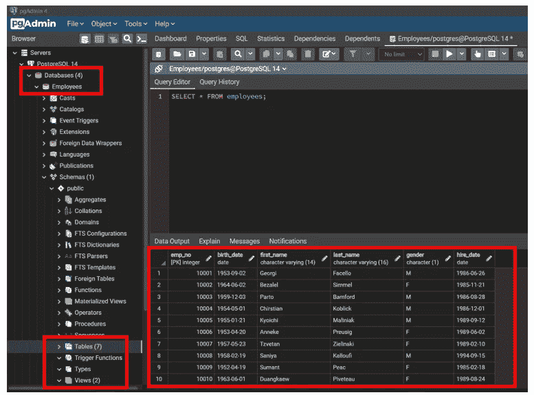

**雇员**数据库包含七个表和两个视图，如上图所示，包括雇员表。此外，在右侧，返回查询 employees 表中所有数据的输出。然而，由于篇幅限制，我们只能看到前十行。但是，employees 表包含大约 11，822 行和 6 列，如下图所示。

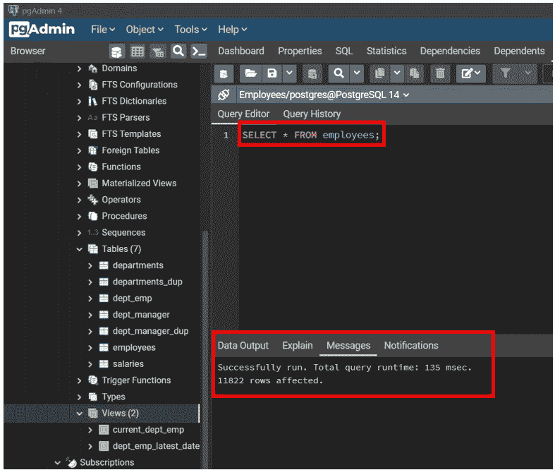

太好了！我们可以开始学习如何将 RStudio 连接到**雇员** PostgreSQL 数据库。我将概述从 RStudio 成功连接到这个数据库的步骤。如果你已经准备好并兴奋地想看看如何做到这一点，那就加入我吧！

## **第一步:定义数据库连接**

创建从 RStudio 到 PostgreSQL 的数据库连接相对简单。在这一步中，我们将使用之前安装的 DBI 包中的函数。

在编写将 RStudio 连接到 PostgreSQL 的代码之前，我们希望确保拥有关于数据库的所有信息，包括端口号和用户名。要获取这些信息，打开 pg admin(PostgreSQL 的管理界面)后，执行如下操作，如下图所示:

*   右键单击 PostgreSQL14 并选择**属性**(将会打开一个对话框)
*   选择**连接**选项卡，您将看到创建连接所需的所有信息。

> **注意:【PostgreSQL 的默认端口号是 5432。**

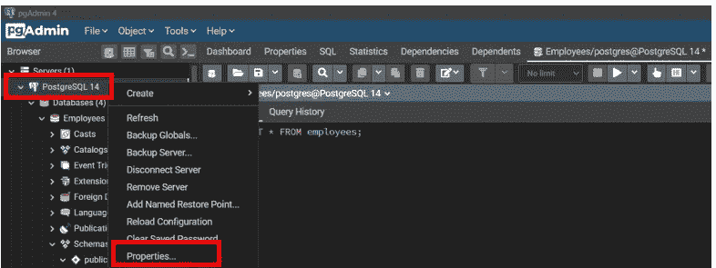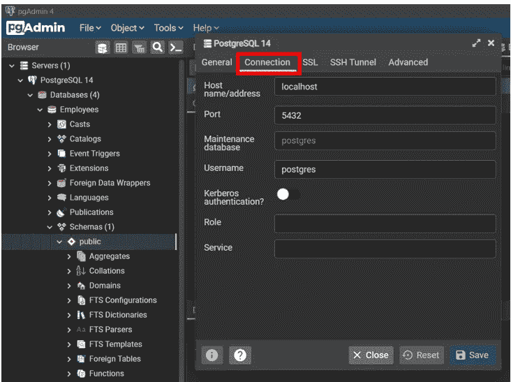

太神奇了！现在，我们有了创建连接所需的信息。

通常，首先检查连接是否存在是一个好的做法，也就是说，检查我们是否可以从 RStudio 连接到 PostgreSQL 数据库。本文将使用 DBI 包中的 [dbCanConnect()](https://rdrr.io/cran/DBI/man/dbCanConnect.html) 函数。该函数只检查有效性，不返回连接对象。默认实现打开一个连接，并在成功时断开连接。简单地说，它帮助我们检查 RStudio 是否可以与数据库建立连接。

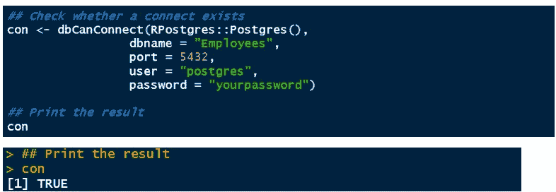

上面的代码看起来很容易理解。我们填写了我们得到的关于数据库的信息。回想一下，我们想要连接到 **Employees** 数据库，因此有了参数 dbname = "Employees "。此外，输入您在安装 PostgreSQL 时使用的相同密码，该密码与您在打开 PgAdmin 界面时输入的密码相同。

漂亮！打印连接对象 **con** 的结果为 **TRUE，**表示存在有效的连接。建立之后，我们可以使用 dbConnect()函数通过适当的身份验证过程连接到数据库。它采用与 dbCanConnect()函数相似的参数。

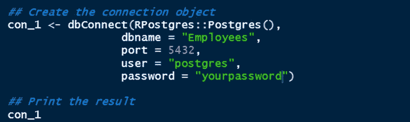

正如我提到的，他们采取相似的论点，但产生不同的结果。让我们看看我们创建的连接对象 **con_1** 的结果。

我相信我们都同意它们返回不同的结果。这个结果告诉我们，我们已经成功地连接到端口 5432 上的**雇员**数据库。

太棒了。从现在开始，这将是一段平稳的旅程。连接到数据库是第一步，也是最关键的一步。这不就是你读这篇文章的原因吗？

现在，让我们玩一些其他功能和有趣的数据任务。接下来，使用 dbListTables()函数，我们可以返回数据库中所有视图和临时对象(表)的列表。

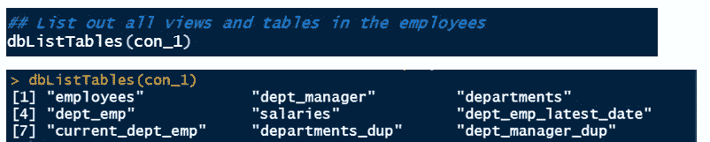

从结果中你注意到了什么？

返回了九个对象，对应于七个表和两个视图，正如我们在本节开头的图像中看到的。这是有道理的吧？

现在的问题是——在建立了联系之后，然后呢？下一步找出这个问题的答案。

## **第二步:查询数据库**

现在，让我们使用 DBI 包中的 dbGetQuery()函数直接从 RStudio 查询数据库。此函数以数据框的形式返回查询结果。它需要两个必需的参数:连接和一个 SQL 语句。

运行下面的代码后，将查询雇员表以返回所有数据。按照我所写的方式运行下面的代码的缺点是，它会在 RStudio 控制台上打印结果，从而使您的 RStudio 控制台非常混乱。

一个更好的方法是将结果存储为 R 对象，例如， **emp_df** 。有了这个 R 对象，我们可以做许多其他的事情，包括对 employees 表的数据操作，而不会影响到 employees 数据库中的原始 Employees 表，也不会丢失数据，即使我们关闭了与数据库的连接。

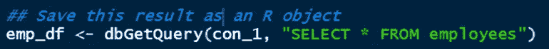

太好了！你做得很好。该代码将成功查询 employees 表中的所有数据。

让我们进行第三步！

## **第三步:探索数据集**

现在，我们将 employees 表中的数据保存为 R 数据框。首先，我们可以使用 dim()函数检查数据的维度(行数和列数)。

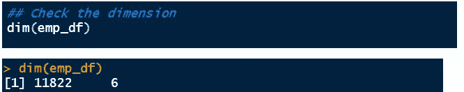

这不是很有趣吗？结果告诉我们，数据有 11，822 行和 6 列。

这些数字能引起共鸣吗？是啊！

这些是 PostgreSQL 数据库 **employees** 中 Employees 表的行数和列数的精确结果。显然，我们已经成功地连接到 employees 表，没有合理的怀疑。

现在，我们可以使用 glimpse()函数来查看数据。[惊鸿一瞥()](https://www.rdocumentation.org/packages/dplyr/versions/0.3/topics/glimpse)就像是转置版的 print():列顺着页面往下跑，数据横着跑。此功能可以查看数据框中的每一列。这有点像应用于数据框的 str()，但它试图向您显示尽可能多的数据。此外，即使应用于远程数据源，它也总是显示底层数据。glimpse() 是 dplyr 包中的一个函数。

> **注意:**DP lyr 包是 tidyverse 包家族的一员。 **dplyr** 包非常强大，事实上，它是 R 中对数据操作最有用的包。这是我有史以来最好的数据处理软件包。你可以在 Coursera 上查看我的基于项目的课程，名为**用 dplyr 在 R** [这里](https://www.coursera.org/learn/data-manipulation-with-dplyr-in-r/home/welcome) **。我在那门课程中讲述了 dplyr 包的使用。**

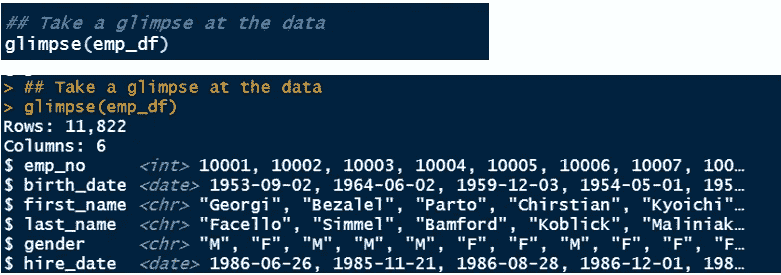

太神奇了！在一个目标中，我们可以看到数据集的所有信息，包括行数、列数、列名、列数据类型，甚至几行数据。

随着我们的深入，我们可以使用 head 和 tail base R 函数来获取数据集的前六行和后六行。

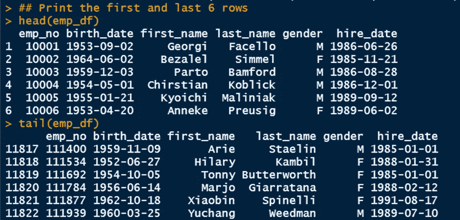

这不是太美了吗？这些结果进一步强调了我们在这篇文章中所考虑的内容的重要性。只要连接到数据库，我们就可以查询数据库中的任何表。在本例中，我们查询了 employees 表，并将其保存为 R 数据框。有了它，我们就可以在 employees 表上进行任何数据操作、清理、转换或可视化，如果我们编写 SQL 查询，这可能会很困难或代价很高。此外，多亏了 RStudio，我们可以在不篡改数据库的情况下完成所有这些数据任务。

当我们开始结束本文时，一旦将查询的数据保存为 R 对象(如数据框)，就应该断开或关闭您创建的连接，这一点至关重要。这样做有助于丢弃所有未完成的工作并释放资源(例如，内存、套接字)。

我们将使用 DBI 包中的 [dbDisconnect()](https://www.rdocumentation.org/packages/DBI/versions/0.5-1/topics/dbDisconnect) 函数。它的工作方式与我们用来创建连接的 dbConnect()函数相反。dbConnect()函数接受一个必需的参数:连接。

这段代码关闭了连接，这意味着我们不再能够访问**雇员**数据库中的表。但是，我们仍然可以在 employees 表上执行数据操作任务，因为我们已经将该数据保存为名为 **emp_df 的 R 数据帧。**

例如，可以提出一个数据问题，如 1990 年 1 月 1 日或之前雇用了多少雇员？下面的代码帮助我们回答这个问题。

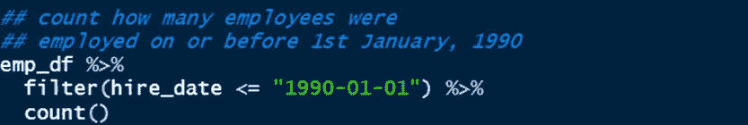

上面的代码使用了 dplyr 包中的函数。%>%表示管道功能。在 dplyr 中，将一系列操作链接在一起是一个非常有用的功能。filter()函数过滤 1990 年 1 月 1 日或之前的雇佣日期(因此使用了<=). Also, you will notice that the date takes the yyyy-mm-dd format (like a typical SQL date format). You can decide to change the date format using functions in the powerful lubridate() package *(这超出了本文的范围)*。最后，我们使用 count()函数获得所需的数字。

我们来看看上面 R 代码的结果。

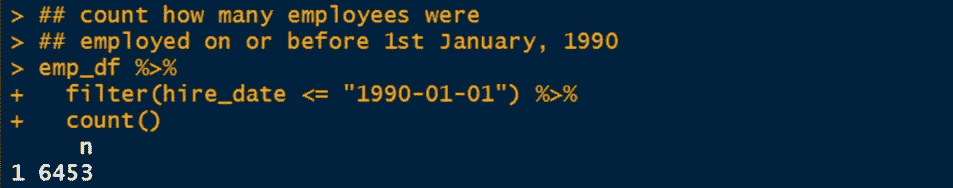

太神奇了！在 11，822 名雇员中，该公司在 1990 年 1 月 1 日或之前雇用了 6，453 人。

关于将 RStudio 连接到 PostgreSQL 数据库的讨论已经接近尾声。

哦…坚持住！让我在这里快速补充一下这一点。您也可以使用下面的代码来创建连接。这段代码与我们上面使用的代码的区别只是使用 RStudio API 来请求用户名和密码。

其实没什么区别，只是这段代码看起来比第一段更安全。如果您与其他人共享您的代码，并且不想泄露您的用户名和密码，那么使用此功能可能会有所帮助。

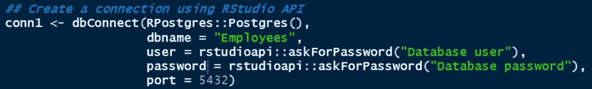

运行上面的代码时，会弹出一个对话框，要求您输入用户名和密码，如下所示。输入用户名和密码后，将会创建连接。

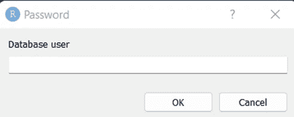

> **注意:**您只需要上面代码中的用户名和密码。您还可以使用 RStudio API 来询问数据库名称。

我认为这是可以理解的。我决定添加最后一部分，以展示您可以使用 RStudio 做类似的事情。你可以进一步探索。

你有兴趣学习如何[将 RStudio 连接到 MySQL 数据库](https://arimoroolayinka.medium.com/a-simple-guide-on-connecting-rstudio-to-a-mysql-database-d8a8ca6573fd)吗？连接 MySQL 数据库不像连接 PostgreSQL 数据库那样简单。然而，在我的文章中，我已经解释了将 RStudio 连接到 MySQL 数据库所需的一切。一定要看。

# **结论**

太神奇了！你已经走了很长的路，我很高兴你走了这么远。我向你的顽强和坚持到底的决心致敬。我相信你花时间学习这些概念是值得的，你会发现它们很有价值。

我有一份礼物给你——我已经上传了用于这个插图的完整 R 脚本到 GitHub 库[这里](https://github.com/Predicare1/Connecting-RStudio-to-SQL-databases/blob/main/connect-RStudio-to-PostgreSQL.R)。这个脚本减轻了您编写代码的压力，您可以快速运行代码。当然，要使用这个脚本，您需要调整脚本，比如更改数据库名、表名等等。

此外，在创建到数据库的连接之后，您可以做许多其他事情。您可以从 RStudio 更新数据库中的表或向表中添加新记录。本文为您提供了最大化 RStudio 和 SQL 功能的第一步，也是关键的一步。在这里，您可以阅读软件包和函数的文档，以便对从 RStudio 连接到的数据库执行不同的操作。

如果你喜欢这篇文章，请在评论区留下你的评论，与他人分享这篇文章。如果你能点击“鼓掌”图标(最多允许 50 次鼓掌)，这将对我意义重大。

作为 Coursera Guided Project Network 的一名基于项目的课程讲师，我教授过一些关于使用 R 的课程，尤其是 R tidyverse 系列包，包括 dplyr 包。你可以点击[这里](https://www.coursera.org/instructor/arimoro-olayinka)查看这些课程。谢谢大家！下次见！