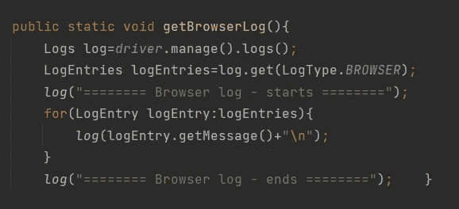

# 捕获失败测试的浏览器日志的简单指南

> 原文：<https://medium.com/geekculture/a-simple-guide-to-capture-browser-logs-for-failed-tests-f523073d6be3?source=collection_archive---------10----------------------->

Capture Browser Logs using Selenium by Sajitha

这将是一篇有趣的文章。

每当测试失败时，大多数开发人员都会跑来问“我能看看浏览器日志吗？”🙂

然而，我们自动化工程师常常不太注意捕捉浏览器日志。

我最近觉得这对开发人员准确定位问题很有帮助。所以…