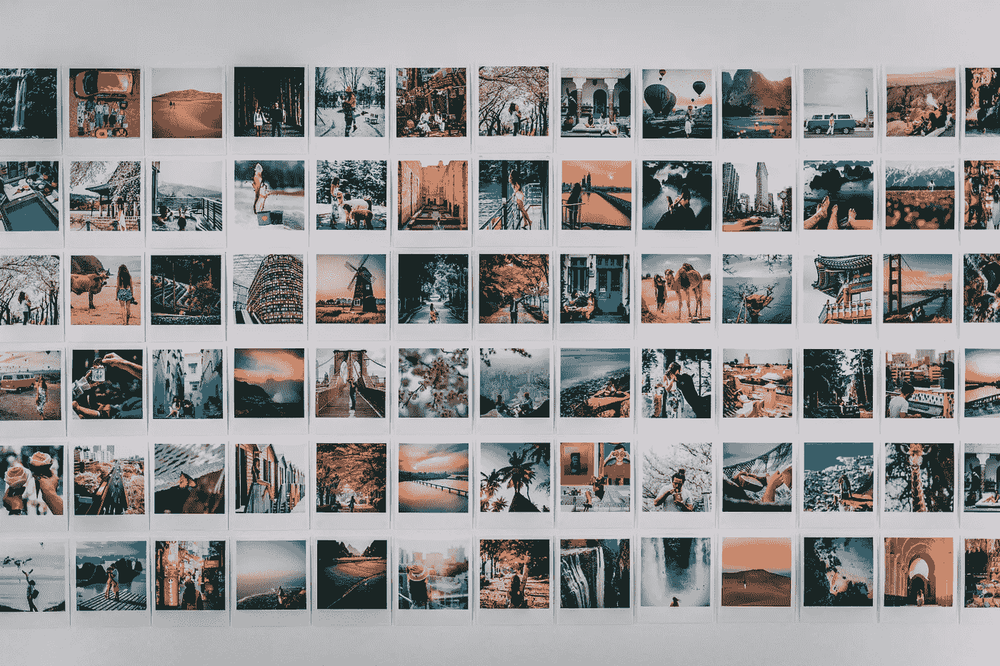
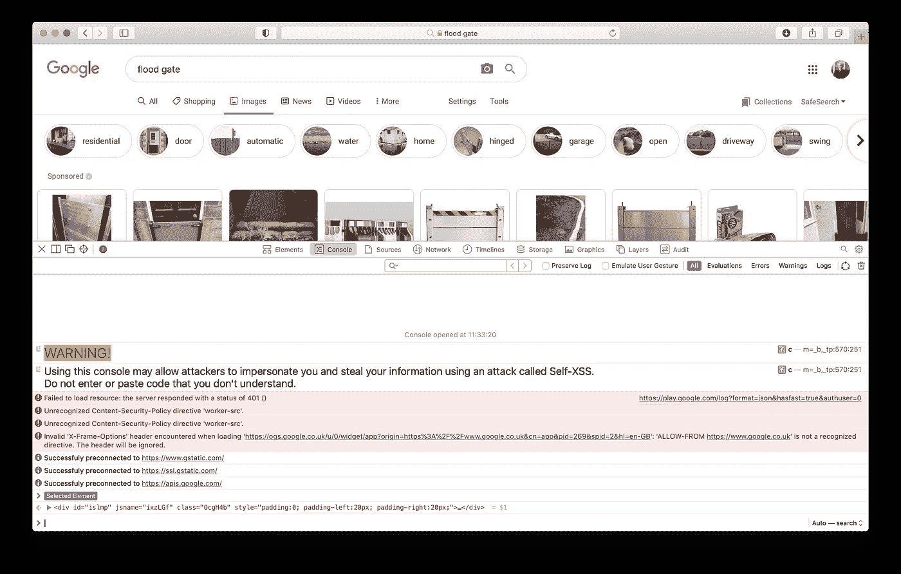
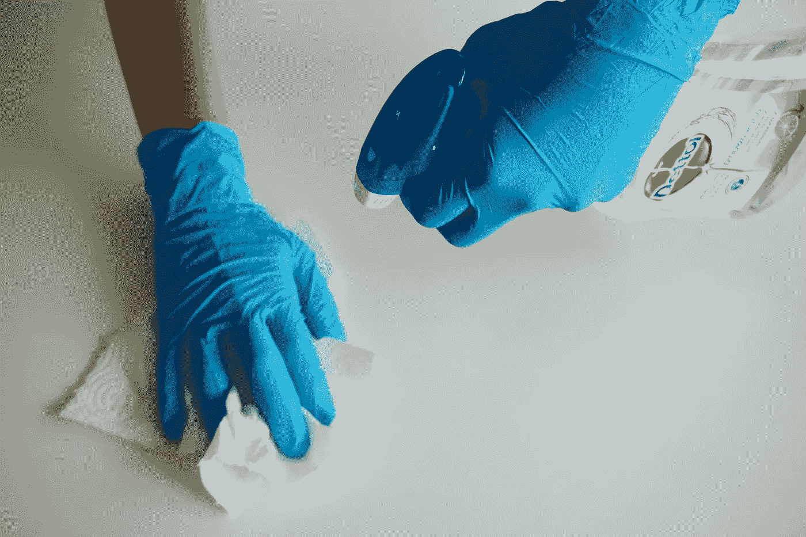
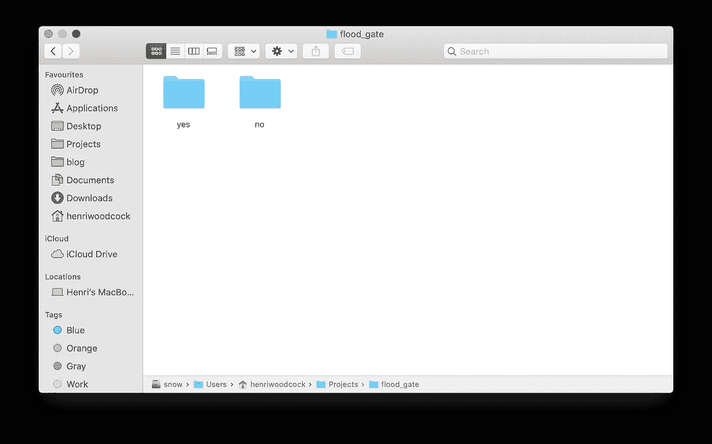

# 创建影像数据集的简单指南

> 原文：<https://medium.com/geekculture/a-simple-guide-to-creating-an-image-dataset-440543d21f9b?source=collection_archive---------2----------------------->

## 一个完整的端到端教程来创建一个没有网络抓取数据集！



Photo by [Taryn Elliott](https://www.pexels.com/@taryn-elliott?utm_content=attributionCopyText&utm_medium=referral&utm_source=pexels) from [Pexels](https://www.pexels.com/photo/white-and-black-picture-frame-4340919/?utm_content=attributionCopyText&utm_medium=referral&utm_source=pexels)

数据科学家喜欢创建模型，并竞相略微提高数据集的准确性。到目前为止，如此多的数据科学家已经使用了这些流行的数据集，以至于很难从它们身上学到任何新东西。它还阻止了数据科学从一个解决问题的学科变成一个更具工程性质的学科:略微调整模型以略微提高分数。

要在数据科学中做一些独特的事情，你必须自己创建一个数据集，并解决一个新问题！因为我们大多数数据科学家不太了解数据工程或 web 抓取，本指南将向您展示如何在不了解任何 web 抓取知识的情况下为您的独特问题制作图像数据集！本文将介绍如何为分类问题创建影像数据集，并将其分解为以下步骤:

1.  定义问题
2.  数据收集
3.  清理数据集

# 定义问题


Photo by [Sebastian Herrmann](https://unsplash.com/@officestock?utm_source=unsplash&utm_medium=referral&utm_content=creditCopyText) on [Unsplash](https://unsplash.com/s/photos/problem?utm_source=unsplash&utm_medium=referral&utm_content=creditCopyText)

创建新数据集的第一步是确定您的问题。你不能只是收集数据，然后希望你能弄清楚些什么。这方面的数据太多了！要解决图像分类问题，您需要决定要分类的类别。比如是狗的品种吗？还是创作画作的艺术家？当我创建数据集时，我知道我想从影像中对防洪资产进行分类，因此我开始列出要包含在我的数据集中的不同资产。

有了这个决定，你可以列出你想要分类的不同类别。对于我的数据集，这是:堤防，防洪闸，防洪墙，排水口，水库和堰。但是，你可以根据自己的喜好选择多或少！

# 数据收集

对于数据收集部分，我们可以用 google 找到自己喜欢的图片。我承诺没有网页抓取知识是必需的，这意味着这种方法将尽可能简单。你甚至不需要一个网页抓取包！

以下是步骤:

1.  去谷歌图片
2.  搜索你的关键词。例如“泄洪闸”
3.  转到页面的最底部，按下“加载更多”按钮
4.  重复步骤 3，直到不再出现“加载更多”按钮
5.  在网络浏览器上打开控制台，输入:`var urls = Array.from(document.querySelectorAll(‘.rg_i’)).map(el=> el.hasAttribute(‘data-src’)?el.getAttribute(‘data-src’):el.getAttribute(‘data-iurl’));
    var filtered = urls.filter(function (el) {
    return el != null;}); var hiddenElement = document.createElement(‘a’); hiddenElement.href = ‘data:text/csv;charset=utf-8,’ + encodeURI(filtered.join(‘\n’));
    hiddenElement.download = ‘file.csv’;
    hiddenElement.click();`

按下回车键将生成一个 CSV 文件，其中包含谷歌搜索中所有图片的链接。您现在可以将这个 CSV 重命名为您刚才搜索的类的名称。对您希望包含的每个类别重复此操作。



The console on Safari.

数据收集的下一步是下载 CSV 格式的图像。我们可以通过打开每个 CSV，然后遍历所有行来下载每个图像。对于这一步，我使用了`csv`和`requests`。先用`pip`安装`requests`(`csv`预装了 Python3):

```
pip install --upgrade pip
pip install requests
```

下面是一些伪代码，用于遍历 CSV 文件并下载所有图像。你可以在我的 [Github](https://github.com/henriwoodcock/automatic-asset-classification/blob/master/automatic_asset_classification/web_scrape/web_scraping.py) 上找到我使用的所有哨声和铃声的完整代码示例。

```
from pathlib import Path
import requests
import csvdataLoc = Path('data') #location where data is saved
csvLoc = dataLoc / 'csvs' # folder contained csvs in data folderclasses = ["class1", "class2"] #class namesfor class in classes:
  #csv files are named by class.csv
  with open(csvLoc / (str(class) + "_image_db.csv")) as csvfile:
    #create a list of rows 
    csvrows = csv.reader(csvfile, delimiter=',', quotechar='"') #create a folder to output images
  classLoc = dataLoc / class #if the folder does not exist make it
  if not classLoc.exists(): classLoc.mkdir() #number each image by number in csv
  i = 0
  for row in csvsrows:
    #imageurl is first (and only column)    
    imageurl = row[0] #imagename = "class_i.jpg"
    imagename = class + str(i) + ".jpg" result = requests.get(url, stream = True)
    image = result.raw.read() #save image into folder for that class
    open(classLoc / imagename, "wb").write(image)
```

这可能需要一些时间(取决于您的网速和要下载的图像数量)。所以请放心让它在后台运行。

一旦完成，如果使用与我上面相似的下载格式，你应该有一个文件夹，包含每个类的文件夹，里面有该类的图像。

# 清理数据集



Photo by [Anton](https://unsplash.com/@uniqueton?utm_source=unsplash&utm_medium=referral&utm_content=creditCopyText) on [Unsplash](https://unsplash.com/s/photos/cleaning?utm_source=unsplash&utm_medium=referral&utm_content=creditCopyText)

从谷歌下载数据意味着我们需要做一些最后的检查。这样做可以确保数据达到高标准。清洁准备就绪的图像包括三个部分:

1.  删除重复的图像。
2.  移除标签不正确的图像(从网上抓取)。
3.  裁剪图像。

## 1.移除重复图像

有许多不同的算法来消除重复的图像。我现在将解释其中的一些。第一项检查是验证没有损坏的图像(这可能是由于失败的文件下载)。我们可以通过在 Python 中编写一个试图打开每个图像的循环来做到这一点。在 Python 中，这可以通过一个`try`和`except`块来完成。如果我们无法打开图像，请删除文件。

移除损坏的图像后，我们可以开始删除重复的文件。我们现在来看看实现这一点的两种方法。(同样，这个代码可以在我的 Github [这里](https://github.com/henriwoodcock/automatic-asset-classification/blob/master/automatic_asset_classification/web_scrape/hashing_functions.py)和[这里](https://github.com/henriwoodcock/automatic-asset-classification/blob/master/automatic_asset_classification/web_scrape/duplicate_images.p)找到)。

第一种方法包括使用一个*散列函数*。哈希函数将数据从任意大小映射到固定大小。散列函数的好处是，在计算上不可能找到映射到同一输出的两个输入(因此不太可能发生)。我们可以通过检查任意两个图像是否有相同的*哈希值*来利用这一点。为此，将图像导入 NumPy 数组，并通过比较将图像传递给哈希函数的结果，将每个图像与其他图像进行比较。为此，我使用了 md5 散列函数。下面是一些伪代码来了解这一点的基本思想:

```
import hashlib
hash_keys = {}with open(imagename, 'rb') as f:  
  #produce hash of file
  imagehash = hashlib.md5(f.read()).hexdigest()#check if file already in hash_keys            
if imagehash not in hash_keys:
  hash_keys[filehash] = imagename 
  #if file already in hash_keys add to duplicates            
else:
  duplicates.append(imagename)
```

第二种方法查找相似的图像，但不仅仅是精确的副本。我们可以使用*海明距离*来计算两幅图像之间的相似度。汉明距离等于两个图像之间的差异数。因为它会计算差异，所以必须调整图像的大小，使它们具有相同的尺寸。然后，我们可以基于阈值移除图像，例如如果 10%或更多的值不同。下面你可以看到一个汉明距离的例子:

```
x = [1,5,6,9]
y = [2,5,6,2]hamming_distance(x,y) = |1-2| + |5-5| + |6-6| + |9-2|
                      = 1+0+0+1 
                      = 2 percentage_difference = hamming_distance(x,y) / len(x)
                      = 2 / 4
                      = 0.5
```

## 2.删除不正确的图像

移除不正确的图像是以半自动的方式完成的。对于每个类别，取前 50 幅图像，并将其标记为“是”(如果该图像属于该类别)和“否”(如果该图像不属于该类别)。现在你微调一个预先训练好的神经网络来预测该类别中其余图像的“是”或“否”。如果模型预测“是”，你保留图像，如果“否”，你删除图像。在我的 [Github](https://github.com/henriwoodcock/automatic-asset-classification/blob/master/automatic_asset_classification/web_scrape/image_processing.py) 上可以看到用 Fastai 做这件事的例子。



An example of the yes/no folder for Flood Gate.

## 3.裁剪图像以备使用

在所有上述处理之后，剩下的数据集几乎是最终形式的。准备数据以备使用的最后一步是裁剪图像，使对象居中，并且所有图像都是方形的。这都是手动完成的，以避免自动算法将错误的对象放在中心的问题，但是如果您有太多的图像要查看，您也可以使用自动算法。进行此操作时，还可以检查图像是否被正确标记。

这样做是为了确保在数据集上开发模型时，它只从感兴趣的对象中学习要素。这在图像包含多个对象的情况下尤其重要，您不希望它学习错误的标签。图像是方形的，因为这意味着可以使用许多预训练的架构，这已经成为深度学习的标准。

# 摘要

您现在已经在没有任何 web 抓取知识的情况下创建了图像数据集！您现在可以在您的项目中使用它了！

我将很快就这种方法的利弊谈几点看法。

首先，你不需要任何网页抓取软件或软件包。你可以下载数以千计的与谷歌搜索相关的图片，这意味着你花更少的时间编写脚本，花更多的时间使用你的新数据集。

但是，有大量的手工工作；你必须谷歌搜索每个类别，手动向下滚动，直到没有更多的图片。你也仅限于谷歌搜索，有时你可能知道更好的网站，更具体地与你的主题相关。要使用这些网站，你需要为网站写一个特定的脚本。

总的来说，这种方法为您提供了一种易于使用的解决方案来帮助您开发影像数据集。使用这样的方法意味着您可以很快开始开发您的模型并测试解决问题的可行性。

**免责声明:**在谷歌上找到的图片属于许多不同的版权许可。查法律很重要。以下使用案例可以豁免:非商业研究和私人学习、引用、新闻报道、教育和其他一些用途。如果您希望以任何其他方式使用这些数据(如在线发布)，您需要获得每个版权所有者的许可。

## 参考

1.  Nayak，P. [从谷歌图像中创建一个图像数据集，并使用 Fast.ai](https://nayakpplaban.medium.com/create-an-image-dataset-from-google-images-and-classify-the-images-using-fastai-c4d67d60f19) 对图像进行分类。*中等。* 2020。
2.  梅内塞斯。应用密码学手册。博卡拉顿:CRC 前。1997 年。

3.编码理论的第一课(牛津应用数学和计算科学系列)。美国牛津大学出版社。1986.