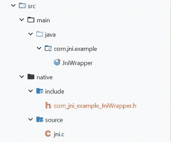
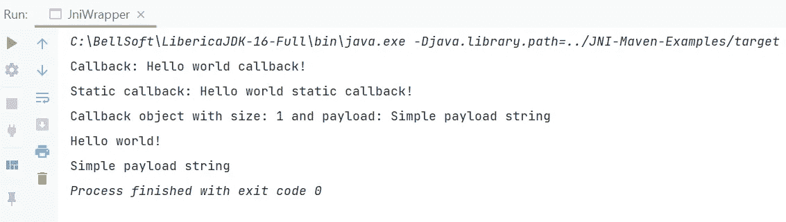

# 使用本地 Maven 插件的 Java 本地接口(JNI)简单指南

> 原文：<https://medium.com/geekculture/a-simple-guide-to-java-native-interface-jni-using-native-maven-plugin-e01f4077a8a5?source=collection_archive---------1----------------------->


Photo by [sigmund](https://unsplash.com/@sigmund) on Unsplash

有时需要从 **Java** 中调用 **C/C++** 代码，例如使用 **CUDA/OpenCL** 进行 **GPGPU** 计算，或者使用 **Vulkan/OpenGL 渲染复杂的 **3D** 图形。**在这种情况下，调用 **C++** 函数最简单的方法就是使用[**Java 本地接口**](https://docs.oracle.com/javase/8/docs/technotes/guides/jni/spec/intro.html#java_native_interface_overview) **(JNI)。**同时，方便将 **C/C++** 和 **Java** 源码保存和编译在一起——这就是 [**原生 Maven 插件**](https://www.mojohaus.org/maven-native/native-maven-plugin/) 发挥作用的地方。

本文将提供用于 **Windows** 和 **macOS 的**原生 Maven 插件**的配置示例，使用 JDK8** 和示例代码从 **Java** 调用 **C/C++** ，反之亦然。

这个项目在我的 GitHub 这里有[。](https://github.com/dredwardhyde/jni-maven-example)

## macOS 配置

这个配置是用最新的 **Xcode** 在 **macOS Big Sur 上测试的。**请注意，**原生 Maven 插件**需要 [**命令** - **线条工具**](https://developer.apple.com/forums/thread/652240) 安装。

```
<profile>
  <id>**macOS**</id>
  <activation>
    <os>
      <family>**mac**</family>
    </os>
  </activation>
  <properties>
    <os_name>**mac**</os_name>
    ***<!-- should follow the pattern lib*library_name*.dylib-->***<lib_name>**libjnilibrary.dylib**</lib_name>
  </properties>
  <build>
    <plugins>
      <plugin>
        <groupId>**org.codehaus.mojo**</groupId>
        <artifactId>**native-maven-plugin**</artifactId>
        <version>**1.0-alpha-11**</version>
        <extensions>**true**</extensions>
        <configuration>
          <javahOS>**${os_name}**</javahOS>
          <sources>
            <source>
              ***<!-- path to the C/C++ sources -->*** <directory>**src/native/source**</directory>
              <fileNames>
                <fileName>**jni.c**</fileName>
              </fileNames>
            </source>
            ***<!-- in this example - path to generated JNI header -->*** <source>
              <directory>**src/native/include**</directory>
            </source>
          </sources>
          <compilerProvider>**generic-classic**</compilerProvider>
          <compilerExecutable>**gcc**</compilerExecutable>
          ***<!-- compiler options -->*** <compilerStartOptions>
            <compilerStartOption>**-m64**</compilerStartOption>
            <compilerStartOption>**-Wall**</compilerStartOption>
            <compilerStartOption>**-Wextra**</compilerStartOption>
            <compilerStartOption>**-O3**</compilerStartOption>
            <compilerStartOption>**-I**</compilerStartOption>        
            <compilerStartOption>
                   **${env.JAVA_HOME}/include**
            </compilerStartOption>
            <compilerStartOption>**-I**</compilerStartOption>     
            <compilerStartOption>
                   **${env.JAVA_HOME}/include/darwin**
            </compilerStartOption>
          </compilerStartOptions>
          <linkerOutputDirectory>**target**</linkerOutputDirectory>
          <linkerExecutable>**gcc**</linkerExecutable>
          ***<!-- linker options -->*** <linkerStartOptions>
            <linkerStartOption>**-m64**</linkerStartOption>
            <linkerStartOption>**-shared**</linkerStartOption>
          </linkerStartOptions>
          <linkerEndOptions>
            <linkerEndOption>
              **-o ${project.build.directory}/${lib_name}**
            </linkerEndOption>
          </linkerEndOptions>
        </configuration>
        <executions>
          <execution>
            <id>**javah**</id>
            <phase>**compile**</phase>
            <goals>
              <goal>**initialize**</goal>
              <goal>**compile**</goal>
              <goal>**link**</goal>
            </goals>
          </execution>
        </executions>
      </plugin>
    </plugins>
  </build>
</profile>
```

## Windows 10 (Visual Studio 2017)配置

遗憾的是，**原生 Maven 插件** [**并没有为比 MSVC2013** 更新的 MSVC **提供**](https://www.mojohaus.org/maven-native/native-maven-plugin/envfactory.html) 环境工厂，所以我为 MSVC2017x64 创建了自己的工厂。你需要克隆 [**这个**](https://github.com/dredwardhyde/visual-studio-2017-support) **仓库，使用 *mvn install* 命令*编译安装。***

```
<profile>
  <id>**windows**</id>
  <activation>
    <os>
      <family>**windows**</family>
    </os>
  </activation>
  <properties>
    <os_name>**windows**</os_name>
    ***<!-- note that the libary name differs 
         from the macOS configuration-->*** <lib_name>**jnilibrary**</lib_name>
  </properties>
  <build>
    <plugins>
      <plugin>
        <groupId>**org.codehaus.mojo**</groupId>
        <artifactId>**native-maven-plugin**</artifactId>
        <version>**1.0-alpha-11**</version>
        <extensions>**true**</extensions>
        <dependencies>
          <dependency>
            <groupId>**com.edwardhyde**</groupId>
            <artifactId>**vc-2017-support**</artifactId>
            <version>**1.0-SNAPSHOT**</version>
          </dependency>
        </dependencies>
        <configuration>
          <javahOS>**${os_name}**</javahOS>
          <compilerProvider>**msvc**</compilerProvider>
          ***<!-- custom environment factory for MSVC2017-->*** <envFactoryName>
              **com.edwardhyde.MSVC2017x64EnvFactory**
          </envFactoryName>
          <sources>
            <source>
              <directory>**src/native/source**</directory>
              <fileNames>
                <fileName>**jni.c**</fileName>
              </fileNames>
            </source>
            <source>
              <directory>**src/native/include**</directory>
            </source>
          </sources>
          <compilerProvider>**msvc**</compilerProvider>
          <compilerStartOptions>
            ***<!-- create DLL-->***             
            <compilerStartOption>**/LD**</compilerStartOption>
            <compilerStartOption>**/MD**</compilerStartOption>
            <compilerStartOption>**-I**</compilerStartOption>
            <compilerStartOption>
                   **${env.JAVA_HOME}\include**
            </compilerStartOption>
            <compilerStartOption>**-I**</compilerStartOption>  
            <compilerStartOption>
                   **${env.JAVA_HOME}\include\win32**
            </compilerStartOption>
          </compilerStartOptions>
          <linkerOutputDirectory>**target**</linkerOutputDirectory>
          <linkerProvider>**msvc**</linkerProvider>
          <linkerFinalName>**${lib_name}**</linkerFinalName>
          <linkerFinalNameExt>**dll**</linkerFinalNameExt>
          <linkerStartOptions>
            <linkerStartOption>**/INCREMENTAL:NO**</linkerStartOption>
            <linkerStartOption>**/DLL**</linkerStartOption>
          </linkerStartOptions>
        </configuration>
        <executions>
          <execution>
            <id>**javah**</id>
            <phase>**compile**</phase>
            <goals>
              <goal>**initialize**</goal>
              <goal>**compile**</goal>
              <goal>**link**</goal>
            </goals>
          </execution>
        </executions>
      </plugin>
    </plugins>
  </build>
</profile>
```

如果要从 **Java** 中调用 **C/C++** native 函数，需要将需要的方法标记为 native，并使用 [**javah**](https://docs.oracle.com/javase/8/docs/technotes/tools/windows/javah.html) **(或者 JDK9+** 中的 javac -h)命令行工具生成 **JNI** 头。

```
**package** com.jni.example;

**public class** JniWrapper {
    **public native** String getString();
}
```

但是我们可以使用 [**Exec Maven 插件**](https://www.mojohaus.org/exec-maven-plugin/) **:** 来实现

```
<plugins>
  <plugin>
    <groupId>**org.codehaus.mojo**</groupId>
    <artifactId>**exec-maven-plugin**</artifactId>
    <version>**1.5.0**</version>
    <executions>
      <execution>
        <id>**generate-jni-headers**</id>
        <phase>**generate-sources**</phase>
        <goals>
          <goal>**exec**</goal>
        </goals>
        <configuration>
          <workingDirectory>**${project.basedir}**</workingDirectory>
          <executable>**javah**</executable>
          <arguments>
            <argument>**-verbose**</argument>
            <argument>**-jni**</argument>
            <argument>**-classpath**</argument>
            <argument>**${project.build.sourceDirectory}**</argument>
            <argument>**-d**</argument>
            ***<!-- directory where generated header will be placed -->* **            <argument>
                 **${project.basedir}/src/native/include**
            </argument>
            ***<!-- target class-->*** <argument>**com.jni.example.JniWrapper**</argument>
          </arguments>
        </configuration>
      </execution>
    </executions>
  </plugin>
</plugins>
```

因此，**com _ JNI _ example _ JNI wrapper . h**将被创建 **:**



Project structure

正如你在这里看到的，每个 **JNI** 方法至少有两个参数:

*   **JNIEnv *—*** 一个指针指向一个存储所有 **JNI** 函数指针的结构。
*   **job object—**一个对该方法附加到的 Java 对象的引用(我们的 ***JniWrapper*** 类的实例)。

```
*/* DO NOT EDIT THIS FILE - it is machine generated */* **#include** <jni.h>
*/* Header for class com_jni_example_JniWrapper */* **#ifndef** _Included_com_jni_example_JniWrapper
**#define** _Included_com_jni_example_JniWrapper
**#ifdef** __cplusplus
**extern "C"** {
**#endif** */*
 * Class:     com_jni_example_JniWrapper
 * Method:    getString
 * Signature: ()Ljava/lang/String;
 */* **JNIEXPORT jstring JNICALL 
Java_com_jni_example_JniWrapper_getString(JNIEnv *, jobject);**

**#ifdef** __cplusplus
}
**#endif
#endif**
```

现在我们需要实现我们的本机 **getString()** 方法。在这里，我将举例说明如何调用**静态和实例方法，用本地代码创建 Java 对象，以及更多内容:**

```
**#include "com_jni_example_JniWrapper.h"
#include** <stdio.h>

**#define** STRING_RETURN **"Hello world!"
#define** STRING_CALLBACK **"Hello world callback!"
#define** STRING_CALLBACK_STATIC **"Hello world static callback!"
#define** STRING_PAYLOAD **"Simple payload string"

JNIEXPORT jstring JNICALL Java_com_jni_example_JniWrapper_getString(JNIEnv *env, 
                                          jobject thiz) {
    // get the class of an object**
    jclass cls_foo = (*env)->GetObjectClass(**env, thiz**); **//** ***callback* instance method with one *String* parameter 
    // and *void* result** jmethodID callback = (*env)->GetMethodID(**env**,
                                           **cls_foo**, 
                                           **"callback"**, 
                                           **"(Ljava/lang/String;)V"**); **//** ***callbackObject* instance method with one 
    // *List<String> arrayList*** **parameter and *String* result**
    jmethodID callbackWithObject = (*env)->GetMethodID(**env**,
                             **cls_foo**,
                            **"callbackObject"**,
                            **"(Ljava/util/List;)Ljava/lang/String;"**); **//** ***callback* staticmethod with one *String* parameter 
    // and *void* result
**    jmethodID callbackStatic = (*env)->GetStaticMethodID(**env**,
                                           **cls_foo**,
                                           **"callbackStatic"**,
                                           **"(Ljava/lang/String;)V"**); **// construct a new** ***java.lang.String*** **objects from 
    // an array of characters in UTF-8 encoding**
    jstring jStringRegular = (*env)->NewStringUTF(**env**,
                                           **STRING_CALLBACK**);

    jstring jStringStatic = (*env)->NewStringUTF(**env**,
                                           **STRING_CALLBACK_STATIC**); **// call instance method with *void* result**
    (*env)->CallVoidMethod(**env, thiz, callback, jStringRegular**); **// call static instance method with *void* result** (*env)->CallStaticVoidMethod(**env, 
                                 thiz,** 
                                 **callbackStatic, 
                                 jStringStatic**); **// delete the local references**
    (*env)->DeleteLocalRef(**env, jStringRegular**); (*env)->DeleteLocalRef(**env, jStringStatic**);

    jclass cls = (*env)->FindClass(**env, "java/util/ArrayList"**); **// get the default constructor for *java.util.ArrayList* class** jmethodID constructor = (*env)->GetMethodID(**env, 
                                                cls, 
                                                "<init>"**, 
                                                **"()V"**); **// create a new instance of *java.util.ArrayList***
    jobject arraylist = (*env)->NewObject(**env, cls, constructor**);

    jstring jStringPayload = (*env)->NewStringUTF(**env,  
                                                  STRING_PAYLOAD**);
    **// get the *add* method**
    jmethodID addMethod = (*env)->GetMethodID(**env, 
                                           cls,** 
                                           **"add"**, 
                                           **"(Ljava/lang/Object;)Z"**); **// call the *add* method that returns *boolean* **    (*env)->CallBooleanMethod(**env, arraylist,** 
                             **addMethod, jStringPayload**); **// call the *callbackObject* method that returns *String***
    jobject resultString = (*env)->CallObjectMethod(**env,** 
                                                 **thiz,** 
                                                 **callbackWithObject,**
                                                 **arraylist**);
    **// convert the *jobject to*****an array of characters** const char* str = (*env)->GetStringUTFChars(**env,** 
                                             **(jstring) resultString,**
                                                **NULL**);
    **// print returned string**
    printf(str); (*env)->ReleaseStringUTFChars(**env, resultString, str**); (*env)->DeleteLocalRef(**env, jStringPayload**); (*env)->DeleteLocalRef(**env, arraylist**);

    **return** (*env)->NewStringUTF(**env, STRING_RETURN**);
}
```

最后，让我们在 ***JniWrapper*** 类中实现相应的 **Java** 方法，一起测试一切:

```
**package com.jni.example;**

import java.util.*List*;

@SuppressWarnings("unused")
**public class JniWrapper {**
    **private static final String *LIB_NAME* = "jnilibrary";

    static {
        // load the native library
        System.*loadLibrary*(*LIB_NAME*);
    }** 
    **public static void callbackStatic(String string)** {
        System.*out*.println("Static callback: " + string);
    }

    **public native String getString()**;

    **public void callback(String string)** {
        System.*out*.println("Callback: " + string);
    }

    **public String callbackObject(*List*<String> arrayList)** {
        System.*out*.println("Callback object with size: "
                + arrayList.size()
                + " and payload: "
                + arrayList.get(0));
        **return arrayList.get(0);**
    }

    **public static void main(String[] args)** {
        JniWrapper jni = new JniWrapper();
        System.*out*.println(jni.getString());
    }
}
```

**现在运行 *JniWrapper.main()* 方法，其中*-djava . library . path*JVM 选项指向*目标*目录:**



Execution results