# 超级马里奥兄弟环境下强化学习的简单指南

> 原文：<https://medium.com/geekculture/a-simple-guide-to-reinforcement-learning-with-the-super-mario-bros-environment-495a13974a54?source=collection_archive---------13----------------------->

Photo by [@cpwrm](http://twitter.com/cpwrm) on Unsplash

# 理论

假设我们想要设计一个能够完成超级马里奥兄弟游戏第一关的算法。我们将如何做到这一点？

这个游戏的目标很简单——尽可能快地拿到关卡最右端的旗子。为此，我们需要观察****游戏的当前状态 *s*** ，通过按下控制按钮移动马里奥(**姑且称之为动作 *a*** )，并检查在此之后我们离目标还有多远(**在强化学习动作中的表现由奖励 *r* )，**观察一些**新状态*s’*(在我们的新框架中结果，我们将得到一系列的**动作、状态和奖励**称为**轨迹:******

**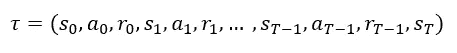**

**A trajectory of **(s,a,r)** tuples**

**用更正式的术语来说，这种环境可以描述为一个 [**马尔可夫决策过程**](https://en.wikipedia.org/wiki/Markov_decision_process) 如果我们通过一次考虑多个帧来结合角色的速度来行动。这意味着状态之间的转换只取决于最新的状态和动作对，而没有先前的历史。**

**让我们称之为估计器(可以是神经网络),它将**作为状态**,并告诉我们采取哪个动作**作为策略**,因此我们的目标是最大化轨迹上的预期回报:**

**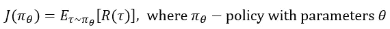**

**Policy performance **J****

# **政策梯度**

**为了最大化预期回报，我们希望通过梯度上升来优化策略参数，就像任何其他神经网络一样:**

****

**政策绩效 ***J*** 的梯度称为**政策梯度。**现在我们需要以一种计算上可行的形式来表达策略梯度。首先，让我们推导出**政策梯度**的解析形式:**

****

**正如你在最后一个公式中看到的，这里我们取一个轨迹概率的对数，可以这样表示:**

**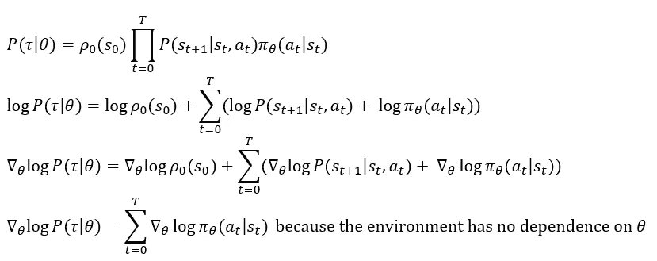**

**因此，**政策梯度**的推导采用如下形式:**

**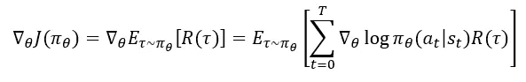**

**但是，实际上，我们应该只增加考虑其后果的行动的可能性，并在**【0，1】**之间引入贴现因子 **γ** ，作为对**未来报酬**的不确定性的惩罚**

**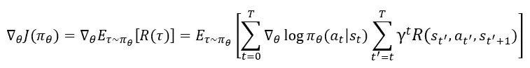**

**我们可以通过收集一组轨迹来估计这种期望，在这些轨迹中，代理根据当前策略产生动作。这一系列优化被称为**基于策略的方法。****

## **基线**

**让我们考虑随机变量的参数化概率分布，所以:**

**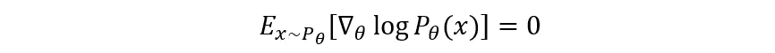**

**这意味着我们可以从策略梯度表达式中增加或减去任何**基线**函数，该函数仅取决于状态，而不会改变结果预期:**

**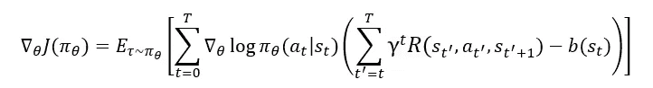**

**在实践中，基线最常见的选择是由神经网络(有时称为**评论家**)近似的**策略上的价值函数** ***V(s)*** ，它与策略同时更新。一般来说，**基线**有助于减少方差，增加训练过程的稳定性。**

# **具有广义优势估计的近似策略优化**

**由于梯度估计的高方差，常规策略梯度方法的采样效率很差。这是由影响未来回报的行为的信用分配的困难造成的，特别是在长轨迹的环境中。这种差异有时可以通过将**基线用作上述**来减少。但是还有另外一种方法来估计一个轨迹的回报——**重要性抽样。**在这种方法中，可以用不同的策略来计算预期报酬，并在以后通过**重要性比率 *r* :** 来细化**

**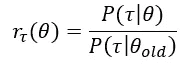**

**因此，目标函数采用以下形式，其中*可以是**贴现回报，如在政策梯度法**或**中的优势函数** **，如在**[**【GAE**](https://arxiv.org/abs/1506.02438)**(下面解释)**:***

***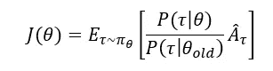***

***如果两个政策相同，那么这个公式直接转化为**政策梯度**:***

******

***实际上，**重要率**只取决于政策，不取决于环境:***

***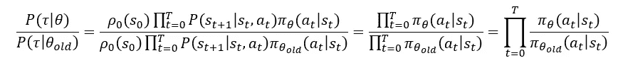***

***策略梯度的**低样本效率的另一个原因是，它需要使用**新策略**来收集样本的**新轨迹**以计算**下一个梯度更新**。使用旧策略收集的旧样本不可重复使用。因此，为了克服这个问题，我们可以引入一个**代理目标函数**，只要**新旧策略相似**，它的优化就能保证策略的改进。这个误差可以由这两个策略之间的 KL 差异来限定。增加的约束有助于我们不要采取会损害训练进度的过于乐观的行动。*****

***考虑到这些事实，[**TRPO**](https://arxiv.org/pdf/1502.05477.pdf)**论文介绍了一种新颖的方法，旨在最大化目标函数，同时使新旧策略之间的**KL-距离**足够小(所谓的**信任区域约束**):*****

*****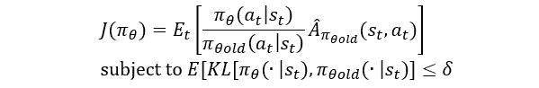*****

*****[**TRPO**](https://arxiv.org/pdf/1707.06347.pdf) **objective function*******

*******TRPO** 的作者提出了一种相当复杂的方法来近似解决这个问题，但是 OpenAI 通过在他们的 [**近似策略优化**](https://arxiv.org/pdf/1707.06347.pdf) 论文中引入**裁剪代理目标**函数，创建了一种限制策略更新大小的新方法:*****

*****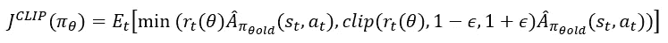*****

*****最小化内的第一项同上，但在第二项中，**比值被限幅在(1**–**ε，1+ε)** 之间。*****

*****当在具有策略**(演员)**和值**(评论家)**函数的共享参数的神经网络上应用 PPO 时，除了**裁剪代理**之外，目标函数还与值估计的**误差(第二项)**和 [**熵加成**](https://arxiv.org/pdf/1602.01783.pdf) **(第三项)**相结合，以鼓励充分探索(与 **c(1)*******

**********

*****价值估计的误差只是实际收益和评论家估计的收益之间的 MSE 损失。*****

*****此外，由于截取的替代目标函数，**PPO 算法允许我们在相同样本上运行多个时期的梯度上升**，而不会损害我们的策略。**这种方法极大地提高了采样效率。*******

## *****优势函数*****

*****关于 PPO 算法，我们需要弄清楚的最后一件事是**如何计算优势值**。与策略梯度方法不同，PPO 算法意味着使用两个估计器— **actor 和 critical**。第二个——批评家**——返回给定状态的预期收益的估计值。因此，自然地，我们希望使用这个估计来计算 advantage — **一个告诉我们模型所选择的行为是否会导致比我们预期的更好或更差的回报的值**:*******

***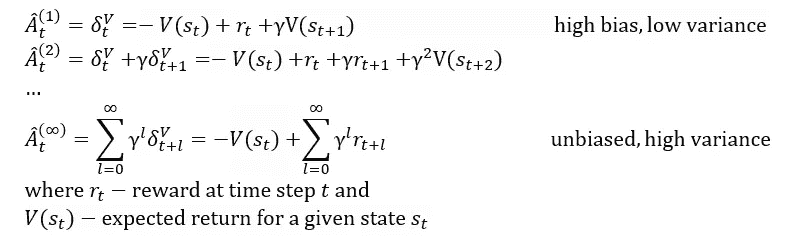***

***我们采用优势的指数加权平均值来平衡偏差和方差。这就是所谓的 [**广义优势估计**](https://arxiv.org/pdf/1506.02438.pdf) **:*****

***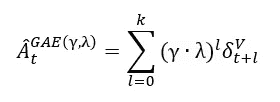***

# ***双深度 Q 网络***

***解决强化学习问题的另一种方法是近似**一个最优行动值函数**，如果我们从状态 ***s*** 开始并采取一些行动 ***a*** ，它会给我们最大的期望回报:***

***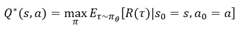***

*****Optimal Action-Value function*****

***这个函数服从**贝尔曼方程，**它告诉我们，如果状态*的最优值****Q****s 已知所有可能的动作*，那么最优策略是选择动作*最大化报酬加上你下一步到达的状态值:******

*****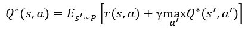*****

*******The Bellman equation (the next state s’ is sampled from the environment’s transition rules P)*******

*****用于估计所有状态-动作对的最优 ***Q*** 值的最简单(也是最老的)算法是[**Q-学习**](https://link.springer.com/content/pdf/10.1007/BF00992698.pdf) 。它假设我们对于所有这样的对有一个大的查找表，并且在一个情节内，估计发生如下:*****

*   ****在时间步*观察当前状态 ***s********
*   ****选择并执行一个动作 ***一个当前状态具有最高*值的**** *(或者有时选择随机动作— **它被称为ϵ-greedy 方法**)。*****
*   ****在时间步 ***t+1 观察下一个状态***s’*和奖励**r’*******。****
*   *根据以下公式更新 **Q 值。这里我们估计 *Q'*** 出最佳 **Q 值**为下一个状态，但是哪个动作 ***a'*** 导致这个最大值 **Q** 并不十分重要:*

*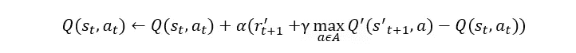*

*记忆所有状态-动作对的所有 ***Q*** 值是不切实际的。一个更好的方法是使用一个函数来逼近 ***Q*** 值。这就是神经网络发挥作用的地方。*

*一种叫做[**Deep Q-Network**](https://www.cs.toronto.edu/~vmnih/docs/dqn.pdf)的算法，通过引入两种创新方法——**经验重放**和**定期更新目标网络**，大大提高了训练稳定性，降低了资源需求。*

***经验重放**机制使用固定大小的单个重放存储器，其中存储了*N 个 ***(s，a，r，s’)***元组。这些样本是在训练期间从重放存储器中随机抽取的。**它显著提高了采样效率，降低了观察序列之间的相关性。****

****周期性更新的目标网络**意味着保持一个单独的克隆的神经网络实例，其权重被冻结，并且仅在每个 ***C*** 步骤与主导网络同步。该网络用于在训练期间估计目标 ***Q*** 值。**这种机制减少了短期波动的影响，从而稳定了训练过程。****

****深度 Q 网络**的损失函数看起来像这样(其中***【D】***是来自重放存储器的均匀随机采样):**

**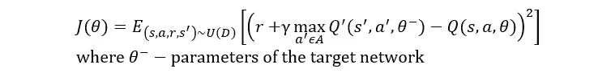**

****Deep Q-Network loss function****

**不幸的是， **Q-Learning** (以及基于它的 **DQN** )算法有一个重大缺陷——**它倾向于明显高估动作值**。这是因为 **Q-Learning** 算法使用相同的样本集来寻找最佳行动(具有最高的预期回报)并估计行动值。因此，如果该动作的值被高估，并且被选为最佳动作，那么 ***Q*** 的值也被高估。如果对所有 ***Q*** 值的高估不一致(这很大程度上取决于环境的转变规则和行动空间的大小)，我们将花费更多的时间探索这种非最优状态，学习过程将会很慢。你可以在这里 找到更正式的解释 [**。**](https://papers.nips.cc/paper/2010/file/091d584fced301b442654dd8c23b3fc9-Paper.pdf)**

**这就是为什么在 2010 年， **Hado van Hasselt** 推出了一种估算*Q 值的新方法，称为 [**双 Q-learning**](https://papers.nips.cc/paper/2010/file/091d584fced301b442654dd8c23b3fc9-Paper.pdf) 。该方法使用两个估值器 ***A*** 和 ***B，*** 交替更新。如果我们想要更新估计量 ***A*** ，那么使用估计量 ***B*** 来评估下一步的 ***Q*** 值。这种方法解决了高估问题，因为其中一个估计器可能会看到高估动作 ***a1*** 的样本，而另一个估计器会看到高估动作 ***a2 的样本。******

**因此，在 2015 年，同一个团队发表了一篇论文，其中有一个更新版本的 **DQN** 算法，称为 [**双深度 Q-网络**](https://arxiv.org/abs/1509.06461) ，它具有以下损失函数:**

**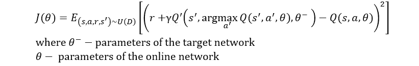**

****Double Deep Q-Network loss function****

**正如你在这里看到的， **argmax** 中动作的选择是由**在线网络**决定的，所以这个价值估计遵循了根据当前值的贪婪策略，但是我们使用**目标网络**来评估这个策略的价值。**我们可以通过定期将目标网络**的权重与**在线网络**同步或者**切换这两个网络的角色来更新目标网络**。这个损失函数将在本文后面的练习部分使用。**

# **实践**

**在本文的练习部分，我们将使用来自超级马里奥兄弟****的第一关。**游戏作为一种环境。默认情况下，单次观察是一张**240×256**像素的 RGB 图像，所以我们需要编写几个 [**包装器**](https://github.com/openai/gym/tree/master/gym/wrappers) 将其转换为分辨率为**84×84**像素的灰度图像。同样，并不是所有的观察值都有用，所以我们将只使用**每四个观察值**和 [**将它们堆叠在一起**](https://github.com/openai/gym/blob/master/gym/wrappers/frame_stack.py) :****

****现在我们可以创建我们的环境并且**将随机种子设置为固定值以获得可重复的结果**。同样，为了简单起见，**动作空间被限制为两个动作**——向右移动以及向右移动和跳跃的组合:****

****在下面的所有实现中，我试图使用相同的模型架构、优化器、学习率和常见的超参数(如 gamma)来直接比较算法的效率。****

## ****政策梯度****

****策略梯度算法的**实现直接遵循上一节描述的算法，并使用 [**PyTorch 发行版**](https://pytorch.org/docs/stable/distributions.html) 包:******

******Policy Gradient implementation******

********

******The plot of average reward per 10 episodes******

## ****双深度 Q 网络****

******DDQN** 的实现与上述理论仅在一个细节上有所不同——使用[**smoothl loss**](https://pytorch.org/docs/stable/generated/torch.nn.SmoothL1Loss.html)**代替 [**MSE**](https://pytorch.org/docs/stable/generated/torch.nn.MSELoss.html) 以获得更好的结果:******

********Double Deep Q-Network implementation********

******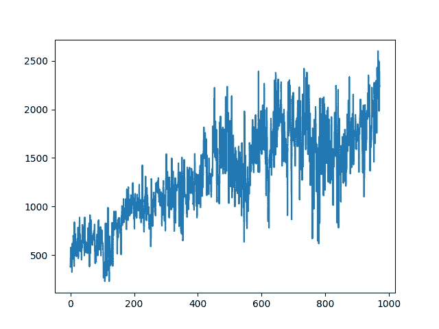******

********The plot of average reward per 10 episodes********

## ******具有广义优势估计的近似策略优化******

********PPO+GAE** 算法通过引入随机小批量训练稳定性，尽可能遵循理论解释来实现；******

********PPO+GAE implementation********

******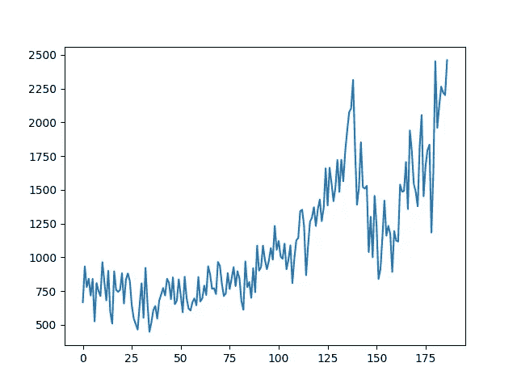******

********The plot of average reward per 10 episodes********

## ******结果******

******从上面的图中可以看出，所述算法的相对样本效率符合其理论估计值。******

************

********这个项目在我的 GitHub 上也有******。**********