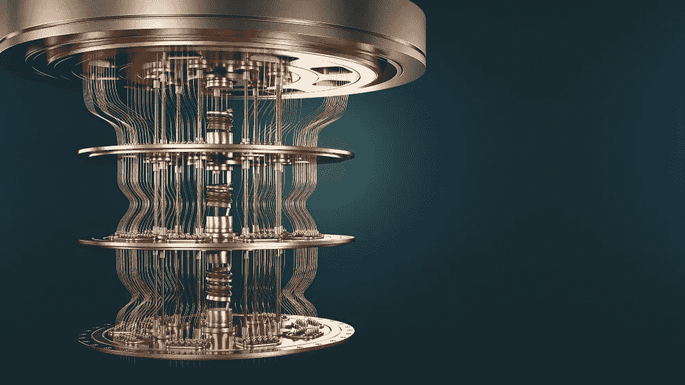
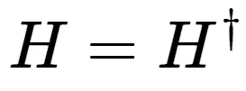
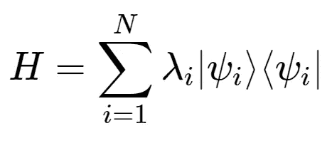
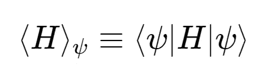
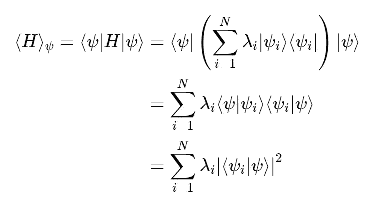
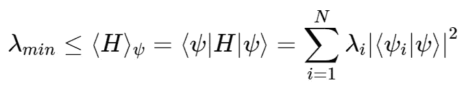
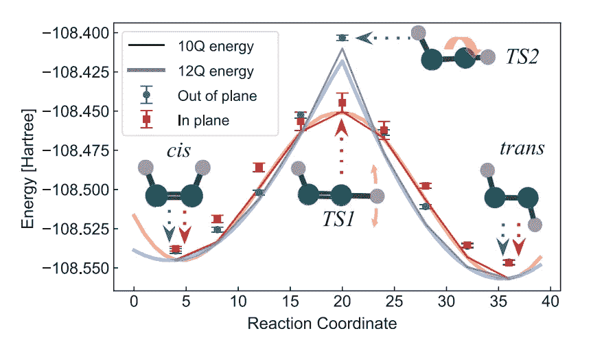
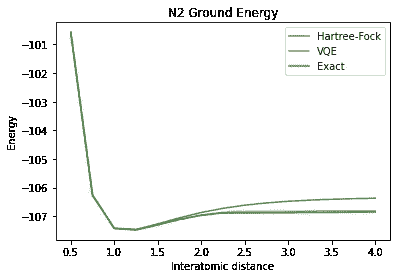
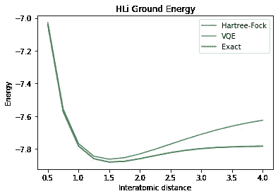
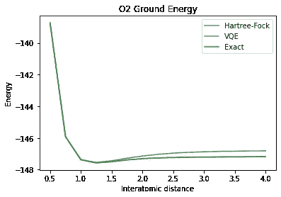

# VQEs 的简单指南

> 原文：<https://medium.com/geekculture/a-simple-guide-to-vqes-b836d5021b1b?source=collection_archive---------24----------------------->

## 解释 vqe，以及我如何用它们找到 N2，LiH 和 O2 的基态

如果你试图了解 vqe，你可能真的不知道它们是什么。我知道我是。这在很大程度上是因为那些被抛来抛去的大词。所以我会尽量用最少的长词来提供一个简单的理解。那么 VQEs 是如何工作的呢？

# vqe 如何工作

在我解释 vqe 如何工作之前，这里有几个定义可以帮助你理解:

> 哈密顿量:哈密顿量是描述分子可能能量的矩阵
> 
> **量子位映射:**是在量子位上编码信息的过程
> 
> **安萨兹:**这是一个类似分子波函数的有根据的猜测
> 
> 特征值:与线性方程组相关的标量，最好把它们看作简单的标量

理论上，VQEs 通过**改变参数、**然后**优化**使**能量最低**来工作。从而得到最低的特征值。听起来很简单，但是还有更多。所以让我们深入研究一下。

VQE 代表变分量子本征解算器。原因如下:

*   **变分:**因为 VQE 会改变参数以找到真实值
*   **量子:**因为是量子算法
*   **特征值求解器:**因为我们正在求解最低特征值

VQE 是一种量子机器学习算法。这意味着它同时使用量子计算和经典计算。

## 为了解释，我将使用一个类比:

所以你试图找到你能避开的最低点。但你没有林波柱。那你是做什么的？你在经典计算机和量子计算机上模拟自己。所以这些是你找到你的最低点的步骤:

1.  在量子计算机中把你自己编码成一个量子比特
2.  找到一个范围内所有可能的边缘极点的高度，在那里你可以得到你的最低边缘
3.  在量子计算机上，模拟你自己在**改变**地狱边缘极点高度的情况下做很多很多次地狱边缘
4.  然后测量量子计算机的结果
5.  最后，将结果发送到经典计算机，然后经典计算机使用一种优化方法，如梯度下降，以优化最低可能的边缘极点高度
6.  然后重复步骤 3-5，直到你找到你的最低点

## 在本例中:

*   边缘极点等于你为了找到最低特征值而改变的参数，例如:分子间的距离。
*   你的最低边缘点等于最低特征值。例如:分子的基态。
*   你和你试图模拟的东西一样。例句:一个分子。
*   你的潜在最低边缘点的范围等于**安萨兹**的范围。

如果你理解了这个例子，你就能理解 VQE 是如何工作的。

为了解释 VQE 是如何工作的，我将解释如何使用 VQE 来模拟一个分子，目的是找到**基态**(分子的最低能量状态)**。**以下是制作 VQE 的步骤:

1.  用**量子位映射**对量子位上的**哈密顿量**(描述分子可能能量的矩阵)进行编码
2.  找到基态分子间距离的 **ansatz** (这只是一个有根据的猜测)
3.  在 ansatz 的量子计算机上模拟不同距离的分子
4.  在量子计算机上测量结果。这导致量子位崩溃为 0 和 1
5.  最后，你把结果发送到经典计算机。经典计算机使用一种优化方法，如梯度下降法，优化分子中可能的最低能量状态。
6.  重复步骤 3-5，直到你得到分子的基态

现在你已经对 VQE 的工作原理有了直观的了解，我将用数学术语来解释它的工作原理。

# 为什么 vqe 有效

VQE 背后的数学变得相当复杂，但坚持下去。VQE 使用量子力学的**变分法**或**变分原理**。

首先我们要明白一个矩阵是一个**厄米**等于它的共轭转置。所以:

你需要知道的是，它允许我们使用**谱定理。**这允许我们声明埃尔米特矩阵的特征值必须是**实数值**。这意味着我们可以用一个厄米矩阵来描述我们的哈密顿量。我们可以将哈密顿量表示为:

要对此进行分解:

*   λ =特征值
*   |ψ⟩=特征向量

特征值与特征向量相当。我们也可以把哈密顿量表示成这样:

然后用前面的两个方程，我们可以把它们结合起来，得到这个方程:

这个方程告诉我们任何可观测状态的期望值。因为|⟨ψ⟩⟨ψ⟩|等于或大于 0。我们可以这样说:

这是其中最重要的方程式。这是**变分法**或**变分原理**方程，它告诉我们任何波函数的期望值。这等于或小于哈密顿量的本征值。这最后一个等式是整个 VQE 运转的基础。

# 为什么 vqe 很棒

所以你可能会问我为什么要在乎？vqe 将如何有所帮助？

## 量子化学

首先，vqe 现在很有用，因为它们在量子化学方面很棒。这意味着我们可以做一些事情，比如找到分子的基态，这很有用，因为它可以帮助我们找到反应速率和分子结构。虽然现在我们只能模拟非常小的分子，比如已经模拟过的最大的分子，二氮烯分子。

我们可以在未来进一步拓展这一领域，最终能够制造出具有我们想要的特殊性质的材料。像特种超导材料、太空级柔性材料、具有更长相干时间的特种量子比特或任何你能想象到的材料。

我们走得更远！最终，我们能够模拟整个系统，如电池，并能够优化材料，使它们持续更长时间，或者了解某些分子如何与我们的身体发生反应，如咖啡因。

## 金融

VQEs 还可以用于[投资组合优化](https://qiskit.org/documentation/tutorials/finance/01_portfolio_optimization.html)，更具体地说是解决均值-方差投资组合优化问题，该问题对股票的风险和预期收益进行加权，并输出一个概率。它的工作方式非常类似于人工智能股票预测器的工作方式，因为它做的是同样的事情，但它是一台量子计算机，对股票进行建模，因此它有可能提高准确性，与人工智能预测器相比，计算速度要快得多。

# 我的结果

利用这些原理，我实际上能够 VQE 模拟一堆分子，找到分子的基态能量，像锂氢氧化物，氧气和氮气。我能够得到非常好的结果(图中的 VQE 线被图中的精确线部分隐藏)。基态能量是能量最低的，如下图所示:

N2 的结果是:

HLi 的结果:

O2 的结果:

# TD；实验室反应堆

*   vqe 通过改变参数和优化最低值来工作
*   vqe 在量子化学中有很多应用，可以帮助我们在分子水平上理解我们日常接触的事物，并有可能发现新材料
*   vqe 可以在金融中用来优化投资组合
*   导致它们工作的主要原理是变分原理