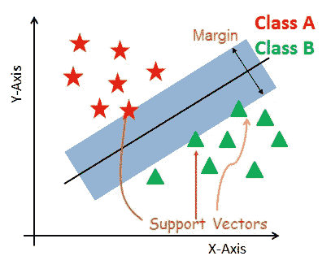
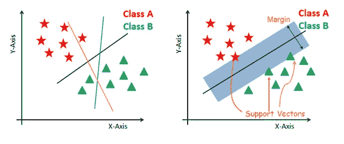
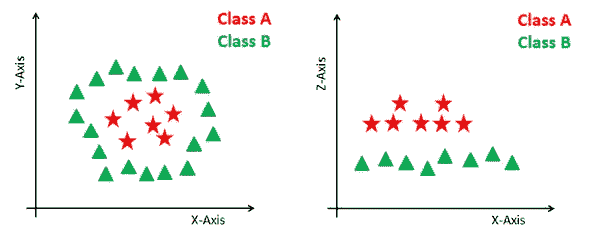

# 决策树和支持向量机的简单介绍(SVM)

> 原文：<https://medium.com/geekculture/a-simple-introduction-to-decision-tree-and-support-vector-machines-svm-3035f5bd50f?source=collection_archive---------5----------------------->

决策树和支持向量机是机器学习中用来进行预测的常用工具。这两种算法都可以用于分类和回归问题。不再拖延，让我们对他们做一个简短的介绍…

# **决策树制作**

决策树是一种受监督的机器学习，其中数据根据某个参数被连续分割。该树可以用两个实体来解释，即决策节点和树叶。树叶是决定或最终结果。决策节点是数据被拆分的地方。

Image by Author

决策树的一个例子可以用上面的二叉树来解释。比方说，我们想利用给定的信息来预测一个人是否需要新冠肺炎测试。这里的决策节点是像“我暴露了吗”这样的问题？我有症状吗？叶节点是像“参加考试”、“不，不要参加考试”这样的结果。在这种情况下，这是一个二元分类问题(是，不是类型问题)。决策树主要有两种类型:

**1。分类树(是/否类型)**

我们上面看到的是一个分类树的例子，其中的结果是一个变量，如“参加考试”或“不，不要参加考试”。这里的决策变量是绝对的。

**2。回归树(连续数据类型)**

回归树是指目标变量所在的算法，该算法用于预测其值。作为回归类型问题的一个示例，您可能希望预测汽车的销售价格，这是一个连续的因变量。这既取决于里程等连续因素，也取决于制造年份、事故历史等分类因素。

## 决策树的优点和缺点决策树方法的优点是:

**决策树的优势**

*   决策树很容易理解。它的结果在一组规则中
*   它执行分类不需要太多的计算。
*   它能够处理连续变量和分类变量。
*   它清楚地表明哪些字段对预测或分类最重要。

**决策树方法的弱点:**

*   决策树不太适合目标是预测连续属性的值的评估任务。
*   在许多类别和相对少量的训练样本的分类问题中，它们容易出错。
*   决策树中有很高的过拟合概率。

# 支持向量机(SVM):

支持向量机(SVM)是一种受监督的机器学习算法，可用于分类或回归问题。它使用一种称为内核技巧的技术来转换您的数据，然后基于这些转换，它会在可能的输出之间找到一个最佳边界。SVM 的目标是确定一个最优的分离超平面，它最大化不同类别的训练数据之间的间隔。

Image Data Camp

**支持向量:**

支持向量是最接近超平面的数据点。通过计算边距，这些点将更好地定义分隔线。

**超平面:**

超平面是在具有不同类别的一组对象之间分开的决策平面。

**保证金:**

边距是最近的类点上的两条线之间的间隙。

Image Data Camp

为了区分这两类，有许多可能的超平面可供选择。我们的目标是找到给出最大余量的最佳超平面。

**非线性数据:**

在上面的例子中，画一条线把两个类分开是很简单的，但是对于所有类型的问题，这种方法是不一样的。在这种情况下，SVM 使用内核技巧将不可分数据转换为可分数据。为此，我们将增加第三维度。我们创建了一个新的 z 维，它可以通过某种方式计算:z = x + y

Image Data Camp

**SVM 内核:**

内核将输入数据空间转换成所需的形式。SVM 使用了一种叫做核心技巧的技术，通过增加更多的维度将不可分离的问题转化为可分离的问题。它在非线性分离问题中最有用。内核技巧帮助你建立一个更准确的分类器。

支持向量机有助于文本和超文本分类、人脸检测、图像分类、使用 SVM 可以识别手写字符、癌症诊断和预后。

# SVM 的优势和劣势:

**SVM 的实力:**

1.它在维数大于样本数的情况下是有效的。

2.它工作得很好，有一个清晰的分离边界

3.它在决策函数中使用训练点的子集(称为支持向量)，因此它也是内存高效的。

4.在高维空间是有效的。

**SVM 的弱点:**

1.当我们有大数据集时，它不能很好地执行，因为所需的训练时间更长

2.SVM 没有直接提供概率估计

3.当数据集有更多噪声时，它无法执行。

**结论:**

没有完美的模型，每个模型都是工具。这意味着它需要根据每种情况进行适当的调整和优化。

*原载于 2021 年 2 月 1 日*[*【https://www.numpyninja.com】*](https://www.numpyninja.com/post/a-simple-introduction-to-decision-tree-and-support-vector-machines-svm)*。*