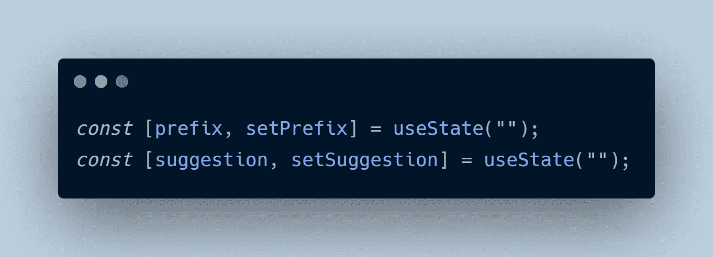
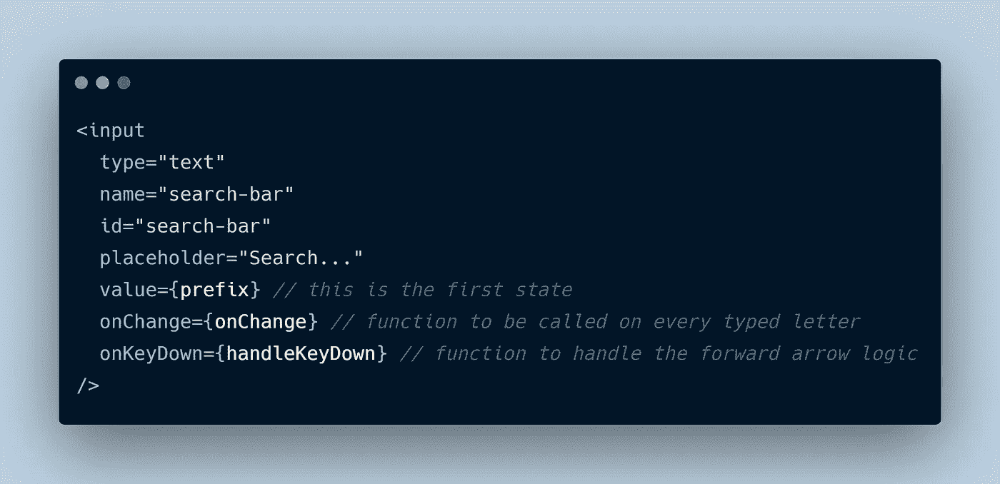
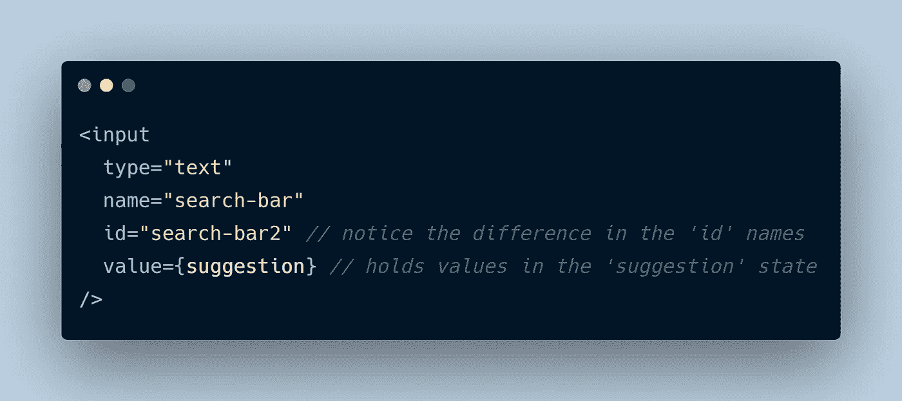

# 一个简单的搜索栏自动完成实现(ReactJs)

> 原文：<https://medium.com/geekculture/a-simple-search-bar-auto-complete-implementation-reactjs-f08382742013?source=collection_archive---------8----------------------->

想知道搜索栏中自动完成功能背后的技巧吗？我抓住你了。


因此，不久前我研究了 Trie(一种主要用于自动完成和自动建议实现的数据结构),当我用几个词对它进行测试并返回建议时，它看起来真的很神奇。现在我很兴奋能更上一层楼。使用 ReactJs，我创建了一个简单的搜索栏，并用一个包含十个单词的字典对它进行了测试(当然它们不是很多，只是为了确保它能工作)。你可以[在这里](https://wxj36.csb.app/)用*‘你好’，‘氦’，‘世界’，‘汽车’，‘地毯’，‘测试’，‘这个’，‘那个’，‘那些’，‘工作’，‘是’(因为那是我全部加到我的字典里的)*。让我们来看看我是如何做到这一点的。

> TL；DR 直接进入 [codesandbox.io](https://codesandbox.io/s/search-bar-wxj36) 并摆弄代码

[finished search bar as seen in codesandbox.io](https://codesandbox.io/s/search-bar-wxj36)

首先，了解 Trie 如何工作的逻辑是很有用的，我已经在这里写了一篇关于我的实现的文章，所以你可以继续。

> 当你理解了基本原理，就很容易操纵动力学。

首先，我假设您熟悉启动 react 项目模板并让它运行，以及如何使用`react hooks`。我还会跟踪这个库的主分支中的[源代码，这样万一您的实现在第一次尝试中不工作，您可以参考。](https://github.com/EKaxada/search-bar)

让我们深入了解真实情况。我们在`src`文件夹中的文件夹结构将如下所示；

```
src
 |App.css
 |App.js
 |trie.js
 |index.js
```

然后我们继续在`trie.js`中创建`Trie`逻辑，但我不会在这里这样做，因为这会让这篇短小的黑客文章变得冗长而乏味。[你可以在这里找到代码](https://github.com/EKaxada/search-bar/blob/main/src/trie.js)和[一篇解释实现的文章](/geekculture/how-to-effortlessly-implement-an-autocomplete-data-structure-in-javascript-using-a-trie-ea87a7d5a804)。

接下来，我们开始在`App.js`文件中实现整个项目的核心。我们的`App.js`文件将是一个具有两个`string`状态和两个输入字段的`state component`。



the two states in App.js

所以这是逻辑。我们将**将两个输入堆叠起来**。这将通过 CSS `position`和`z-index`属性来完成。([全文](https://github.com/EKaxada/search-bar/blob/main/src/App.css) `[App.css](https://github.com/EKaxada/search-bar/blob/main/src/App.css)` [文件此处](https://github.com/EKaxada/search-bar/blob/main/src/App.css))。*顶部的输入将用于输入单词，而后面的输入将用于显示完整的单词(如果找到的话)。这是基本的设计逻辑。*

> **注意:使用`input`元素控制输入字段的设计非常困难，这就是为什么大多数设计选择了`contenteditable div`的原因，本文并不打算解决这些问题，但至少我遇到了一些限制，我希望你能弄清楚什么时候不使用一个或另一个。**

因此顶部的`input`元件将具有两种功能并保持第一种状态。



first input element

后面的`input`元件将没有功能，而是处于第二状态；



second input element

到目前为止，根据我们的第一个`input`元素，我们创建了两个函数来实现这个特性，`***onChange***` ***和*** `***handleKeyDown***` ***函数*** 。

# `'onChange'`功能

对于将在顶部输入中键入或删除的每个字符，将调用该函数。我将逐行解释这个函数，因为它是最重要的，但首先，这是整个函数；

当该函数被调用时，此时输入域中的任何字符都用`e.target.value`引用，并存储在`value`变量中。

```
var value = e.target.value
```

然后使用`setPrefix(value)`将`prefix`状态更新为输入字段中的当前字符。

有时用户可能输入了不止一个单词，唯一的方法是使用空格`split`字符串`value`；

```
var words = value.split(" ")// if value = 'this is a sentence' then value.split(" ") returns an array of ["this","is","a","sentence"].
```

如果您在调用`trie.find('he')`时查看了我们的 Trie 实现，我们正在寻找以`'he'`开头的所有单词，对于我们的示例词典，这些单词是`'hello'`和`'helium'`。因此，为了总是获得`trie_prefix`，我们将目标锁定在最后一个空格后输入的最后一个单词，并且总是锁定我们可以说的话；

```
var trie_prefix = words[words.length - 1].toLowerCase()
```

我包含了`.toLowerCase()`方法，以便在有大写字母的情况下，它被转换成小写字母，因为我的字典中所有的单词都是小写的。然后，我将查找单词并使用`trie_prefix`返回一个按照长度排序的`found_words`数组，最短的放在最前面。

```
var found_words = myTrie.find(trie_prefix).sort((a, b) => {      return a.length - b.length;});
```

> 大多数时候，单词是根据它们的使用频率和复杂度预测来排序的，实际上我在这里并没有这样做。

然后我们用`var first_word = found_words[0]`挑选第一个单词，然后表演一些‘魔术’！

如果有任何`found_words`并且如果输入字段不为空并且`value`中的最后一个字符也不是空格，我们继续检查`first_word`是否不是`undefined`或`null`，如果不是，我们使用`slice()`方法获取`first_word`的剩余字母并用完整的单词更新我们的`suggestion`状态，否则我们用输入字段中的任何内容更新我们的`suggestion`状态。这是这个程序的代码。

那么用户如何选择建议的单词呢？按下右箭头键，这就是`handleKeyChange`功能发挥作用的地方。

handleKeyDown function

就是这样，我们现在可以用我们喜欢的任何单词来创建我们的字典，并测试它们。我将使用 JSON 和一个数组对象。(我假设您可能想使用您自己的单词，这些单词可能以 JSON 格式返回，所以我用 JSON 实现了它，以使事情变得简单)

sample words

然后，我们实例化一个新的 Trie 对象，并通过自调用异步函数遍历数组中的每个单词来插入这些单词。*(确保将其放在* `*onChange*` *函数之前的状态声明之后)*

inserting words into trie

就这些了。[通过观看这个演示](https://wxj36.csb.app/)来看看结果如何。使用这个库跟踪[的完整实现，我希望你能扩展它以满足你的需求。这只是让你开始。](https://github.com/EKaxada/search-bar)

我很欣赏这些掌声。干杯:)！