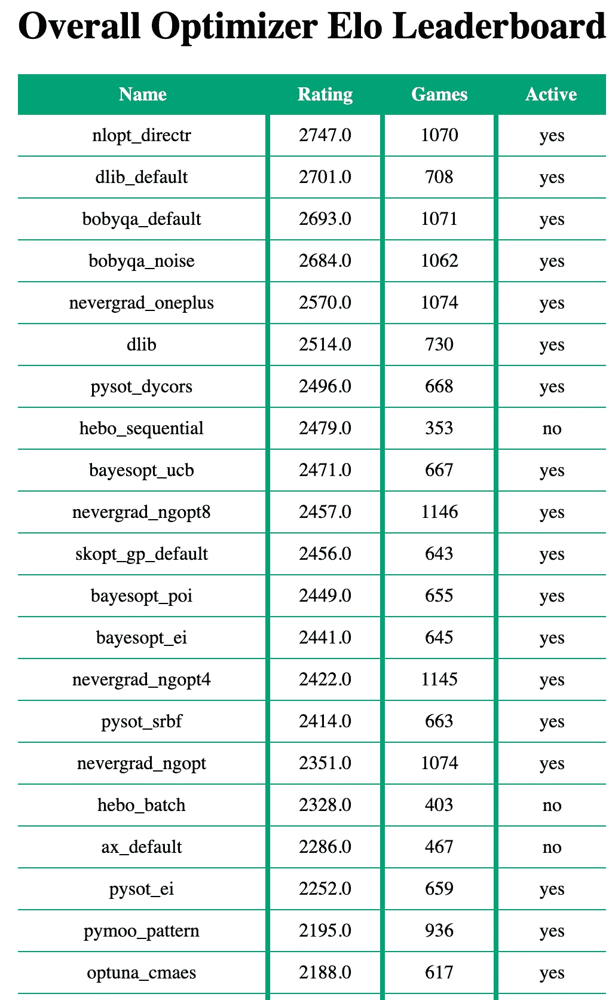
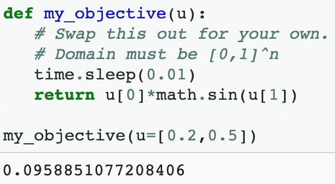
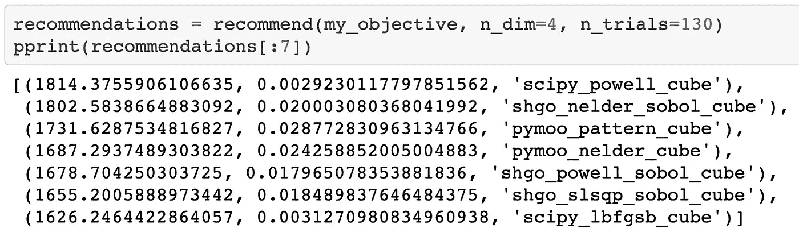
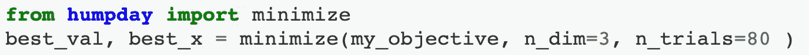
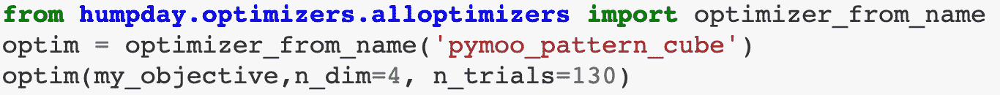
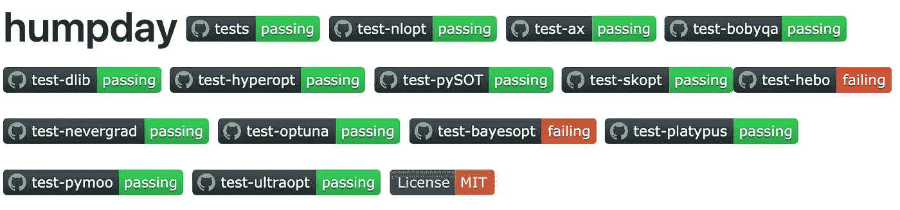
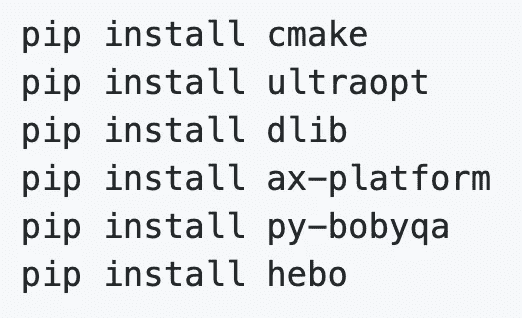

# 选择 Python 优化包的简单方法

> 原文：<https://medium.com/geekculture/a-simple-way-to-choose-a-python-optimization-package-250e1d3b83c9?source=collection_archive---------4----------------------->

有无数的开源优化包可以帮助你最小化一个任意的多元函数，即使你不知道那个函数的导数。它们比网格或者随机搜索要好很多，但是你应该先从哪里开始找呢？

我以一个 [colab 笔记本](https://github.com/microprediction/humpday/blob/main/black_box_optimization_package_recommender.ipynb)的形式提供了一个简单的答案，您可以根据自己的目的轻松修改它。这篇文章提供了一个演练和一些背景。但是，甚至在打开笔记本之前，你可能想浏览一下全球优化者的 [Elo 评级。这里有一些对我的问题很有效的策略。](https://microprediction.github.io/optimizer-elo-ratings/html_leaderboards/overall.html)

# 推荐

在 colab 中打开[笔记本](https://github.com/microprediction/humpday/blob/main/black_box_optimization_package_recommender.ipynb)，会看到它导入了[驼峰日](https://github.com/microprediction/humpday)包(我猜想应该是用骆驼壳写的)。接下来，我们提供一个目标函数。显然，我的是一个占位符，但是您可以根据自己的需要修改它。

Example objective function

你所需要做的就是把这个发送给 HumpDay 推荐函数:

正如你所看到的，它将产生一个推荐列表，按照 Elo 等级排列，并返回计算时间。如果你的目标函数本身非常昂贵，这些应该不会相差太多。但是，请注意，一些黑盒优化器的计算时间可能非常长(例如，特别是那些依赖于高斯过程的优化器)，使用一个自身的计算限制了您在固定时间单位内可以使用的目标函数求值次数的优化器是没有意义的。

请注意，在提供目标函数时，您指定了维数(n_dim)和函数求值的最大次数(n_trials)。您可能会注意到，针对全局优化器的 [Elo 评级包含针对不同维度和试验数量选择的子评级。一些优化器针对不同的目的进行了调整，这就是为什么获得一个粗略的想法会有所帮助。](https://microprediction.github.io/optimizer-elo-ratings/html_leaderboards/overall.html)

# 觉得幸运吗？

现在我知道你在想什么了。如果这可以推荐一个优化器，为什么我需要做任何事情？事实上，我们欢迎您使用 humpday 包中的元优化器，它只是使用了第一个建议。

Using the meta-optimizer in the HumpDay package. This will call the first recommendation.

# 自己选？

正如笔记本所展示的，你可以使用 HumpDay 来实例化任何出现在排行榜上或你个人推荐中的策略。

Using HumpDay to instantiate an optimization strategy.

# 积分赛

我希望这些建议对你有用。然而， *your* 目标函数的性能显然比优化器在为 Elo 评级而编译的目标函数上的性能更重要。如果你有时间，那么直接在你的目标函数或目标函数集上运行一些是有意义的。这个笔记本展示了这样做的一种方式，叫做分数竞赛。

Using HumpDay points_race to assess optimizer performance on a list of objective functions

也许那对你的问题来说耗时太长或者是弄巧成拙，因为你只想优化一次。然而，一个合理的方法是为你的实际问题创建一个更简单或更低维的版本(或者甚至是它的替代品)。

# 什么在起作用？

许多软件包，以及它们在 HumpDay 中的使用，都会定期进行测试。

Test results for optimization packages

有时(不总是)看一眼 [HumpDay](https://github.com/microprediction/humpday) repo 可以提醒你软件包中的突破性变化，这些变化可能没有被原作者发现(他们很忙，让他们休息一下)。

由于不稳定性，并且为了避免膨胀，HumpDay 不会自动包含它所公开的功能的所有优化器。如果您想要全部，请尝试将以下内容添加到您的脚本中:

Examples of installing additional optimizers not included in HumpDay out-of-the-box.

然而，这是一个流动的列表，所以请参考 HumpDay [README.md](https://github.com/microprediction/humpday/blob/main/README.md) ，或者更好的 [requirements.txt](https://github.com/microprediction/humpday/blob/main/requirements.txt) 来看看还有什么没有。

# 限制

我不建议你在选择了优化包和策略之后直接使用 HumpDay。这可能是限制性的，取决于您的问题，并引入了 HumpDay 的一个故障点(尽管如此)。

注意，HumpDay 只支持在超立方体上定义的目标函数。如果你的函数有一个连续的域，这并不是丧失了通用性，否则 HumpDay 可能帮不了你太多。

# 方法学

我会让你参考[这篇文章](https://www.microprediction.com/blog/humpday)中对 Elo 评级方法的描述。那篇博客文章还包括一长串尚未包含在 HumpDay 中的 Python 优化包。如果你想帮忙，拉请求是非常受欢迎的。

# 援助和贡献

我写了 [HumpDay](https://github.com/microprediction/humpday) 作为提供免费、高质量、开源预测的努力的一部分(也有时间序列 [Elo 评级](https://github.com/microprediction/timeseries-elo-ratings))。如果你感兴趣，可以考虑关注[微预测](https://www.linkedin.com/company/65109690)，或者提出拉取请求，或者如果你有问题，可以在美国东部时间周五中午参加我们的每周贡献者聊天。Google Meet 的详细信息在[知识中心](https://www.microprediction.com/knowledge-center)中。