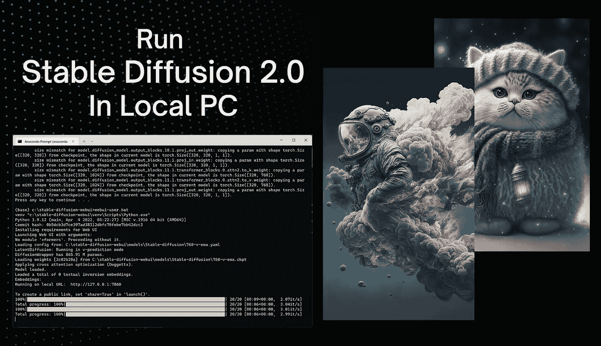

# 在您的 PC 上本地运行 Stable Diffusion 2.0 的简单方法—无代码指南

> 原文：<https://medium.com/geekculture/a-simple-way-to-run-stable-diffusion-2-0-locally-on-your-pc-no-code-guide-3beb911e444c?source=collection_archive---------0----------------------->

Image by [Jim Clyde Monge](https://medium.com/u/819323b399ac?source=post_page-----3beb911e444c--------------------------------). AI art by [AlphaLeague](https://www.midjourney.com/app/feed/851871890833932308/) and [Freizeit](https://www.midjourney.com/app/feed/1017545903801913375/)

毫不夸张地说，人工智能在过去几个月里取得了巨大的进步，该领域的最新进展是发布了[稳定扩散 2.0](https://stability.ai/blog/stable-diffusion-v2-release) 。

这个来自 Stability AI 的新模型包含了全新的功能，如深度导向图像生成、文本导向修复等等。可以多看看……