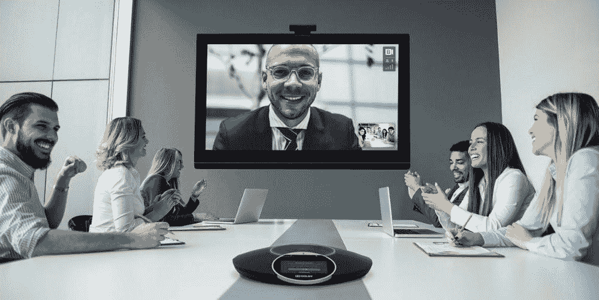
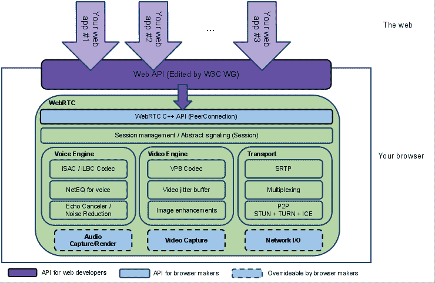
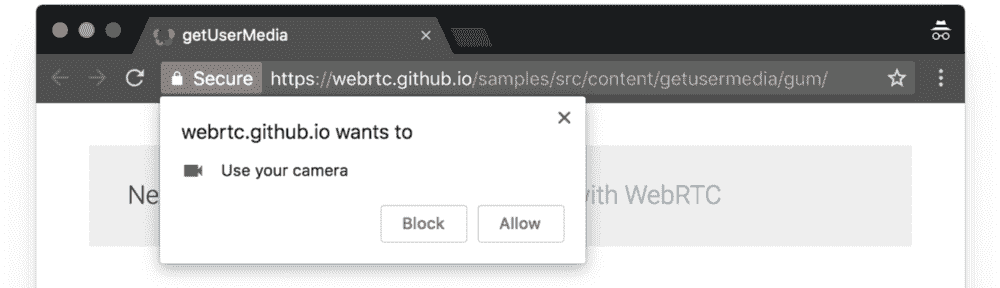
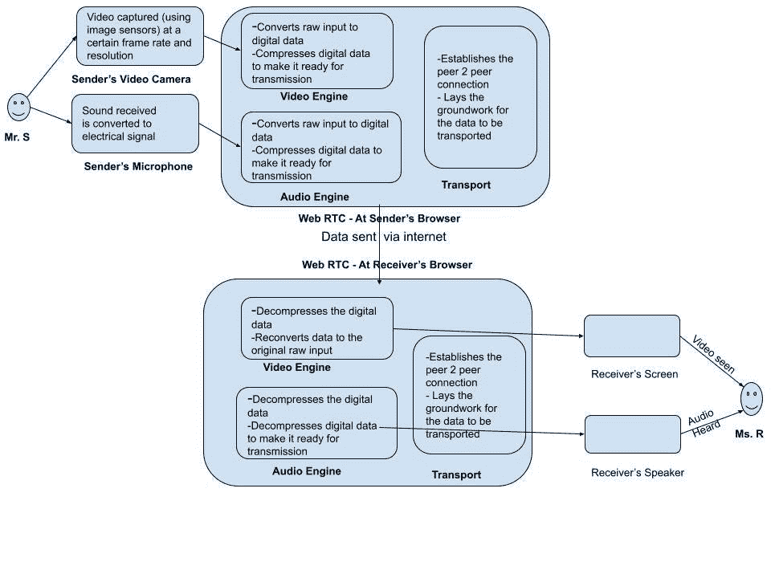

# 对基于网络的视频会议的一点技术介绍

> 原文：<https://medium.com/geekculture/a-slightly-technical-introduction-to-web-based-video-conferencing-d310f76bf05b?source=collection_archive---------12----------------------->

Image Source: bluejeans.com

它的 2021 和视频会议从未如此简单。

不需要购买硬件设备，不需要安装桌面应用程序或“企业”软件。你只需要打开浏览器，输入网址，生成一个链接，然后开始聊天。

视频会议应用程序的简单性、便利性和可靠性简直令人惊叹！

作为一名在以视频会议为核心的平台上工作的产品经理，我一直对视频会议实际上是如何工作的感到好奇。

这篇文章是我试图为好奇的人们揭开视频会议的神秘面纱。

# 成功的视频会议体验所需的要素

让我们看看成功的视频通话的一般步骤。

# 步骤 1:捕获音频和视频输入

这一切都始于摄像机和麦克风捕捉你美丽的脸庞和美丽的声音。

摄像机通过一个光探测器网格来完成这项工作，这个光探测器被称为电荷耦合器件(CCD)。这些探测器捕捉它们视野中的信息。

这种数据传输是即时的，因为相机不能存储数据。

# 步骤 2:用于转换和数据压缩的编解码器

捕获原始输入后，编解码器开始对其进行处理。

它是一种对数字数据流或信号进行编码或解码的设备或计算机程序。

它是两个词的组合——编码器和解码器。编码器压缩数据，解码器解压缩数据。

视频和音频必须分开压缩。因此，需要单独的视频编解码器和音频编解码器。

> “视频会议应用中常用的视频编解码器有:H.264、H.263+、H.263、H.261。常见的音频编解码器有: [G.711](https://www.video-conferencing.com/definition/g.711.html) 、G.722、 [G.728](https://www.video-conferencing.com/definition/g.728.html) 、Siren Audio 和 AAC。请注意，音频编解码器可以嵌入到视频编解码器(如 H.264)的容器中。“—【videoconferencing.com 

为什么我们需要编解码器？

1.  模拟数据必须转换成数字格式(0 和 1 的组合)。这是通过互联网传输数据的唯一方式。
2.  压缩数据。否则，传输将需要巨大的带宽。

为了使视频会议成功进行，发送方和接收方必须使用相同的编解码器。

# 步骤 3:通过网络传输数据

一旦数据被压缩，通过互联网传输的时间就到了。这之所以成为可能，是因为有了 VoIP(网络电话协议)。这项技术使您能够使用互联网连接而不是普通电话进行语音通话。

# 步骤 4:用于再转换和解压缩的编解码器

数字数据最终到达接收器端。编解码器又开始工作了。这一次它的工作是解压缩接收到的数据，并将其转换成模拟信号。

这一步是可行的，因为发送方和接收方的编解码器使用相同的标准。

# 步骤 5:显示接收者输出的音频和视频

模拟数据(漂亮的脸蛋和好听的声音)最终可以被接收器通过输出设备看到。

# 进入 WebRTC —使“基于 Web 的视频会议”成为可能的向导

在过去的黄金时代，发送者和接收者都需要在他们的机器上安装软件，以实现视频会议中的上述步骤。

这一切随着 WebRTC 的进入而改变。

> WebRTC (Web 实时通信)是一种使 Web 应用程序和站点能够捕获和流式传输音频和/或视频媒体的技术。构成 WebRTC 的标准集使得点对点视频会议成为可能，而不需要用户安装插件或任何其他第三方软件。”—[Mozilla.org](https://developer.mozilla.org/en-US/docs/Web/API/WebRTC_API)

如上图所示，底层的 WebRTC 实现包括[三个主要框架](https://sookocheff.com/post/networking/how-does-web-rtc-work/):

1.  **语音引擎**:负责从麦克风捕捉原始音频输入，并使用编解码器对其进行压缩。它还执行回声消除和降噪。
2.  **视频引擎**:负责从摄像头捕捉原始视频输入，并使用视频编解码器压缩数据。
3.  **传输**:帮助发现并建立与接收方的连接。建立连接后，它帮助您通过网络发送数据。

这些框架的功能通过简单的 JavaScript APIs 公开。使用这些 API，任何网站都可以提供视频会议功能。这样的网站将遵循这些[步骤](https://webrtc.org/):

# 1.访问终端用户系统上的媒体设备

如果网站想要捕获音频/视频输入，首先需要请求摄像头和麦克风许可。

WebRTC 标准[提供 API](https://webrtc.org/getting-started/media-devices)用于访问连接到计算机的摄像头和麦克风设备。这些设备被称为“媒体设备”。

# 2.捕获原始音频/视频输入

在获得对媒体设备的访问之后，从它们捕获原始输入。这是转换成数字格式，压缩使用编解码器，并准备好运输。上面提到的“语音引擎”和“视频引擎”框架对此负责。

# 3.建立对等连接

必须在两个对等方(发送方和接收方)之间建立 RTC 对等连接，会议才能开始。

这涉及信令—它有助于发现远程对等体的存在，并用于交换连接信息。

解释这个步骤超出了这篇介绍性文章的范围。你可以在这里阅读更多相关信息[。](https://sookocheff.com/post/networking/how-does-web-rtc-work/)

# 4.开始流式传输

一旦与远程对等方(接收方)建立了连接，您就可以开始向其传输音频和视频。

为此，来自媒体设备的输入捕获被连接到 RTC 对等连接。

魔法终于开始了！

这就是 WebRTC 技术支持所有基于 web 的视频会议通信的方式。

它真正革新了视频会议的工作方式！

# 摘要

下面的流程图描述了视频会议的整个过程，以及 WebRTC 在其中的作用。

这很好地总结了视频会议的魔力是如何在幕后展现的。

正如你所看到的，确实有很多移动部件让你与你的朋友、家人和同事无缝通话！

随着视频会议变得越来越普遍，这一领域的创新将继续以爆炸式的速度发生。

# 参考

以下是为本文提供素材的一些资源:

1.  https://www.explainthatstuff.com/webcams.html
2.  【https://www.elprocus.com/webcam-types-working-applications/ 
3.  [https://www.wowza.com/blog/video-codecs-encoding](https://www.wowza.com/blog/video-codecs-encoding)
4.  [https://bloggeek.me/how-webrtc-works/](https://bloggeek.me/how-webrtc-works/)
5.  编解码器—[https://www.streamingmedia.com/Articles/ReadArticle.aspx?ArticleID=74487](https://www.streamingmedia.com/Articles/ReadArticle.aspx?ArticleID=74487)
6.  [https://sookocheff . com/post/networking/how-do-we b-RTC-work/](https://sookocheff.com/post/networking/how-does-web-rtc-work/)